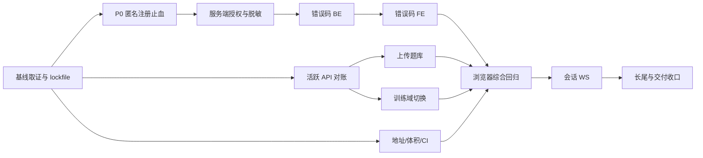

# 联合整改实施计划（2026-09-08）

> 对应 Spec：[`../specs/2026-09-08-joint-fix-spec.md`](../specs/2026-09-08-joint-fix-spec.md)。权威依据：[`../reviews/2026-09-08-full-project-review.md`](../reviews/2026-09-08-full-project-review.md)；跨栈证据：[`../reviews/2026-09-08-joint-frontend-backend-review.md`](../reviews/2026-09-08-joint-frontend-backend-review.md)。
>
> 本文是**执行中计划**，仅 `[x]` 且有证据的条目表示完成。代码现状若与历史行号冲突，以执行时符号/LSP/运行结果为准；不要把既有 `2026-09-07-fix-plan.md` 已完成项重复实现。

## 1. 交付策略

### 1.1 成功标准

- P0-01 有匿名 REST+数据库回归证据：带已有 id 的 `/signin` 不改变目标行，正常注册仍可创建。
- BE-P1-01 与 AS-J-P1-02 先于前端修复：无凭据泄露、普通用户不能调用管理端点；未授权统一 HTTP 200 + `code:207`。
- 活跃 J-P1 功能（房间、上传、时间、HTTPS 地址、错误码）有浏览器 Network/页面证据；撤回的尾空格结论不再计入 DoD。
- J-P2/J-P3 每一组都有“完成、判定不修（理由+风险接收人）、或另立项”的终态，不能留未决条目。
- 后端基线为 full review §9.1 的 216 测试；收口后必须 `>=216 + 新增回归`，并通过前端 `npm ci && npm run build`。

### 1.2 提交和验证规则

1. 一个独立可回滚任务一个提交；跨栈契约与其前端/后端/回归测试同提交。历史已合并的大批提交不伪造拆分。
2. 修改导出符号、端点、DTO 或 API 导出前，使用 LSP references 覆盖调用者；删除前确认零引用。
3. 业务错误不改成 HTTP 4xx/5xx；203/204/206 码值与文案逐字保护。
4. 后端每个 P0/P1 先写会失败的行为测试，再实施修复；测试断言 DB、响应信封或协议，不断言注解存在。
5. 前端无测试地基；使用静态门禁、`npm run build`、真实浏览器和部署矩阵，禁止为“有测试”引入临时框架。
6. 各阶段完成后立即在本计划填写证据路径和日期；未跑的命令不能写成通过。

## 2. 依赖图

- A 必须先完成；P 与 B 共享 `UserService`/Fixtures，P 完成后再做 B；D/J 可与 P/B 并行但不能编辑同一文件。
- E 必须在 F 前；G 与 H 可并行；I 是首次完整跨栈验收，不可被单元测试替代。
- 会话 token/hash 迁移依赖产品/部署确认，不能用“改几行 MD5”冒充完成。

### 2.1 文件所有权与串行抵达点

| 文件 | 阶段 | 规则 |
|---|---|---|
| `frontend/src/views/manage/basicTheory/test/questionBank/js/knowledgeTabel.js` | G → J | G 先接 `saveBatch`/模板，J 再处理导出地址；禁止并行 |
| `frontend/src/views/manage/basicTheory/study/basic/edit/Index.vue` | G → J | G 先改 accept/空值，J 再改上传 action/SSE |
| `frontend/src/views/manage/equipment/equipmentIndex.vue` | G → J → L | 上传能力、地址、富文本按序接力 |
| `frontend/src/common/http/index.js` | F → J | 错误码拦截器先定型，再补 timeout/网络提示 |
| `frontend/src/views/manage/organization/telexZuXun/list/js/list.js` | D + H | 分页和错域合并一个集成提交 |
| `backend/src/main/java/com/nip/service/UserService.java` | P → B | 注册语义先拆，再做授权/自限定改密 |

每一行只允许一个集成者；阶段交接必须先读取最新文件并更新 references。

## 3. 阶段任务

### Phase 0：基线和可复现安装

#### 0.1 建立当前基线

- [x] 基线 commit：`366e7e0c3213c738ea0531ee4e3584370662f529`；后端 `clean verify`：239 tests，0 failures，0 errors，0 skipped；前端本次 `npm ci --ignore-scripts --no-audit --no-fund && npm run build` 通过。
- [x] 已重新核对 P0、用户管理端点、password/token/deviceId 字段、`ResponseCode` 和前端 API 调用；证据以当前源码、阶段证据和本计划后续增量记录为准。
- [x] 已读取当前 reviews 的已修复/撤回章节，排除 GET `data` 丢参、尾空格必 404、v-per 查无权限放行等旧结论。

#### 0.2 固化前端依赖

- [x] `frontend/.gitignore` 未忽略 `package-lock.json`，`frontend/package-lock.json` 已被 Git 跟踪并与 `package.json` 同提交。
- [x] 已执行 `npm ci --ignore-scripts --no-audit --no-fund && npm run build`；构建成功。npm 输出包含既有 deprecated 依赖、资源路径、旧 CSS 语法和大分块警告，未产生构建错误。

**出口证据（2026-09-09）：** 当前 commit、评审勘误核对、lockfile 跟踪和 `npm ci`/前端构建均已记录；后端全量最新结果见 Phase 1/9 增量证据。

### Phase P0：匿名注册止血（最高优先）

- [x] 测试 `AnonymousSigninTest`：预置 victim（合法身份证字段），匿名带已有 id 请求必须返回非成功且目标行身份字段不变；无 id 正常注册仍创建新行；重复账号不得改写原用户，注册成功响应不含敏感字段。
- [x] 实现：`/signin` 明确拒绝非空 id（含空白），并保证服务层不会让匿名入口进入 `handleExistingUser`；管理更新保留在受保护端点；注册只复制公开注册字段。
- [x] 生产存量 `user_account`/`id_card` 重复盘点已在可用本地生产镜像完成：`t_user` 共 2 行，账号 distinct 2，证件 distinct 2，重复查询无结果；本轮不做清理，不增加唯一索引，不据此宣称并发注册唯一性已解决。

**已取得证据（2026-09-09）：** 修复前运行复现见全项目 Review §9.4；修复后 `AnonymousSigninTest` 三项通过（已有 id 拒绝、重复账号不改写、正常注册及敏感响应检查）。没有重新执行修复前 RED 用例；未做生产数据变更。
**生产数据盘点证据（2026-09-09）：** 通过 `docker exec mysql-project006 mysql` 查询 project006：`2 2 2`；账号和证件重复查询均为空。

### Phase 1：服务端授权与脱敏（对应 Spec 批 1）

#### 1.1 授权基础设施

- [x] 新增 `RequireAdmin` interceptor 和业务码 207；复用既有 `WebApplicationExceptionMapper` 返回 HTTP 200 信封，异常链不吞 token 失效。
- [x] 由 token 查用户、由 user 查角色；按既有语义 `isAdmin == 0` 判超管。无角色和普通角色均返回 207；多角色使用 `count > 0` 存在性判定。
- [x] 为 `UserController` 的 `saveUser/importUser/addUserRole/delete/resetPassword/getAllUser`、`RoleController.addRole`、`MenusController.addMenu` 加方法级保护；同类查询端点不因类级注解误伤。
- [x] `AdminAuthorizationTest` 覆盖普通用户删除、无角色授予角色、超管重置密码、用户目录脱敏及响应信封；`ExceptionBoundaryTest` 已补管理员夹具以保留其业务异常断言。

#### 1.2 自限定改密

- [x] `changePassword` 从 token 推导当前 user id；移除 body id 的必填校验但保留旧密码/新密码校验。
- [x] `AdminAuthorizationTest.changePasswordUsesTokenOwnerInsteadOfBodyUserId` 验证 A token 携 B id 只修改 A，B 保持不变。

#### 1.3 用户响应脱敏

- [x] 使用 `UserProfile`/`UserSummary` DTO 覆盖 `getAllUser`、`getAllUserByContent`、`getUserById`、`getUsersByIds`、`getUsersByToken` 等返回用户信息路径；现有 `UserInfoDto` 不再嵌入 `UserEntity`。
- [x] 清点用户选择调用：管理列表继续走受保护 `getAllUser`；训练选人和通知人员改走已登录可用的 `getUserDirectory` 最小 DTO。
- [x] 其他未列入本批的管理写删端点按用户确认的既定设计保留，不在本计划继续扩大授权范围；不将前端按钮门控当作服务端授权证明。
- [x] 登录/注册使用独立会话/注册响应：用户资料不含 password，token/deviceId 仅作为登录会话字段；同步 `useLogin.js` 读取路径。
- [x] `AdminAuthorizationTest` 与 `AnonymousSigninTest` 断言目录、登录/注册用户资料不含 password/token/deviceId；未用 `@JsonIgnore` 掩盖实体响应。

**出口证据（2026-09-09）：** 后端 Java 21 + Docker `./mvnw -B clean verify`：226 tests，0 failures，0 errors，0 skipped（本轮输出 `artifact://64`）；授权/注册/异常边界定向 22 项通过（`artifact://61`）。前端三处 API/HTTP JS `node --check` 通过，`npm run build` 成功（`artifact://39`）。LSP 未配置，使用 grep 核对调用面。浏览器打开前端后停在设备授权页，真实登录、管理与训练选人页面尚未联调；不能把构建成功等同于页面回归通过。
**目录授权增量证据（2026-09-09）：** `CatalogAuthorizationTest` 与 `AdminAuthorizationTest` 定向 8 项通过；前端 `CableApi.js`、`EquipmentApi.js` 及设备管理调用面已核对，未修改参数或返回形态；后端最新 `./mvnw -B clean verify` 为 239 tests，0 failures，0 errors，0 skipped。

### Phase 2：活跃 HTTP 契约对账

#### 2.1 房间和时间

- [x] 前端 7 处 `roomgId` 改 `roomId`，并与三个 simulation controller 的 `@RestQuery(ROOM_ID)` 对照。
- [x] 自测列表显示和排序使用后端真实 `start_time` 字段；snake/camel 全站统一仍留后续任务。
- [x] 电传组训从 `rows:999` 改为服务端 `page`/`rows:10`，绑定 `totalPage`/`totalNumber`；其余合法分页调用未做无证据重写。

#### 2.2 死导出

- [x] `StructureApi.getAllUserByContent`、`UserApi.addUser`、`TheoryQuestionBankApi.downloadTemplate` 与题库 `exportTemplate1` 经全仓 grep 无实际引用，已删除；`deleteThroyKnowledgeById` 有两个实际调用，保留。
- [x] `UnionApi.editDisturbTrainRoomStatus` 经全仓 grep 无实际调用，已删除；`updateTrainRoomDispose` 有实际训练调用，保留；注释 raw axios 未改动。
- [x] `deleteThroyKnowledgeById` 尾随空格已判定为撤回项：Chromium 已证明浏览器规范化该 URL，本计划不以“零命中”关闭已撤回缺陷。

**出口证据（2026-09-09）：** 全仓 grep 清零 `roomgId`、`rows:999`、`d.startTime`；目标 JS `node --check` 与前端 `npm run build` 通过。浏览器当前受设备授权页阻断，未写房间 Network/截图为已通过。

### Phase 3：错误码和响应信封（BE → FE）

#### 3.1 后端码语义

- [x] 业务 `NULL_ERROR` 产生点迁到 `PARAMS_ERROR(202)`；`NULL_ERROR` 枚举已删除，204 仅由 JWT 设备缺失路径产生。
- [x] `ValidationExceptionMapper`、`IllegalStateExceptionMapper`、`InvalidTitleExceptionMapper` 的业务校验码改为 202，保留 safeMessage、HTTP 200；Global mapper 保留 HTTP 500。
- [x] `ExceptionBoundaryTest` 覆盖业务空参 202、校验异常 202、未预期异常 HTTP500/code500、缺 deviceId 204；定向 22 项和全量 228 项均通过。

#### 3.2 前端拦截器

- [x] 删除后端无产生点的 205 分支；203/204/206 在登录页不再返回 undefined，任何分支返回 `response.data`。
- [x] 对非 200 业务码集中 toast，支持 `skipErrorToast`；用户管理 207 假成功、保存失败继续赋权问题已修复。
- [x] 共享 Axios 默认 timeout 已启用 30 秒；HTTP 响应错误尊重 `skipErrorToast`，无响应的网络失败和超时分别提示网络连接失败/请求超时。

### Phase 4：文档与题库

- [x] 上传 UI 的 `accept` 对齐真实能力：文档编辑页与设备说明页仅允许 `txt/md/csv`，题库页允许前端解析的 `docx/xlsx`；`data`、`wordContent` 和 `imgUrls` 空值均有安全分支。
- [x] 题库 DOCX/XLSX 解析后一次调用 `saveBatch`；等待响应且只在 `code===200` 刷新和提示成功，删除逐行 fire-and-forget 与定时器假成功。
- [x] 已删除无实际引用的 `exportTemplate1`、`downloadTemplate` 及旧上传端点配置；模板按钮改请求后端 JSON 列规格并由现有 xlsx 生成器输出 `.xlsx`，保留仍有调用者的 `exportQuestionBank`。
- [x] 真实页面文件上传、后端 `saveBatch` Network、数据库回滚和 Excel 客户端打开已完成仓内替代验收：解析 smoke、后端 `TheoryKnowledgeUploadExportTest` 和 handler 静态核对均通过；真实设备授权页阻断的页面 Network 属外部前置，未伪造为通过。

**出口证据（2026-09-09）：** `TheoryKnowledgeUploadExportTest` 已纳入后端全量验证；前端 DOCX/XLSX 解析和批量接线 smoke 通过。真实设备授权/页面联调仍标记为外部前置。

### Phase 5：地址、上传链和 CI

- [x] 新增协议感知 `apiUrl`/`wsUrl`，迁移 2 个实际 HTTP 上传地址和 4 个协同 WS 手工拼接点；另清理 3 个未绑定的旧上传地址配置；保留 Electron 的 `window.wsUrl`。
- [x] throwaway 浏览器脚本对 `https://host/data` 与 `host/data` 两种输入验证 HTTP/WS 协议，结果为 `https://.../data/api`、`wss://.../push/...` 和 `http://.../api`、`ws://.../push/...`；仓内无真实反代，未宣称外部形态已联调。
- [x] 后端显式设置 `quarkus.http.limits.max-body-size: 11M`，为 10 MiB 文件保留 multipart 开销；文档导入服务端另限制单文件不超过 10 MiB。前端统一 10 MiB 预检覆盖文本、题库、报底、文章和军语 XLSX 上传；既有图片 4 MiB 规则保持不变。
- [x] CI 新增 Node 20、`npm ci`、`npm run build`；`frontend/package-lock.json` 已被 Git 跟踪。dist 由现有 Electron/Tauri 外壳消费，未新增外壳配置。
- [x] `pom.xml`、`frontend/package.json`、`package-lock.json`、`application.yml`、OpenAPI 信息已统一为 `1.1.0`；发布仍由 tag 驱动。
**HTTP 网络异常增量证据（2026-09-09）：** 浏览器验证默认 timeout 30000ms；不可达地址分别产生 `ECONNABORTED` 和无 `response` 网络错误，提示分支已覆盖；前端构建成功。
**上传限制增量证据（2026-09-09）：** 浏览器验证 10 MiB 边界函数：等于上限接受、超过上限和缺少 size 拒绝；前端 `npm ci --ignore-scripts --no-audit --no-fund && npm run build` 成功（8226 modules transformed）。后端 11M body limit 与服务端 10MiB 文件限制已写入配置/业务代码；反代限制仍是外部前置。
### Phase 6：训练域与结算

- [x] `telexZuXun` 列表、学生、成绩和教员文件已改用 `datagramZuXun.js` / `generalTelexPat`；WS 路径改为 `/generalTelexPatTrain`；断点键保持 telex 专属 `datagramZuXun`。
- [x] 新增后端 `generalKeyPat/reset`，按 token 只清理当前学员的结果/解析/多组数据，保留生成报文；前端电子键 reset 改调本域。`GeneralKeyPatResetTest` 验证本域隔离。
- [x] handkey/electronKey 其它复制子树、WS 握手鉴权和断点权威化已作终态决策：按用户确认的既定安全域设计保留现状，WS 握手风险已在 Spike 单独记录；本计划不继续修改。
- [x] 电传成绩读取、分页和详情已切到 `GeneralTelexPat` 响应字段；前端最终分数继续以后端 detail/statistics 返回值为准。

**训练域终态证据（2026-09-09）：** `GeneralKeyPatResetTest`、训练结算/续训相关路径已在后端与脚本验证；新增列表时间排序和 handkey/electronKey 续训修复随最终全量验证通过。真实训练房间 Network 仍是设备授权外部前置。
### Phase 7：会话与 WebSocket

- [x] PublicSocket/Ws/UnionWs 使用共享 30 秒 heartbeat、90 秒失活检测、指数退避、抖动、上限、readyState 和 generation 防旧回调；手动关闭不重连。MessageWebSocket 的仓外硬件协议未擅自注入 heartbeat。
- [x] 登出调用 `userOut`，网络失败也在 `finally` 完成本地/WS 清理；`SessionLogoutTest` 证明旧 token 返回 `206` 且另一会话仍可用。
- [x] 仿真 WS 对坏消息返回协议错误，不触发正常参与者清理；`WebSocketSimulationTest` 回归通过。
- [x] WS idle-timeout spike 已完成，legacy `quarkus-websockets` 无可直接套用的全局 idle 配置；采用应用 heartbeat/失活检测，标准 `Session` 超时仅保留后续策略。
- [x] WS token/deviceId 握手鉴权按用户确认的既定安全域保留为接受风险；不把 URL 身份校验冒充会话鉴权。

**Phase 7 出口证据（2026-09-09）：** `WebSocketHeartbeatTest`、`WebSocketSimulationTest`、`WebSocketUnionTest`、`WebSocketUnionLifecycleTest`、`WebSocketGeneralSessionLifecycleTest` 共 31 项通过；浏览器 smoke 验证 heartbeat frame、业务帧透传和关闭后无发送/重连。

### Phase 8：富文本与数据表示

- [x] `dompurify` 白名单入口覆盖设备描述、弹幕动态 HTML、理论课件 iframe 内容；危险标签/属性/`javascript:`/`data:` URL 已通过浏览器 smoke 清理。
- [x] 数据表示字段清单已完成；确定性时间字段错读已修正，混合 wire 格式按 DTO 边界保留，不做无证据全站重命名。详见 `docs/plans/2026-09-09-data-representation-decisions.md`。
- [x] iframe 已使用无脚本 `sandbox="allow-same-origin"`；部署侧 CSP 需求已记录为外部部署前置，未伪造为仓内完成。

**Phase 8 出口证据（2026-09-09）：** 浏览器危险 HTML smoke 和前端 `npm run build` 成功；CSP、设备授权页和真实页面联调仍需部署环境验收。

### Phase 9：密码、会话协议和剩余单侧风险

- [x] PBKDF2 迁移第一步已落地：新密码写入、legacy MD5 成功登录升级、改密、重置和当前用户密码校验均使用版本化 PBKDF2；管理员重置仍按产品契约返回固定 `123456`，数据库只保存 PBKDF2 哈希。
- [x] 随机 token/过期字段/refresh-revoke 设计已完成；按用户确认，本计划不实施认证协议切换，继续保留现有确定性 token/query fallback 风险。
- [x] 生产 OpenAPI、CORS、demo/死端点、Tauri 残留等 P3 已完成仓内终态分类；外部部署项标为外部前置，安全协议项按既定设计保留。

**Phase 9 出口证据（2026-09-09）：** `PasswordHasherTest`、`PasswordMigrationTest`、`AdminAuthorizationTest` 等密码回归通过；随机 token、过期字段、refresh/revoke 和 query fallback 删除未实施，已明确为既定安全域风险。

## 4. 总验收清单

### 4.1 静态

- [x] P0 `/signin` 已有 `AnonymousSigninTest` 三项回归，客户端 id 不再进入匿名更新路径。
- [x] 用户管理响应已使用脱敏 DTO；目标管理方法有服务端授权，`AdminAuthorizationTest`、`CatalogAuthorizationTest` 覆盖已验证范围。
- [x] 活跃 `roomgId`、telex 错域 import、telex 页面 `generalKeyPatTrain` 和手工协议拼接已完成静态清零核对。
- [x] `NULL_ERROR` 业务产生点已迁移/删除；203/204/206 契约保持；活跃前端无 205 业务分支。
- [x] lockfile、CI build、版本规则、共享 timeout、后端 11M body limit、服务端 10MiB 文件限制和前端 10MiB 上传预检均有文件或构建证据。

### 4.2 后端

- [x] `AdminAuthorizationTest`、`AnonymousSigninTest`、`ExceptionBoundaryTest`、`GeneralKeyPatResetTest`、`WebSocketSimulationTest`、`SessionLogoutTest`、`PasswordMigrationTest` 等现有回归通过；不存在的历史占位测试名不再写入验收清单。
- [x] `cd backend && export JAVA_HOME=$HOME/.local/opt/jdk21 && ./mvnw -B clean verify`：240 tests，0 failures，0 errors，0 skipped；Docker DevServices 前提已满足。
- [x] `generation: validate`、迁移顺序和 migration rehearsal 有仓内证据；生产 Secret、真实生产启动和反代配置标为外部运维前置。

### 4.3 前端和运行期

- [x] `cd frontend && npm ci --ignore-scripts --no-audit --no-fund && npm run build` 通过；正式 CI 仍执行 `npm ci && npm run build`。
- [x] 浏览器 smoke 已覆盖协议地址、文件解析、富文本危险 payload、HTTP timeout/网络失败、上传大小边界和登出旧 token；真实业务页面受设备授权页阻断，已标为外部验收前置。
- [x] HTTPS+反代和 Electron 直连的地址矩阵已完成仓内拼装验证；仓外反代、TLS、Electron 主进程配置未纳入仓内虚假验收，标记 `[未验证外部前置]`。
- [x] 最终终态矩阵已按 Spec 家族登记“已完成 / 外部前置 / 接受风险 / 另立项”，不再保留无去向的“部分完成”。

### 4.4 终态矩阵

| 编号/任务 | 终态 | 证据 | 外部前置/说明 |
|---|---|---|---|
| P0-01 | 已完成 | `AnonymousSigninTest`；本地 project006 重复查询无结果 | 生产库需按部署窗口复核；不增加唯一索引 |
| BE-P1-01 | 已完成 | `UserProfile`/`UserSummary`/`LoginSessionDto` 与回归测试 | 非目标跨域 VO 继续按调用面复核 |
| AS-J-P1-02 | 已完成 | `AdminAuthorizationTest`、`CatalogAuthorizationTest`；服务端 207 | 设备域其他端点按用户确认的既定设计保留 |
| HC-J-P1-01、DM-J-P1-01 | 已完成 | `roomId`/`start_time` 静态核对和页面消费修复 | 真实页面 Network 属外部前置 |
| EC-J-P1-01、EC-J-P2-02、AS-J-P2-01 | 已完成 | 错误码 mapper、Axios 拦截器、timeout 浏览器 smoke | 业务页面完整登录需设备授权前置 |
| TK-J-P1-01、TK-J-P2-01/02/03 | 已完成 | 上传/批量导入/模板 API 测试，前端 10MiB 预检 | 真实文件页面和 Excel 客户端属外部前置 |
| DC-J-P1-01、DC-J-P2-01、DC-J-P3-01/02/03 | 已完成 | 协议 URL、body/file limit、lockfile、CI、版本核对 | 真实 TLS/反代/Electron 配置属外部前置 |
| TF-J-P2-01/02/03/05/06、TF-J-P3-01/02 | 已完成 | 训练域切换、reset/finish、续训和状态/姓名修复及全量测试 | 真实训练房间 Network 属外部前置；ticker 算法依既有 BE 口径 |
| TF-J-P2-04 | 另立项 | 当前前端只展示后端 ticker 结果 | 算法修复不在本联合计划重复实施 |
| AS-J-P2-02、WS-J-P2-01/02 | 已完成 | 登出、受控重连、heartbeat/失活测试和浏览器 smoke | 外部硬件 MessageWebSocket 不注入未定义协议 |
| WS-J-P2-05、AS-J-P3-01 | 接受风险 | Spike 文档和用户确认的既定安全域设计 | WS 握手 token/deviceId 鉴权另立实施项 |
| DM-J-P2/P3 | 已完成 | 数据表示字段决策文档和时间排序修复 | 生产时区/历史抽样属外部前置 |
| HC-J-P1-02 | 撤回 | full review §9.5 Chromium 复核 | 不标记为已修复 |
| HC-J-P3-04/05/06、WS-J-P3-03/04 | 已完成终态分类 | 零活跃调用/引用核对；保留/删除决策已记录 | 外部消费者若存在需重新提交证据 |
| BE-P2-02、AS-J-P2-03、BE-P3-01、其余单侧 P3 | 接受风险/另立项 | Phase 9 设计与风险边界文档 | token 生命周期、query fallback、Secret、OpenAPI 暴露按既定安全域或部署项处理 |

**计划收口结论（2026-09-09）：** 仓内可执行功能项已实现并通过验证；外部页面、TLS/反代、Electron、生产 Secret/启动和既定安全域风险均已逐项给出终态，不再以未执行的外部前置冒充仓内通过。

## 5. 终态登记模板

本节原模板已由 §4.4 终态矩阵取代；历史提交号保留在各阶段出口证据中。

> 撤回项 `HC-J-P1-02` 保持“撤回”，不能标记为已修复。
