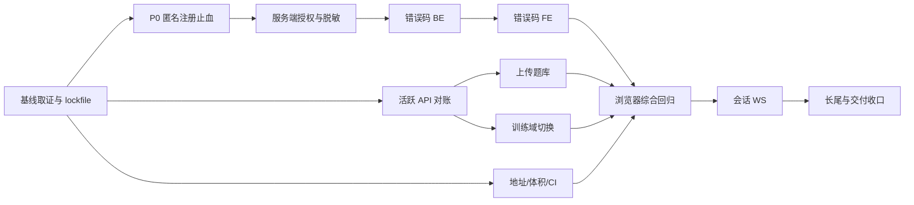

# 联合整改实施计划（2026-09-08）

> 对应 Spec：[`../specs/2026-09-08-joint-fix-spec.md`](../specs/2026-09-08-joint-fix-spec.md)。权威依据：[`../reviews/2026-09-08-full-project-review.md`](../reviews/2026-09-08-full-project-review.md)；跨栈证据：[`../reviews/2026-09-08-joint-frontend-backend-review.md`](../reviews/2026-09-08-joint-frontend-backend-review.md)。
>
> 本文是**执行中计划**，仅 `[x]` 且有证据的条目表示完成。代码现状若与历史行号冲突，以执行时符号/LSP/运行结果为准；不要把既有 `2026-09-07-fix-plan.md` 已完成项重复实现。

## 1. 交付策略

### 1.1 成功标准

- P0-01 有匿名 REST+数据库回归证据：带已有 id 的 `/signin` 不改变目标行，正常注册仍可创建。
- BE-P1-01 与 AS-J-P1-02 先于前端修复：无凭据泄露、普通用户不能调用管理端点；未授权统一 HTTP 200 + `code:207`。
- 活跃 J-P1 功能（房间、上传、时间、HTTPS 地址、错误码）有浏览器 Network/页面证据；撤回的尾空格结论不再计入 DoD。
- J-P2/J-P3 每一组都有“完成、判定不修（理由+风险接收人）、或另立项”的终态，不能留未决条目。
- 后端基线为 full review §9.1 的 216 测试；收口后必须 `>=216 + 新增回归`，并通过前端 `npm ci && npm run build`。

### 1.2 提交和验证规则

1. 一个独立可回滚任务一个提交；跨栈契约与其前端/后端/回归测试同提交。历史已合并的大批提交不伪造拆分。
2. 修改导出符号、端点、DTO 或 API 导出前，使用 LSP references 覆盖调用者；删除前确认零引用。
3. 业务错误不改成 HTTP 4xx/5xx；203/204/206 码值与文案逐字保护。
4. 后端每个 P0/P1 先写会失败的行为测试，再实施修复；测试断言 DB、响应信封或协议，不断言注解存在。
5. 前端无测试地基；使用静态门禁、`npm run build`、真实浏览器和部署矩阵，禁止为“有测试”引入临时框架。
6. 各阶段完成后立即在本计划填写证据路径和日期；未跑的命令不能写成通过。

## 2. 依赖图

- A 必须先完成；P 与 B 共享 `UserService`/Fixtures，P 完成后再做 B；D/J 可与 P/B 并行但不能编辑同一文件。
- E 必须在 F 前；G 与 H 可并行；I 是首次完整跨栈验收，不可被单元测试替代。
- 会话 token/hash 迁移依赖产品/部署确认，不能用“改几行 MD5”冒充完成。

### 2.1 文件所有权与串行抵达点

| 文件 | 阶段 | 规则 |
|---|---|---|
| `frontend/src/views/manage/basicTheory/test/questionBank/js/knowledgeTabel.js` | G → J | G 先接 `saveBatch`/模板，J 再处理导出地址；禁止并行 |
| `frontend/src/views/manage/basicTheory/study/basic/edit/Index.vue` | G → J | G 先改 accept/空值，J 再改上传 action/SSE |
| `frontend/src/views/manage/equipment/equipmentIndex.vue` | G → J → L | 上传能力、地址、富文本按序接力 |
| `frontend/src/common/http/index.js` | F → J | 错误码拦截器先定型，再补 timeout/网络提示 |
| `frontend/src/views/manage/organization/telexZuXun/list/js/list.js` | D + H | 分页和错域合并一个集成提交 |
| `backend/src/main/java/com/nip/service/UserService.java` | P → B | 注册语义先拆，再做授权/自限定改密 |

每一行只允许一个集成者；阶段交接必须先读取最新文件并更新 references。

## 3. 阶段任务

### Phase 0：基线和可复现安装

#### 0.1 建立当前基线

- [ ] 记录当前源码 commit、后端 `clean verify`、前端 `npm install --ignore-scripts --no-audit --no-fund && npm run build` 结果。
- [ ] 重新核对 P0、用户管理端点、三类凭据字段、`ResponseCode`、活跃前端 API 调用；把证据写入本计划。
- [ ] 读 `docs/reviews` 的“已修复/撤回”章节，排除 `GET data` 丢参、尾空格必 404、v-per 查无权限放行等旧结论。

#### 0.2 固化前端依赖

- [ ] 从 `frontend/.gitignore` 删除 `package-lock.json`，确认 `frontend/package-lock.json` 被 Git 跟踪且与 `package.json` 同提交。
- [ ] 本地用 `npm ci` 构建；若 lockfile 由不同 npm 版本生成，记录版本并统一 CI 版本。

**出口证据：** 基线命令输出、lockfile 状态、差异排除清单。

### Phase P0：匿名注册止血（最高优先）

- [x] 测试 `AnonymousSigninTest`：预置 victim（合法身份证字段），匿名带已有 id 请求必须返回非成功且目标行身份字段不变；无 id 正常注册仍创建新行；重复账号不得改写原用户，注册成功响应不含敏感字段。
- [x] 实现：`/signin` 明确拒绝非空 id（含空白），并保证服务层不会让匿名入口进入 `handleExistingUser`；管理更新保留在受保护端点；注册只复制公开注册字段。
- [ ] 生产存量 `user_account`/`id_card` 重复盘点及清理尚未执行；本轮不增加唯一索引，保留已有服务层重复账号检查，不据此宣称并发注册唯一性已解决。

**已取得证据（2026-09-09）：** 修复前运行复现见全项目 Review §9.4；修复后 `AnonymousSigninTest` 三项通过（已有 id 拒绝、重复账号不改写、正常注册及敏感响应检查）。没有重新执行修复前 RED 用例；未做生产数据变更。

### Phase 1：服务端授权与脱敏（对应 Spec 批 1）

#### 1.1 授权基础设施

- [x] 新增 `RequireAdmin` interceptor 和业务码 207；复用既有 `WebApplicationExceptionMapper` 返回 HTTP 200 信封，异常链不吞 token 失效。
- [x] 由 token 查用户、由 user 查角色；按既有语义 `isAdmin == 0` 判超管。无角色和普通角色均返回 207；多角色使用 `count > 0` 存在性判定。
- [x] 为 `UserController` 的 `saveUser/importUser/addUserRole/delete/resetPassword/getAllUser`、`RoleController.addRole`、`MenusController.addMenu` 加方法级保护；同类查询端点不因类级注解误伤。
- [x] `AdminAuthorizationTest` 覆盖普通用户删除、无角色授予角色、超管重置密码、用户目录脱敏及响应信封；`ExceptionBoundaryTest` 已补管理员夹具以保留其业务异常断言。

#### 1.2 自限定改密

- [x] `changePassword` 从 token 推导当前 user id；移除 body id 的必填校验但保留旧密码/新密码校验。
- [x] `AdminAuthorizationTest.changePasswordUsesTokenOwnerInsteadOfBodyUserId` 验证 A token 携 B id 只修改 A，B 保持不变。

#### 1.3 用户响应脱敏

- [x] 使用 `UserProfile`/`UserSummary` DTO 覆盖 `getAllUser`、`getAllUserByContent`、`getUserById`、`getUsersByIds`、`getUsersByToken` 等返回用户信息路径；现有 `UserInfoDto` 不再嵌入 `UserEntity`。
- [x] 清点用户选择调用：管理列表继续走受保护 `getAllUser`；训练选人和通知人员改走已登录可用的 `getUserDirectory` 最小 DTO。
- [ ] `CableController`、`CableTypeController`、`DeviceController` 等无 `@JWT` 写/删端点仍需按各自消费者逐项整改；不属于已完成的八个 user/role/menu 管理方法。
- [x] 登录/注册使用独立会话/注册响应：用户资料不含 password，token/deviceId 仅作为登录会话字段；同步 `useLogin.js` 读取路径。
- [x] `AdminAuthorizationTest` 与 `AnonymousSigninTest` 断言目录、登录/注册用户资料不含 password/token/deviceId；未用 `@JsonIgnore` 掩盖实体响应。

**出口证据（2026-09-09）：** 后端 Java 21 + Docker `./mvnw -B clean verify`：226 tests，0 failures，0 errors，0 skipped（本轮输出 `artifact://64`）；授权/注册/异常边界定向 22 项通过（`artifact://61`）。前端三处 API/HTTP JS `node --check` 通过，`npm run build` 成功（`artifact://39`）。LSP 未配置，使用 grep 核对调用面。浏览器打开前端后停在设备授权页，真实登录、管理与训练选人页面尚未联调；不能把构建成功等同于页面回归通过。

### Phase 2：活跃 HTTP 契约对账

#### 2.1 房间和时间

- [x] 前端 7 处 `roomgId` 改 `roomId`，并与三个 simulation controller 的 `@RestQuery(ROOM_ID)` 对照。
- [x] 自测列表显示和排序使用后端真实 `start_time` 字段；snake/camel 全站统一仍留后续任务。
- [x] 电传组训从 `rows:999` 改为服务端 `page`/`rows:10`，绑定 `totalPage`/`totalNumber`；其余合法分页调用未做无证据重写。

#### 2.2 死导出

- [x] `StructureApi.getAllUserByContent`、`UserApi.addUser`、`TheoryQuestionBankApi.downloadTemplate` 与题库 `exportTemplate1` 经全仓 grep 无实际引用，已删除；`deleteThroyKnowledgeById` 有两个实际调用，保留。
- [x] `UnionApi.editDisturbTrainRoomStatus` 经全仓 grep 无实际调用，已删除；`updateTrainRoomDispose` 有实际训练调用，保留；注释 raw axios 未改动。
- [ ] `deleteThroyKnowledgeById` URL 尾空格不作为确定性缺陷，本批不改。

**出口证据（2026-09-09）：** 全仓 grep 清零 `roomgId`、`rows:999`、`d.startTime`；目标 JS `node --check` 与前端 `npm run build` 通过。浏览器当前受设备授权页阻断，未写房间 Network/截图为已通过。

### Phase 3：错误码和响应信封（BE → FE）

#### 3.1 后端码语义

- [x] 业务 `NULL_ERROR` 产生点迁到 `PARAMS_ERROR(202)`；`NULL_ERROR` 枚举已删除，204 仅由 JWT 设备缺失路径产生。
- [x] `ValidationExceptionMapper`、`IllegalStateExceptionMapper`、`InvalidTitleExceptionMapper` 的业务校验码改为 202，保留 safeMessage、HTTP 200；Global mapper 保留 HTTP 500。
- [x] `ExceptionBoundaryTest` 覆盖业务空参 202、校验异常 202、未预期异常 HTTP500/code500、缺 deviceId 204；定向 22 项和全量 228 项均通过。

#### 3.2 前端拦截器

- [x] 删除后端无产生点的 205 分支；203/204/206 在登录页不再返回 undefined，任何分支返回 `response.data`。
- [x] 对非 200 业务码集中 toast，支持 `skipErrorToast`；用户管理 207 假成功、保存失败继续赋权问题已修复。
- [ ] 网络错误和 timeout 留 Phase 5 同文件接力。

### Phase 4：文档与题库

- [x] 上传 UI 的 `accept` 对齐真实能力：文档编辑页与设备说明页仅允许 `txt/md/csv`，题库页允许前端解析的 `docx/xlsx`；`data`、`wordContent` 和 `imgUrls` 空值均有安全分支。
- [x] 题库 DOCX/XLSX 解析后一次调用 `saveBatch`；等待响应且只在 `code===200` 刷新和提示成功，删除逐行 fire-and-forget 与定时器假成功。
- [x] 已删除无实际引用的 `exportTemplate1`、`downloadTemplate` 及旧上传端点配置；模板按钮改请求后端 JSON 列规格并由现有 xlsx 生成器输出 `.xlsx`，保留仍有调用者的 `exportQuestionBank`。
- [ ] 真实页面文件上传、后端 saveBatch Network、数据库回滚和 Excel 客户端打开尚未在设备授权页之外完成；浏览器已直接验证 DOCX 文本解析、XLSX 行归一化，后端既有 `TheoryKnowledgeUploadExportTest` 覆盖 API/DB 契约。

**出口证据（2026-09-09）：** 后端全量 `clean verify` 228 tests 全绿；前端 `node --check`/`npm run build` 成功；浏览器解析 smoke：DOCX 2 行题目得到 `[1,3]` 类型、单选答案 `"1"`、判断答案 `"1"`，XLSX 行回退当前题库 ID 后正确归一化。真实设备授权/页面联调仍是外部前置。

### Phase 5：地址、上传链和 CI

- [x] 新增协议感知 `apiUrl`/`wsUrl`，迁移 2 个实际 HTTP 上传地址和 4 个协同 WS 手工拼接点；另清理 3 个未绑定的旧上传地址配置；保留 Electron 的 `window.wsUrl`。
- [x] throwaway 浏览器脚本对 `https://host/data` 与 `host/data` 两种输入验证 HTTP/WS 协议，结果为 `https://.../data/api`、`wss://.../push/...` 和 `http://.../api`、`ws://.../push/...`；仓内无真实反代，未宣称外部形态已联调。
- [ ] 后端 body 上限、前端文件大小预检、共享 timeout 未完成；反代 `client_max_body_size` 仍作为仓外前置记录。
- [x] CI 新增 Node 20、`npm ci`、`npm run build`；`frontend/package-lock.json` 已解除忽略并纳入本提交。dist 仍由现有 Electron/Tauri 外壳按其既有加载路径消费，未新增外壳配置。
- [x] `pom.xml`、`frontend/package.json`、`package-lock.json`、`application.yml`、OpenAPI 信息已统一为 `1.1.0`；发布仍由 tag 驱动。

### Phase 6：训练域与结算

- [x] `telexZuXun` 列表、学生、成绩和教员文件已改用 `datagramZuXun.js` / `generalTelexPat`；WS 路径改为 `/generalTelexPatTrain`；断点键保持 telex 专属 `datagramZuXun`。
- [x] 新增后端 `generalKeyPat/reset`，按 token 只清理当前学员的结果/解析/多组数据，保留生成报文；前端电子键 reset 改调本域。`GeneralKeyPatResetTest` 验证本域隔离。
- [x] 电传/电子键前端完成提交仅在后端 `code===200` 后跳转；后端 `finish` 对已完成参训记录幂等短路，避免重复计分。
- [x] 电传成绩读取、分页和详情已切到 `GeneralTelexPat` 响应字段；前端最终分数继续以后端 detail/statistics 返回值为准。
- [ ] handkey/electronKey 其它复制子树、WS 握手鉴权和断点权威化仍需后续逐域核对；本批不宣称全站训练状态已收口。

**出口证据（2026-09-09）：** `GeneralKeyPatResetTest` 1 项通过，后端 `./mvnw -B clean verify`：229 tests，0 failures，0 errors，0 skipped；电传/电子键目标脚本 `node --check` 通过，前端 `npm run build` 成功；`telexZuXun` 子树 grep 无 `electronKeyZuXun`、`handkeyZuXun`、`generalKeyPat`、`generalTicker` 残留。未完成真实训练房间 Network 与重复 finish 运行态验证。

### Phase 7：会话与 WebSocket

- [x] 登出调用 `userOut`，网络失败也在 `finally` 完成本地/WS 清理；`SessionLogoutTest` 证明旧 token 返回 `206` 且另一会话仍可用。浏览器 smoke 证明清理后跳转 `/login`。
- [ ] PublicSocket/Ws/MessageWebSocket/UnionWs 的受控重连、抖动、上限、readyState 和退出置空已落地，关闭不触发重连；心跳看门狗尚未实现，保留为未完成项。
- [ ] 仿真 WS 对坏消息逐条返回协议错误，不让单条解析异常触发正常参与者清理；必要时保留未知 room/id 的拒绝日志。
- [ ] 将 WS idle-timeout 单列为 spike：在当前 Quarkus 版本确认配置键和实际关闭行为，输出选定值/不支持时的应用层替代；该 spike 不阻塞 FE logout/重连交付。
- [ ] WS token/deviceId 握手鉴权单独记录安全决策；若不改，明确为已接受风险，不把 URL 修复冒充鉴权完成。
 
**Phase 7 已交付部分的出口证据（2026-09-09）：** 后端 `SessionLogoutTest` 通过，后端 `./mvnw -B clean verify`：230 tests，0 failures，0 errors，0 skipped；前端全部相关脚本 `node --check` 通过，`npm run build` 成功；浏览器 smoke 验证关闭后不重连（创建连接数保持 1）、登出清理 `token/deviceId/userInfo/userRole/userRouter/tabCache` 并跳转 `/login`。心跳、仿真坏消息、idle-timeout spike、WS 握手鉴权仍未完成，不宣称 Phase 7 全部收口。

### Phase 8：富文本与数据表示

- [ ] 复用或引入一个成熟白名单净化器，建立唯一渲染入口；覆盖 `v-html` 和 iframe/document.write 两个 sink，阻断危险标签、事件属性和 javascript/data URL scheme。
- [ ] 按字段清单处理时区、数值 wire 类型、snake/camel、字典取值、createTime；每项写完成或不修理由，不做无证据全站重命名。
- [ ] CSP/iframe sandbox 的要求写入部署验收；净化测试断言恶意 payload 不执行且合法富文本保留。

### Phase 9：密码、会话协议和剩余单侧风险

- [ ] 设计并评审 hash 版本、PBKDF2/Argon2id 选择、旧 MD5 渐进升级、密码重置、失败回滚；存量数据和 `password` 列长度先盘点。
- [ ] 设计随机有期限 access token、refresh/revoke、device 绑定和 Web/Electron 安全存储迁移；在设计落地前保留明文自动登录/确定性 token 的接受风险。
- [ ] 删除 query token/deviceId 兼容前，完成所有客户端 header 迁移并做日志观察；改生产凭据为 Secret/最小权限账号。
- [ ] 处理生产 OpenAPI、CORS、demo/死端点、Tauri 残留等 P3：逐项选择实施、接受或另开 Spec。

## 4. 总验收清单

### 4.1 静态

- [ ] P0 `/signin` 不再存在“客户端 id 触发更新”的可达路径。
- [ ] 用户管理响应 DTO 无 password/token/deviceId；目标管理方法均有服务端授权（不以 UI `v-per` 为证明）。
- [ ] 活跃 `roomgId`、telex 错域 import、`generalKeyPatTrain`（telex 页面）和手工协议拼接均清零。
- [ ] `NULL_ERROR` 仅保留在决定性的兼容位置或为零；203/204/206 定义逐字不变；前端不存在 205 处理分支/undefined 返回。
- [ ] lockfile 跟踪、CI 前端 build、版本规则、上传体积规则都有文件证据。

### 4.2 后端

- [ ] `AdminAuthorizationTest`、`UserResponseRedactionTest`、P0 注册测试、`ErrorEnvelopeContractTest`、训练 reset/WS 回归测试通过。
- [ ] `cd backend && export JAVA_HOME=$HOME/.local/opt/jdk21 && ./mvnw -B clean verify` 通过；输出原样记录测试数、失败数和 Docker 前提。
- [ ] 生产 `generation: validate`、迁移顺序、唯一约束、Secret 变量和启动 smoke 均有证据；不以旧计划的 216 全绿替代新行为验收。

### 4.3 前端和运行期

- [ ] `cd frontend && npm ci && npm run build` 通过。
- [ ] 浏览器逐条保存 Network/截图：房间、改密错误、txt 导入、题库批量、xlsx 模板、telex 建训、登出旧 token。
- [ ] HTTPS+反代和 Electron 直连分别验证；缺少仓外反代时明确标 `[未验证外部前置]`。
- [ ] 最终表中每个 Spec 编号都有状态：已完成/判定不修/另立项；不得出现“部分完成但无下步”。

## 5. 终态登记模板

| 编号/任务 | 状态 | 代码/测试/运行证据 | 偏离或风险 | 提交 |
|---|---|---|---|---|
| P0-01 | 注册入口止血已完成 | `AnonymousSigninTest` 三项、全量 226 全绿 | 生产重复数据盘点与并发唯一性未完成 | `adb4949`、`649b37a` |
| BE-P1-01 | 用户 API 脱敏已完成，跨域响应待复核 | `UserProfile`、`UserSummary`、`LoginSessionDto`；登录与当前用户响应回归 | 不宣称所有跨域 VO（如 `ComprehensiveVO.userEntity`）均已脱敏；页面联调受设备授权前置限制 | `649b37a`、`e7514ed` |
| AS-J-P1-02 | 八个管理方法已加授权 | `AdminAuthorizationTest`、`ExceptionBoundaryTest`；207 前端提示及目录迁移 | Cable/CableType/Device 端点尚未整改 | `649b37a`、`e7514ed` |
| HC/EC/TK/DC/DM J-P1 | 未开始 | — | — | — |
| J-P2/J-P3 长尾 | 未开始 | — | — | — |

> 关闭本计划前，将模板扩展为完整编号表，并把撤回项 `HC-J-P1-02` 单独标记为“撤回（full review §9.5 实测）”，不能标记为已修复。
