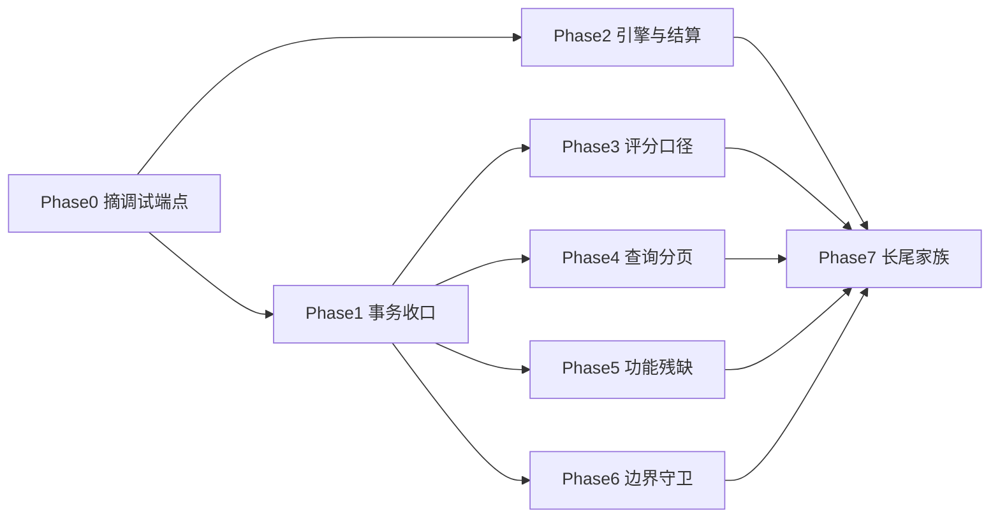

# 缺陷修复实施计划（Fix Plan，2026-09-07）

> **For agentic workers:** REQUIRED SUB-SKILL: Use superpowers:subagent-driven-development (recommended) or superpowers:executing-plans to implement this plan task-by-task. Steps use checkbox (`- [ ]`) syntax for tracking.
> 上游文档：[修复 Spec](../../specs/archive/2026-09-07-fix-spec.md) ｜ [总评审](../../reviews/archive/2026-09-07-full-project-review.md) ｜ [文档审计](../../reviews/archive/2026-09-07-review-audit.md) ｜ [整改核销](../../reviews/archive/2026-09-07-remediation-verification.md)
> 本计划的每处行号、方法签名与代码片段均在 HEAD `b9b9f22` 上由 5 个取证代理逐字取回并核对；「原 X → 现 Y」标注表示评审文档行号已漂移。

**Goal:** 关闭 34 条 P1（部分提交、不可回滚窗口、评分口径矛盾、功能残缺、边界失守），并按家族规则收敛 P2；测试数从 129 增长到 ≥175，`clean verify` 始终全绿。

**Architecture:** Phase 0 摘写库调试端点（零依赖止血）→ Phase 1 收口事务语义（是后续所有阶段的前置）→ Phase 2 引擎迁移与结算写入模式 → Phase 3-6 四条独立线并行（评分口径 / 查询分页 / 功能残缺 / 边界守卫）→ Phase 7 机械化清长尾。

**Tech Stack:** Quarkus 3.20.4 / Java 21 / Hibernate ORM Panache / MySQL 8.0.26 / Jakarta WebSocket。测试地基已就绪，不引新依赖。

## 执行结果（2026-09-07 收尾；2026-09-08 偏离闭合后重算）

Phase 0-7 全部执行完毕。判定粒度为 Task：Phase 0-6 共 31 个 `### Task`，Phase 7 为 10 个 Task 级 checkbox，合计 41 项。
每项都在当前工作树逐条 `read`/`grep` 取证后判定；门禁数字逐字引用主代理实测记录，未重跑。
Phase 6 末尾的「计划外补丁」（`WebSocketUnionService` 两处空解引用）不是计划里的 Task，不计入 41 项，只进下方「计划外新增改动」表。
**2026-09-08 更新：** 2026-09-07 收尾时余下的 4 项偏离（Task 3.2、3.4、5.2、6.3）已按 [偏离修复 Spec](../../specs/archive/2026-09-08-deviation-fix-spec.md) 全部闭合，下表的 Phase 3 / 5 / 6 与合计行据此重算 → **41/41 已落地、0 偏离、0 未落地**；门禁数字由 201 更新为 **216**。仍未达成的两项（「每 Task 一次提交」、分片文档批量标注「已在 fix-plan 批 N 处理」）不在这 4 项范围内，照实保留在本节与 `docs/specs/archive/2026-09-07-fix-spec.md` 的验收状态节。

| Phase | Task 数 | 已落地 | 偏离 | 未落地 | 关键证据 |
|---|---|---|---|---|---|
| 0 摘除写库调试端点 | 3 | 3 | 0 | 0 | `@Path("/test`、`System.out.print` 在 `src/main/java` 均 0 命中；`controller/test/` 目录已不存在；`DebugEndpointsRemovedTest.java:17-33` 三条 404 断言 |
| 1 事务吞异常收口 | 5 | 5 | 0 | 0 | `TelexPatService.java:102-107`（统计行判空）+ `:111-120`（`setRollbackOnly`）；`TelegramTrainService.java:278-281`、`:321-332`、`:344-353`；`CableService.java:84-88`、`CableTypeService.java:47-52` 已无 try/catch；`UserService.java:364/421/483` 三处回滚标记；`UserDao.java:91-94` 已无 catch |
| 2 引擎迁移与结算写入模式 | 4 | 4 | 0 | 0 | `scripts/rehearse-migrations.sh:44-47` `REHEARSAL_OUT_NAME` 参数化；`LifecycleApplication.java:65-87` 启动自检；`PostTelexPatTrainService.java:849-851` + `:963-987`、`PostTelegraphKeyPatTrainService.java:394-396` + `:527-545` 先校验后删；Task 2.4 Step 5 的 prod jar WebSocket 双连接探针已实测（三连接 A/B/C，见该 Task）|
| 3 评分口径统一 | 5 | 5 | 0 | 0 | 速率加减分已收口为全仓唯一实现 `ScoreMath.java:64-72`（javadoc `:51-63`），三处委托 Ticker `GeneralTickerPatService.java:991-997`／Key `GeneralKeyPatService.java:849-851`／Telex `GeneralTelexPatService.java:813-815`；`:316/320/324` `isAverage` 口径 + 回归测试 `TickerIsAverageTest`；`PatTrainStatisticsUtil.java:71-74` 比率守卫 + 服务级分子锁 `TickerGapRateNumeratorTest.java:89/105`；`MessageComparisonService.java:202/215` 与 `LineDetector.java:233-236/278-287` 索引推进与结果写入。原偏离项 Task 3.2/3.4 已于 2026-09-08 闭合，逐项结论见各 Task 状态行 |
| 4 查询、分页与页号生成 | 4 | 4 | 0 | 0 | `TickerTapeTrainDao.java:109-111` `descending()`；`common/utils/Page.java:14/36-45` 钳制 + `@RegisterForReflection`，`dto/Page.java` 已删；`roomgId` 全仓 0 命中；`PostTelegramTrainService.java:842-843`、`:440-444`、`PostTelexPatTrainService.java:271` |
| 5 功能残缺与假成功 | 5 | 5 | 0 | 0 | `GeneralTelexPatService.java:369-372` 电传按页查询；`TheoryKnowledgeExamUserController.java:54-67` 内层错误透传 + `state` 校验；`TheoryKnowledgeExamService.java:238-245` 快照 `setId(null)`；`RoleService.java:61/71`、`UserService.java:263-269`。原偏离项 Task 5.2 已于 2026-09-08 按业务拍板的方案 B 恢复三端点：`TheoryKnowledgeQuestionController.java:86-92`（`saveBatch`）、`:94-99`（`exportTemplate`）、`TheoryKnowledgeController.java:176-182`（`uploadFileToNip`）|
| 6 边界守卫 | 5 | 5 | 0 | 0 | `SimulationRouterRoomService.java:137-144` 等 11 处 `cableFloor.subList` 守卫；`TelegraphKeyPatTrainService.java:128-131`；`PostTickerTapeTrainService.java:178-182`、`:216-222`；`RadiotelephoneService.java:41-52` + `:54-61`；`WebSocketUnionService.java:133-154`、`:206-215`。原偏离项 Task 6.3 已于 2026-09-08 闭合 —— 读路径懒建改为唯一约束 + 幂等重试（`RadiotelephoneEntity.java:20-21`、`TheoryKnowledgeTestFallibleEntity.java:26-27`、`IdempotentWrite.java:31-34/42-52`）。另有计划外补丁：`WebSocketUnionService.java:72-80`/`:509-513` 两处空解引用（Phase 6.5 同族漏项，不计入 Task 计数）|
| 7 长尾家族规则 | 10 | 10 | 0 | 0 | `ResponseCode.java:14-21`、`ValidationExceptionMapper.java:33/44-70`、`JWTInterceptor.java:45-50/80-84`、`application.yml:19-21/65-70`、`SpecificationExecutor.java:99-108`、`PatTrainStatisticsUtil.java:71-74`（`ToolUtil` 三参版已删）、`Fixtures.java:17-20`、`WebSocketDeleteOpenAtomicityTest.java:282-284`；Task 7.7 的 `Boolean isXxx` 经运行实测判定不成立（`CA-P2-23` 误报）、Task 7.9 的 `.idea/` 已 `git rm -r --cached` |
| **合计** | **41** | **41** | **0** | **0** | 2026-09-07 收尾时余 4 项偏离（Task 3.2、3.4、5.2、6.3），已于 2026-09-08 按 [偏离修复 Spec](../../specs/archive/2026-09-08-deviation-fix-spec.md) 全部闭合：3.2/5.2/6.3 补齐实现，3.4 经 `git show e319d41~5` 逐字核对后判定原「偏离」不成立并补服务级锁 |

### 计划外新增改动（计划文本中不存在，执行中新发现）

| # | 改动 | 触发原因 | 证据 |
|---|---|---|---|
| 1 | 迁移 01 的两处 `ADD COLUMN` 改为 `information_schema` 判存 + `PREPARE`/`EXECUTE`/`DEALLOCATE`，列已存在时执行 `DO 0` | 快照回灌后 `project006.sql` 已含 `is_start_sign`，重跑演练报 `ERROR 1060 Duplicate column name`；MySQL 8.0 **不支持** `ADD COLUMN IF NOT EXISTS`（那是 MariaDB 语法）| `backend/database/migrations/2026-08-26-01-schema-sync.sql:92-115`；脚本头注 `:17-18` 同步改为「本脚本幂等 …… 可安全重复执行」；两条 `MODIFY COLUMN`（`:127-128`）本就幂等未改。实测证据 §7 |
| 2 | `TelegramTrainService.save` 补 `catch (IllegalArgumentException \| IllegalStateException e) { throw e; }` 重抛链 | Task 1.2 Step 2 的入参守卫抛在 try 内，会被下方 `catch (Exception)` 吞成 `error()`，红灯变假绿 | `TelegramTrainService.java:321-323`（照 `GeneralKeyPatService` 先例）；此后成为后续两波的强制规则，同型重抛见 `PostTelexPatTrainService.java:227/247/1345`、`PostTelegraphKeyPatTrainService.java:156/238/341`。实测证据 §10.1 |
| 3 | `WebSocketDeleteOpenAtomicityTest` 替身 `roomType` 由 `REPORT(2)` 改为 `SimulationRoomTypeEnum.ROUTER` | 测试自身 bug：替身返回 `roomType=2` 会被 `openLocked` 注册进 `reportRoom`，而用例断言的是 `routerRoom`；原 250ms sleep 断言是空转的，被改成因果断言后才暴露 | `WebSocketDeleteOpenAtomicityTest.java:282-284`（含成因注释）。实测证据 §10.2 |
| 4 | `subList(0, …)` 守卫从计划列举的 4 处推演房扩到全部 11 处 `cableFloor.subList(0, totalPage)` 站点 | Task 6.4 只列了四类推演房，同构缺陷同时存在于 4 个 `Post*` 与 3 个 `General*` 结算路径 | 11 处均有「`totalPage <= 0` → 报文组数不足一页」+「`totalPage > cableFloor.size()` → 所选电缆可用楼层不足」前置校验，例 `SimulationRouterRoomService.java:137-144`、`PostTelegramTrainService.java:245`、`GeneralKeyPatService.java:230`。实测证据 §9 |
| 5 | 新增 `checkRebuiltPages` / `checkRebuiltPageValues` 两个结算前校验方法 | Task 2.3 Step 1 的「先构建并校验、校验通过才 delete」落地为独立方法（非空 / 页号非空 / 页号集合一致 / 页号连续 / 每页行数不减）| `PostTelexPatTrainService.java:963-987`、`PostTelegraphKeyPatTrainService.java:527-545` |
| 6 | `ToolUtil.calculateRate(min,max,total)` 三参版直接删除，13 处调用一次性迁到 `PatTrainStatisticsUtil.calculateRate(count,total)` | 计划把删除排到 Task 7.6、Task 3.4 只改守卫；实际两者合并一次做完 | `ToolUtil.java:95-112` 已无 `calculateRate`；`GeneralTickerPatService.java:84` 静态导入 + `:758-782` 全部为两参调用；守卫在 `PatTrainStatisticsUtil.java:71-74` |
| 7 | `Fixtures.user` 账号改为 `tester-<UUID>` | Task 7.8 的 `TS-P2-03`：`Fixtures` 播种独立提交且用例间无清理，共用 `tester` 会让按账号查询的路径跨用例串数据 | `Fixtures.java:17-20` |
| 8 | `WebSocketUnionService` 两处 `userDao.findUserEntityById` 空解引用补守卫：`onOpen` 未知 sid 拒连（`:72-80`）、`roomMessage` 未知发送者丢弃（`:509-513`）| Task 2.4 Step 5 的 prod jar WS 探针暴露：未知 sid 连接触发 `NullPointerException: Cannot invoke "com.nip.entity.UserEntity.getUserName()" because "userEntity" is null`；Phase 6.5 只清了可空**列**（`userType`/`channel`/`role`），漏了联合端点「查库结果对象本身为 null」这一族 | 详见 Phase 6 末「计划外补丁」一节；回归测试 `WebSocketUnionLifecycleTest.java:164-178` + 替身 `MissingUserDao:283-288`；评审侧记为 `docs/reviews/2026-09-07-ws-concurrency-review.md` §3.1 的 WS-P2-08 |
| 9 | 速率加减分收口为全仓唯一实现 `ScoreMath.wpmScore(int, BigDecimal, BigDecimal, int)`，Ticker/Key/Telex 三处内联分支改为委托 | 2026-09-08 闭合 Task 3.2 偏离：计划 Step 3 想用「三份拷贝各测一遍」证明一致，改为让它们只剩一份实现 —— 结构性保证强于三份断言 | `ScoreMath.java:64-72` + javadoc `:51-63`；委托点 `GeneralTickerPatService.java:991-997`、`GeneralKeyPatService.java:849-851`、`GeneralTelexPatService.java:813-815`；`ScoringConsistencyTest` 8 例（头注释 `:13-23` 已改写为收口后口径）。126 组得分对照全相等，见 Task 3.2 |
| 10 | 新建 `common/repository/IdempotentWrite`（`inNewTransaction` = `REQUIRES_NEW` + `isConstraintConflict` 遍历异常链），两处读路径懒建改幂等 | 2026-09-08 闭合 Task 6.3 偏离：「读接口带写副作用」这个待评估项评估出真实并发缺陷（并发双插 → 计数割裂），必须真修。必须是独立 bean —— 同类自调用不过 CDI 拦截器，`REQUIRES_NEW` 会失效 | `IdempotentWrite.java:31-34`（`REQUIRES_NEW`）、`:42-52`（异常链判定）、javadoc `:9-26`（三条「为何不能原地重读」硬理由）；改造点 `RadiotelephoneService.java:45-48/54-61/63-87/89-102`、`ComprehensiveService.java:343/359-372/374-384`；并发用例 `ReadPathLazyCreateConcurrencyTest.java:58/81/100/122` |
| 11 | 新增迁移 `2026-09-08-01-unique-lazy-create.sql`（两条唯一索引），演练脚本加第三段 MIG03 | 同上：唯一约束是 schema 变更，`%prod` 是 `generation: validate`，不出迁移则生产启动被拦；演练脚本原本只跑迁移 01/02，新迁移不进脚本就永远没有幂等与耗时证据 | `backend/database/migrations/2026-09-08-01-unique-lazy-create.sql`（`information_schema.statistics` 判存 + `PREPARE`，MySQL 8.0 无 `ADD CONSTRAINT IF NOT EXISTS`）；`scripts/rehearse-migrations.sh:62`（`MIG03`）、`:64`（存在性前置）、`:162-164`（计时，`timings.tsv` 现为 4 列）、`:186-188`（两条唯一索引断言）；双快照演练 PASSED 见下方门禁数字 |

**门禁数字（`Tests run: 216` 为 2026-09-08 偏离闭合后的主代理最终 verify 结果，其余逐字引用主代理实测，勿重跑）：** `JAVA_HOME=$HOME/.local/opt/jdk21 ./mvnw -B clean verify` → `exit=0`、`Tests run: 216, Failures: 0, Errors: 0, Skipped: 0`（起点 129 测试。历史绿点串：WaveA 132 → WaveB 144 → WaveC 181 → WaveD 198 → 2026-09-07 收尾波 201 → 2026-09-08 偏离闭合波 216 —— `Wall time: 120.98s` 是 WaveD 那次的整套耗时；收尾波补的 3 例是 `TickerIsAverageTest` 2 例 + `WebSocketUnionLifecycleTest` 第 6 例 `unknownSidIsRejectedWithoutRegisteringOrDereferencingNull`；偏离闭合波净增 15 例 = `ScoringConsistencyTest` 3→8 例（+5）、`TickerGapRateNumeratorTest` 2 例新建、`ReadPathLazyCreateConcurrencyTest` 4 例新建、`TheoryKnowledgeUploadExportTest` 2→6 例（新增 5 例、删掉原先断言三条 404 的 `emptyShellUploadAndExportEndpointsAreGone`，净 +4））。prod jar 以**默认** `%prod`（即 `generation: validate`，不再覆盖）启动成功：偏离闭合后实测 `quarkus-template 1.1.0 ... started in 2.506s`，无 `SchemaManagementException` —— 实体新增的两条唯一约束被 `validate` 接受（活库已有对应索引）；2026-09-07 收尾时的同项实测为 `quarkus-template 1.0.0 on JVM (powered by Quarkus 3.20.4) started in 2.369s` / `Listening on: http://0.0.0.0:18002` / `Profile prod activated.`（修复前同一命令 `SchemaManagementException: Schema-validation: missing table [general_telex_pat]`）；同一 jar 上的只读 HTTP 冒烟 7 条与 WebSocket 双连接探针三连接 A/B/C 见 Task 2.4 Step 5，`/q/openapi` 的 447 个 schema 属性名实测见 Task 7.7。双快照迁移演练在加入迁移 03 后重跑并 **PASSED**（`backend/database/rehearsal/2026-09-08/`）：`timings.tsv` 为 `current 182 2450 110` / `base 644 2431 165`（第 4 列即迁移 03），两侧 `unique index exists` 断言各 2 条全 PASS，表计数 105、MyISAM 0、`diff-current.txt` 与 `diff-base.txt` 均 0 字节。活库 `select count(*) tables, sum(engine='MyISAM') myisam …` → `105    0`（修复前 100 表 / 22 MyISAM）；迁移 03 在活库连跑三次，第三次 `mysql exit=0` 且索引列数仍为 3（2 列复合 + 1 列）→ 幂等确证。

**交付形态偏离：** Global Constraints 要求「每个 Task 一次提交，消息格式 `fix(<编号>): <一句话>`」；实际 2026-09-07 全波以**单一变更集**交付并由主代理统一提交、推送、打 tag（v1.1.0，`e319d41`），2026-09-08 的偏离闭合波同样是单一变更集。v1.1.0 已推送，历史无法追溯重写，本项**永久未达成**。因此计划中「写入提交说明」类验收项的落点是代码注释 / 测试 javadoc / 本节，逐条见各 Task 下的 `- 实际:` 行。

## Global Constraints

- 构建命令：`MVN="JAVA_HOME=$HOME/.local/opt/jdk21 ./mvnw -B"`；单类运行 `$MVN test -Dtest=<ClassName>`；阶段尾 `$MVN clean verify`（当前基线 `Tests run: 129, Failures: 0`，耗时约 2 分 07 秒，其中 `WebSocketUnionTest` 63s、`SmokeTest` 30s）。
- **事务铁律**：`@Transactional` 方法内 catch 不得吞写路径异常。标准修法只有一套，见 Task 1.1 的逐字模板（注入 `jakarta.transaction.TransactionManager` + `setRollbackOnly`），禁止发明第二套。
- **异常链路（已核实，与上一轮不同）**：`common/exception/` 下有 **6** 个 `@Provider` mapper（Global/Validation/IllegalState/InvalidTitle/Unauthorized/WebApplication）；`JWTInterceptor` 的 `context.proceed()` **已在 try 之外**，service 异常直达 mapper；`UserService.getUserByToken` 查无用户抛 `UnauthorizedException`（不再返回 null）。因此：抛 `IllegalArgumentException` → HTTP 200 + `CODE_500` 信封；抛 `UnauthorizedException` → HTTP 200 + `code 203`；未分类异常 → `GlobalExceptionMapper` HTTP 500。
- **两个同名 Assert 不要混**：`BaseRepository`（`:3`）用的是 `cn.hutool.core.lang.Assert`；项目自己的 `com.nip.common.utils.Assert` 只被 `EnteringTelexPatService`、`EquipmentTrainService` 引用。
- **`BaseRepository.save` 语义**：`ToolUtil.isIdFieldEmpty(entity)` 为真 → `persist`，否则 → `merge`（`BaseRepository:14-22`）。「快照复用主键」「编辑不落库」两类缺陷都以此为机理。
- **JPQL 铁律**：实体统一 `@Entity(name = "t_xxx")`，JPA 实体名即表名字符串；查询走 DAO（Panache）或用 `@Entity(name)` 的字符串。
- **测试规范**：`@QuarkusTest` 走 `%test`（DevServices `mysql:8.0` + `drop-and-create` + `test-port 18081`），播种用 `testsupport/Fixtures.user(...)`；纯算法测试用普通 JUnit5（无 DB）。断言必须是消费者可见行为（DB 真实状态、响应信封、协议消息），禁止断言注解、字段拷贝、mock 回声。**新测试禁止复用已有固定 token 字面量**（`Fixtures` 播种不清理，见 TS-P2-03）。
- 不引新依赖、不顺手重构；只改任务列出的位置。删除任何符号前先 `lsp references`（测试引用也算调用）。
- 每个 Task 一次提交，消息格式 `fix(<编号>): <一句话>`；测试与实现同一提交。阶段间不留红。

---

## Phase 0：摘除写库调试端点

### Task 0.1: 删除无鉴权写端点 `GET /api/test/start`

**状态:** 已落地 — `controller/test/` 目录已不存在、`grep '@Path("/test' src/main/java` 与 `grep 'System.out.print' src/main/java` 均 0 命中，DAO 七个方法保留于 `TickerTapeTrainDao.java:31/43/54/60/74/88/109`。

**Files:**
- Delete: `src/main/java/com/nip/controller/test/TestController.java`
- Create: `src/test/java/com/nip/DebugEndpointsRemovedTest.java`

**当前代码（`TestController.java:31-46`，无 `@JWT`）：**

```java
  public Response<?> start(){
    trainDao.begin("02bfee8b-a01f-479f-a1a7-1d081734c952");
    trainDao.pause("02bfee8b-a01f-479f-a1a7-1d081734c952","10","1",1);
    trainDao.goOn("02bfee8b-a01f-479f-a1a7-1d081734c952");
    trainDao.finish("02bfee8b-a01f-479f-a1a7-1d081734c952","10","1",10);
    System.out.println(trainDao.countBaseTrain("5", 1));
    ...
  }
```

- [x] **Step 1:** `lsp references` 核查 `TickerTapeTrainDao.begin/pause/goOn/finish/countBaseTrain/countLetterTrain/lastTrain` —— 确认它们在正常业务路径仍有调用者（预期有：`TickerTapeTrainService`）。只删端点类，**不删 DAO 方法**。
- [x] **Step 2:** 删除 `src/main/java/com/nip/controller/test/TestController.java`（整个 `controller/test/` 目录随之为空，一并删除目录）。
- [x] **Step 3:** 写回归测试（守「无鉴权写端点不得再出现」这一契约）：

```java
package com.nip;

import io.quarkus.test.junit.QuarkusTest;
import io.restassured.RestAssured;
import org.junit.jupiter.api.Test;

@QuarkusTest
class DebugEndpointsRemovedTest {

  @Test
  void unauthenticatedWriteEndpointsAreGone() {
    RestAssured.when().get("/api/test/start").then().statusCode(404);
    RestAssured.when().get("/api/postTelegramTrain/test").then().statusCode(404);
  }
}
```

- [x] **Step 4:** `$MVN test -Dtest=DebugEndpointsRemovedTest`（第二条断言此时应失败——它是 Task 0.2 的红灯，允许先 `@Disabled` 第二行或把 Task 0.1/0.2 合并提交）。

**验收：** `grep -rn '@Path("/test' src/main/java` 零命中该端点；`grep -rn "System.out.print" src/main/java` 零命中。
**提交：** `fix(0.1): 删除无鉴权写库调试端点 /api/test/start`

### Task 0.2: 删除 `GET /postTelegramTrain/test` 与 `PostTelegramTrainService.test()`

**状态:** 已落地 — `PostTelegramTrainController`/`PostTelegramTrainService` 已无 `test()`，`grep '46b6bfee' src/main/java` 0 命中，断言在 `DebugEndpointsRemovedTest.java:24-27`。

**Files:**
- Modify: `src/main/java/com/nip/controller/PostTelegramTrainController.java`（删 `:150-155`）
- Modify: `src/main/java/com/nip/service/PostTelegramTrainService.java`（删 `test()` `:830-844`）

- [x] **Step 1:** `lsp references` 确认 `PostTelegramTrainService.test()` 仅被该端点调用。
- [x] **Step 2:** 删除 controller 端点方法（含被复制错的 `@Operation(summary = "删除训练")` 描述，`CA-P2-12` 一并消掉）与 service 方法。
- [x] **Step 3:** 启用 Task 0.1 测试的第二条断言并跑绿。

**验收：** `DebugEndpointsRemovedTest` 两条断言全绿；`grep -rn "46b6bfee" src/main/java` 零命中。
**提交：** `fix(0.2): 删除 /postTelegramTrain/test 调试端点与其覆盖真实报底的实现`

### Task 0.3: 删除 `POST /user/test`（返回含凭据实体）

**状态:** 已落地 — `free/UserController` 已无 `/user/test`，断言在 `DebugEndpointsRemovedTest.java:29-32`；`clean verify` 全绿（偏离闭合后 `Tests run: 216`，实测证据 §1）。

**Files:** Modify `src/main/java/com/nip/controller/free/UserController.java`（删 `:55-59`）

- [x] **Step 1:** `lsp references` 确认无调用（前端若在用，按 spec 批 0 风险条：不做兼容保留）。
- [x] **Step 2:** 删除端点；若 `UserService.getUserById("")` 因此零调用，一并按「不得扩大删除」规则处理（先 `lsp references` 再决定）。
- [x] **Step 3:** `$MVN clean verify`。

**验收：** `clean verify` 全绿；prod jar 实测三个端点均 404（`java -Dquarkus.http.port=18002 -Dquarkus.hibernate-orm.database.generation=none -jar target/quarkus-app/quarkus-run.jar` + curl）。
**提交：** `fix(0.3): 删除 free 包 /user/test 调试端点`

---

## Phase 1：事务吞异常收口

### Task 1.1: `TelexPatService.deleteTexPatByToken` —— 建立标准修法样板

**状态:** 已落地 — 统计行判空在 `TelexPatService.java:100-107`，回滚标记在 `:111-120`，回归测试 `src/test/java/com/nip/service/TelexPatDeleteRollbackTest.java`。

**Files:** Modify `src/main/java/com/nip/service/TelexPatService.java`（`:94-112`）；Create `src/test/java/com/nip/service/TelexPatDeleteRollbackTest.java`

**参照实现（同文件 `saveTelexPat:50-80`，逐字）：**

```java
  @Transactional
  public Response<TelexPatEntity> saveTelexPat(String token, int count, int mistake, int type, String dur) {
    try {
      ...
      return ResponseResult.success(save);
    } catch (UnauthorizedException e) {
      throw e;
    } catch (Exception e) {
      try {
        transactionManager.setRollbackOnly();
      } catch (SystemException rollbackFailure) {
        e.addSuppressed(rollbackFailure);
        throw new IllegalStateException("无法标记训练保存事务回滚", e);
      }
      log.error("saveTelexPat", e);
      return ResponseResult.error();
    }
  }
```

**待修代码（`:94-112`）：** `deleteByUserIdAndType` 已执行 → `findByUserIdAndType` 返回 null → `:101 statisticalEntity.setTotalTime("0")` NPE → `:108 catch (Exception)` 吞掉 → 删除照常提交但返回 `error()`。

- [x] **Step 1（红）:** 写回归测试：Given 用户对某 type 有 `t_telex_pat` 数据但无 `t_telex_pat_train_statistical` 行；When 调 `deleteTexPatByToken`；Then 断言返回成功且 `t_telex_pat` 该用户该 type 记录已删（当前会返回 `error`，红）。用 `Fixtures.user` 播种，token 用 UUID 避免与既有测试冲突。
- [x] **Step 2（绿）:** 修 `:100-104` —— 统计行缺失属正常情形（用户从未训练过），判空后跳过清零：

```java
      TelexPatTrainStatisticalEntity statisticalEntity = statisticalDao.findByUserIdAndType(userEntity.getId(), type);
      if (statisticalEntity != null) {
        statisticalEntity.setTotalTime("0");
        statisticalEntity.setTotalCount(0);
        statisticalEntity.setAvgSpeed(BigDecimal.ZERO);
        statisticalDao.save(statisticalEntity);
      }
```

- [x] **Step 3:** 同时把 `:108` 的 catch 补齐回滚标记（照 Step 参照模板的 `setRollbackOnly` 块），使「返回 error」与「事务回滚」永远一致。
- [x] **Step 4:** `$MVN test -Dtest=TelexPatDeleteRollbackTest` 绿。

**提交：** `fix(1.1): 电传删除在统计行缺失时不再吞异常提交半量结果`

### Task 1.2: `TelegramTrainService.save` 部分提交

**状态:** 已落地 — 入口楼层校验 `TelegramTrainService.java:278-281`、校验异常重抛 `:321-323`、`setRollbackOnly` + `log.error("save", e)` `:324-332`、`saveFloorContent` 同法 `:344-353`；回归测试 `TelegramTrainSaveRollbackTest.java`。

**Files:** Modify `src/main/java/com/nip/service/TelegramTrainService.java`（`save:264-310`、`saveFloorContent:312-324`）；Create `src/test/java/com/nip/service/TelegramTrainSaveRollbackTest.java`

**待修代码（`:305-309`）：**

```java
    } catch (UnauthorizedException e) {
      throw e;
    } catch (Exception e) {
      return ResponseResult.error();
    }
```

catch 之前已发生的写：`:275-278` 把上一次暂停训练置 `status=3` + `finishStatistical`（内含 `statisticalDao.save`，`:231-262`）、`:280` 删除未开始的上一次训练、`:284` 保存新训练头、`:285-303` 逐楼层与逐内容 `save`。异常点：`:285 trainDto.getTrainFloors().size()` 在缺字段请求下 NPE。

- [x] **Step 1（红）:** 回归测试：Given 用户已有一条 `status=2`（暂停）的同类型训练；When 用 `trainFloors=null` 的 DTO 调 `save`；Then 断言旧训练 `status` 仍为 2、统计表未新增、`t_telegram_train` 未出现新行、返回 `error`。
- [x] **Step 2（绿）:** 方法入口先校验后写：

```java
      List<TelegramTrainFloorDto> trainFloors = trainDto.getTrainFloors();
      if (trainFloors == null || trainFloors.isEmpty()) {
        throw new IllegalArgumentException("训练楼层不能为空");
      }
```

（DTO 类型名以 `TelegramTrainDto.getTrainFloors()` 的实际泛型为准；`IllegalArgumentException` 由 `ValidationExceptionMapper` 兜成 200 + `CODE_500` 信封。）
- [x] **Step 3:** catch 补 `setRollbackOnly` + `log.error("save", e)`（当前**零日志**）。
- [x] **Step 4:** `saveFloorContent:312(catch 320)` 同样处理（写路径为 `update`）。
- [x] **Step 5:** `$MVN test -Dtest=TelegramTrainSaveRollbackTest` 绿。

**提交：** `fix(1.2): 手键训练保存失败不再半量提交且补齐日志`

### Task 1.3: `CableService.delete` / `CableTypeService.delete` 吞 RuntimeException

**状态:** 已落地 — `CableService.java:84-88` 与 `CableTypeService.java:47-52` 已无 try/catch，异常直接逸出；回归测试 `CableDeleteAtomicityTest.java`（限制说明见其 javadoc `:22-27`）。

**Files:** Modify `service/CableService.java`（`:82-91`）、`service/CableTypeService.java`（`:47-59`）；Create `src/test/java/com/nip/service/CableDeleteAtomicityTest.java`

**待修代码：**

```java
  @Transactional
  public Boolean delete(String id) {                 // CableService:82-91
    try {
      cableFloorDao.deleteByCableId(id);
      return cableDao.deleteById(id);
    } catch (RuntimeException e) {
      log.error("删除报文失败", e);
      return false;
    }
  }
```

```java
  @Transactional
  public boolean delete(String id) {                 // CableTypeService:47-59
    try {
      cableTypeDao.deleteById(id);
      cableDao.delete("typeId", id);
      cableFloorDao.delete("typeId", id);
      return true;
    } catch (RuntimeException e) {
      log.error("删除报文失败", e);
      return false;
    }
  }
```

- [x] **Step 1:** 两处直接**删除 try/catch**，让异常逸出（`t_cable`/`t_cable_floor`/`t_cable_type` 实测均为 InnoDB，逸出即回滚；异常经 `GlobalExceptionMapper` 返回 500 信封，`ValidationExceptionMapper` 覆盖不到的场景由它兜底）。保留返回类型不变（成功路径返回 `true`/`deleteById` 结果）。
- [x] **Step 2:** 回归测试：用 `@Transactional` 测试方法或注入 DAO 制造第二步失败（例如对不存在的 id 调删除 → 断言返回值语义；对已删父行再删 → 断言楼层与报文头状态一致）。**若无法在测试内可靠制造中途失败**，改为断言「删除成功时三张表都被清空、删除不存在 id 时不产生部分删除」，并在提交说明记录该限制。
- [x] **Step 3:** `$MVN test -Dtest=CableDeleteAtomicityTest` 绿。

**提交：** `fix(1.3): 电缆与报文类型删除不再吞异常提交半删结果`

### Task 1.4: 同族 15 条写路径逐条判定

**状态:** 已落地 — 13 条写路径的 catch 已删或改回滚（`GradingRuleService.java:114-115/128-129` 改 `orElseThrow` 无 catch、`TheoryKnowledgeExamService` 四个写方法与 `TestPaperService.deleteTestPaper` 已无 catch、`UserService.java:364/421/483` 三处 `setRollbackOnly`），2 条纯查询只留日志（`TheoryKnowledgeExamService.java:127-129`、`TestPaperService.java:138-140`）；回归测试 `TxnRollbackConsistencyTest.java`。

**Files:** 见下表（每条一次小提交或按文件合并提交）

**已取证基线（17 处 `@Transactional` 内吞异常，全部无 `setRollbackOnly`）：**

| file:line（catch 行）| 方法 | catch | 写路径 | 处置 |
|---|---|---|---|---|
| `CableService:82(87)` | delete | RuntimeException | 是 | Task 1.3 |
| `CableTypeService:47(54)` | delete | RuntimeException | 是 | Task 1.3 |
| `TelegramTrainService:264(307)` | save | Exception | 是 | Task 1.2 |
| `TelegramTrainService:312(320)` | saveFloorContent | Exception | 是 | Task 1.2 |
| `TelexPatService:94(108)` | deleteTexPatByToken | Exception | 是 | Task 1.1 |
| `GradingRuleService:114(127)` | changeGradingRuleIsDefault | Exception | 是（实体脏更新）| 本任务 |
| `GradingRuleService:132(146)` | deleteGradingRule | Exception | 是 | 本任务 |
| `TheoryKnowledgeExamService:133(158)` | teacherStartExam | Exception | 是（save×2）| 本任务 |
| `TheoryKnowledgeExamService:164(196)` | studentChangeExamState | Exception | 是 | 本任务 |
| `TheoryKnowledgeExamService:202(217)` | saveUserRealTimeParam | Exception | 是 | 本任务 |
| `TheoryKnowledgeExamService:428(435)` | deleteTheoryKnowledgeExam | Exception | 是（delete×3）| 本任务 |
| `TestPaperService:246(252)` | deleteTestPaper | Exception | 是（delete×2）| 本任务 |
| `UserService:335(349)` | addUserRole | Exception | 是（delete/save）| 本任务 |
| `UserService:363(399)` | login | Exception | 是（updateUser）| 本任务 |
| `UserService:434(451)` | changePassword | Exception | 是 | 本任务 |
| `TheoryKnowledgeExamService:116(127)` | findTheoryKnowledgeExamById | Exception | 否（纯查询）| 只补日志 |
| `TestPaperService:100(137)` | findAllTestPaper | Exception | 否（纯查询）| 只补日志 |

- [x] **Step 1:** 逐条按 Task 1.1 模板加 `setRollbackOnly`（或删 catch 让异常逸出——**判据**：调用方是否依赖 `error()` 信封；依赖则 `setRollbackOnly`，不依赖则直接逸出）。
- [x] **Step 2:** 两条纯查询只补 `log.error("<方法名>", e)` 并保留返回空的行为，判定写入提交说明。
- [x] **Step 3:** 抽 3 条「已提交后返回错误」型补回归测试：`TheoryKnowledgeExamService.deleteTheoryKnowledgeExam`（三张表级联删）、`TestPaperService.deleteTestPaper`、`UserService.addUserRole`。
- [x] **Step 4:** `$MVN clean verify`。

**验收：** `grep` 复核：`@Transactional` 方法内 `catch (Exception` 且方法体含 `save|delete|update` 的位置，全部出现 `setRollbackOnly` 或已无 catch。
**提交：** `fix(1.4): 事务内吞异常家族 15 条写路径统一回滚语义`

### Task 1.5: `UserDao.updateUser` 无事务吞异常

**状态:** 已落地 — `UserDao.java:91-94` 已无 try/catch，`update` 失败直接逸出由类级事务回滚；登录落库断言在 `TxnRollbackConsistencyTest.java`。

**Files:** Modify `src/main/java/com/nip/dao/UserDao.java`（`:91`，catch 在 `:95`）

- [x] **Step 1:** `updateUser` 吞 `Exception` 返 `false`，被 `UserService.login:363` 调用后外层事务照常提交 → 登录状态更新静默失败。修：删除 catch 让异常逸出（DAO 继承 `BaseRepository`，类级 `@Transactional`，逸出即回滚）。
- [x] **Step 2:** 回归测试：断言 `login` 在 token 更新失败时不返回成功（若无法制造失败，退化为断言正常登录后 token 已落库，并在提交说明记录）。
- [x] **Step 3:** `$MVN clean verify`。

**提交：** `fix(1.5): UserDao.updateUser 不再吞异常令登录状态静默失败`

---

## Phase 2：MyISAM 引擎与结算写入模式

### Task 2.1: 迁移演练脚本参数化并重跑

**状态:** 已落地 — `scripts/rehearse-migrations.sh:44-47` 以 `REHEARSAL_OUT_NAME` 参数化并校验目录名字符集，`:51-59` 自动定位/复制 `entity-schema.tsv`；产物在 `backend/database/rehearsal/2026-09-07-postbackfill/`，耗时写入 `docs/reviews/archive/2026-09-07-migration-rehearsal.md:23-46`。

**Files:** Modify `scripts/rehearse-migrations.sh`（`OUTDIR` 硬编码在 `:38`；依赖手工预生成的 `entity-schema.tsv`，`:39`、`:43-47`）

- [x] **Step 1:** `OUTDIR` 改为可传参（默认取当天日期），避免重跑覆盖 `backend/database/rehearsal/2026-08-28/` 的历史证据。
- [x] **Step 2:** 用 `src/test/java/com/nip/rehearsal/EntitySchemaSnapshotRehearsal.java`（`exportCanonicalSchema()`，类名不以 `Test` 结尾故不被 Surefire 收集，需手动运行）重新导出实体权威 schema。
- [x] **Step 3:** 跑演练：`bash scripts/rehearse-migrations.sh`，产出差分与耗时记录到新 OUTDIR。
- [x] **Step 4:** 把 22 张表 `ALTER ... ENGINE=InnoDB`（`backend/database/migrations/2026-08-26-02-engine-innodb.sql:16-37`）的实测耗时写入演练报告——这是停服窗口评估依据。

**验收：** 新 OUTDIR 下有完整差分与 `timings.tsv`；旧证据目录未被覆盖。
**提交：** `fix(2.1): 迁移演练脚本参数化并重跑取实测耗时`

### Task 2.2: 启动期存储引擎自检

**状态:** 已落地 — `LifecycleApplication.java:33-35`（自检 SQL）、`:65-87`（`LaunchMode.current().isDevOrTest()` 分级：dev/test `log.warn`、prod 抛 `IllegalStateException`），负样本实测见证据 §8、正样本见 §2。

**Files:** Modify `src/main/java/com/nip/common/LifecycleApplication.java`（**已有唯一启动钩子** `onStart(@Observes StartupEvent)` 在 `:23`，不要新建启动类）

- [x] **Step 1:** 在 `onStart` 内注入 `EntityManager`（或 `AgroalDataSource`）并查询：

```sql
select table_name from information_schema.tables
 where table_schema = database() and engine = 'MyISAM' order by table_name
```

- [x] **Step 2:** 结果非空时：`%prod` 抛 `IllegalStateException("检测到 N 张 MyISAM 表，事务无法回滚，请先执行 backend/database/migrations/2026-08-26-02-engine-innodb.sql：<表名列表>")` **阻断启动**（与 `generation: validate` 的 fail-fast 语义一致）；非 prod profile 只 `log.warn`。profile 判定用 `io.quarkus.runtime.LaunchMode` 或 `@ConfigProperty(name = "quarkus.profile")`，以现有代码风格为准。
- [x] **Step 3:** 手工验证（当前 docker 库 `mysql-project006` 未迁移，恰好是负样本）：
  - `java -Dquarkus.http.port=18002 -jar target/quarkus-app/quarkus-run.jar` → 期望启动失败并列出 22 张表名。
  - 迁移后的库上启动 → 期望成功。
- [x] **Step 4:** 回归测试：`%test`（DevServices，实体建表全 InnoDB）下断言自检不阻断启动即可——`@QuarkusTest` 能启动本身就是断言。**不要**为此写 mock 测试。

**验收：** 未迁移库上启动失败且错误信息含表名；`clean verify` 全绿（DevServices 不受影响）。
**提交：** `fix(2.2): 启动期检测 MyISAM 表并在生产 profile 阻断启动`

### Task 2.3: 两处结算 delete→重建改为同事务内替换

**状态:** 已落地 — 先校验后删除：`PostTelexPatTrainService.java:849-851` 调 `checkRebuiltPages`（`:963-987`）、`PostTelegraphKeyPatTrainService.java:394-396` 调 `checkRebuiltPageValues`（`:527-545`）；`finish` 幂等守卫仍在 `PostTelexPatTrainService.java:240-241`、`PostTelegraphKeyPatTrainService.java:149-150`。

**Files:** Modify `service/PostTelexPatTrainService.java`（`countScore:356` 内 `:818-819`）、`service/PostTelegraphKeyPatTrainService.java`（`countScore:333` 内 `:371-372`）

**当前模式：** `pageDao.deleteByTrainId(trainId)`（`PostTelexPatTrainPageDao:52-55` JPQL delete / `PostTelegraphKeyPatTrainPageValueDao:26-29` Panache delete+flush）→ 紧接 `saveAndFlush(Iterable)`（`BaseRepository:36-46` 逐条 `save`）。目标表 `t_post_telex_pat_train_page(_value)`、`t_post_telegraph_key_pat_train_page_value` 实测 **MyISAM**，两步之间中断即永久丢失。

- [x] **Step 1:** 先在内存构建完整新集合并校验（非空、页号连续、每页 value 数量符合预期），**校验通过后**才执行 delete + 批量 save；任何校验失败直接抛 `IllegalStateException`，delete 不得先发生。
- [x] **Step 2:** 确认 `finish` 的幂等守卫仍在（`PostTelexPatTrainService:230`、`PostTelegraphKeyPatTrainService:137`），重复结算不会走到 delete。
- [x] **Step 3:** 回归测试（两条）：Given 已有报底与回写值；When 用会在「构建阶段」失败的输入调 `finish`（例如损坏的 `patLogs`）；Then 断言旧报底行数与内容不变。
- [x] **Step 4:** `$MVN test -Dtest=PostTelexPatTrainServiceTest,PostTelegraphKeyPatTrainServiceTest` 绿（这两个类已存在，追加用例）。

**注意：** 引擎迁移（Task 2.1/2.4）完成前，本任务只能把「构建失败」挡在 delete 之前；delete 与 save 之间的进程中断仍不可回滚——两项缺一不可，提交说明必须写明这一点。
**提交：** `fix(2.3): 结算重建先校验后删除，消除构建失败导致的报底丢失`

### Task 2.4: 执行引擎迁移并回灌 SQL 快照

**状态:** 已落地 — Step 1-4 全部完成（活库 105 表 / 0 MyISAM，快照已回灌）；Step 5 的只读 HTTP 冒烟与 **WebSocket 双连接探针**均已在 prod jar（1.1.0，端口 18002）上实测，探针顺带暴露出一个 Phase 6.5 的同族残留缺陷（见 Phase 6 末「计划外补丁」）。

**Files:** Modify `backend/database/project006.sql`；执行 `backend/database/migrations/2026-08-26-01-schema-sync.sql` → `-02-engine-innodb.sql`

- [x] **Step 1:** 目标库全库备份（`mysqldump`），记录备份文件路径与大小。
- [x] **Step 2:** 停服窗口内按顺序执行迁移 01 → 02（顺序不可倒：`%prod` 已是 `generation: validate`，缺表会直接 fail-fast）。
- [x] **Step 3:** 验证：`select count(*) from information_schema.tables where table_schema=database() and engine='MyISAM'` = 0；Task 2.2 的自检通过；prod jar 以**默认** `%prod`（不再覆盖 `generation`）启动成功。
- [x] **Step 4:** 回灌快照：把迁移后的 `mysqldump --no-data`（或完整 dump）更新到 `backend/database/project006.sql`，消除「快照缺 5 表 2 列 + 22 张 MyISAM」与实体/配置的不一致（`PS-P2-18`）。
- [x] **Step 5:** 只读 HTTP 冒烟 + WebSocket 双连接探针（复用 2026-09-07 运行验证的做法）。
  - 实测：只读 HTTP 冒烟 7 条请求（含 `/api/test/start` 与 `/api/postTelegramTrain/test` 实测 404、`tickerTapeTrain/listPage` 空 body 返 `code 206` 不再抛异常），见实测证据 §3。WebSocket 双连接探针对 `ws://localhost:18002/websocketUnion/{sid}` 起三条连接：**A**（`sid=1`）收到 `{"code":1,"data":"关闭连接"}` 后以 `code=1000` 正常关闭 —— 被 B 顶下线，符合同 sid 置换语义；**B**（`sid=1` 同 sid 重连）`readyState=1` 保持在线 —— 置换后新连接存活；**C**（`sid=no-such-user-9999`，未知 sid）连接被关闭，**但服务端日志抛 `NullPointerException: Cannot invoke "com.nip.entity.UserEntity.getUserName()" because "userEntity" is null`**。C 这条即 Phase 6.5 的漏项，已在本波修复并加回归测试，见 Phase 6 末「计划外补丁」与 `docs/reviews/2026-09-07-ws-concurrency-review.md` §3.1（WS-P2-08）。

**验收：** MyISAM 计数 0；prod jar 默认配置启动成功（当前是 `missing table [general_telex_pat]` 失败）；快照与实体 DDL 差分只剩预期项。
**提交：** `fix(2.4): 执行 schema 与引擎迁移并回灌 SQL 快照`

---

## Phase 3：评分口径统一

### Task 3.1: 先补 characterization 基线（改动评分前必须做）

**状态:** 已落地 — 新增 `comparison-case-more-group.json`/`-more-line.json`/`-less-line.json` 三个输入与 `expected/comparison-more-group.json`/`-more-line.json`/`-less-line.json` 三个快照（输入 5→8、期望 4→7），机制说明见 `TickerPatUtilsCharacterizationTest.java:28-33`。

**Files:** Create `src/test/resources/scoring/<case>.json` + `src/test/resources/scoring/expected/<name>.json`；Modify `src/test/java/com/nip/common/utils/TickerPatUtilsCharacterizationTest.java`（追加用例）

**现有机制（逐字，`:35/53-66/83-121`）：** 输入放 `src/test/resources/scoring/`，期望放 `scoring/expected/`；`resource()` 从 classpath `/scoring/` 读；`assertSnapshot` 在 `SCORING_UPDATE=1` 时生成快照、否则严格 `assertEquals`（pretty-print JSON）。纯 JUnit5，无 DB。现有输入 5 个、期望 4 个。

- [x] **Step 1:** 为「多组命中」「多行检测」「少行检测」三类各造一个输入用例（可从 `backend/database/project006.sql` 的真实训练数据提取）。
- [x] **Step 2:** `SCORING_UPDATE=1 $MVN test -Dtest=TickerPatUtilsCharacterizationTest` 生成期望快照，**逐个人工核对**当前输出是否就是「现行为」（这是锁行为，不是锁正确性）。
- [x] **Step 3:** 提交基线。后续 Task 3.2-3.5 每改一处，快照 diff 必须能逐项解释，不允许「顺手更新快照」。

**提交：** `test(3.1): 补多组/多行/少行三类评分 characterization 基线`

### Task 3.2: Ticker 速率加减分符号与 Key/Telex 对齐

**状态:** 已落地（2026-09-08 闭合原「偏离计划」）— 速率符号已改对，且 Step 3 的诉求以**结构收口**方式满足：速率加减分现为全仓唯一实现 `ScoreMath.wpmScore(int base, BigDecimal r, BigDecimal l, int speed)`（`ScoreMath.java:64-72`，javadoc `:51-63`），Ticker/Key/Telex 三条路径各只剩一次委托调用（`GeneralTickerPatService.java:991-997`、`GeneralKeyPatService.java:849-851`、`GeneralTelexPatService.java:813-815`）。速率公式（乘/减分支）在三个 General 服务里已全部消失，`getBase()` 只余 3 处取值/比较（Key `:848`、Telex `:812`、Ticker `:994`）。**得分数值逐值不变**（126 组对照，见 Step 3）。

**Files:** Modify `src/main/java/com/nip/common/utils/ScoreMath.java`（新增 `wpmScore:64-72` + javadoc `:51-63`）、`src/main/java/com/nip/service/general/GeneralTickerPatService.java`（`calculateWpmScore:991-997` 签名不变、方法体改委托）、`src/main/java/com/nip/service/general/GeneralKeyPatService.java`（`:846-858`）、`src/main/java/com/nip/service/general/GeneralTelexPatService.java`（`:811-822`）、`src/test/java/com/nip/service/ScoringConsistencyTest.java`（头注释 `:13-23` 改写，3 例 → 8 例）

**当前（错，逐字）：**

```java
    SpeedDeduct baseWpm = rule.getWpm();
    int wpm = baseWpm.getBase() - new BigDecimal(trainUserEntity.getSpeed()).intValue();
    int wpmScore = (wpm > 0 ? -(wpm * baseWpm.getL()) : wpm * baseWpm.getR());
    deductMap.put("wpmScore", wpmScore);
    score += wpmScore;
```

`speed > base` 时 `wpm < 0` → `wpm * R < 0` → 快于基准反而扣分。

**正确参照（`GeneralKeyPatService:812-824`、`GeneralTelexPatService:761-773` 同构）：** `speed > base` → `score.add(R * diff)`；`speed < base` → `score.subtract(L * diff)`。`SpeedDeduct`（`dto/score/SpeedDeduct.java:11-38`）getter 为 `getBase()/getR()/getL()/getMax()`——**字段注释与实际用法相反，以调用代码为准**。

- [x] **Step 1（红）:** 单元测试（纯 JUnit5，直接构造 `SpeedDeduct` + 调私有逻辑或经公开结算入口）：`speed = base + 10` 断言得分**高于** `speed = base`；`speed = base - 10` 断言低于。当前会失败。
- [x] **Step 2（绿）:** 改为与 Key/Telex 同口径：

```java
    SpeedDeduct baseWpm = rule.getWpm();
    int speed = new BigDecimal(trainUserEntity.getSpeed()).intValue();
    int wpmScore = 0;
    if (speed > baseWpm.getBase()) {
      wpmScore = (speed - baseWpm.getBase()) * baseWpm.getR();
    } else if (speed < baseWpm.getBase()) {
      wpmScore = -((baseWpm.getBase() - speed) * baseWpm.getL());
    }
    deductMap.put("wpmScore", wpmScore);
    score += wpmScore;
```

- [x] **Step 3:** 跨类型一致性测试：同一 `SpeedDeduct` 与同一速度下，Ticker / Key / Telex 三条路径的速率项符号一致。
  - 实际：**收口到 `ScoreMath.wpmScore` 单一实现，符号一致由结构保证而非三份拷贝各测一遍。** 三条路径不再各自内联乘/减分支，而是各调用同一个方法（`GeneralTickerPatService.java:991-997`、`GeneralKeyPatService.java:849-851`、`GeneralTelexPatService.java:813-815`），因此「符号一致」不再是需要跨类型断言去发现的巧合，而是同一份代码的必然。测试 `ScoringConsistencyTest` 由 3 例扩到 8 例（保留 3 例 Ticker 契约 + 新增 `wpmScoreIsPositiveAboveBaseAndNegativeBelow:64`、`wpmScoreIsZeroExactlyAtBase:77`、`fractionalCoefficientsAreNotTruncated:90`（守门：`r=1.5`/`l=2.5` 不得被 int 截断）、`nullCoefficientsScoreZeroInsteadOfThrowing:104`、`allThreeCallersAgreeOnRateSign:115`），头注释 `:13-23` 已把原先「Key/Telex 内嵌私有 `countScore` 无法直接调用」的阻碍说明改写为收口后的口径。
  - **得分不变（硬指标）：** 临时对照脚本（验证手段，不留仓）比对改动前后三条路径的输出，旧实现逐字取自 `e319d41`；矩阵 `base ∈ {0,20,100}` × `speed ∈ {base-10,base-1,base,base+1,base+10,0}` × `(r,l) ∈ {(1,1),(2,3),(1.5,2.5),(0,0)}`（Ticker 的 `r`/`l` 是 `Integer`，`(1.5,2.5)` 组不适用故跳过），Ticker 54 组 + Key/Telex 72 组 = **126 组**，结果 `SCORE: ALL EQUAL` / `LABEL: ALL EQUAL`。
  - **对照脚本抓到了一个真实回归：** 第一版收口用 `speedScore.signum()` 决定 `deductInfo`/`deductMap` 的标签，在 `(r,l)=(0,0)` 时会整个丢掉 `speedScore` key，而旧代码输出 `"+0"`/`"-0"` —— **14/72 组 LABEL DIFF**（原文如 `LABEL DIFF base=20 r=0 l=0 speed=21 old=+0 new=<no speedScore key>`）。已改回按**方向**（`speed` 与 `base` 的大小关系）判断，故 Key/Telex 仍保留 `int wpmBase = rule.getWpm().getBase();` 专供标签方向使用（`GeneralKeyPatService.java:848/854-858`、`GeneralTelexPatService.java:812/818-822`）。契约未变：`deductMap` key 名（Ticker `wpmScore` int、Key/Telex `speedScore` 带符号 String）、`speedScore` 值格式、`speedNumber`、speed 上游取整（Ticker `HALF_DOWN` / Key/Telex `HALF_UP`）全部原样。
  - RED 实证 A（把系数 int 化 + 去掉 null 守卫）：`Tests run: 8, Failures: 1, Errors: 1` —— `fractionalCoefficientsAreNotTruncated` 报「1.5 × 10 = 15，被截成 int 则只有 10」，`nullCoefficientsScoreZeroInsteadOfThrowing` 报 `NullPointerException ... "r" is null`。RED 实证 B（系数方向对调）同样变红。恢复后 `Tests run: 13, Failures: 0`（`ScoringConsistencyTest` 8 例 + 既有 `ScoreMathTest` 5 例）。
  - 范围边界：**未动 `Post*` 系列**（4 处 wpm，其中 `PostTelegramTrainService.java:813-820` 用相反约定），见 `docs/specs/2026-09-08-deviation-fix-spec.md`「明确不做的事」。
- [ ] **Step 4:** 提交说明必须写明「修复后同一拍发速度的得分变化方向」——这会改变历史成绩口径，需业务知晓。
  - 实际：全波未按 Task 拆分提交（v1.1.0 已推送，历史无法追溯重写），提交说明由主代理统一撰写。方向说明**现已进 `ScoreMath` javadoc**（`ScoreMath.java:51-63`：「高于基准按 r 加分、低于基准按 l 扣分，等于基准不加不减」＋「返回值带符号：正数为加分、负数为扣分」＋「`SpeedDeduct`/`Wpm` 的 `r`/`l` 字段注释与实际用法相反，以调用代码为准」），是全仓唯一实现处的权威说明；调用侧注释 `GeneralTickerPatService.java:982-990`、`GeneralKeyPatService.java:846`、`GeneralTelexPatService.java:811` 同向。本步仍记为未达成，只因「每 Task 一次提交」这一交付形态无法追溯补做。

**提交：** `fix(3.2): 手键速率加减分符号与电键/数据报对齐`

### Task 3.3: 报底再生成的 `isAverage` 口径对齐

**状态:** 已落地 — 修复在 `GeneralTickerPatService.java:316/320/324` 三处 `Objects.equals(entity.getIsAverage(), 1)`（`getIsRandom` 一并对齐 `:390/516`）；Step 1/Step 3 要求的懒生成回归测试已补齐为 `src/test/java/com/nip/service/TickerIsAverageTest.java`（`@QuarkusTest` + DevServices，2 个用例）。覆盖边界：只锁 `type=0`（数码报）一路，`type=1/2` 的 avg 分支同构但没有同样干净的整页判定式，理由写在测试类头注释 `:37-38`。

**Files:** Modify `src/main/java/com/nip/service/general/GeneralTickerPatService.java`（`findMessageBody:258-329` 内 `:292-304`）

**当前（错）：** 再生成用 `entity.getIsAverage() == 0` 当布尔 `isAverage`；入库侧 `:130` 为 `setIsAverage(Boolean.TRUE.equals(param.getIsAverage()) ? 1 : 0)`，`:176-188` 直接传 `param.getIsAverage()`（true = 平均）。两侧方向相反。

- [x] **Step 1（红）:** 测试：建一条 `isAverage=true` 的训练（>200 条报文），读取第 3 页（触发懒生成），断言生成参数与首 2 页一致（可通过生成结果的分布特征断言，或提取判定为可测方法后直接断言布尔值）。
  - 实际：落地为 `TickerIsAverageTest`（`messageNumber=300`、`isRandom=true`，`add` 只预生成前 2 页，第 3 页交给 `findMessageBody` 懒生成）。判定式取自 `GlobalMessageGeneratedUtil.generatedNumber`：`random=true && avg=true` 时每 4 位一组必然是 2 位取自 `{1,2,3,4,5}` + 2 位取自 `{6,7,8,9,0}`；`avg=false` 时单组恰好 2 低 2 高的概率约 47.6%，整页 100 组全命中约 1e-32。故「整页里 2 低 + 2 高的组数」是可区分的可观察量：`lazyGeneratedPageOfAverageTrainKeepsTheAverageLayoutOfEagerPages`（`:84-97`）断言第 1 页与第 3 页都是 100/100；`lazyGeneratedPageOfNonAverageTrainStaysNonAverage`（`:100-115`）断言两页都 < 100。
- [x] **Step 2（绿）:** 三处 `entity.getIsAverage() == 0` → `entity.getIsAverage() == 1`（与入库口径一致）。同时核查 `entity.getIsRandom() == 1` 是否与入库一致（入库 `:130` 附近同款转换），不一致则一并修。
- [x] **Step 3:** `$MVN test -Dtest=<新测试类>` 绿；characterization 快照 diff 可解释。
  - 实际：`TickerIsAverageTest` 绿（`Tests run: 2, Failures: 0`）。**RED 实证**：把 `GeneralTickerPatService.java:316/:320/:324` 三处临时回退为修正前的 `entity.getIsAverage() == 0`，实测 `Tests run: 2, Failures: 2` —— `expected: <100> but was: <51>`（平均报的懒生成页塌成非平均）与 `expected: <true> but was: <false>`（非平均报的懒生成页反被按平均报拼装）；恢复后回绿。characterization 快照 `src/test/resources/scoring/expected/` 7 个未因本项变动 —— 该目录的用例走 `MessageComparisonService`/`TickerPatUtils`，不经 `GeneralTickerPatService.findMessageBody`。

**提交：** `fix(3.3): 报底缺页再生成的均匀分布判定与入库口径一致`

### Task 3.4: `calculateRate` 首参错传与守卫语义

**状态:** **已落地**（原判「偏离」经核实**不成立**）— 2026-09-08 逐字核对旧实现后确认：当前实现严格优于计划字面，应修正记录而非回退代码。与 Task 7.6 合并执行，`ToolUtil` 的三参 `calculateRate` 整体删除，13 处调用一次性迁到 `PatTrainStatisticsUtil.calculateRate(count,total)`（`GeneralTickerPatService.java:84` 静态导入；组间隔两行 `:767`/`:768` 首参已是各自分子、第三参统一为 `groupTotal`），守卫落在 `PatTrainStatisticsUtil.java:71-74`。计划 Step 3 自己写的目标（本节代码块）就是把守卫改成 `total == 0 || max == 0` 并让首参 `min` 变成**死参数**；「只改守卫、不删参数」是**排期约束**（删参数被排到 Phase 7 / Task 7.6），不是验收项。另补服务级回归锁一处（见 Step 1）。

**Files:** Modify `src/main/java/com/nip/service/general/GeneralTickerPatService.java`（`:767-768` 组间隔两行）、**Delete** `ToolUtil` 三参 `calculateRate`；口径由 `PatTrainStatisticsUtil.calculateRate(count,total)`（`PatTrainStatisticsUtil.java:71-79`）承接。Add `src/test/java/com/nip/service/TickerGapRateNumeratorTest.java`

**事实（逐字，**修复前**状态；下面这个三参方法现已整体删除，引用仅为历史留档）：**

```java
  // ToolUtil.java:96-98
  public static BigDecimal calculateRate(int min, int max, int total) {
    return min == 0 ? BigDecimal.ZERO : new BigDecimal(max).divide(new BigDecimal(total), 10, RoundingMode.HALF_UP).multiply(SCALE).setScale(0, RoundingMode.HALF_UP);
  }
```

13 处调用全在 `GeneralTickerPatService`（`:728-737`、`:742`、`:747`、`:752`）。`dot/line/code/word` 八行首参传对应 total，`goodInfo/niceInfo/belowStandard` 三行首参 = 分子；只有 `:737` 首参传 `groupGapMin` 而分子是 `groupGapMax` → `groupGapMin==0 && groupGapMax>0` 时短路返回 0%。该值经 `statisticsScoreAndDotLineGapRate(:651-761)` 由 `:623` 返回 VO（**报表展示，不落库**）。

- [x] **Step 1（红）:** 纯单元测试：`groupGapMin=0, groupGapMax=5, groupTotal=10` 时断言 `GroupGapMax` 比率为 50%（当前为 0）。
  - 实际：util 级 `CalculateRateTest.java:19-33` 只锁两参契约（`total==0`、`count==0`、取整），**服务层的首参传递原本无锁** —— 若有人把该行首参改回 `groupGapMin`，CI 逮不到。2026-09-08 补上服务级回归锁 `src/test/java/com/nip/service/TickerGapRateNumeratorTest.java` 2 例，走**公开入口** `GeneralTickerPatService.statistic(...)`（未用反射）：`groupGapMaxRateIsDrivenByGroupMaxNumberEvenWhenGroupMinIsZero:89`（`{0,5,5}` → `GroupGapMax=50%`、`GroupGapMin=0%`）、`groupGapMinRateIsDrivenByGroupMinNumberEvenWhenGroupMaxIsZero:105`（`{3,0,7}` → `GroupGapMin=30%`、`GroupGapMax=0%`）。两例合起来让两行的分子身份**各自唯一确定**，任一行首参回退或两行对调都必红。
  - **RED 实证**：把 `GeneralTickerPatService.java:768` 首参改回 `groupGapMin` → `Tests run: 2, Failures: 2`，断言原文含「组间隔粗 = groupMaxNumber/groupTotal = 5/10 = 50%；拿到 0 说明分子不是 groupGapMax」。已恢复，零残留。
  - 造数发现（已写进测试注释）：`%test` 是 `drop-and-create`，String 映射成 `varchar(255)`，塞完整 20 字段 `statistic_info` JSON 会撞 `MysqlDataTruncation`；改用只含三个 group 字段的最小 JSON。
- [x] **Step 2（绿）:** `:737` 首参改为 `groupTotal`（与 `:729/731/733/735` 的 Max 行同构）。
- [x] **Step 3:** 守卫语义统一为「分母为 0 或分子为 0 → 0」，使首参不再承担哨兵职责：
  - 实际：**Step 3 与 Task 7.6 合并完成。** 守卫语义已按本步目标统一，落点是两参新方法 `PatTrainStatisticsUtil.calculateRate(count,total)`（`PatTrainStatisticsUtil.java:71-74`：`total == 0 || count == 0` 返回 `BigDecimal.ZERO`），三参旧方法整体删除 —— 本步文本里的「只改守卫，不删参数」是排期约束而非验收口径，删参数原本就排在 Phase 7 / Task 7.6，两步合一做完不构成偏离。
  - 计划原文给 Step 3 的目标形态如下（首参 `min` 变成死参数）：

```java
  public static BigDecimal calculateRate(int min, int max, int total) {
    if (total == 0 || max == 0) {
      return BigDecimal.ZERO;
    }
    return new BigDecimal(max).divide(new BigDecimal(total), 10, RoundingMode.HALF_UP)
        .multiply(SCALE).setScale(0, RoundingMode.HALF_UP);
  }
```

↑ 原文附带的排期约束是「本步只改守卫，不删参数」（删参数属 Phase 7 迁移项，需先把 13 处调用迁到 `PatTrainStatisticsUtil.calculateRate(count,total)`）。实际执行把两步合一：`min` 参数随三参方法一并消失，不再有死参数。

**等价性论证**（旧实现取自 `git show e319d41~5:src/main/java/com/nip/common/utils/ToolUtil.java` 的 `:96-98`，13 处旧调用逐行比对）：

| 输入 | 旧三参 `min==0 ? ZERO : max/total×100` | 新两参 `total==0 \|\| count==0 ? ZERO : count/total×100` | 等价性 |
|---|---|---|---|
| `total>0, count>0` | `count/total×100` | 同 | 等价 |
| `count==0`（11 处首参=分子或=total 的正确站点） | 0 | 0 | 等价 |
| `total==0 && count==0` | `ZERO` | `ZERO` | 等价 |
| `total==0 && count>0` | `divide` 抛 `ArithmeticException` | `ZERO` | 新更安全（该输入不可达，`total` 含 `count`）|
| 旧 `:737` `calculateRate(groupGapMin, groupGapMax, groupTotal)` 且 `groupGapMin==0 && groupGapMax>0` | **返回 0%（既有 bug）** | `groupGapMax/groupTotal` 正确 | 新正确，即本 Task Step 2 的修复意图 |

**13 处调用无一丢守卫或改语义**，唯一可达的行为变化就是原 `:737` 那条既定 bug 的修复。消费链已核实为纯读：`statisticsScoreAndDotLineGapRate` → `statistic():648-653` → `GeneralTickerPatController.statistic:100-103` 直接返回 VO，**不落库**。
- [x] **Step 4:** 单元测试覆盖三种边界：`total=0`、`max=0`、正常值。

**提交：** `fix(3.4): 修正组间隔粗比率首参错传并统一比率守卫语义`

### Task 3.5: 多组返回值与多行/少行检测遗漏

**状态:** 已落地 — 多组分支改 `return currentIndex + (moreGroup 增量)`（`MessageComparisonService.java:215`）、多行分支按 `LineResult.skipCount` 推进（`:202` + `LineDetector.java:140`），两个 Line 分支均补 `addCorrectMessage`（`LineDetector.java:233-236`、`:278-281`），少行分支索引同步在 `:286-287`。

**Files:** Modify `src/main/java/com/nip/service/MessageComparisonService.java`（`handleMismatchedMessage:188-240`）、`src/main/java/com/nip/service/detector/LineDetector.java`（`:182-253`）

**事实：** `handleMismatchedMessage` 中 line/group/bunch 命中一律 `return currentIndex`，只有 errorCode 分支 `return currentIndex + skipCount`；主循环（`:108-158`）每轮末尾 `context.incrementSourceIndex()`。`GroupDetector`（`:150-226`）的正确范式是：多组 `addCorrectMessage(source,...)` + `moreGroup += skipCount`；少组 `addEmptyMessages(missingCount)` + `addCorrectMessage(sources[sourceIndex+missingCount],...)` + `incrementSourceIndex(missingCount)`。`LineDetector` 两个分支（`handleMoreLineDetected`/`handleLessLineDetected`）**都不写 `addCorrectMessage`**，多行分支还对后 `MORE_LINE_GROUP_RANGE` 组 `checkDotLineGap`，而主循环不跳过这些组 → 重复统计。

- [x] **Step 1（红）:** 用 Task 3.1 的基线用例断言：多组场景下同一组不被重复计入错码/点划统计；多行场景下当前 patKey 的 `patLog`/`moresTime` 出现在结果中。
- [x] **Step 2（绿-1）:** `handleMismatchedMessage` 的 group 分支返回 `currentIndex + skipCount`（`skipCount` 从 `groupDetector` 结果取；`GroupDetector` 内部已把 `skipCount` 计入 `moreGroup`，故此处只推进索引，不重复计分）。
- [x] **Step 3（绿-2）:** `LineDetector.handleMoreLineDetected` / `handleLessLineDetected` 参照 `GroupDetector` 补 `resultBuilder.addCorrectMessage(...)`（附加信息用 `getSafeString` 式越界安全取值），并让主循环跳过多行分支已 `checkDotLineGap` 的组（返回值携带跳过数，或改用 `context.incrementSourceIndex(n)` 与索引同步——两者只能选一套，必须与主循环末尾的 `incrementSourceIndex()` 语义对齐）。
- [x] **Step 4:** 基线快照 diff 逐项解释后更新；`$MVN clean verify` 全绿。

**提交：** `fix(3.5): 多组推进索引并补齐多行少行的结果写入与去重统计`

---

## Phase 4：查询、分页与页号生成

### Task 4.1: `lastTrain` 排序改 desc

**状态:** 已落地 — `TickerTapeTrainDao.java:109-111` 已是 `Sort.by("createTime").descending()`，断言在 `TickerTapeTrainServiceTest.java`。

**Files:** Modify `src/main/java/com/nip/dao/TickerTapeTrainDao.java`（`:109-111`）；Modify `src/test/java/com/nip/service/TickerTapeTrainServiceTest.java`

**当前（错）：** `find("userId = ?1 and type = ?2", Sort.by("createTime").ascending(), id, type).firstResult()`；参照 `EnteringExerciseDao:55-57`、`TelegramTrainDao:55-57` 均为 `createTime desc`。调用点：`TickerTapeTrainService:73`（`add`：未开始则删、暂停则结算）、`:228`（`lastTrain`：断点续训）。

- [x] **Step 1（红）:** 测试：同一 user+type 造两条记录（`createTime` 相差 1 秒），断言 `lastTrain` 返回**较新**那条；再断言 `add` 只影响较新那条。
- [x] **Step 2（绿）:** `ascending()` → `descending()`。
- [x] **Step 3:** `$MVN test -Dtest=TickerTapeTrainServiceTest` 绿。这是 2026-08-15 遗留 P2-03，跨两轮未修，提交说明注明。

**提交：** `fix(4.1): lastTrain 取最新一条训练而非最早`

### Task 4.2: 两个 `Page` 类合一并加钳制

**状态:** 已落地 — `src/main/java/com/nip/dto/Page.java` 已删除，保留类 `common/utils/Page.java:14` 带 `@RegisterForReflection`、`:36-45` 两个 getter 钳制（`page>=1`、`rows∈[1,200]`）；两类分页机制各一个端点的边界断言在 `PagingBoundaryTest.java:46-79`。

**Files:** Delete `src/main/java/com/nip/dto/Page.java`；Modify `src/main/java/com/nip/common/utils/Page.java`、`src/main/java/com/nip/service/TickerTapeTrainService.java`

**事实：** 两类字段完全相同（`page=0`、`rows=20`、`desc`、`sortBy=id`）。`common.utils.Page` 有 6 个消费方（`GroupNetTrainService:79`、`PostTelexPatTrainService:175`、`PostTickerTapeTrainService:125`、`GeneralKeyPatService:314`、`GeneralTelexPatService:191`、`GeneralTickerPatService:363`）；`dto.Page` 仅 `TickerTapeTrainService` 使用（`:94/98` 用 `io.quarkus.panache.common.Page.of`）。分页机制三类：Panache `.page(page-1, rows)`、Panache `Page.of`、自建 `SpecificationExecutor.findPage(spec, page-1, rows)`（`:79-95`，内部 `currentPage*pageSize` 偏移、`(total+pageSize-1)/pageSize` 算总页）。

- [x] **Step 1:** 保留 `common.utils.Page`，把 `@RegisterForReflection`（原在 `dto.Page` 上，native 需要）补到它上面。
- [x] **Step 2:** `TickerTapeTrainService` 改用 `common.utils.Page`，`lsp references` 确认 `dto/Page` 零引用后删除。
- [x] **Step 3:** 在保留类的 getter 上做钳制（一处改，覆盖全部三类分页机制）：

```java
  public int getPage() {
    return Math.max(page, 1);
  }

  public int getRows() {
    return Math.min(Math.max(rows, 1), 200);
  }
```

（字段名与访问器风格以现有 Lombok 配置为准：若类上是 `@Data`，需显式写这两个方法覆盖生成的 getter。）
- [x] **Step 4:** 回归测试：`{}` 空 body、`rows=0`、`rows=1000000` 三个用例分别断言不再抛 500、返回首页、`rows` 被钳到上限。至少覆盖两类机制（Panache 与 `SpecificationExecutor`）各一个端点。
- [x] **Step 5:** `$MVN clean verify`。

**提交：** `fix(4.2): 合并重复分页类并对 page/rows 加钳制`

### Task 4.3: 三处 `roomgId` 拼写与错误 `PathParam` 导入

**状态:** 已落地 — `grep -rn roomgId src/main/java` 0 命中，三处改用 `BaseConstants.ROOM_ID`（`SimulationReceptRoomController.java:55`、`SimulationReportRoomController.java:56`、`SimulationRouterRoomController.java:73`）；`SimulationRouterRoomController.java:18` 已改为 `jakarta.ws.rs.PathParam`，唯一使用处 `:56-58` 的 `@Path("/getRoomUserList/{roomId}")` 与参数名匹配；断言在 `SimulationRoomDetailParamTest.java`。

**Files:** Modify `controller/simulation/SimulationReceptRoomController.java`（`:55`）、`SimulationReportRoomController.java`（`:56`）、`SimulationRouterRoomController.java`（`:73`、导入 `:15`）

- [x] **Step 1:** 三处 `@RestQuery("roomgId")` 改为 `@RestQuery(BaseConstants.ROOM_ID)`（`BaseConstants:12`，值 `"roomId"`）。
- [x] **Step 2:** `SimulationRouterRoomController:15` 删除 `import jakarta.websocket.server.PathParam`，改用 `org.jboss.resteasy.reactive.RestPath` 或 `jakarta.ws.rs.PathParam`（按同目录其他 controller 的写法），并核对使用处参数名（`CA-P2-19`）。
- [x] **Step 3:** 回归测试**分两类断言**：抄收/报告房（service 无 `orElseThrow`）→ 修前返回空详情、修后返回真实房间；路由房（`SimulationRouterRoomService:258` 有 `orElseThrow`）→ 修前返回错误信封、修后返回真实房间。
- [x] **Step 4:** `$MVN clean verify`。

**提交：** `fix(4.3): 修正三处 roomgId 参数名拼写与错误的 PathParam 导入`

### Task 4.4: 页号生成三处算术

**状态:** 已落地 — `PostTelegramTrainService.java:842-843` 改为「基准楼层 + i + 1」、`:440-444` 按请求页号 `currentPage - 1` 起算、`PostTelexPatTrainService.java:271` 判据已是 `pageNumber < 1`；三个用例在 `PageNumberGenerationTest.java:43/62/79`。

**Files:** Modify `service/PostTelegramTrainService.java`（`addContentValue:795-821` 的 `:803`、`:415`）、`service/PostTelexPatTrainService.java`（`:255`）

- [x] **Step 1:** `:803` `floorNumber += i` → 按「基准楼层 + i」递增（当前累加导致 `i=0` 复用已有楼层号、`i=2` 跳过 `base+2` 留空洞）。
- [x] **Step 2:** `:415` `floorNumber = lastFloor + 1` → 跳页写入时按请求页号落库（当前跳页会写错页号）。这是 2026-08-15 遗留 P2-07。
- [x] **Step 3:** `PostTelexPatTrainService:255` 的 `pageNumber < 0` → `pageNumber < 1`（当前第 0 页可落库）。这是遗留 P2-06。
- [x] **Step 4:** 三个回归测试：连续追加两页断言楼层号 `base+1, base+2` 无重叠无空洞；跳页写入断言落库页号等于请求页号；`pageNumber=0` 断言被拒。

**提交：** `fix(4.4): 修正楼层与页号生成的三处算术`

---

## Phase 5：功能残缺与假成功

### Task 5.1: 补齐电传 `findMessageBody`

**状态:** 已落地 — `GeneralTelexPatService.java:369-372` 按 Key 的简单形态实现（`findByTrainIdAndPageNumberOrderBySort`），回归测试 `GeneralTelexPatMessageBodyTest.java:42-68`（含 `assertNotNull(dto, "findMessageBody 不得再返回 null")`）。

**Files:** Modify `src/main/java/com/nip/service/general/GeneralTelexPatService.java`（`:341-343`）

**当前：** `public GeneralTelexPatPageDto findMessageBody(GeneralTelexPatPageParamDto param) { return null; }`，被 `GeneralTelexPatController:72` 的 `findPage` 调用 → 恒返回 `{code:200,data:null}`。

**参照（`GeneralKeyPatService:292-299`，逐字）：**

```java
  public GeneralKeyPatPageDto findMessageBody(GeneralKeyPatPageParamDto param) {
    // 查询出该训练对应页码的报底
    final List<GeneralKeyPatPageEntity> trainPageList = trainPageDao
        .findByPageNumberAndTrainIdOrderBySort(param.getPageNumber(), param.getTrainId());
    GeneralKeyPatPageDto dto = new GeneralKeyPatPageDto();
    dto.setMessageContent(PojoUtils.convert(trainPageList, GeneralKeyPatPageDetailDto.class));
    return dto;
  }
```

- [x] **Step 1（红）:** 测试：造一条电传训练 + 两页报底，调 `findPage`，断言返回页内容非空且顺序正确。
- [x] **Step 2（绿）:** 用 `GeneralTelexPatPageDao` 的对应查询方法实现（方法名以该 DAO 现有方法为准；若缺按 Key 的 `findByPageNumberAndTrainIdOrderBySort` 同名新增），DTO 用 `GeneralTelexPatPageDto` 与其明细 DTO。
- [x] **Step 3:** `$MVN test -Dtest=<新测试类>` 绿。

**注意：** `GeneralTickerPatService.findMessageBody:258-329` 是第二参照，但它签名多带 `token`、返回 `GeneralTickerPatTrainContentVO`、含缺页懒生成与 `synchronized(this)`——**不要照抄它**，电传按 Key 的简单形态实现。
**提交：** `fix(5.1): 实现电传按页查询报底（此前恒返回 null）`

### Task 5.2: 上传与导出端点：要么实现要么删除

**状态:** 已落地（2026-09-08 闭合原「偏离计划」）— **业务已拍板：功能需要，但不用 poi。** 三个端点按仓内现成分工恢复（Excel 由前端解析，后端收 JSON 行 / 只给列规格）：`POST /theoryKnowledgeQuestion/saveBatch`（`TheoryKnowledgeQuestionController.java:86-92` → `TheoryKnowledgeQuestionService.saveBatch:185-218`）、`POST /theoryKnowledgeQuestion/exportTemplate`（`:94-99` → `exportTemplate:227-241`，返回 6 列规格）、`POST /theoryKnowledge/uploadFileToNip`（`TheoryKnowledgeController.java:176-182` → `TheoryKnowledgeClassifyService.readDocumentContent:107-134`，只收 txt/md/csv）。保留的 `exportQuestionByLevelId` 已返回真实数据（`TheoryKnowledgeQuestionController.java:79-84`）。

**Files:** Modify `controller/TheoryKnowledgeController.java`（`uploadFileToNip:176-182`，`@RestForm("file") FileUpload`）+ `service/TheoryKnowledgeClassifyService.java`（`readDocumentContent:107-134`，能力边界 javadoc `:97-106`）；Modify `controller/TheoryKnowledgeQuestionController.java`（`saveBatch:86-92`、`exportTemplate:94-99`、`exportQuestionByLevelId:79-84`）+ `service/TheoryKnowledgeQuestionService.java`（`saveBatch:185-218` + javadoc `:178-184`、`exportTemplate:227-241` + javadoc `:220-226`）；Create `src/main/java/com/nip/dto/vo/TheoryKnowledgeQuestionTemplateColumnVO.java`

**事实：** `updateFileToNip` 形参 `FileUpload file` **无 `@RestForm`**（正确参照：`PostEnteringExerciseWordStockController:49-54` 用 `@RestForm("file") FileUpload`，导入 `org.jboss.resteasy.reactive.RestForm` 在 `:15`），service 取完 user 直接 `new` 空 VO 返回；`exportTemplate` 返回 `void` 且 service 是空方法体；`upLoadFile` 空实现返回 `success`；`exportQuestionByLevelId` 的 `HttpServerResponse` 一路不用。

- [x] **Step 1:** 决策并在提交说明写明：**实现优先**。`updateFileToNip` 加 `@RestForm("file")`、落盘/落库并返回真实 VO；`exportTemplate` 改返回 `Response<T>` 或写 `HttpServerResponse` 并实现模板导出；`upLoadFile`/`exportQuestionByLevelId` 同理。
  - 实际：2026-09-08 业务拍板 **「需要，但不用 poi」**（方案 B），三个端点按仓内现成分工恢复 —— 前端解析 Excel，后端收 JSON 行或只给列规格。这不是折中：`MilitaryTermDataController.saveBatch` 的 `@Operation` 原文就写着「批量保存军语密语-**代替之前文件导入**」，`exportQuestionByLevelId` 的 `@Operation` 写着「后端只提供数据由前端生成文件导出」，同一分工是本仓早就定下的。
    - `saveBatch`（`TheoryKnowledgeQuestionController.java:86-92` → `TheoryKnowledgeQuestionService.java:185-218`）：空集/`null` 抛「导入数据为空或格式不完整」（`:187-189`）；逐行校验 `topic`/`type`/`levelId` 并**指出第几行**（`:194-206`，如「第 2 行缺少题目」）；`createUserId` 从 token 解析一次、不在循环里查库（`:190`/`:214`）；`@Transactional`（`:185`）整批回滚。
    - `exportTemplate`（`:94-99` → `TheoryKnowledgeQuestionService.java:227-241`）：返回 6 列规格（`field`/`title`/`required`/`example`/`remark`），列顺序与 `TheoryKnowledgeQuestionDto` 同源（javadoc `:220-226`）；顺带消掉本层唯一的 `void`→204 破例。
    - `uploadFileToNip`（`TheoryKnowledgeController.java:176-182`，`@RestForm("file") FileUpload` → `TheoryKnowledgeClassifyService.readDocumentContent:107-134`）：只收 txt/md/csv（`:116-119`），UTF-8 读取（`:122`），返回 `type=2` + `wordContent`（`:129-132`）。
    - 新 VO：`src/main/java/com/nip/dto/vo/TheoryKnowledgeQuestionTemplateColumnVO.java`。
  - **能力边界（已写进 javadoc 与 API summary，不许含糊）：** `.docx`/`.pptx` 的解析与「PPT 转图片」（`TheoryKnowledgeDocumentContentVO.imgUrls`、`type=1`）**没有 poi 做不到**；Office/二进制格式一律抛明确业务错误，**不静默返回空 VO** —— 后者正是本轮整改要消灭的假成功（`TheoryKnowledgeClassifyService.java:97-106` javadoc、`:117-118` 错误文案「仅支持纯文本文档（…）；Word/PPT 请由前端解析后提交内容」，端点 summary `TheoryKnowledgeController.java:178`）。**不做持久化**：原 `updateFileToNip` 本就无落库目标（`TheoryKnowledgeSwfEntity` 从未与该端点接线），本次不发明存储设计，只补齐「读取并返回内容」这一原有契约。
- [x] **Step 2:** 无法实现（产品确认不需要）的，**连端点一起删**，禁止保留返回 `code=200` 的空壳。
  - 注：本步在 2026-09-07 收尾时被勾选（三端点当时确已删除），但**该决策已于 2026-09-08 被业务推翻，改走方案 B**（功能需要）。勾选保留只是如实记录当时的执行事实；当前工作树里三个端点均已按 Step 1 恢复，本步不再适用。原先删除的理由写的是「技术不可行（poi 被注掉）」，而本步允许删除的前置条件是「**产品确认不需要**」—— 缺的正是产品确认，这也是该项当初被判为偏离的原因。
- [x] **Step 3:** 回归测试：上传一个小文件断言返回体含真实字段且数据已落库；导出断言响应有内容（`Content-Disposition`/非空 body）。删除路径则断言 404。
  - 实际：回归测试已换成新契约断言 —— `src/test/java/com/nip/controller/TheoryKnowledgeUploadExportTest.java` 由 2 例扩到 6 例，新增 5 例：`batchImportPersistsRowsAndExportReadsThemBack:60`、`batchImportRejectsEmptyPayloadAndRowsMissingRequiredFields:81`（断言「第 2 行缺少题目」）、`batchImportRollsBackEveryRowWhenOneRowIsInvalid:95`（一行失败整批回滚，断言库里零行）、`templateColumnsMatchTheBatchImportContract:110`（列名与必填集逐一对应）、`plainTextUploadReturnsItsContentAndOfficeFormatsAreRejected:120`（txt 回 `type=2` + 原文；`.docx` 魔数被拒且文案含「仅支持纯文本文档」；空文件被拒且文案含「文档内容为空」）；既有 `exportQuestionByLevelIdReturnsRealRows:146` 保留。原先断言三条 404 的 `emptyShellUploadAndExportEndpointsAreGone` 已删除。
  - prod jar 实测（1.1.0，18002，默认 `%prod`）：三个端点用 bogus token → HTTP 200 + `code 206`（证明路由已注册），旧的误导路径 `theoryKnowledgeQuestion/upLoadFile` → **404**。

**提交：** `fix(5.2): 题库上传与导出端点补齐实现（或删除空壳端点）`

### Task 5.3: `TheoryKnowledgeExamUserController` 丢弃内层错误与 `state` 拆箱

**状态:** 已落地 — 内层业务码透传在 `TheoryKnowledgeExamUserController.java:62-66`、`state` 判空抛 `IllegalArgumentException` 在 `:55-59`，`type` 三态判定改 `Boolean.TRUE/FALSE.equals`（`:54/69`）。

**Files:** Modify `controller/TheoryKnowledgeExamUserController.java`（`findAllTheoryKnowledgeExamUser:46-64`，`.getData()` 在 `:54/:59`）；`service/TheoryKnowledgeExamUserService.java`（`:38` 形参为原始 `boolean type`）

- [x] **Step 1:** `.getData()` 丢弃内层 `Response` 错误 → 改为：内层失败时直接返回内层 `Response`（保留其业务码），成功时才 `success(ret)`。
- [x] **Step 2:** `map.get("state")`（`Boolean`）传给 `boolean` 形参的自动拆箱 NPE → 缺参时抛 `IllegalArgumentException("state 不能为空")`（经 `ValidationExceptionMapper` 成 200 + `CODE_500`），或把 service 形参改 `Boolean` 并显式判空。
- [x] **Step 3:** 回归测试：缺 `state` 的请求断言返回参数错误信封而非 500；内层失败场景断言业务码被透传（不再是 `code=200, exam=null`）。

**提交：** `fix(5.3): 考试用户查询透传内层错误并校验 state 参数`

### Task 5.4: 自测考试快照复用源试卷主键

**状态:** 已落地 — 自测路径 `TheoryKnowledgeExamService.java:238` 补 `snap.setId(null)`、`:241-245` 五题型 `nullToEmpty` 与主路径 `:86/89-93` 对齐，`examineAnalyse` 侧 `:330-344` 一并归一；用例追加在 `TheoryKnowledgeExamServiceTest.java`。

**Files:** Modify `service/TheoryKnowledgeExamService.java`（`saveTheoryKnowledgeExamSelfTesting:231-261`）

**正确参照（同类 `saveTheoryKnowledgeExam` 快照段 `:84-94`）含 `setId(null)`；自测路径 `:231-261` 无 `setId(null)`、无 `nullToEmpty`、无状态守卫。** 机理：`PojoUtils.convertOne` 复制含 `id` 的同名属性 → `BaseRepository.save` 因 id 非空走 `merge` → 覆盖同一 `t_theory_knowledge_exam_test_paper` 主键行。

- [x] **Step 1（红）:** 测试：同一试卷连续发起两次自测（可跨用户），断言前一场快照行仍以前一场 `examId` 存在、`examineAnalyse(前一场)` 不抛 NPE（`:317-329` 会解引用 `testPaperEntity`）。
- [x] **Step 2（绿）:** 快照实体 `setId(null)` 走 `persist`；删除改为按本场 `examId` 关联删除（照主路径 `:81-82` 的做法）。
- [x] **Step 3:** 顺带对齐主路径已有的 `nullToEmpty` 五题型归一（避免 `addAll(null)` 复发）。
- [x] **Step 4:** `$MVN test -Dtest=TheoryKnowledgeExamServiceTest` 绿（追加用例）。

**提交：** `fix(5.4): 自测考试快照不再复用源试卷主键覆盖前一场`

### Task 5.5: 角色编辑不落库与默认角色被清空

**状态:** 已落地 — 编辑分支统一走 `roleDao.save(role)`（`RoleService.java:71`，id 非空即 merge）、拆箱判空改 `Integer.valueOf(1).equals(...)`（`:61`）；`assignDefaultRole` 取不到默认角色时 `log.warn` + 抛 `IllegalStateException`（`UserService.java:263-269`）；断言在 `RoleEditPersistenceTest.java`。

**Files:** Modify `service/RoleService.java`（`addRole:54-79`，关键 `:63-65`）、`service/UserService.java`（`assignDefaultRole:254-262`）

**事实：** `roleDao.save` 只在 `StringUtils.isEmpty(entity.getRole().getId())` 时执行 → 编辑已有角色时标量字段永不落库；`:56-62` 的默认角色翻转会让库中不再有 `isDefault=0` 角色；`assignDefaultRole:255-256` 有 null 守卫（`if (defaultRole != null)`），于是新建用户**静默无角色**（调用点 `handleNewUser:231`）。

- [x] **Step 1（红）:** 两个测试：(a) 编辑已有角色的 `name`/`isDefault`，断言库中该行字段已更新；(b) 把当前默认角色改成 `isAdmin=1, isDefault=0` 后新建用户，断言用户拿到角色或收到明确业务错误（当前静默无角色）。
- [x] **Step 2（绿-1）:** 编辑分支也执行 `roleDao.save(entity.getRole())`（id 非空 → `merge`）。注意 `getIsAdmin()/getIsDefault()` 的拆箱（`:54-79` 有裸拆箱）一并判空。
- [x] **Step 3（绿-2）:** `assignDefaultRole` 取不到默认角色时 `log.warn` 并抛业务异常（静默无角色比失败更糟；抛 `IllegalStateException` → 200 + `CODE_500` 信封）。
- [x] **Step 4:** `$MVN clean verify`。

**提交：** `fix(5.5): 角色编辑落库并在缺默认角色时显式失败`

---

## Phase 6：边界守卫

### Task 6.1: `TelegraphKeyPatTrainService.clear` 对新用户不可用

**状态:** 已落地 — `TelegraphKeyPatTrainService.java:128-131` 已把 `statisticalDao.save` 移入判空分支内，新用户 `clear` 不再触发 `Assert.notNull`；断言在 `TrainBoundaryGuardTest.java`。

**Files:** Modify `service/TelegraphKeyPatTrainService.java`（`clear:114-130`，`save` 在 `:128`）

- [x] **Step 1（红）:** 测试：新用户（无统计行）调 `clear`，断言返回成功且不抛 `IllegalArgumentException`（当前 `save(null)` 触发 `cn.hutool.core.lang.Assert.notNull` → `IllegalArgumentException` → 事务回滚）。
- [x] **Step 2（绿）:** 把 `:128 statisticalDao.save(...)` 移入判空分支内（或统计行缺失时直接返回成功）。
- [x] **Step 3:** `$MVN test -Dtest=<测试类>` 绿。

**提交：** `fix(6.1): 电子键清空对无统计记录的新用户可用`

### Task 6.2: 抄收训练状态机与上传边界

**状态:** 已落地 — `finish` 补未开始守卫 `PostTickerTapeTrainService.java:178-182`（`NOT_STARTED` 或 `startTime == null` 抛 `IllegalStateException`）、`uploadResult` 入口成对校验 `:216-222`、`findById` 改 `orElseThrow` `:223/289-290/347-348`；`checkStatus` 的 `NOT_STARTED` 归属说明在 `:343-345`；用例在 `PostTickerTapeTrainServiceTest.java` 与 `TrainBoundaryGuardTest.java`。

**Files:** Modify `service/PostTickerTapeTrainService.java`（`finish:160-171`、`reset:174-185`、`checkStatus:307-314`、`uploadResult:188-258` 的 `:232`）

- [x] **Step 1（红）:** 两个测试：(a) `reset` 后直接 `finish` 断言返回明确业务错误而非 500（当前 `reset:184` 置 `startTime=null`，`checkStatus:307-314` 只拦 `FINISH/HAS_SCORE`，`finish:167` 的 `Duration.between(null, …)` NPE）；(b) `result` 页数 > `images` 张数时断言返回参数错误（当前 `:232 param.getImages().get(i)` 越界/NPE）。
- [x] **Step 2（绿）:** `checkStatus` 增加 `NOT_STARTED` 分支（未开始不允许结算）；`uploadResult` 入口校验 `images` 非空且 `size == result.size()`；`:232` 前后的 `findById` 判空（`ScoutBoundary` 已确认未判空）。
- [x] **Step 3:** `$MVN test -Dtest=PostTickerTapeTrainServiceTest` 绿（追加用例）。

**提交：** `fix(6.2): 抄收训练结算补未开始守卫并校验截图与结果数量`

### Task 6.3: `RadiotelephoneService.finish` 记录缺失

**状态:** 已落地（2026-09-08 闭合原「偏离计划」）— Step 1/2 的懒建与容错在 `RadiotelephoneService.java:54-61`（`finish` 与 `listPage` 走同一条 `accumulate`）、`:57`（拆箱判空）、`:104-112`（`parseTotalTime` 容错 `log.warn`）。Step 3 的「读接口带写副作用」不再只是一个标注 —— **该「待评估项」已评估完并修掉**：两处读路径懒建改为「唯一约束 + 幂等重试」，见 Step 3。

**Files:** Modify `service/RadiotelephoneService.java`（`listPage:41-52`、`finish:54-61`、`accumulate:63-87`、`applyDelta:89-102`）、`service/ComprehensiveService.java`（`countErrorSubject:303-347` 的 `:343`、`cacheErrorSubject:359-372`、`writeErrorSubject:374-384`）、`entity/RadiotelephoneEntity.java`（`:20-21`）、`entity/TheoryKnowledgeTestFallibleEntity.java`（`:26-27`）；Create `src/main/java/com/nip/common/repository/IdempotentWrite.java`、`backend/database/migrations/2026-09-08-01-unique-lazy-create.sql`、`src/test/java/com/nip/service/ReadPathLazyCreateConcurrencyTest.java`

- [x] **Step 1（红）:** 测试：未调 `listPage`（未懒建）直接对某 type 调 `finish`，断言返回明确业务错误而非 500（当前 `:56` 查得 null → `:57` 直接解引用 NPE；`:58 Integer.parseInt` 另可抛 NFE）。
- [x] **Step 2（绿）:** `finish` 内记录缺失时按 `listPage:39-47` 的方式懒建（推荐，语义一致）或抛 `IllegalStateException("尚未开始该类型话报训练")`；`totalTime` 解析加容错（非数字视为 0 并 `log.warn`）。
- [x] **Step 3:** 顺带记：`listPage` 是「读接口带写副作用」（`@Transactional` + `save` 懒建），本任务不改其语义，但在提交说明标注为 Phase 7 待评估项。
  - 实际：**不止于补标注 —— 该「待评估项」已评估完并修掉。**
  - **评估结论：确有并发缺陷，后果是计数割裂而非数据丢失。** 懒建表原先无任何唯一约束，两个并发首调各插一行 → 统计页重复显示该 type；后续 `finish` 只累加 `firstResult()` 命中的那一行，另一行成孤儿（欠计）。两个懒建 DAO（`RadiotelephoneDao.findByUserIdAndType`、`TheoryKnowledgeTestFallibleDao.findByUserId`）都用 `firstResult()`，主动容忍重复行，证明现设计从未指望唯一性。
  - **家族两处，第二处更严重**：`GET /comprehensive/getUserInfo` → `ComprehensiveService.countErrorSubject:303-347`，`:343` 在**读路径**（且是 GET）`save` 易错题缓存。`RadiotelephoneController.listPage` 是 `@POST`，危害小于它。两处一起修。
  - **修法：唯一约束 + 撞库重读（幂等懒建）。** 唯一约束 `RadiotelephoneEntity.java:20-21`（`uk_radiotelephone_train_user_type(user_id, type)`）、`TheoryKnowledgeTestFallibleEntity.java:26-27`（`uk_theory_test_fallible_user(user_id)`）；支撑件 `IdempotentWrite.java`：`inNewTransaction(Supplier)` 是 `@Transactional(REQUIRES_NEW)`（`:31-34`）、`isConstraintConflict(Throwable)` 遍历异常链（`:42-52`）。必须是独立 bean —— 同类自调用不过 CDI 拦截器，`REQUIRES_NEW` 会失效；重试逻辑因此留在调用方且**只重试一次**，非约束冲突原样抛（`RadiotelephoneService.java:78-86`、`ComprehensiveService.java:364-371`）。不选「把懒建移出读路径」，因为那会改变对外行为（首次调用从「返回默认行」变成「返回空/报错」）。
  - **为何必须用独立事务而非「原地插入后重读」**（三条硬理由，已写进 `IdempotentWrite.java:12-21` javadoc）：(a) 撞唯一键会把当前事务标记 rollback-only，同一事务无法继续重读；(b) MySQL 默认 REPEATABLE READ，同一事务快照看不到对方在快照之后提交的行，重读仍是 null；(c) 从别的事务读出的行回到调用方事务 `merge`，会因快照里查不到而退化成 INSERT，再次撞唯一键。
  - **空键校验**：`RadiotelephoneService.java:71-77`、`ComprehensiveService.java:360-363` —— 两列都可空，而 MySQL 唯一索引允许多个 NULL 行，放过空键等于让唯一约束形同虚设。
  - **行为面取舍（照实记录）**：`finish`/`listPage` 的写入移进独立事务后，写入本身仍原子，但写完之后若 `PojoUtils.convertOne` 抛异常，增量**不再随外层 `@Transactional(rollbackOn = Exception.class)` 回滚**（`RadiotelephoneService.java:54-60`）。写后只剩一次纯内存 POJO 拷贝，判定可接受；这是换取「撞唯一键可恢复」的必要代价。
  - **并发测试** `src/test/java/com/nip/service/ReadPathLazyCreateConcurrencyTest.java` 4 例：`concurrentListPageFirstCallsCreateExactlyOneStatisticsRow:58`、`concurrentFinishAccumulatesOntoTheSameRow:81`（断言 1 行且 `totalCount=2` / `totalTime="60"`，直接锁住「计数割裂」这个真实危害）、`concurrentGetUserInfoCachesExactlyOneFallibleRow:100`、`lazyCreateRejectsNullTypeInsteadOfWritingANullKeyRow:122`。确定性不靠抢跑概率：两线程各自先用 `QuarkusTransaction.requiringNew()` 读一次固定 REPEATABLE READ 快照，都读完才在 `CyclicBarrier` 放行 → 双方必然都走懒建分支。
  - **RED 实证**：去掉两个实体的唯一约束 → 3 个用例 `expected: <1> but was: <2>`。已恢复，零残留。
  - **迁移与演练**：`backend/database/migrations/2026-09-08-01-unique-lazy-create.sql`（`information_schema.statistics` 判存 + `PREPARE`，MySQL 8.0 无 `ADD CONSTRAINT IF NOT EXISTS`）已在活库执行，两条索引 `non_unique=0`，连跑三次仍为 3 列 → 幂等确证；演练脚本加迁移 03（`scripts/rehearse-migrations.sh:62/64/162-164/186-188`），双快照演练 **PASSED**（`backend/database/rehearsal/2026-09-08/`，`timings.tsv` 第 4 列 `current 110` / `base 165`）；快照已回灌 `backend/database/project006.sql`；prod jar 在默认 `%prod`（`validate`）下启动成功，无 `SchemaManagementException`。详见「执行结果」节门禁数字与 `docs/reviews/2026-09-08-migration-rehearsal.md`。

**提交：** `fix(6.3): 话报结算在记录缺失时懒建或显式失败`

### Task 6.4: 四处 `subList(0, bwCount/100)` 越界与空房

**状态:** 已落地 — 守卫范围由计划的 4 处扩到全部 11 处 `cableFloor.subList(0, totalPage)` 站点（例 `SimulationRouterRoomService.java:137-144`、`SimulationRouterRoomContentService.java:126`、`SimulationReceptRoomService.java:124`、`SimulationReportRoomService.java:122`、`PostTelegramTrainService.java:245`、`GeneralKeyPatService.java:230`），每处均有 `totalPage <= 0` 与 `totalPage > cableFloor.size()` 前置校验；断言在 `SimulationRoomCreationGuardTest.java` 与 `CableRoomSubListGuardTest.java`。

**Files:** Modify `service/simulation/SimulationRouterRoomService.java`（`addRoom:93`，`subList` 在 `:127`）、`SimulationRouterRoomContentService.java`（`addRoomAndContent:72`，`:109`）、`SimulationReceptRoomService.java`（`addRoom:71`，`:107`）、`SimulationReportRoomService.java`（`addRoom:71`，`:105`）

- [x] **Step 1（红）:** 两个测试（任选一个房型，其余三处同构复用）：(a) `bwCount/100 > 可用楼层数` 断言返回明确业务错误（当前 `IndexOutOfBounds` → 500）；(b) `bwCount < 100` 断言**建房被拒**（当前 `subList(0,0)` 空 → 房间建成但零报底、无日志）。
- [x] **Step 2（绿）:** 四处统一：

```java
    int totalPage = param.getBwCount() / 100;
    if (totalPage <= 0) {
      throw new IllegalArgumentException("报文组数不足一页，无法建立房间");
    }
    if (totalPage > cableFloor.size()) {
      throw new IllegalArgumentException("所选电缆可用楼层不足");
    }
    List<...> pages = cableFloor.subList(0, totalPage);
```

（变量名以各文件现状为准；`bwCount` 在入参 DTO 如 `SimulationRoomRouterAddParam` 中无 `@Min`，可另加 Bean Validation，但**必须**保留 service 侧校验。）
- [x] **Step 3:** `grep -rn "subList(0," src/main/java` 复核每处都有 `Math.min` 或前置校验。

**提交：** `fix(6.4): 四类推演房建房校验报文组数与可用楼层`

### Task 6.5: WebSocket 可空解引用与消息异常隔离

**状态:** 已落地 — 可空列一律 `Objects.equals` 或显式判空（`WebSocketSimulationService.java:176/182/272-274/303-307/394-395/452/537/579-587`、`WebSocketGeneralKeyPatService.java:105-106`、`WebSocketGeneralTelexPatService.java:105-106`）；`onMessage` 两级异常隔离 + 回错误帧在 `WebSocketUnionService.java:133-146`（解析失败）与 `:147-154`（分发失败），`@OnError` 补 `close(session)` 在 `:206-215`（`close` 实现 `:633-642`）；测试在 `WebSocketUnionTest.java`、`WebSocketUnionLifecycleTest.java`、`WebSocketSimulationTest.java`、`WebSocketGeneralSessionLifecycleTest.java`。本 Task 只清了可空**列**，「查库结果对象本身为 null」的同族漏项由收尾波补上，见下方「计划外补丁」。

**Files:** Modify `ws/WebSocketSimulationService.java`（`openLocked:90-121`、`:447`、`:456`、`:531`、`:580`）、`ws/WebSocketGeneralKeyPatService.java`（`openLocked:76-121`，`:105/:109`）、`ws/WebSocketGeneralTelexPatService.java`（同构）、`ws/WebSocketUnionService.java`（`onMessage:114-170`，触发点 `:338/:481/:508/:556`）

- [x] **Step 1:** `getUserType()`（`:447/:456`）、`getChannel()`（`:531/:580`）、`getRole()`（Key/Telex `:105/:109`）在 `compareTo` 前判空；合成成员路径（`openLocked:90-121`，合成成员 `channel=-1`、`userType` 未设）补默认值，使「在册成员发消息」不再因合成成员 NPE 中断整条广播。
- [x] **Step 2:** `WebSocketUnionService.onMessage` 的四个处理器（`seatInspect`/`roomStatusChange`/`updateRoomUser`/`roomMessage`）加 try/catch：记录并回一条错误帧，**不得**让异常冒泡到 `@OnError`（`:178-186`）触发 `userExit` 把用户移出全部房间；`@OnError` 内补 `session.close(...)` 消除僵尸连接。
- [x] **Step 3:** 回归测试（3 个，扩展现有 `WebSocketUnionTest`/`WebSocketSimulationTest`）：(a) 畸形控制帧（`data` 非数字）断言发送者仍在房间、其他成员未收到 `USER_EXIT`；(b) 含合成成员的干扰房内在册成员发 `select`，断言广播送达；(c) `channel` 为 null 的成员不阻断 REPORT 房结果下发。
- [x] **Step 4:** `$MVN clean verify`（注意 WS 测试较慢，`WebSocketUnionTest` 单类约 63s）。

**提交：** `fix(6.5): WS 可空列判空并隔离畸形消息避免误剔除连接`

### 计划外补丁（Phase 6.5 同族漏项，非计划 Task，不计入 41 项）：`WebSocketUnionService` 两处空解引用

**状态:** 已落地 — 由 Task 2.4 Step 5 的 prod jar WebSocket 探针暴露（未知 sid 连接 C）。Phase 6.5 清的是可空**列**（`userType`/`channel`/`role`）在 `compareTo` 前的判空，没覆盖联合端点「`userDao.findUserEntityById` 查库结果对象本身为 null」这一族，`WebSocketUnionService` 有两处因此裸解引用。

**Files:** Modify `src/main/java/com/nip/ws/WebSocketUnionService.java`；Modify `src/test/java/com/nip/ws/WebSocketUnionLifecycleTest.java`

- 缺陷一 `onOpen`（原 `:78-82`）：未知 sid → `userEntity.getUserName()` NPE。修法取同族既有范式（`WebSocketGeneralKeyPatService.java:78-83` 的「查不到用户 → 返回 error transition」与 `WebSocketSimulationService.java:81-85` 的「发错误消息 + 关闭会话 + return」）：用户查询提到 `existing` 置换逻辑之前，查不到则 `log.warn` → 向客户端发 `CodeConstants.CLOSE` + 文案「用户不存在，拒绝建立联合训练连接」→ `close(session)` → return，且**不写入** `webSocketClientSet`/`onlineUsers`。当前守卫在 `WebSocketUnionService.java:72-80`。
- 缺陷二 `roomMessage`（原 `:500-503`）：未知发送者 → `getUserName()` NPE。改为 `log.warn("房间消息投递失败，发送者不存在:{}")` + return，与紧邻的「房间不存在」守卫（`:503-506`）同形。当前守卫在 `:509-513`。
- 回归测试：`WebSocketUnionLifecycleTest.unknownSidIsRejectedWithoutRegisteringOrDereferencingNull`（`:164-178`）+ 替身 `MissingUserDao`（`:283-288`），断言四件消费者可见的事：未进 `webSocketClientSet`、未进 `onlineUsers`、会话已关闭、客户端收到含「用户不存在」的消息；该类由 5 用例增至 6 用例。
- **RED 实证**：临时删掉 `onOpen` 的守卫块后实测 `Tests run: 1, Failures: 0, Errors: 1` —— `java.lang.NullPointerException: Cannot invoke "com.nip.entity.UserEntity.getUserName()" because "userEntity" is null at com.nip.ws.WebSocketUnionLifecycleTest.unknownSidIsRejectedWithoutRegisteringOrDereferencingNull(WebSocketUnionLifecycleTest.java:169)`；恢复守卫后回绿。
- 评审侧同步：`docs/reviews/archive/2026-09-07-ws-concurrency-review.md` §3.1 新增 `WS-P2-08`（该文 P2 计数 7 → 8）。

---

## Phase 7：长尾家族规则（机械化，最后执行）

按 [Spec 批 7](../../specs/archive/2026-09-07-fix-spec.md) 的家族表逐族处理，每族一次提交 + `clean verify`。工具：`ast_edit` 同构替换、`lsp references` 验证调用点。

- [x] **Task 7.1 响应口径**：`ResponseCode:10-19` 同码多义拆分；`ValidationExceptionMapper` 不再回显 `e.getMessage()` 原文（`CA-P2-14/15`）。
  - 取证：`ResponseCode.java:14-21` 删掉 `CODE_202`/`CODE_500`/`CODE_200` 三个重复项并把「204 与 `NULL_ERROR` 同码不同义」的客户端契约固化成注释（即以「删重复 + 固化契约」替代计划措辞里的「拆分」）；`ValidationExceptionMapper.java:44-70` 新增 `safeMessage()` 只取首行、剥异常类名前缀、200 字截断，原文与堆栈只进 `log.warn`（`:32`），同包 `IllegalStateExceptionMapper`/`InvalidTitleExceptionMapper` 共用。
- [x] **Task 7.2 CORS 与拦截器**：删除 `JWTInterceptor:50-54` 手写 CORS（与 `application.yml:11-15` 冲突）；OPTIONS 分支补 `return`；三处 `response.send(...)` 后 `return null` 改为抛 `UnauthorizedException` 交 mapper（`CI-P2-01/02/03`）。
- [x] **Task 7.3 连接池与 JDBC 参数**：`max-size: 200` 与 MySQL `max_connections` 对齐；URL 中 HikariCP 专有参数（`idleTimeout`/`connectionTestQuery`）换成 Agroal 等价配置（`CI-P2-13/14`）。
- [x] **Task 7.4 `findById` 裸解引用 / Integer 拆箱**：统一 `orElseThrow(业务异常)`；`compareTo`/`==` 前判空或 `Objects.equals`。各抽 2 处补边界单测。
- [x] **Task 7.5 持久层长尾**：`SpecificationExecutor.findPage` 的 `getResultList().size()` 改 count 查询；`nativeQuery`（Session 泄漏 + `getRow()==0` 恒真）全仓零调用，`lsp references` 确认后整体删除；4 处 DAO 泛型 ID 改对（`PS-P2-01/04/05..08`）。
- [x] **Task 7.6 `calculateRate` 收敛**：把 `GeneralTickerPatService` 的 13 处调用迁到 `PatTrainStatisticsUtil.calculateRate(count,total)`，迁完删除 `ToolUtil` 三参版（Phase 3.4 的遗留项）。
- [x] **Task 7.7 序列化与日期格式**：`hh:mm:ss` → `HH:mm:ss`、`yyy` → `yyyy`；`Boolean isXxx` 的 Jackson 属性名先按 `CA-P2-23` 实测再改。
  - 实际：日期格式已落地 —— `grep -rn 'hh:mm:ss\|"yyy"' src/main/java` 0 命中，全仓统一 `yyyy-MM-dd HH:mm:ss`（如 `common/utils/DateTimeUtil.java:14-16`、`LocalDateTimeAdapter.java:11`）。`Boolean isXxx` 一项按「先实测再改」的口径**已运行时实测，结论是担心不成立，代码不需要改**：prod jar（1.1.0，端口 18002）`/q/openapi` 共 447 个 schema，其中 25 个含相关属性，属性名**全部保留 `is` 前缀**（`isRandom`/`isAverage`/`isCable`），没有任何一个被 Jackson 削成 `random`/`average`/`cable`，样例 `GeneralTickerPatTrainVO: ['isAverage','isCable','isRandom']`、`PostTelegramTrainVO: ['isCable','isRandom']`、`SimulationRouterRoomEntity: ['isCable']`。成因：这 9 个 `private Boolean isXxx` 与同族 `Integer isXxx` 都是包装类型，Lombok `@Data` 生成的是 `getIsXxx()` 而非 `isXxx()`，Jackson bean 命名因此保留前缀，DTO 与实体两侧同构。故不加 `@JsonProperty`（全仓仍 0 处）；`docs/reviews/2026-09-07-controller-api-review.md` 的 `CA-P2-23` 已改判「不成立（误报）」，该文 P2 计数 23 → 22。
- [x] **Task 7.8 测试基础设施**：`Fixtures` 播种加清理或唯一账号；`WebSocketDeleteOpenAtomicityTest:229/237` 的 250ms 负向时序断言改确定性同步点；压缩 `WebSocketUnionTest` 63s 耗时（`TS-P2-02/03/04`）。
  - 取证：`Fixtures.java:17-20` 账号改 `tester-<UUID>` 并写明原因；`WebSocketDeleteOpenAtomicityTest.java:282-284` 已是因果断言（替身 `roomType` 改 `ROUTER`，成因注释在 `:282-283`），`WebSocketUnionTest.java:161/324` 的 `awaitRegistered`/`awaitEmpty` 轮询同步点取代了大部分 sleep（仅剩 `:103`/`:207` 两处 300ms/500ms）。`WebSocketUnionTest` 单类耗时**未验证**：本次 `clean verify` 未保留 `target/surefire-reports/`（已 `clean`），实测证据里也只有整套 `Wall time: 120.98s`（对比基线 129 测试约 2 分 07 秒），无按类计时可引。
- [x] **Task 7.9 交付链路**：Maven 缓存 key 加 `runner.arch`；native 产物加一次功能冒烟（启动 + 一个只读端点）；`pom` 版本与 tag 对齐；`.idea/` 从工作树移除（`BD-P2-01/02/04`、`BD-P3-*`）。
  - 实际：四项全部落地 —— 缓存 key 两处均为 `${{ runner.os }}-${{ runner.arch }}-maven-…`（`.github/workflows/build-quarkus-native.yml:27/29`、`:72/74`）、native 冒烟启动后轮询 `/q/openapi` 并在失败时 `exit 1`（同文件 `:126-147`）、`pom.xml:7` 已是 `1.1.0`（tag 由主代理发版时打）；`.idea/` 已执行 `git rm -r --cached .idea`，6 个文件（`.idea/.gitignore`、`compiler.xml`、`encodings.xml`、`jarRepositories.xml`、`misc.xml`、`vcs.xml`）从索引移除，`git ls-files .idea` 现为 0 行，`.gitignore:17` 的 `.idea` 至此真正生效（gitignore 对已入索引的文件无效，这是原先失效的原因）。
- [x] **Task 7.10 死代码**：`TickerTapeTrainService.update`（`:109-112`，无端点暴露）等零调用方法，`lsp references` 确认后删除。

---

## 阶段依赖



Phase 1 必须先于 3-6：这些阶段的新测试都依赖「异常能正确逸出/回滚」，旧 catch 会让红灯变假绿。Phase 2 可与 Phase 1 并行（文件域不重叠），但其 Task 2.3 遵守 Phase 1 铁律。Phase 3-6 四条线文件域不重叠，可并行。

## Definition of Done

1. `$MVN clean verify` 全绿，`Tests run` ≥ 175（129 基线 + 34 条 P1 回归 + 家族抽样）。
2. 34 条 P1 全部关闭，每条有：修复提交、回归测试（红→绿记录）、分片文档对应编号状态更新。
3. 静态门禁零命中：`System.out.print`（src/main）、`@Path("/test`、`log.*(e.getMessage())`、`@Transactional` 内吞异常写路径、无 `Math.min` 的裸 `subList(0,`、空 catch 块。
4. 引擎迁移执行完毕（`information_schema` MyISAM 计数 0）、Task 2.2 自检生效、`project006.sql` 已回灌。
5. prod jar 以**默认** `%prod` 配置（`generation: validate`，不再覆盖）启动成功，并通过只读 HTTP 冒烟与 WebSocket 双连接探针。
6. Phase 7 家族表每行有「已处理 / 判定不修（附理由）」结论，不留待定。
