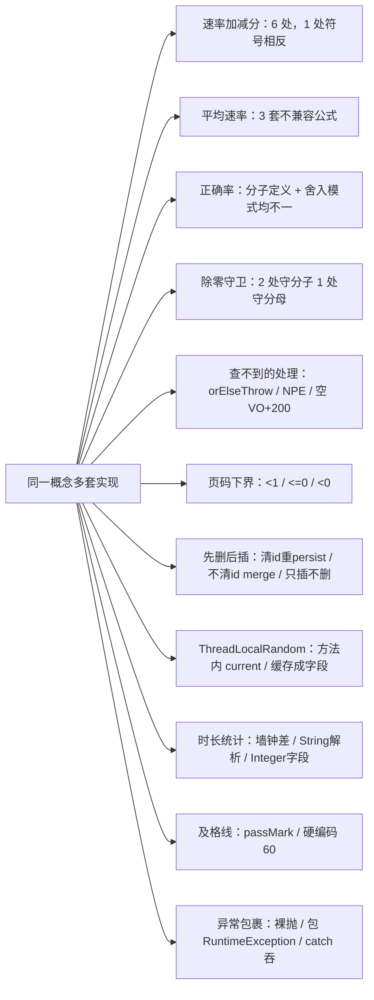

# 结论：业务服务层共 180 条问题 —— P0 14 条 / P1 70 条 / P2 96 条（安全项已按内网口径单列，不计入）

最需要先处理的是 **7 类会造成数据永久丢失的「先删后插」**：`@Transactional` 方法内部把异常 catch 掉只 log 不重抛，JTA 只对逸出方法的异常回滚，所以 DELETE 已经提交、INSERT 没做完。受影响的是理论课件、试卷题目、考生答卷、电传报底、电键拍发记录、菜单按钮权限、设备操作说明 —— 全部不可恢复，且客户端只看到一句「系统错误」或干脆看到「成功」。

其次是 **3 个功能完全不可用的确定性 bug**：菜单编辑八行全是自赋值（改什么都不生效）、角色编辑从不落库（还会把系统唯一的默认角色抹掉导致新用户永久登不上）、五笔训练的重复性校验判断写反（新建 100% 被拒）。

| 项目 | 内容 |
|---|---|
| 审查对象 | `src/main/java/com/nip/service/` 顶层 65 个 `*.java` + `builder/` `constants/` `context/` `detector/` `enums/` |
| 非目标 | `service/general/`、`service/simulation/`、`service/event/`、`dao/`、`controller/`（由其他分片负责） |
| 技术栈 | Quarkus 3.20.4、Java 21、Hibernate ORM/Panache、MySQL |
| 审查方式 | 纯静态阅读。本机无 Java 环境，未运行任何构建/测试/格式化工具，未修改任何项目文件 |
| 审查日期 | 2026-08-26 |
| 部署口径 | 内网部署；认证授权、凭据、匿名访问、弱口令、个人信息等纯安全项列入附录 A，不计入 P0/P1/P2 |

## 严重级定义

| 级别 | 判据 |
|---|---|
| P0 | 崩溃 / 数据永久损坏 / 功能完全不可用 |
| P1 | 严重缺陷：数据完整性、并发损坏、资源泄漏、事务部分提交、评分结果错误并落库 |
| P2 | 功能瑕疵、性能、可维护性 |

## 一个贯穿全文的前置事实（影响所有事务判断）

`src/main/java/com/nip/common/repository/BaseRepository.java:11-12` 在**类级**打了 `@Transactional`，`save`/`saveAndFlush`/`flush`（:15、:26、:33、:43、:50）**每个方法又各打一次**。各 Dao 都是 `@ApplicationScoped` CDI Bean。

后果：Service 方法即使不写 `@Transactional`，单次 `dao.save()` 也**不会**抛 `TransactionRequiredException` —— 它自己开一个新事务并立即提交。这把「缺事务」从一个显式崩溃变成了隐蔽的「**每次写操作一个独立事务 → 循环写入部分提交**」。本报告里所有「缺 @Transactional」条目的实际表现都是原子性丢失，而不是报错。

另一个反复出现的前置事实：**CDI 自调用不经过拦截器代理**。同类内 `this.method()` 调用一个 `@Transactional` 方法，注解完全不生效。

---

# P0 —— 14 条

## P0 组一：@Transactional 内 catch 吞异常 + 先删后插 → 数据永久丢失（3 条）

### P0-01 理论知识课件与随堂测验被静默清空
**位置** `src/main/java/com/nip/service/TheoryKnowledgeService.java:223-296`

**现象**
```java
223  @Transactional
224  public Response<TheoryKnowledgeEntity> saveTheoryKnowledge(TheoryKnowledgesDto knowledgesDto) {
225    try {
231      knowledgeSwfDao.deleteAllByKnowledgeId(knowledgesDto.getKnowledge().getId());   // 先删光全部课件
237        throw new IllegalArgumentException("标题不能是空!");                            // 循环中途抛
276      theoryKnowledgeTestContentDao.deleteByKnowledgeIdAndCreateUserIdAnd...(...)     // 第二处先删后插
292    } catch (Exception e) {
293      log.error("保存失败:{}", e.getMessage());
294      return ResponseResult.error(...);   // 异常没逸出 → 事务不回滚 → DELETE 提交
295    }
```

**触发条件** 编辑一个已有 3 个课件的理论知识，第 2 个课件 title 传空串（前端漏填/裁剪）。第 231 行删光 3 个课件，第 1 个重新插入，第 2 个抛异常。另一触发点在第 259 行 `firstByKnowledgeSwfIdAndVersions.getId()`：该 swf 没有 versions=1 的测验时 findFirst 返回 null → NPE → 同样被吞，而课件已删。

**影响** 教学内容不可逆丢失，无告警，管理员只看到「系统错误」，重试也救不回来。

**建议** 去掉 catch 让异常逸出；把 title 非空校验全部前移到 delete 之前。

### P0-02 试卷题目被清空
**位置** `src/main/java/com/nip/service/TestPaperService.java:59-92`

**现象**
```java
65        testPaperQuestionDao.deleteAllByTestPaperId(testPaperDto.getId());   // 先删光该试卷所有题
77        testPaperQuestionDtos.addAll(testPaperDto.getSingleChoice());
78-81    ...addAll(getMultipleChoice()/getJudge()/getCompletion()/getShortAnswer());
89      } catch (Exception e) { log.error(...); return ResponseResult.error(); }
```
证据：`TestPaperDto.java:36-40` 五个列表字段均无初始值，客户端不传该字段时反序列化后为 null；`ArrayList.addAll(null)` 内部调 `c.toArray()` → NPE。

**触发条件** 编辑一张只有单选和判断题的试卷，请求体**不含** `shortAnswer`/`completion` 字段（不是空数组，是字段缺失）。

**影响** 试卷题目数变成 0 且返回「系统错误」，用户不知道数据已毁；该试卷若已被考试引用，考试直接不可用。

**建议** 五个 list 用 `Optional.ofNullable(...).orElse(List.of())` 兜住；delete 移到构建完列表之后；移除 catch。

### P0-03 菜单按钮权限被永久删除
**位置** `src/main/java/com/nip/service/MenusService.java:101-115`

**现象**（已逐行核对）
```java
101      List<MenusButtonEntity> permissions = entity.getPermissions();
102      menusButtonDao.deleteAllByMenusId(menus.getId());   // 立即下发的 JPQL 批量 DELETE
104      permissions.forEach(p -> { ... menusButtonDao.save(p); ... });   // permissions 为 null → NPE
113      } catch (Exception e) {
114        return null;                                       // 连 log 都没有
```

**触发条件** 请求体里 `permissions` 为 null（前端只改菜单不带按钮列表）。

**影响** 该菜单下所有按钮权限行被永久删除且无新数据补入，绑定该菜单的所有角色按钮权限一起消失。

**建议** 删掉 113-115 的 catch；permissions 为 null 时提前 return，不要执行 DELETE。

## P0 组二：先删后插 + 结果集可能为空/被并发破坏（2 条）

### P0-04 电传训练结算时报底被删光且不回插
**位置** `src/main/java/com/nip/service/PostTelexPatTrainService.java:785-795`

**现象**（已逐行核对）
```java
785      pageNumbers.forEach(pageNumber -> { ... TelexPatUtils.handle(..., pageValueResult, ...); });
793      List<PostTelexPatTrainPageEntity> convert = PojoUtils.convert(pageValueResult, ...);
794      pageDao.deleteByTrainId(entity.getId());    // 删光全部报底
795      pageDao.saveAndFlush(convert);              // convert 可能为空
```
`pageValueResult` 唯一的填充路径在 `TelexPatUtils.java:331-339`：`for (j < userPages.size()) { if (rowNum < neatenResult.size()) { ... add(...) } }`。用户该页没有任何输入时 `userPageValues` 为 null（`TelexPatUtils.java:34-41` length=0）→ neatenResult 为空 → `0 < 0` 为 false → 整页一次 add 都不执行。

**触发条件** 调 begin 后一组都没拍发（或所有页 pat_value 为空/未提交）就调 finish。save() 时已生成 200 组报底（:106-124），全部被删除。

**影响** 报底（正确答案）永久消失；detail() 返回空；再调 getPage() 会用新随机数重新生成一套完全不同的内容，历史成绩再也无法复核。事务正常提交，无法回滚。

**建议** `if (!convert.isEmpty())` 才执行 delete+save；或按 pageNumber 逐页 delete，只删本次真正产出了结果的页。

### P0-05 电键训练用 parallelStream 并发写非线程安全集合，再用残缺结果覆盖用户拍发数据
**位置** `src/main/java/com/nip/service/PostTelegraphKeyPatTrainService.java:344-361`

**现象**（已逐行核对）
```java
344    List<KeyPatValueTransferDto> pageValueResult = new ArrayList<>();
346    pageNumbers.parallelStream().forEach(pageNumber -> {
354      handle(null, pageResult, userPages, userPageValues, ks);   // ks 是共享的 KeyPatStatisticalDto
355      pageValueResult.addAll(pageResult);                        // 普通 ArrayList，多线程并发 addAll
356    });
360    valueDao.deleteByTrainId(entity.getId());
361    valueDao.saveAndFlush(pv);
```
`KeyPatStatisticalDto`（`src/main/java/com/nip/dto/KeyPatStatisticalDto.java:9-22`）全是裸 int 字段，handle 内部是 `ks.setX(ks.getX()+1)` 读-改-写，非原子。`ArrayList.addAll` 并发执行会扩容竞争 → 丢条目、留 null 空洞，或直接抛 `ArrayIndexOutOfBoundsException`。

**触发条件** 训练页数 ≥2（`pageNumbers.size()>=2` 时 ForkJoinPool 就会拆分；本机 12 核并行度 15，几乎必然触发）。用户拍满 2 页以上即可。

**影响** (1) 第 361 行用丢了条目的 pv 覆盖第 360 行刚删掉的用户全部拍发记录 → 数据永久缺失；(2) ks 计数丢失 → 分数、正确率、速率每次算出来都不一样，同一份数据重算结果不可复现；(3) 若 addAll 抛 AIOOBE，异常从 forEach 冒出 → finish 500。

**建议** 改回 `stream()`。另注：`parallelStream` 内还跨线程用了同一个 EntityManager（第 349、352 行的 Dao 查询），这本身就是 Hibernate Session 线程安全违规。

## P0 组三：功能完全不可用（4 条）

### P0-06 菜单编辑分支八行全是自赋值，所有字段修改都不生效
**位置** `src/main/java/com/nip/service/MenusService.java:90-98`

**现象**（已逐行核对）
```java
90|  menus = menusDao.findById(entity.getMenus().getId());
91|  menus.setParentId(menus.getParentId());
92|  menus.setComponent(menus.getComponent());
93|  menus.setKey(menus.getKey());
94|  menus.setPath(menus.getPath());
95|  menus.setName(menus.getName());
96|  menus.setIcon(menus.getIcon());
97|  menus.setTitle(menus.getTitle());
98|  menus.setSort(menus.getSort());
```
八行全部是 `menus.setX(menus.getX())`，源对象应该是 `entity.getMenus()`（请求带来的新值），写成了从自己读、写回自己。

**触发条件** 任何一次「编辑已有菜单」。

**影响** 菜单编辑功能完全失效 —— 改名称、改路径、改图标、改排序全部静默丢弃，接口还返回成功。只有按钮权限那部分（102-108 行）真的被更新了。

**建议** 改成 `menus.setParentId(entity.getMenus().getParentId())` 等，或直接 `menusDao.save(entity.getMenus())`。

### P0-07 角色编辑从不落库；编辑默认角色会抹掉系统唯一的默认角色
**位置** `src/main/java/com/nip/service/RoleService.java:51-62`

**现象**（已逐行核对）
```java
51  @Transactional
52  public RoleEntity addRole(SaveRoleDto entity) {
53    if (entity.getRole().getIsAdmin() == 1 && entity.getRole().getIsDefault() == 0) {
54      List<RoleEntity> allByIsDefault = roleDao.findAllByIsDefault(0);
55      allByIsDefault.forEach(r -> { r.setIsDefault(1); roleDao.save(r); });
59    }
60    if (StringUtils.isEmpty(entity.getRole().getId())) {
61      roleDao.save(entity.getRole());     // 只有新建才 save
62    }
```
`entity.getRole()` 来自 HTTP 反序列化，是 detached 对象，从未被 merge。id 非空（编辑）时第 60 行的 if 不成立 → 角色的名称/备注/isAdmin/isDefault 全部不写库。

**级联后果**：编辑一个当前 `isDefault=0`（是默认角色）的角色时，第 54-55 行把包含它自己在内的所有默认角色改成 `isDefault=1` 并 merge 落库，而它自己提交的 `isDefault=0` 因为第 61 行不执行而丢失 → 提交后**数据库里没有任何 isDefault=0 的角色**。此后 `UserService.assignDefaultRole`（`UserService.java:245-254`）的 `roleDao.find("isDefault", 0).firstResult()` 恒为 null，新建用户拿不到任何角色；这些用户登录时走到 `UserService.java:391` 的 `role.getIsAdmin()`，role 为 null → NPE → 被 398 行 catch → 返回「数据异常」。

**触发条件** 在角色管理页编辑任意已有角色；编辑当前默认角色。

**影响** 角色编辑功能完全失效 + 一次误操作后系统失去默认角色，所有新建用户永久无法登录。

**建议** 第 60-62 行改成无条件 `roleDao.save(entity.getRole())`；第 53-59 行的默认角色重置要排除正在编辑的这条记录。

### P0-08 五笔训练重复性校验判断写反，新建 100% 被拒
**位置** `src/main/java/com/nip/service/EnteringTelexPatService.java:47-50`

**现象**（已逐行核对）
```java
47    if (Objects.isNull(param.getId())) {
48      EnteringTelexPatEntity check = telexPatDao.findByCreateUserIdAndType(userEntity.getId(), param.getType());
49      Assert.notNull(check, "您已存在相同类型的训练，不能再添加同类的训练！");
50    }
```
`src/main/java/com/nip/common/utils/Assert.java:75-79` 的 `notNull(object, message)` 语义是 **object == null 时抛** `IllegalArgumentException`。所以 check 为 null（库里没有同类记录 = 应当允许新建）时抛「已存在」；check 非 null（真的重复了）时反而放行。同文件 `Assert.java:55-59` 已提供语义相反的 `isNull`。

**触发条件** `EnteringTelexPatController.java:47` POST 保存，body 不带 id（新建路径）。

**影响** 任何用户第一次创建五笔训练都失败，前端看到「您已存在相同类型的训练」；同时真正的重复创建不再被拦截。该功能完全不可用。

**建议** 改为 `Assert.isNull(check, "...")`。

### P0-09 电键训练「清空」对新用户必抛异常，对老用户插入空白垃圾行
**位置** `src/main/java/com/nip/service/TelegraphKeyPatTrainService.java:115-132`

**现象**（已逐行核对）
```java
118    TelegraphKeyPatTrainEntity entity = Optional.ofNullable(patTrainDao.findByCreateUserIdAndType(userEntity.getId(), type))
119        .orElseGet(TelegraphKeyPatTrainEntity::new);          // 无记录时得到空白实体
124    TelegraphKeyPatTrainEntity save = patTrainDao.save(entity); // 空白实体 id 为空 → persist → 插入 createUserId/type 全 null 的行
126    TelegraphKeyTrainStatisticalEntity statisticalEntity = statisticalDao.findByUserIdAndType(userEntity.getId(), type);
127    if (statisticalEntity != null) { statisticalEntity.setTotalCount(0); }
130    statisticalDao.save(statisticalEntity);                     // save 在 null 判断【外面】
```
`BaseRepository.java:16` `Assert.notNull(entity, "Entity must not be null.")` → statisticalEntity 为 null 时抛 `IllegalArgumentException`。

**触发条件** 「清空」接口，用户该 type 尚无统计记录（新用户 / 从未完成过训练）。

**影响** 整方法 `@Transactional` → 回滚 → 清空功能对新用户完全不可用；对老用户则先在训练表插入一条 createUserId=null 的脏数据。

**建议** save 移进 if 内；无训练记录时直接返回默认 VO（对照 `EnteringTelexPatService.java:97-108` 的正确写法）。

## P0 组四：其余（5 条）

### P0-10 编辑考试无条件删除全部考生答卷与成绩
**位置** `src/main/java/com/nip/service/TheoryKnowledgeExamService.java:73-76`

**现象**（已逐行核对）
```java
73    if (!StringUtils.isEmpty(testPaper.getId())) {     // 判的是【试卷 id】，不是「是否为编辑操作」
74      theoryKnowledgeExamTestPaperDao.deleteById(testPaper.getId());
75      theoryKnowledgeExamUserDao.deleteAllByExamId(save.getId());   // 删掉本场考试全部考生行
76    }
88    dto.getStuId().forEach(stu -> { ... setState(1); setScore(0); ... });  // 重建为未开始
```
第 71 行 `theoryKnowledgeExamDao.save(entity)` 走 `BaseRepository.java:15-23`，dto 带 exam id → `entityManager.merge` → `save.getId()` 就是原考试 id → `deleteAllByExamId` 命中已有的全部 `t_theory_knowledge_exam_user` 行（`TheoryKnowledgeExamUserDao.java:33-36` 是物理 delete），其中的 `content`（学生答题内容）和 `score`（成绩）一并没了。

**触发条件** 考试进行中或已阅卷完成后，老师回到编辑页改一下标题/时长/考生名单再点保存。

**影响** 全班答题内容与成绩永久丢失，考生状态被重置为 state=1、score=0，已完成的考试凭空变成未开始。

**建议** 删除条件改成「考试确实存在且 state==1（未开始）」；或改成按 stuId 差集增删，不动已有答卷。

### P0-11 考试试卷复用原试卷主键，两场考试共用一份试卷时互相覆盖
**位置** `src/main/java/com/nip/service/TheoryKnowledgeExamService.java:77-79`（自测路径同问题在 :233-235）

**现象**
```java
77    TheoryKnowledgeExamTestPaperEntity theoryKnowledgeExamTestPaperEntity = PojoUtils.convertOne(testPaper,
78        TheoryKnowledgeExamTestPaperEntity.class);
79    theoryKnowledgeExamTestPaperEntity.setExamId(save.getId());   // 只设了 examId，没清 id
```
证据链：`PojoUtils.java:77` `BeanUtil.copyProperties(v, entity, CopyOptions.create().setIgnoreError(true))` 复制**所有同名属性**，不排除 id → `TestPaperDto.java:15` 的 `id`（原试卷主键）被复制到 `TheoryKnowledgeExamTestPaperEntity.java:20-21` 的 `@Id` → `BaseRepository.java:18-22` id 非空走 `merge` → 以**原试卷 id** 作为 `t_theory_knowledge_exam_test_paper` 的主键写入。而本该承载此信息的 `testPaperId`（`TheoryKnowledgeExamTestPaperEntity.java:26-27`，注释「原试卷id」）从头到尾没人赋值。

**触发条件** 用同一份试卷 P 建考试 A，随后再用 P 建考试 B。

**影响** B 的 merge 命中主键 = P.id 的同一行，把 examId 从 A 改成 B。考试 A 的 `findAllByExamId(A)` 返回 null → `studentChangeExamState` case 2 发不出试卷、`examineAnalyse` 第 317 行 NPE → 考试 A 整场不可用。

**建议** `convertOne` 之后立刻 `setId(null)`、`setTestPaperId(testPaper.getId())`，与 `TestPaperService.java:84` `setId(null)` 的写法保持一致。

### P0-12 试卷缺任一题型时考核分析必崩
**位置** `src/main/java/com/nip/service/TheoryKnowledgeExamService.java:325-339`

**现象** 325/328/331/334/337 五行都是 `questionEntities.addAll(JSONUtils.fromJson(testPaperEntity.getXxxList(), new TypeToken<>() {}))`。
证据链：`JSONUtils.java:33-38` `fromJson` 对空串返回 **null**；`JSONUtils.java:18-23` `toJson(null)` 返回 **空串**；写入端 `TheoryKnowledgeExamService.java:80-84` 直接 `setShortAnswer(JSONUtils.toJson(testPaper.getShortAnswer()))`，而 TestPaperDto 五个列表无初始值 → 库里存空串 → 读取端 `addAll(null)` NPE。方法无 try/catch。

**触发条件** 任何一份不同时包含单选+多选+判断+填空+简答五种题型的试卷 —— 也就是绝大多数真实试卷 —— 的「考核分析」。

**影响** 考核分析功能完全不可用，500。

**建议** `JSONUtils.fromJson` 空输入返回空集合，或在这五处包 `Optional.ofNullable(...).orElseGet(List::of)`。

### P0-13 军语出题的 while 循环在「类型条目数恰好为 4」时必然死循环
**位置** `src/main/java/com/nip/service/PostMilitaryTermTrainService.java:147-190`

**现象**
```java
147  titleIndex = random.nextInt(militaryTermDataEntities.size() - 1);
156  int flag = 1;
165  while (flag <= 3) {
171      optionId = random.nextInt(militaryTermDataEntities.size() - 1);
173      if (titleIndex != optionId || optionId == 0) {
180        if (options.stream().anyMatch(s -> s.equals(value))) {
181          boolean b = checkKeyword(value, options);
182          if (b) { flag++; }        // 不匹配任何改写规则时 flag 不变
184        } else { options.add(value); flag++; }
```
推理链：add() 第 92-96 行只把「条目数 >= 4」的类型放进 types，所以最小规模就是 size==4。此时 `nextInt(4-1)` 只能产出下标 0/1/2（下标 3 永远取不到）。titleIndex 也在 0..2。第 173 行排除了 `optionId==titleIndex`（除非为 0），因此可用于当干扰项的**不同**条目只有 2 个，而循环需要把 flag 从 1 推到 4（3 个新增选项）。凑到 2 个后，之后每一轮抽到的 value 都已在 options 里，走 checkKeyword 分支；若该文本不含数字、不含「无线/出口/入口/干线/小时/线状/面状/接收/发射/战术/战役」、也没有 4 段以上顿号，checkKeyword 恒返回 false → flag 永远停在 3 → 循环永不退出。

**触发条件** 创建训练时选中一个恰好有 4 条数据的军语类型，且这些条目的 value 是纯中文描述。

**影响** 处理该 HTTP 请求的工作线程 100% CPU 空转且永不释放，连接不返回；反复调用可打满线程池，整个服务不可用。

**建议** 先对该类型条目按 value 去重取候选池，候选不足 4 个则跳过该题或抛业务异常；循环加最大重试次数上限。

### P0-14 抄收训练 update() 用 4 字段 Param 整体 merge，抹空实体 11 列
**位置** `src/main/java/com/nip/service/TickerTapeTrainService.java:108-113`

**现象**（已逐行核对）
```java
108  @Transactional
109  public TickerTapeTrainUpdateParam update(TickerTapeTrainUpdateParam param) {
110    TickerTapeTrainEntity entity = BeanUtil.toBean(param, TickerTapeTrainEntity.class);
111    TickerTapeTrainEntity save = tickerTapeTrainDao.save(entity);
112    return BeanUtil.toBean(save, TickerTapeTrainUpdateParam.class);
113  }
```
`TickerTapeTrainUpdateParam.java:19-33` 只有 id/validTime/mark/schedule 四个字段；`TickerTapeTrainEntity.java:33-105` 有 15 个字段。toBean 产出的实体其余字段全为 null。`BaseRepository.java:16-23`：id 非空 → `entityManager.merge(entity)`，merge 把 detached 实例的**全部**字段覆盖到托管行。

**触发条件** 调用一次 update 接口（暂停/进度上报走的就是这个 Param 形状）。

**影响** name/rate/type/**codeMessageBody（整份报文内容）**/codeShort/startTime/endTime/status/userId/isLowRate 全部写成 NULL。userId 变 null 后 listPage（:91-93 按 userId 过滤）再也查不到该记录；status 变 null 后 checkStatus（:231-236）必 NPE。报文内容不可恢复。

**建议** 改为 findById 后逐字段 set（对照 `TelegraphKeyPatSyntheticalService.java:76-87`），或走 DAO 具名 update JPQL（`TickerTapeTrainDao` 已有 begin/pause/goOn/finish 四个具名 update，update() 是唯一漏网的）。

> **审计更正（2026-08-27 执行期实证）**：本条为误报。全仓 grep 确认 `TickerTapeTrainService.update()` 无任何调用方（Controller 未暴露对应端点），属死代码；merge 抹空字段的机制描述正确但无触发路径。不列入修复批次。


---

# P1 —— 70 条

## P1 组一：电报拍发评分与报文对比（MessageComparisonService + detector/，7 条）

### P1-01 字间隔扣分用错了规则段：系数取自「大间隔」，上限却按「中间隔」裁剪
**位置** `src/main/java/com/nip/service/detector/ErrorCodeDetector.java:173` 与 `:194`

**现象**
```java
173    scoreVO.setWordScore(scoreVO.getWordScore() + rule.getLarge().getL());   // 字间隔过小
194    scoreVO.setWordScore(scoreVO.getWordScore() + rule.getLarge().getR());   // 字间隔过大
```
项目内的权威映射（两处互相印证）：
- 字间隔 word ↔ `rule.getMiddle()`：`TickerPatUtils.java:633` `setWordScore(... + rule.getMiddle().getL())`、`:637` `... rule.getMiddle().getR()`；`PostTelegramTrainService.java:719` `calculateScore(rule.getMiddle().getMax(), scoreVO.getWordScore(), rule.getMiddle().getMax())`
- 组间隔 group ↔ `rule.getLarge()`：`TickerPatUtils.java:618/622` `setGroupScore(... rule.getLarge().getL()/getR())`；`PostTelegramTrainService.java:724` `calculateScore(rule.getLarge().getMax(), scoreVO.getGroupScore(), ...)`

所以 ErrorCodeDetector 把字间隔的扣分**累加到 wordScore**、**却用 large（组间隔）的系数**，而它的上限在 `applyDeductions` 里又按 `rule.getMiddle().getMax()` 裁剪 —— 系数和上限来自两个不同的规则段。

**触发条件** 任何一次拍发出现字间隔过小（组内含 `#`）或字间隔过大（相邻两组长度和=4 且合并后等于标准报文）。只要管理员把 large 和 middle 配成不同值（这正是分开配置的目的），分数就错。

**影响** 字间隔错误的扣分量错误且被错误封顶，最终分数落库。

**建议** 两处改为 `rule.getMiddle().getL()` / `rule.getMiddle().getR()`。

### P1-02 速率加减分：系数用反 + 超速反而被扣分（与其余 5 处实现相反）
**位置** `src/main/java/com/nip/service/PostTelegramTrainService.java:786-790`

**现象**
```java
786    SpeedDeduct baseWpm = rule.getWpm();
787    int wpm = baseWpm.getBase() - new BigDecimal(entity.getSpeed()).intValue();   // wpm>0 表示【低于】基准
788    int wpmScore = (wpm > 0 ? -(wpm * baseWpm.getL()) : wpm * baseWpm.getR());
790    score += wpmScore;
```
`src/main/java/com/nip/dto/score/SpeedDeduct.java:19-27` 自带注释：
```java
19  /** 低于扣分 */
22  Integer r;
24  /** 高于加分 */
27  Integer l;
```
两个错误叠加：
1. 低于基准（wpm>0）用的是 **L（高于加分系数）**，应该用 R；高于基准（wpm<0）用的是 **R（低于扣分系数）**，应该用 L。两个系数完全对调。
2. 高于基准时 `wpm * R` 因 wpm 为负而得负值，`score +=` 后是**扣分** —— 拍得越快扣得越多。

**同一业务在其他 5 处的实现都是「高于加分 / 低于扣分」**：
- `PostTelegraphKeyPatTrainService.java:463-472`：`if (speed > base) score = score.add(R * diff); else score = score.subtract(L * diff);`
- `PostTelexPatTrainService.java:693-708` 与 `:869-879`
- `service/general/GeneralKeyPatService.java:790-800`
- `service/general/GeneralTelexPatService.java:735-745`

另：`service/general/GeneralTickerPatService.java:918-922` 是本条的逐字复制体，同病（该文件属于 general 分片，此处仅作为同源证据）。

**触发条件** 任何一次电报拍发训练结算，只要 speed 不等于 base。

**影响** 速率项分数方向和量级都错，且与其他五种训练的口径相反，横向成绩对比无意义。

**建议** 改成与其他五处一致的 if/else 形式，并按 SpeedDeduct 的注释用 r/l。

> 附带发现（不单独计条，属于本条的根因环境）：`dto/score/SpeedDeduct.java:19-27` 定义 r=低于扣分 / l=高于加分，而 `dto/PostTelexPatTrainRuleDto.java:43-51` 与 `dto/PostKeyPatTrainRuleDto.java:43-51` 的 `Wpm` 定义 r=高于扣分 / l=低于扣分 —— **同名 JSON 字段 r/l 在两套规则 DTO 里含义相反**，而两套都从同一张 `t_grading_rule.content` 解析。建议统一命名。

### P1-03 多组检测成功后不跳过多余组，主循环把它们再当普通组比对一遍
**位置** `src/main/java/com/nip/service/MessageComparisonService.java:216-223`（配合 `detector/GroupDetector.java:140-182`）

**现象**
```java
216    DetectionResult groupResult = groupDetector.detectMoreOrLessGroup(context, currentIndex, patKey, source, resultBuilder);
218    if (groupResult == DetectionResult.SUCCESS) {
222      return currentIndex;          // ← 不加 skipCount
223    }
```
对比同一方法里的错码路径：
```java
241      skipCount = errorResult.getSkipCount();
250    return currentIndex + skipCount;   // ← 字间隔过大的 skip=1 是生效的
```
`GroupDetector.handleMoreGroupDetected`（:140-182）已经把 `skipCount` 个组当作「多组」计入 `scoreVO.setMoreGroup(...+skipCount)`（:179）并对它们跑了 `checkDotLineGap`（:167-176），但这些组的下标从未从主循环中跳过。

**触发条件** 用户拍发中出现多组（当前源报文在后续 4 组拍发内重新对上）。

**影响** 那几个多余组会被再次当正常组与后续源报文逐一比对 → 错码数、点划间隔统计重复累加，且自此之后源报文与拍发报文的对齐全部错位 —— 本页后半段的评分全错。

**建议** 让 `detectMoreOrLessGroup` 返回 skipCount（或写回 context），主循环 `return currentIndex + skipCount`。

### P1-04 多行/少行检测成功时当前组不写入结果，且点划间隔被统计两遍
**位置** `src/main/java/com/nip/service/detector/LineDetector.java:182-228`（多行）、`:233-253`（少行），入口在 `MessageComparisonService.java:206-213`

**现象**
- 多行：`handleMoreLineDetected`（:182-228）全程**没有任何 `resultBuilder.addXxx` 调用**；而 `MessageComparisonService.java:207-213` 在 SUCCESS 分支里也只计数、不写入。当前 `patKey` 的拍发日志/点划/耗时四列数据全部丢失。
- 多行：`:216-225` 对后续 9 组调了 `checkDotLineGap`，但主循环并没有跳过这 9 组（`return currentIndex`），它们随后会**再被统计一遍**。
- 少行：`handleLessLineDetected`（:233-253）只 `addEmptyMessages(missingLines * 10)`，同样不写当前 `patKey`，而主循环的 `i++` 照常推进 → 该组彻底丢失。

**对照**：少组路径 `GroupDetector.handleLessGroupDetected:199-207` 是「补空 + `addCorrectMessage`」，会写入；两个 detector 对同一件事的处理不一致。

**触发条件** 拍发行数与报底不一致（跨行/漏行），且当前位置恰好在行首（`sourceIndex % 10 == 0`）。

**影响** 落库的 `resolver` JSON 里缺组，前端回放拍发过程时与报底错位；点粗/点虚/间隔统计量翻倍。

**建议** 两个 handle 方法写入当前组；多行分支要么不提前跑 checkDotLineGap，要么把下标推过去。

### P1-05 追加报底 `floorNumber += i` 累加错误，且整个方法无事务
**位置** `src/main/java/com/nip/service/PostTelegramTrainService.java:803-828`

**现象**
```java
803  public List<Integer> addContentValue(PostTelegramTrainAddContentValueVO vo) {   // 无 @Transactional
804    Integer floorNumber = 0;
805    PostTelegramTrainFloorContentEntity entity = floorContentDao.findByTrainId(vo.getTrainId());
807      floorNumber = entity.getFloorNumber();                 // 已有的最大楼层号 base
810    for (int i = 0; i < messageBody.size(); i++) {
811      floorNumber += i;                                      // ← 累加，不是递增
824        floorContentDao.saveAndFlush(contentEntity);         // 逐条 saveAndFlush，各开一个事务
```
结果序列是 base+0, base+1, base+3, base+6, base+10…：
- i=0 时 `floorNumber += 0`，**第一页直接复用已存在的楼层号**，与已有行冲突（同一 floorNumber 出现两套 sort 0..N）；
- i=2 时跳到 base+3，base+2 永远缺失。

**触发条件** 一次追加 2 页及以上。接口已暴露：`PostTelegramTrainController.java:137-141` `POST /addContentValue`。

**影响** 楼层号重叠 + 空洞，`findByTrainIdCountFloor` 返回的页码列表不连续；且无事务 → 中途失败留下半截页面，已写入的行不回滚。

**建议** `floorNumber = base + i + 1`；方法上加 `@Transactional`；循环内改为收集后一次 `saveAndFlush(list)`。

### P1-06 划（dash）扣分的封顶值误用了点（dot）的 max
**位置** `src/main/java/com/nip/service/PostTelegramTrainService.java:709`

**现象**
```java
704    int dotScore  = calculateScore(rule.getDot().getMax(),  scoreVO.getDotScore(),  rule.getDot().getMax());
709    int lineScore = calculateScore(rule.getDash().getMax(), scoreVO.getLineScore(), rule.getDot().getMax());
                                                                                      ^^^^^^^^^^^^^^^^^^^^^ 应为 getDash()
714    int codeScore = calculateScore(rule.getLittle().getMax(), scoreVO.getCodeScore(), rule.getLittle().getMax());
719    int wordScore = calculateScore(rule.getMiddle().getMax(), scoreVO.getWordScore(), rule.getMiddle().getMax());
724    int groupScore= calculateScore(rule.getLarge().getMax(),  scoreVO.getGroupScore(), rule.getLarge().getMax());
```
周围四行的第一、第三参数都是同一个 `getMax()`，只有 709 行不是。`ToolUtil.java:100-108` `calculateScore(max, score, exc)` 的语义是「score > max 时返回 exc」，即 exc 就是封顶值。

**触发条件** 划的扣分累计值超过 `dash.max`，且 `dot.max != dash.max`。

**影响** 划项扣分被封到点的上限，总分错误。

**建议** 第三参改为 `rule.getDash().getMax()`。

### P1-07 写死 trainId 的调试接口会覆盖真实训练数据
**位置** `src/main/java/com/nip/service/PostTelegramTrainService.java:838-852`

**现象**
```java
838  @Transactional
839  public List<PostTelegramTrainContentAddParam> test() {
843    PostTelegramTrainContentFloorValueEntity valueEntity = contentValueDao.findByFloorNumberAndTrainId(
844        1, "46b6bfee-446e-4e71-8192-9616b7ba4ae8");     // 写死的真实 trainId
845    List<...> messageBody = JSONUtils.fromJson(valueEntity.getMessageBody(), ...);   // valueEntity 为 null → NPE
848    messageBody = handleMessageBody(messageBody);
850    contentValueDao.saveAndFlush(valueEntity);          // 回写
```
已暴露为无参 GET：`PostTelegramTrainController.java:150-155`。

**触发条件** 任何人（包括扫描器、健康检查、测试脚本）请求一次 `GET /postTelegramTrain/test`。

**影响** 该 trainId 的第 1 页 messageBody 被 `handleMessageBody` 重写并落库，原始拍发内容不可恢复；若该记录不存在则 NPE 500。

**建议** 删掉该方法和对应的 controller 端点。

## P1 组二：电传/抄收/电键三个拍发训练服务（15 条）

### P1-08 抄收训练用错状态枚举，「训练已结束」校验完全失效
**位置** `PostTickerTapeTrainService.java:167` 与 `:310`
同一个类里混用两个 code 定义不同的枚举：`:167 entity.setStatus(PostTickerTapeTrainStatusEnum.FINISH.getCode())` = **2**（`PostTickerTapeTrainStatusEnum.java:15`）；`:310 if (entity.getStatus().compareTo(TickerTapeTrainStatusEnum.FINISH.getCode()) == 0)` = **3**（`TickerTapeTrainStatusEnum.java:17`）。finish 写入 2，checkStatus 拦的是 3。
**触发条件** 任何已 finish 的训练再调 begin/finish。
**影响** 已结束训练可被反复 begin（:157 重置开始时间）和 finish（:161 重算 validTime），结束时间、有效时长被无声覆盖。而 uploadResult :255 写 HAS_SCORE=3，恰好等于旧枚举的 FINISH=3，checkStatus 变成「拦已评分的」。
**建议** 全用 `PostTickerTapeTrainStatusEnum`；checkStatus 同时拦 FINISH(2) 和 HAS_SCORE(3)。

### P1-09 电传 finish 的幂等守卫被注释掉，可重复结算
**位置** `PostTelexPatTrainService.java:216-218`
`// if (entity.getStatus().equals(3)) { return ...; }` 被整段注释，紧接着 :219 直接 `countScore`（内含 P0-04 的 deleteByTrainId + saveAndFlush）。
**触发条件** 前端重试、用户双击「结束训练」、网络超时重发。
**影响** 第二次 finish 时 `pageDao.countPageNumber` 读到的已经是第一次写回的「报底+用户值」混合行，被当成新报底再解析一次并再次全表删除重写，页表逐次劣化；配合 P0-04 可直接清空。
**建议** 恢复 :216-218 的守卫。

### P1-10 电键 finish 无任何状态守卫
**位置** `PostTelegraphKeyPatTrainService.java:131-142`
:133-136 只查实体就直接 countScore，没有 status 判断。对比 `PostTickerTapeTrainService.java:162` 有 `checkStatus(...)`。
**触发条件** 重复调用 `/finish`。
**影响** countScore :360-361 每次都 deleteByTrainId + 重插，配合 P0-05 的并发竞态，每重复一次数据劣化一次；:329-331 训练时长按新 endTime 重算覆盖原值。

### P1-11 抄收 uploadResult 只插不删，重复上传产生重复行
**位置** `PostTickerTapeTrainService.java:229-234`
全方法没有任何 `valueDao.delete`。对比：`PostTelexPatTrainService.java:300-301` `valueDao.delete("trainId=?1 and pageNumber=?2",...)` 再 save；`PostTelegraphKeyPatTrainService.java:302` `deleteByTrainIdAndPageNumber(...)` 再 persist。
**触发条件** 同一 trainId 调两次 uploadResult（无状态守卫，uploadResult 里也没调 checkStatus）。
**影响** 同一 (trainId,pageNumber) 出现多行；getById :135-138 取出的 images 列表出现重复图片，页数与实际不符。

### P1-12 uploadResult 的 `param.getImages().get(i)` 越界/NPE
**位置** `PostTickerTapeTrainService.java:233`
i 来自 :199 `for (i < param.getResult().size())`，images 与 result 两个列表长度从未校验相等，images 也未判 null。
**触发条件** 客户端提交 result 有 3 页但 images 只传 2 张（或截图失败时不传 images）。
**影响** IndexOutOfBounds/NPE → uploadResult 500，用户拍完的成绩无法提交；:220 已改过的 pageEntity 随事务回滚。

### P1-13 电传速率计算分母未校验，validTime=0 时除零
**位置** `PostTelexPatTrainService.java:688-690`
```java
688  speed = speed.compareTo(BigDecimal.ZERO)==0 ? BigDecimal.ZERO
689      : speed.divide(new BigDecimal(param.getValidTime()), 10, RoundingMode.HALF_DOWN)
```
三目只判了**分子** speed，分母 `param.getValidTime()`（`PostTelexPatTrainFinishParam.java:41`，Integer）完全没判。
**触发条件** 用户拍了内容（speed>0）但上报 validTime=0（秒结、计时器未启动）；传 null 则 `new BigDecimal(null)` NPE。
**影响** ArithmeticException → countScore 抛出 → finish 500，训练无法结算。

### P1-14 电键除零守卫检查了错误的变量
**位置** `PostTelegraphKeyPatTrainService.java:384-388`
```java
384  if (ks.getPat() != 0) {                         // 守卫判的是分子 pat
385-388  speed = new BigDecimal(ks.getPat()).divide(new BigDecimal(ks.getPatTime())...)   // 分母是 patTime
```
**触发条件** pat>0 且 patTime==0。generatePatKey :519 给每行 `setTime("[]")` 作为默认值，用户拍发但客户端未回传时间数组时 patTime 累加为 0。
**影响** ArithmeticException → finish 500。
**建议** 改成 `if (ks.getPatTime() != 0)`。

### P1-15 三处「读接口懒生成报底」无事务、无唯一约束，并发重复插入
**位置** `PostTelexPatTrainService.java:247-250` / `PostTickerTapeTrainService.java:284-298` / `PostTelegraphKeyPatTrainService.java:254-258`
三个入口方法（getPage/findPage/getPage）都**没有** `@Transactional`，「查空 → 生成 → 插入」不在同一事务内（写靠 `BaseRepository.java:33` 各自开小事务），也没有 (trainId,pageNumber,sort) 唯一索引兜底。
**触发条件** 同一 (trainId,pageNumber) 两个并发 GET —— 用户双击翻页、前端重试、两个标签页。
**影响** 两次生成都通过 isEmpty 判断并各插 100 行 → 该页 200 组，sort 值 0..99 重复。后续 countScore 里 `convertTextListString`（TelexPat :1301-1327 按每 10 组一行、每 10 行一页硬切）整体错位 → 分数完全错误。

### P1-16 电传页码校验允许 pageNumber=0，写出垃圾 page 0
**位置** `PostTelexPatTrainService.java:239`
`if (totalPage < pageNumber || pageNumber < 0)` —— 0 不被拦。对比：`PostTickerTapeTrainService.java:270` `if (pageNumber <= 0) throw`；`PostTelegraphKeyPatTrainService.java:238` `pageNumber < 1`。**只有 TelexPat 用 `< 0`**。
**触发条件** GET 传 pageNumber=0。
**影响** 页表被插入 100 行 pageNumber=0 的行；随后 `countPageNumber`（:346/:772）返回 [0,1,2...]，countScore 的页序全部错位。

### P1-17 `cableFloor.subList(0, totalPage)` 四处同构，均未校验 size
**位置** `PostTelegramTrainService.java:230-231`、`PostTelexPatTrainService.java:128-129`、`PostTickerTapeTrainService.java:94-95`、`PostTelegraphKeyPatTrainService.java:90-91`
四处都是 `int totalPage = 总组数 / 100; cableFloor = cableFloor.subList(0, totalPage);`，subList 前从不校验 `cableFloor.size() >= totalPage`。
**触发条件（两种）**
(a) 组数 500（totalPage=5）但 `findCableFloor` 从 startPage 起只剩 3 层 → IndexOutOfBoundsException → 创建训练失败（整个 @Transactional 回滚）。
(b) 组数 < 100（如 50）→ totalPage=0 → `subList(0,0)` 空 → 循环不执行 → **训练建成功但一组报底都没有**，用户进去是空白，且无任何日志。
**建议** `int usable = Math.min(totalPage, cableFloor.size())`，并对 totalPage==0 显式报错。

### P1-18 reset 把 startTime 置 null，finish 直接 NPE
**位置** `PostTickerTapeTrainService.java:164-168` + `:184`
:184 `entity.setStartTime(null)`；:164-168 `Duration.between(startTime, endTime)` 对 null 抛 NPE，finish 无 try/catch。checkStatus(:162) 拦不住 NOT_STARTED。
**触发条件** reset 之后不调 begin 直接调 finish，或训练从未 begin。

### P1-19 电键 beginTime 为 null 时 NPE
**位置** `PostTelegraphKeyPatTrainService.java:329-330`
`entity.getEndTime().toEpochSecond(...) - entity.getBeginTime().toEpochSecond(...)`。beginTime 只在 begin()（:126）里赋值，finish 前不检查（且 finish 也没有状态守卫，见 P1-10）。
**触发条件** 未调 begin 直接 finish。

### P1-20 errorNumber 字段实际存的是「正确组数」
**位置** `PostTelexPatTrainService.java:850-851`
```java
850  int errorTotal = ks.getPatGroup() - ks.getErrorCodeNumber() - ks.getMuchLessCodeNumber();
851  entity.setErrorNumber(errorTotal);
```
:854-855 又拿这个 errorTotal 当**正确数**去除以 patGroup 算正确率 —— 说明它的语义是「正确组数」。同一方法 type4 分支 :715 `setErrorNumber(errorNumber)` 存的是真正的错误计数；`PostTelegraphKeyPatTrainService.java:394` 也是真错误数。
**触发条件** 任何非 trainType=4 的电传训练结算。
**影响** 列表和详情页显示的「错误个数」变成「正确个数」—— 拍得越好显示的错误数越大。同一字段在同一张表里两种含义。

### P1-21 「五三码」规整算法两处实现结果不同，countScore 那处是错的
**位置** `PostTelexPatTrainService.java:396-400`（错）vs `:1011-1013`（对）
```java
// convertCodeAll（正确）:1011-1013
groups[z+1] = group.charAt(group.length()-1) + groups[z+1];   // 取原串最后一位，前置
rowList.add(group.substring(0, group.length()-1));
//  "23456"+"789" → "2345" + "6789"  ✓

// countScore（错误）:396-400
groups[i] = groups[i].substring(0, groups[i].length()-1);              // 先截断成 "2345"
groups[i+1] = nextGroup + groups[i].charAt(groups[i].length()-1);      // 再取「最后一位」——已是截断后的 '5'，且追加到后面
//  "23456"+"789" → "2345" + "7895"  ✗（丢了 '6'，多了 '5'，顺序也反）
```
**触发条件** trainType=4 且用户输入出现「5 位组 + 3 位组」相邻（这正是这段代码要处理的「不规」场景）。
**影响** 规整出来的组内容错误 → :497 判定为错组，多才 35 分/组；nonStandartNumber 也多计。用户被冤柉扣分。

### P1-22 「////」分支缺数组越界检查（同方法其他分支都有）
**位置** `PostTelexPatTrainService.java:959-967`
:961-962 直接取 `groups[z + 1]`，**没有** `z+1 < groups.length` 检查。同方法其他分支都做了：:982 `groups.length - 1 >= z + 1`、:993、:1018 `z + 1 < groups.length`、:1003。
**触发条件** 用户某一行以 "////" 结尾（改错符号在行末）。
**影响** ArrayIndexOutOfBoundsException → :1256 `throw new RuntimeException(e)` → finish 500，整次训练无法结算。


## P1 组三：理论知识/考试/试卷（12 条）

### P1-23 examineAnalyse 中 testPaperEntity 漏判空 + Integer 拆箱 NPE
**位置** `TheoryKnowledgeExamService.java:313-320`
:308 对 examEntity 做了 `ObjectUtil.isEmpty` 判空，:314 的 `theoryKnowledgeExamTestPaperDao.findAllByExamId(examId)`（`TheoryKnowledgeExamTestPaperDao.java:19-21` 用 `.firstResult()`，无结果返回 null）**没判**，:317 `(long) testPaperEntity.getTotal() - (long) testPaperEntity.getPassMark()` 两个 Integer 强转触发拆箱。
**触发条件** 试卷行被 P0-11 的主键覆盖问题偷走；或建考试时 total/passMark 未填。
**影响** 500，考核分析不可用。同一方法内一个判空一个不判，是明显疏漏而非有意。

### P1-24 三元表达式自动拆箱 NPE，一条脏数据污染整个详情页
**位置** `TheoryKnowledgeService.java:122`
```java
122  swf.setScore(null == firstByUserIdAndKnowledgeSwfId ? 0 : firstByUserIdAndKnowledgeSwfId.getScore());
```
两个分支类型分别是 `int`（字面量 0）和 `Integer`（`TheoryKnowledgeTestUserEntity.java:52`），JLS 15.25 二元数值提升 → 整个表达式类型为 int → **无条件对 getScore() 拆箱**。判空判的是实体不是 score 字段。
**触发条件** `t_theory_knowledge_test_user` 存在一行 score 为 null。写入端 `TheoryKnowledgeTestService.java:181-189` `entity.setScore(dto.getScore())` 不做任何判空。
**影响** 此后**任何用户**打开该课件详情页（getByIdAndToken）都会 500。

### P1-25 @ApplicationScoped 单例持有可变 List 字段，并发下结果互相污染
**位置** `TheoryKnowledgeQuestionService.java:108-137` 与 `TestPaperService.java:235-244`（两处完全同构）
两个类都是 `@ApplicationScoped`（单例），`List<String> ids` 是**实例字段**，`findAllLevel` 递归向其 add，方法末尾 `ids = new ArrayList<>()` 重置，无任何同步。
**触发条件**
① 并发：用户甲查题库节点 X 的同时用户乙查节点 Y → 甲的 ids 里混进 Y 整个子树；或乙的重置发生在甲 add 完、查询前 → 甲拿到空结果。
② 异常泄漏（更持久）：`TestPaperService.java:222-234` 中若 `getTestPaper` 抛 `IllegalArgumentException("未知题型")`（:202），:235 的重置永远执行不到 → ids 保留脏数据并持续增长，此后**每一个**请求都返回全库试卷，且 List 无上限膨胀。
**建议** `findAllLevel` 改成带累加器参数或返回新 List，彻底去掉实例字段。

### P1-26 静态 DecimalFormat 被多线程共享
**位置** `TheoryKnowledgeService.java:41` 与 `:711`
`private static final DecimalFormat df = new DecimalFormat("0.00")`，在 `@ApplicationScoped` 单例上又是 static。DecimalFormat 内部持有可变 DigitList/FieldDelegate，JDK 明确声明非线程安全。
**触发条件** 两个用户同时调 `gradeCount(token, year, month, type)` 且 type 既不是 0 也不是 1。
**影响** 平均分字符串错乱（位数串台），不报错、难复现。

### P1-27 统计里对已删除知识点的 findById 结果直接解引用
**位置** `TheoryKnowledgeService.java:445-450`
:445 `knowledgeDao.findById(mapEntry.getKey())` 未判空，:447 直接 `.getId()`。mapEntry.getKey() 来自 `t_theory_knowledge_swf_record` 的历史 knowledgeId，而 `deleteThroyKnowledgeById`（:367-370）只删主表、不清子表。
**触发条件** 用户学习过知识点 X → 管理员删除 X → 该用户打开学时统计。
**影响** 500，且该用户此后**永远**打不开统计页（脏记录不会自愈）。

### P1-28 判空块与 save 调用错位，save(null) 导致整批成绩回滚
**位置** `TheoryKnowledgeExamUserService.java:56-66`
```java
57      if (null != allByExamIdAndUserId) { ... setScore / setState(4) / setContent ... }
65      theoryKnowledgeExamUserDao.save(allByExamIdAndUserId);   // ← 在 if 外面
```
`BaseRepository.java:16` `Assert.notNull(entity, ...)` 抛 IllegalArgumentException，方法 @Transactional 且不 catch → 整批回滚。
**触发条件** 老师提交的成绩 list 里含一个不属于该考试的 user_id（考生被移出考试后前端仍持旧名单、换班）。
**影响** 整批成绩上传失败，循环中前面已处理的考生一并回滚。另：:55 `entry.get("user_id").toString()`、:59 `new BigDecimal(entry.get("score").toString())` key 缺失时 NPE；`.intValue()` 是**截断**不是四舍五入，95.7 分入库变 95。

### P1-29 用 assert 做生产判空，assert 默认关闭
**位置** `TheoryKnowledgeTestService.java:64-66`
JVM 不加 `-ea` 时 assert 编译进字节码但运行期跳过，:65 等价于空行，:66 直接 NPE。这行 assert 给人「已经判过空」的错觉，比没判空更危险。同类无效 assert 还出现在 `PostMilitaryTermTrainService.java:474`、`TelegramTrainService.java:184`、`TelexPatTrainStatisticalService.java:72`。
**触发条件** 前端持有已被删除的测验 id 再提交保存。

### P1-30 versions 拆箱 NPE，只在新增第二个测验时出现
**位置** `TheoryKnowledgeTestService.java:74`
`if (knowledgeTest.getVersions() == 1)`，`TheoryKnowledgeTestEntity.java:29` 是 `Integer versions` 无默认值。:82 的兜底 `setVersions(1)` 只在该 swf 一个测验都没有时才走。
**触发条件** 给某课件新增**第 2 个及以后**的测验，且前端请求体不带 versions 字段。第一个测验因走 else 被兜住，容易漏测。

### P1-31 三处 catch 吞异常导致事务部分提交 / 客服端与服务端状态不一致
**位置** `TheoryKnowledgeExamService.java:149-152`、`:187-190`、`:425-427`
- (a) `teacherStartExam` :128-152：type==3 时循环把每个考生 setState(3)/setEndTime，中途异常 → :149 catch → 事务仍 commit → 部分考生已交卷、考试本身还是「进行中」。
- (b) `studentChangeExamState` :156-190：:181 交卷内容已落库，:184 `WebSocketService.sendInfo(...)` 招致异常被 :187 catch → :189 返回 error。**学生看到「提交失败」但答卷已保存**，会重复交卷覆盖答案。
- (c) `deleteTheoryKnowledgeExam` :418-427：依次删 exam_user → exam_test_paper → exam，任一步失败被 :425 吞 → 已删的部分提交 → 残留孤儿。
**建议** 三处均去 catch；WebSocket 推送移出事务边界（提交后再发），推送失败不应影响业务结果。

### P1-32 学习记录的 findById 结果直接解引用
**位置** `TheoryKnowledgeService.java:349-350`
**触发条件** 客户端上报学习记录时 knowledgeId 为空、拼错、或指向已删除知识点。方法 @Transactional 且无 catch。
**影响** 500，学习记录丢失（该次学时不计入统计）。

### P1-33 记录不存在时 new 一个游离实体，改完不落库却返回成功
**位置** `GradingRuleService.java:104-108` 与 `:111-125`
```java
105    GradingRuleEntity entity = Optional.ofNullable(gradingRuleDao.findById(id)).orElse(new GradingRuleEntity());
106    entity.setStatus(status);
107    return ResponseResult.success(entity);      // 全新对象，从未 persist
113    GradingRuleEntity entity = Optional.ofNullable(...).orElse(new GradingRuleEntity());
114    List<GradingRuleEntity> byType = gradingRuleDao.findByType(entity.getType());   // type 为 null → 空列表
121    return ResponseResult.success();
```
**触发条件** 前端拿到一个已被删除的规则 id（列表页缓存），点「启用/停用」或「设为默认」。
**影响** 界面提示成功，实际零变更；评分仍走旧规则 —— 在评分场景下会导致成绩口径错误且无人察觉。同文件 :55 `getGradingRuleById` 同理。

### P1-34 测验答卷不去重，学分判定与完成数统计双双失真
**位置** `TheoryKnowledgeTestService.java:181-190` + `TheoryKnowledgeService.java:209-210` 与 `:449`
`saveUserKnowledgeSwfTestContent` 每次都 `new TheoryKnowledgeTestUserEntity()` 再 save，无 upsert、无唯一约束。而 :210 用**行数**算「已完成数」、:449 用「课件数 == 答卷数」判定学分。
**触发条件** 用户重复做同一个随堂测验。
**影响** ① doneCount 可超过 swfTestCount，进度条 >100%；② 知识点有 5 个课件，用户只做了 2 个但其中一个反复做了 4 次 → 答卷行数 = 5 = 课件数 → **未完成也发学分**；反之做满 5 个但有一个做了 2 次 → 行数 6 ≠ 5 → 已完成却**扣掉学分**。两个方向都会错。③ :121 `findFirstByUserIdAndKnowledgeSwfId`（Dao 无 Sort）返回任意一条，展示的通常是最早那次而非最新/最高。


## P1 组四：用户/角色/菜单/军语/综合统计（28 条）

### P1-35 「条目少于 4 条」的守卫检查了错误的变量
**位置** `PostMilitaryTermTrainService.java:92-101`
:98 `if (ObjectUtil.isEmpty(dataMap))` 判空的是**未过滤**的 dataMap，真正被 `generateTestPaper` 使用的是 :94 过滤后的 types。若所有选中类型都少于 4 条，types 为空但 dataMap 非空，守卫不触发 → :133 `random.nextInt(0 - 1)` → `IllegalArgumentException("bound must be positive")` → 被 :110 catch 包成 RuntimeException，友好提示语丢失。
**触发条件** 创建训练时只选条目数 < 4 的类型。
**建议** :98 改为 `if (types.isEmpty())`，并把 NIPException 从 try 块里排除。

### P1-36 `random.nextInt(size - 1)` 系统性漏掉每个集合的最后一个元素
**位置** `PostMilitaryTermTrainService.java:133`、`:147`、`:171`
`nextInt(bound)` 返回 [0, bound)，传 size-1 得 0..size-2。
**触发条件** 任何一次出题。
**影响** (a) types 里最后一个类型永远不会被出题；(b) 每个类型的最后一条军语永远不会成为题目；(c) 最后一条也永远不会成为干扰项 —— 这正是 P0-13 死循环的直接成因之一。

### P1-37 客户端重复提交同一题目 id 可使 score 远超 100
**位置** `PostMilitaryTermTrainService.java:453-487`
correctNum 按「提交条目数」累加，分母 `testPaperMap.size()` 是「库里题目数」，两者无绑定。
**触发条件** `dto.testPaperList` 含重复题目 id。10 题的训练提交 20 条全对 → score = 20/10*100 = 200。
**影响** score/correctNumber/errorNumber 全部写坏并入库，排名污染。

### P1-38 assert 失效导致 save(null) 触发整份交卷回滚
**位置** `PostMilitaryTermTrainService.java:474-475`
`assert entityList != null;` 生产不生效 → `BaseRepository.java:33-34` 的 `Assert.notNull(entities, ...)` 抛。
**触发条件** 提交的 testPaperList 里含一个不属于本次训练的题目 id（串号、旧缓存），:455 `testPaperMap.get` 返回 null。
**影响** 交卷 500，本次答题成绩全部丢失。

### P1-39 finish 不校验状态，未 begin 直接交卷 NPE
**位置** `PostMilitaryTermTrainService.java:495`
`termTrainEntity.getStartTime().toEpochSecond(...)`，add() 初始状态为 NOT_STARTED 且不设 startTime，只有 begin()（:424-430）才写。finish() 全程无状态判断。

### P1-40 落库的 types 字段是过滤前的原始值
**位置** `PostMilitaryTermTrainService.java:70` 与 `:97`
:70 `e.setTypes(JSONUtils.toJson(dto.getTypes()))` 在 PojoUtils 回调里执行，**早于** :76-79 的「types 为空则取全部一级类型」和 :97 的 `dto.setTypes(types)`。:84 save 的就是旧值。
**触发条件** (a) 用户不选类型 → 库里存 `"[]"` → 训练列表类型一栏永远空白；(b) 选了 5 个但只有 3 个满足 >=4 条 → 库里存 5 个，与实际出题类型不符。

### P1-41 军语 value 为 null 时出题流程 NPE
**位置** `PostMilitaryTermTrainService.java:154`、`:159`、`:193`（以及 :216 `Pattern.matches` 对 null）
**触发条件** 军语条目 value 为 NULL —— 可达：`MilitaryTermDataService.excelHanle:223` 用 `dto.getContent()` 直接赋值（Excel 内容列为空时为 null），`saveAll:67` 用 `parse.get(key)`（JSON 缺该键时为 null）。
**建议** 构建 dataMap 时过滤掉 value 为空的条目。

### P1-42 数字区间改写：多个「～」时切错段，且解析失败已 log 却继续 parseInt("")
**位置** `PostMilitaryTermTrainService.java:216-261`
:216 的正则可匹配文本里**任意位置**的数字区间，但 :219 split 是按**第一个** ～ 切分；:256 只 `log.error` 不return，:260-261 照常 `Integer.parseInt("")` → NumberFormatException。另 :264-265 用 `replaceFirst` 会改错位置的数字。
**触发条件** 军语释义中含两处及以上「～」，或数字区间前文已出现相同数字。
**影响** 异常沿 generateTestPaper → add() 传播 → 创建训练 500。

### P1-43 saveBatch 自调用 excelHanle，@Transactional 被 CDI 绕过
**位置** `MilitaryTermDataService.java:202-203`
```java
202  public List<MilitaryTermDataVO> saveBatch(List<MilitaryTermDto> params) {   // 无 @Transactional
203    excelHanle(params);      // this.excelHanle(...)，不经过 CDI 代理
208  @Transactional
209  public void excelHanle(List<MilitaryTermDto> list) {
```
调用方 `MilitaryTermDataController.java:87-88` 直接调 saveBatch，控制器无事务。因为 `BaseRepository.save` 自带 `@Transactional`，每一次 `save()` 各自开一个事务并立即提交。
**触发条件** 任意一次批量导入中途出错（例如 P1-45 的 maxSort NPE）。
**影响** 失败点之前的行已提交、之后的没写，数据处于半导入状态；重试时前半部分因 findByParentIdAndKey 命中而走 update 分支，行为与首次不同。

### P1-44 excelHanle 用 return 代替 continue，遇到第一个新父类型就终止整批导入
**位置** `MilitaryTermDataService.java:227`
```java
210  for (MilitaryTermDto dto : list) {
218    if (entity == null) {
226      militaryTermDataDao.save(militaryTermDataEntity);
227      return;                 // 应为 continue
228    }
```
**触发条件** 导入的 Excel 里出现任何一个数据库中尚不存在的一级类型（parentName）。首次导入空库时更极端 —— 第一行就命中，**只导入 1 条**。
**影响** 后面所有行被静默丢弃，接口仍返回成功（:204 返回 findAll() 结果）。用户导入 500 行、实际只入库 1 行且看不到任何错误。

### P1-45 maxSort 未判空导致拆箱 NPE（save() 判了，excelHanle 没判）
**位置** `MilitaryTermDataService.java:219-220`、`:232-233`（对比 `:124` 的正确写法）
证据：`MilitaryTermDataDao.java:29-32` 的 `findByParentIdMaxSort` 是 `select max(sort)`，聚合函数无匹配行时返回 NULL，`getSingleResult()` 正常返回 null。
**触发条件** :219 —— `t_military_term_data` 表 parentId='0' 一行都没有（空库首次导入）；:232 —— 目标父类型下还没有任何子项。
**影响** NPE。因 P1-43，此时前面的行已各自提交，导入停在半途且接口 500。

### P1-46 sortSubtract 方法体是从 updateSort 复制的，做的是 +1 而不是 -1
**位置** `src/main/java/com/nip/dao/MilitaryTermDataDao.java:41-43`（调用点 `MilitaryTermDataService.java:145`）
**现象**（已逐行核对）
```java
35  @Transactional
36  public void updateSort(String parentId, Integer sort) {
37    update("sort = sort + 1 where parentId = ?1 and sort>=?2", parentId, sort);
38  }
40  @Transactional
41  public void sortSubtract(String parentId, Integer sort) {
42    update("sort = sort + 1 where parentId = ?1 and sort>=?2", parentId, sort);   // 与上面一字不差
43  }
```
调用点注释写「修改位置」，语义是删除一条后把后续兄弟的 sort 前移，必须是 `sort - 1`。
**触发条件** 删除任意一条军语。
**影响** 每删一条，后续兄弟节点的 sort 反而 +1，与被删条目留下的空洞叠加，序号越删越散且单调增大；move() 的 downSwapUp/upSwapDown 依赖 sort 连续性，序号散开后拖拽排序结果错乱。已写坏的 sort 无法自动恢复。
*备注：该文件属于 `dao/` 分片，但缺陷只能通过 MilitaryTermDataService 观察到，此处计入并建议与 Persistence 分片协调修复。*

### P1-47 getAll 向上递归：父行缺失时把 null 塞进集合并立刻 NPE；父子互指时 StackOverflowError
**位置** `MenusService.java:75-80`
```java
76    if (!a.getParentId().equals("-1")) {
77      MenusEntity menusEntity = menusDao.findById(a.getParentId());   // 可能为 null
78      list2.add(menusEntity);
79      getAll(menusEntity, list2);                                    // null 传进去 → 第 76 行 NPE
80    }
```
**触发条件** (a) 某菜单的 parentId 指向已被删除的菜单行；(b) A.parentId=B 且 B.parentId=A（含自指）。
**影响** `getMenusDtosById` 被 `UserService.login:393` 调用，**非管理员登录直接崩**；(b) 情况是 StackOverflowError，被 login:398 的 `catch(Exception)` **捕获不到**（Error 不是 Exception），直接 500。

### P1-48 dg/dg2 向下递归无防环，自指菜单导致 StackOverflowError
**位置** `MenusService.java:129-141`、`:143-155`
:132 `if (menusEntity.getParentId().equals(me.getId()))` —— 若某行 parentId 等于自己的 id，条件恒成立 → :134 以自己为父再次递归。
**触发条件** `t_menus` 中存在 parentId 等于自身 id 的行（编辑菜单时把父级选成自己，代码里无任何校验阻止）。
**影响** `getMenusDtos` 被 `UserService.login:392`（管理员登录）和 `RoleService.getRoleMenusInfo:102` 调用 → 管理员无法登录，角色配置页打不开。

### P1-49 sort 为 NULL 时 Collections.sort 自动拆箱 NPE
**位置** `MenusService.java:52`、`:71`、`:139`、`:153` + `MenusDto.java:31-32`
`MenusDto.compareTo` 是 `return this.sort - o.sort;`，而 `MenusEntity.java:48` 是 `private Integer sort;`（**没有默认值**，与同类的 isMenu/isBread = 0 不同），:172 把 MenusDto 的 sort=0 默认值覆盖成 null。
**触发条件** `t_menus` 任意一行 sort 列为 NULL（新增菜单不传 sort 就是 NULL）。
**影响** 所有用户登录失败（被 login catch 成「数据异常」），角色菜单配置页打不开。

### P1-50 同一段 DTO 构造逻辑，一个裸奔崩溃、一个吞异常返回空对象
**位置** `MenusService.java:163-164` vs `:184` vs `:226`
三处漂移：(1) isMenu 为 NULL 时前者拆箱 NPE 直接崩，后者被 :226 catch 成一个 id/key/path 全 null 的空 MenusDto 混进菜单树（catch 块连 log 都没有）；(2) 3 参重载不设置 isBread，非管理员用户的菜单面包屑标记永远是默认值；(3) 单参版本 :173 查按钮权限，3 参版本 :199-208 按角色查 —— 同一个 DTO 的 permissions 语义两套。
**触发条件** `t_menus` 的 is_menu 或 is_bread 列为 NULL；以及任何非管理员登录。

### P1-51 修改用户不做账号查重，新增做了
**位置** `UserService.java:271-275`（对比 `:219-221`）
`handleNewUser:220-221` 有 `findUserEntityByUserAccount` 查重；`handleExistingUser:272-273` 直接 `updateExistingUser`，:288 `existingUser.setUserAccount(...)` 无查重。
**触发条件** 编辑用户 A，把账号改成已存在用户 B 的账号。
**影响** 库里出现两条相同 userAccount。之后 login:366 `findUserEntityByUserAccount` 返回哪一条不确定（取决于 firstResult 顺序），用户可能登不进去、或登进别人的账号。

### P1-52 importUser 与 handleNewUser 六处规则漂移，status 不设置导致导入用户永远登不上
**位置** `UserService.java:306-323` 对比 `:219-233`
| | handleNewUser | importUser |
|---|---|---|
| status | :226 `setStatus(0)` | **完全不设置** |
| bday | :225 `setBday(bDay)` | 不设置，也不解析身份证 |
| 账号格式校验 | addUser :148 `isValidAccount` | 无 |
| 默认头像 | :227 `setDefaultAvatarIfNull` | 无 |
| 查重条件 | :220 仅账号 | :309 身份证**或**账号 |
| 取默认角色 | :248 `.firstResult()` | :316-320 `.list()` 再 `getFirst()` |

**触发条件** 通过导入功能创建用户，然后该用户尝试登录。`UserEntity.java:70` 是 `Integer status` 无默认值 → login:373 `user.getStatus() == 1` 拆箱 NPE → 被 :398 catch → 返回「数据异常」。
**影响** 所有导入的用户永久无法登录，且错误提示无法定位原因（login 日志只打 `e.getMessage()`，NPE 的 message 常为 null）。

### P1-53 用户无角色时登录 NPE，被吞成「数据异常」
**位置** `UserService.java:390-391`
`role` 可能为 null（addUser 传 type=false 时不分配角色，见 :233-235；或系统无默认角色，见 P0-07）；`role.getIsAdmin()` 也可能为 null（`RoleEntity.java:28` 是 Integer 无默认值）。
**影响** 密码正确却登录失败，提示「数据异常」，用户无法自助排查。

### P1-54 ComprehensiveService 所有入口方法都没有空值保护
**位置** `ComprehensiveService.java:70-92`（同样写法在 :122 getTheoryYear、:142 getTheoryTestYear）
:71 `userService.getUserByToken(token)` 直接返回 `findUserEntityByToken(token)`，找不到就是 null，:76 `userEntity.getId()` NPE。整个方法没有 try/catch。
**触发条件** token 过期/被 userOut 清空/请求未带 TOKEN 头。
**影响** 综合统计页三个接口全部 500。

### P1-55 未作答题目的 answer 为 null 时 toString() NPE
**位置** `ComprehensiveService.java:313-314`
**触发条件** 任何一次考试有跳题未作答，之后访问综合信息接口。
**影响** countErrorSubject NPE → getUserOverallInfo:92 → 整个综合信息接口 500。

### P1-56 对 SQL 返回的月份字符串做 substring(5) + Integer.valueOf，格式假设过强
**位置** `ComprehensiveService.java:170`、`:178`
依赖 SQL 返回恰好 `"yyyy-MM"`。来源是 `TheoryKnowledgeTestUserDao.java:93-96` 和 `TheoryKnowledgeSwfRecordDao.java:79-83` 的 NamedNativeQuery，格式由 DATE_FORMAT 决定，Service 层无任何防御。
**触发条件** 命名查询里的日期格式被改成 '%Y-%m-%d' → substring(5) 得 "07-01" → NumberFormatException；返回值长度 <6 → StringIndexOutOfBounds；map.get("time") 为 null → NPE。[INFERENCE] 未读到命名查询定义文件，当前格式未直接验证。

### P1-57 groupingBy 的分类键为 null 直接 NPE
**位置** `ComprehensiveService.java:212`、`:231`
`Collectors.groupingBy` 内部用 `HashMap.merge`，classifier 返回 null 时抛 NPE（已知行为）。yearDtoList 来自 `findKnowledgeAndSwfAndTest` 的 LEFT JOIN 结果经 JSON 往返（:205-208），左连接不命中的行 type/kId 就是 null。
**触发条件** `t_theory_knowledge` 存在 type 为 NULL 的记录，或 LEFT JOIN 右表无匹配。

### P1-58 拼音时长漏统计 type=1，五笔却把 2+3 都算了
**位置** `UserTrainStatisticsService.java:58-60`
```java
58|  int pinyin  = sumEnteringExercise(userId, 0, start, end);
59|  int wubi    = sumEnteringExercise(userId, 2, start, end) + sumEnteringExercise(userId, 3, start, end);
60|  int english = sumEnteringExercise(userId, 4, start, end);
```
证据：`PostEnteringExerciseEntity.java:23` 注释「类型 0 拼音文章 1 拼音军语 2 五笔文章 3 五笔军语 4 英语文章」。type=1「拼音军语」在整个方法里没有任何地方被统计。
**触发条件** 用户做过拼音军语训练。
**影响** 拼音训练时长永久少算，与已经算全的五笔口径不一致，横向对比无意义。

### P1-59 同一个「抄收时长」里两个数据源的完成判定一个用 =3 一个用 >=2
**位置** `UserTrainStatisticsService.java:114` vs `:124`
```java
114|  tickerDao.find("userId = ?1 and status = 3", userId)
124|  postTickerDao.find("userId = ?1 and status >= 2", userId)
```
`TickerTapeTrainEntity.java:84` 注释「0:未开始 1:进行中 2：暂停 3：结束」。
**触发条件** 用户有处于暂停状态的岗位抄收训练。
**影响** 两个来源的时长相加进同一个 receive 字段，暂停中的时长被提前计入，恢复后再次计入会重复。

### P1-60 同一个 VO 的 startTime，手键版填的是结束时间，电键版填的是开始时间
**位置** `UserTrainStatisticsService.java:193` vs `:211`
```java
193|  .setStartTime(e.getFinishTime() == null ? e.getCreateTime().format(fmt) : e.getFinishTime().format(fmt))
211|  .setStartTime(e.getCreateTime() == null ? null : e.getCreateTime().format(fmt))
```
两个方法产出同一个 `HandKeyRecentTrainVO`。另外 :193 在 finishTime 为 null 时 fallback 到 `e.getCreateTime().format(fmt)`，createTime 也为 null 时 NPE（:211 做了判空，:193 没做）。

### P1-61 「训练时长」在六个私有方法里有三套互斥算法
**位置** `UserTrainStatisticsService.java:92` vs `:105`/`:119`/`:128`/`:142`/`:154`/`:166`
```java
 92|  total += Duration.between(e.getCreateTime(), e.getFinishTime()).getSeconds();   // 墙钟时间差，含挂机
105|  total += Integer.parseInt(Objects.toString(e.getDuration(), "0"));             // 读 String 字段解析，异常吞掉
142|  total += Objects.requireNonNullElse(e.getValidTime(), 0);                      // 读 Integer 字段
```
**影响** 手键时长包含用户中途挂机的全部墙钟时间，其它训练时长是有效训练秒数。两类数字被放进同一个 VO 供前端相加/对比，手键时长会被系统性高估。

### P1-62 addUserRole 先删后插 + catch 吞异常
**位置** `UserService.java:340-351`
:340 `userRoleDao.delete(USER_ID, userId)`（立即执行的批量 DELETE）→ :341-346 循环 save → :348 `catch { return false; }`。与 P0-03 同一反模式。
**触发条件** 循环体内出现运行期异常（roleIds 含 null 元素等）。[INFERENCE] 实际风险低于 P0-03，因为 save 走 persist 通常在 commit 时才失败（那时异常已在 try 块外），具体取决于 flush 时机。
**影响** 用户角色被清空且调用方只拿到一个 false。


## P1 组五：小型 CRUD / 训练服务（8 条）

### P1-63 删报文类型：类型行已删、报文与楼层变孤儿，不可回收
**位置** `CableTypeService.java:47-58`
```java
try { cableTypeDao.deleteById(id); cableDao.delete("typeId", id); cableFloorDao.delete("typeId", id); return true; }
catch (RuntimeException e) { log.error("删除报文失败", e); return false; }
```
**触发条件** :50 成功后 :51 或 :52 抛异常（外键约束、锁超时、连接中断）。
**影响** 类型行已从 `t_cable_type` 消失，而 `t_cable`/`t_cable_floor` 里指向它的行还在。因为类型行没了，这批孤儿报文无法再通过类型列表看到也无法再删。调用方只看到 false。

### P1-64 删报文：楼层已删、报文头残留成空报文
**位置** `CableService.java:81-90`
:84 `cableFloorDao.deleteByCableId(id)` 成功后 :85 `cableDao.deleteById(id)` 抛异常 → :86-89 catch 吞掉 → @Transactional 仍提交。
**影响** 报文头还在列表里，但所有拍发内容（moresKey）永久丢失，打开后是空报文。返回 false，前端以为未删。

### P1-65 删除已提交，统计未清零
**位置** `TelexPatService.java:78-95`
:83 `deleteByUserIdAndType(...)` 成功后，:84 `findByUserIdAndType(...)` 可能返回 null，:86 `statisticalEntity.setTotalTime("0")` NPE → :91-94 catch 吞掉 → @Transactional 提交删除。
**触发条件** 用户对某 type 有 `t_telex_pat` 数据但无 `t_telex_pat_train_statistical` 行。
**影响** 训练数据删掉了，统计页还显示旧的总次数/总时长/平均速率，且返回 error() 让前端以为删除没成功。

### P1-66 包全场 catch + 异步统计跨事务读未提交数据
**位置** `TelexPatTrainService.java:54-91`
- 问题 1（部分提交）：:74 `updateStatus(..., FINISH)` 成功、:80 `save(...)` 抛异常 → 被 :87 吞 → 事务提交，上一条训练被改成 FINISH 但新训练没建，前端收到 error。
- 问题 2（跨事务异步）：:75 `CompletableFuture.runAsync(() -> statisticalService.statistical(...), managedExecutor)` —— 异步线程与当前事务并行跑，它要读的 `t_telex_pat_train` 状态正是 :74 刚改、**尚未提交**的那一行。
**触发条件** 上一次训练处于 PAUSE，本次新建 NOT_STARTED 训练。
**影响** 异步线程读到旧状态 → 统计漏统这一条；若外层事务回滚，异步那边已经把统计写进去了（statistical 无事务，靠 DAO save 自己开）→ 孤儿统计。
**建议** 去掉异步，或改为事务提交后回调（`TransactionPhase.AFTER_SUCCESS`）。

### P1-67 TelegramTrainService.save() @Transactional 内全体 catch
**位置** `TelegramTrainService.java:246-299`（catch 在 :296）
内部依次 :273 `deleteById(lastTrain.getId())` / 改上一次训练为 FINISH / 建新训练 / 逐层逐格写入。
**触发条件** :275 `trainDto.getTrainFloors().get(i).getFloorContents().size()` —— floorContents 为 null 时 NPE → 被 :296 吞。
**影响** 上一次训练已被删/已被改成 FINISH、新训练头已写入、楼层写一半 —— 全部提交，前端只收到 error()。

### P1-68 平均速率：除零崩溃 + 两个分支相差 1000 倍
**位置** `TelegraphKeyPatTrainService.java:83-99`
```java
85    ...divide(new BigDecimal(entity.getTotalTime()).divide(new BigDecimal(1000), 10, HALF_UP), 10, HALF_UP)  // 除以 (totalTime/1000)
95    ...divide(new BigDecimal(entity.getTotalTime()), 10, HALF_UP)                                            // 直接除 totalTime，【没有 /1000】
```
三个问题：
1. `TelegraphKeyPatTrainEntity.java:38` `Integer totalTime`。totalTime==0 时 :85 内层得 0、:95 除数直接为 0 → BigDecimal.divide 抛 ArithmeticException。
2. `Optional.orElse(...)` 的参数是**无条件求值**的（不是 orElseGet），所以 :90-98 包括 :95 的除法即使已存在统计记录也会执行 —— totalTime==0 时两条路径都必炋。
3. 同一个量：首次写入用 totalNum/totalTime×60，后续更新用 totalNum/(totalTime/1000)×60 —— 历史入库的平均速率相差 1000 倍。
**触发条件** 先调 clear（把 totalTime 置 0）再保存，或客户端上报 totalTime=0。

### P1-69 EnteringTelexPat 平均速率除零，且与上一条单位口径相反
**位置** `EnteringTelexPatService.java:77-80`
`new BigDecimal(save.getTotalNum()).divide(new BigDecimal(save.getTotalTime()), 10, HALF_UP)` —— `EnteringTelexPatEntity.java:35` 是 `Integer totalTime`，无任何 0 值护栏。
**触发条件** 客户端 POST totalTime=0，或先 clear（:97-108 把 totalTime 置 0）再保存。
**影响** ArithmeticException → @Transactional(:42) 回滚 → 这次训练成绩完全丢失。
**额外漂移** :77 注释写「时长(秒)」直接除 totalTime；`TelegraphKeyPatTrainService.java:85` 却把同名字段当毫秒除以 1000。**两个服务对 totalTime 的单位理解相反**。

### P1-70 更新设备时 descriptions 为 null，静默清空全部操作说明
**位置** `DeviceService.java:54-71`
```java
62    deviceDescriptionDao.deleteByDeviceId(param.getId());              // 先删光
63-68 List<DeviceDescriptionEntity> descriptionEntities = PojoUtils.convert(param.getDescriptions(), ...);
69    deviceDescriptionDao.save(descriptionEntities);                    // 什么都不插
```
`PojoUtils.java:33-39`：`if (CollUtil.isNotEmpty(vs)) {...} else { return new ArrayList<>(); }` —— 传 null **不报错**，返回空 List。`DeviceUpdateParam.java:42` 上的 `@NotNull` 已被注释掉。
**触发条件** 前端只想改设备名/图片，body 里不带 descriptions 字段（或传 []）。
**影响** 该设备下所有操作说明行被永久删除，事务正常提交（无异常），无任何告警。**@Transactional 在这里救不了，因为根本没抛异常。**

> 另有四条小服务的 P1（已包含在上述总数内，此处压缩）：
> - `EnteringExerciseService.java:103-111` 及 `:122-126` —— finish()/pause() 在 id 不存在时插入空白训练行并污染统计：`PojoUtils.convertOne` 内部 hutool 对 source 为 null **直接 return 不报错** → 全 null 新实体 → `ToolUtil.isIdFieldEmpty` 判真 → persist → 插入 createUserId/type/name 全 null、status=FINISH 的新行；:109 `Assert.notNull(save, ...)` 形同虚设（BaseRepository.save 永不返回 null）；pause() 连 @Transactional 都没有。
> - `TickerTapeTrainService.java:152-160` —— saveBaseTrain 本身无事务，内部 saveEntity(:163) 与 saveStatistical(:168) 拆成两个独立事务；saveStatistical 里 :170 `countBaseTrain` 用 `getSingleResult()`（`TickerTapeTrainDao.java:71-74`），无行时抛 NoResultException → 训练记录已提交、统计未写，两者永久不一致。
> - `TelexPatTrainStatisticalService.java:51-79` —— statistical() 无 @Transactional；:77 `statistical.getTotalCount() + 1` 拆箱 NPE；:74-75 `Integer.valueOf(String)` 对 null/"12.5" 抛 NumberFormatException；:72 `assert statistical != null` 生产无效。
> - `RadiotelephoneService.java:53-61` —— finish() 未先调 listPage 时 :56 entity 为 null → NPE；:57 `entity.getTotalCount() + 1` 拆箱；:58 `Integer.parseInt(entity.getTotalTime())` 对 null/非数字抛。**同一个类里 listPage(:39-46) 会懒创建这行记录，finish 却假定它一定存在**。
> - `DeviceTypeService.java:60-70` —— :62 先删父、:64 后查子（顺序反了）；:68 `deleteAllByDeviceIdIn(deviceIdList)` 对空列表展开为 `in ()`。触发：删除一个还没添加过设备的设备类型。[INFERENCE] 具体行为取决于 Hibernate 6 对空列表参数的展开策略。


---

# P2 —— 96 条

## P2-A 缺 @Transactional 的写操作 —— 完整清单（计 1 条）

以下方法含 Panache/DAO 写操作但方法上**无 @Transactional**，全靠 BaseRepository 内部注解各自开微事务：

| 位置 | 说明 |
|---|---|
| `TickerTapeTrainService.java:126/131/138/143/152` | begin/pause/goOn/finish/saveBaseTrain。其中 :143 finish 最重：`tickerTapeTrainDao.finish(...)`（已提交）→ findById → `finishStatistical`（:237 另一个事务），中间失败 → 训练已标 FINISH 但统计未更新 |
| `TelegraphKeyPatSyntheticalService.java:67/76/88` | begin/stop/goTo。而同类里 :43 save 和 :99 finish 都有 —— **同类内不一致** |
| `EnteringExerciseService.java:118/122` | goTo/pause。而紧邻的 :98 begin 带 `@Transactional(rollbackOn = Exception.class)` —— **两个完全同形的状态切换方法，一个有一个没** |
| `EquipmentDeviceService.java:25/30/39/48` | **整个类没有任何 @Transactional**。:39-45 和 :48-52 是「事务外 findById 取出托管实体 → 事务外修改 → 另开事务 saveAndFlush」，中途抛异常时脏实体留在请求级持久化上下文里，同一请求后续任何事务都会把它 flush 出去 |
| `TelexPatTrainStatisticalService.java:51` | statistical(...)（已列 P1-69 附带） |
| `PostEnteringExerciseWordStockService.java:170-204` | 一个**查询**方法内部 :201 `save(e)` 做懒迁移写入，无事务、无幂等保护，并发请求会重复写 |
| `PostTelegramTrainService.java:385/538/803` | findMessageBody / printBottomReport / addContentValue —— 三个**读接口写库** |
| `ComprehensiveService.java:298-345` | getUserOverallInfo 是 GET 接口（`ComprehensiveController.java:39-44`）却在里面 :342 `testFallibleDao.save(fallible)` |

**deleteById 的事务标注分裂（同一操作两种约定）**
- 有：`DeviceScoringRuleService.java:53-56`、`DeviceService.java:84-88`、`DeviceTypeService.java:60-70`、`PostEnteringExerciseWordStockService.java:206-209`、`RadiotelephoneTermDataService.java:63-66`
- 无：`EquipmentDeviceService.java:30-32`、`GeneralGroupNetRuleService.java:34-36`、`PostEnteringExerciseService.java:108-111`、`PostRadiotelephoneService.java:115-117`、`TelexPatTrainService.java:125-127`

**无效的 @Transactional（标在只会被自调用的方法上）**
- `PostTickerTapeTrainService.java:330` `generateMessageBody`，调用点只有 :90（add 内，已在事务中）和 :298（findPage 内 this. 自调用）
- `PostTelegraphKeyPatTrainService.java:490` `generatePatKey`，调用点只有 :86 和 :257，同样全是自调用
当前靠 BaseRepository 自带的 @Transactional 兜住了写操作所以不报错，但这个注解给人「这里有事务边界」的错误印象。

**建议** 统一在 service 层标注；删掉 BaseRepository 上的类级 @Transactional（它只会制造「好像没事」的假象）。

## P2-B 报文对比 / 评分（ServiceCore 直接审查部分，13 条）

### P2-01 `cableFloor.subList` 已升为 P1-17，此处不重复

### P2-02 `findByTrainIdOrderByFloorNumberDescSortDesc` 可能返回 null，直接 `.getFloorNumber()`
**位置** `PostTelegramTrainService.java:405-420`
`PostTelegramTrainFloorContentDao.java:46-48` 用 `.firstResult()`，无行时返回 null，:420 直接解引用。
**触发条件** 该训练一行 floor content 都没有 —— 可达：P1-17(b) 的固定报训练（组数<100）创建后打开第 1 页。
**影响** NPE 500。

### P2-03 用「组数」与「页码」比较来判断是否还有下一页
**位置** `PostTelegramTrainService.java:512-514`
```java
512    if (trainEntity.getMessageNumber().compareTo(dto.getFloorNumber()) > 0) {
513      trainEntity.setFloorNow(dto.getFloorNumber() + 1);
```
messageNumber 是**总组数**（如 200），floorNumber 是**页码**（如 2）。
**触发条件** 提交最后一页。200 > 2 成立 → floorNow = 3，一个不存在的页。
**影响** detail() 返回 floorNow=3，客户端跳到不存在的页 → findMessageBody(3) 得 generateNumber=0 → 空页。

### P2-04 正确率先 scale=2 再 ×100，精度只到整数百分比；且与电传的舍入方式不一致
**位置** `PostTelegramTrainService.java:778-780` vs `PostTelexPatTrainService.java:723-726`
```java
// 电报：correct / patTotalNum，scale=2，HALF_UP，再 ×100
new BigDecimal(correct).divide(new BigDecimal(patTotalNum), 2, RoundingMode.HALF_UP).multiply(new BigDecimal(100))
// 电传：(total - error) / total，scale=2，HALF_DOWN，再 ×100
correctNum.subtract(new BigDecimal(errorNumber)).divide(correctNum, 2, RoundingMode.HALF_DOWN).multiply(new BigDecimal(100))
```
2/3 先舍入成 0.67 再 ×100 = 67.00，真实值是 66.67。字段声称两位小数（"0.00"）却只能产出整数百分比；两个服务舍入模式还一个 HALF_UP 一个 HALF_DOWN。
**建议** 先 `multiply(100)` 再 `divide(..., 2, HALF_UP)`，全项目统一舍入模式。

### P2-05 detail() 四个列表长度不一致，且 break 条件只在 else 分支
**位置** `PostTelegramTrainService.java:349-373`
`messageBody`/`finishInfoDtos`/`standards` 在两个分支都 add，而 `resolver`（:368）**只在 else 分支** add；`if (messageBody.size() == 2) break;`（:369-371）也只在 else 分支。
**触发条件** 训练中有部分页已提交、部分未提交。
**影响** `resolver.size() != messageBody.size()`，前端按下标取会错位；返回的页数不确定（取决于已/未提交的混合顺序）。

### P2-06 三处未校验的拆箱/解析
**位置** `PostTelegramTrainService.java:493`、`:612`、`:787`
- :493 `Long.valueOf(dto.getValidTime())` —— `PostTelegramTrainFinishDto.java:25` 是 `Integer validTime`，为 null 时 NPE
- :612 `dto.getFinishInfo().isEmpty()` —— finishInfo 为 null 时 NPE
- :787 `new BigDecimal(entity.getSpeed())` —— speed 来自 `dto.getSpeed()`（String），null → NPE，非数字 → NumberFormatException
**触发条件** 客户端提交 finish 时缺字段。

### P2-07 AsyncSavePostTelegramTrainService 名不副实，且含死代码
**位置** `AsyncSavePostTelegramTrainService.java:23-35`，调用点 `PostTelegramTrainService.java:553-580`
- `savePostTelegramTrain`（:23-28）**全仓无调用点**，是死代码。
- `selectPostTelegramTrainFloorContent`（:31-35）没有 `@Asynchronous`、没有 executor，直接 `CompletableFuture.completedFuture(...)` —— **完全同步**。
- 因此 `printBottomReport:560-580` 的「并行分页查询」实际是在调用线程上串行跑完后才进入 `futures.forEach`，:566-580 的 InterruptedException/ExecutionException 处理全是死代码。
**影响** 无功能错误，但命名和结构会误导后续维护者（以为已有异步分页）。

### P2-08 `MAX_SIGN_VALUE = 99` 被当成索引上限
**位置** `MessageComparisonService.java:169`，常量定义 `MessageComparisonConstants.java:30-31`
```java
169      if (sourceIndex > MAX_SIGN_VALUE || sourceIndex >= sources.size()) {
170        return sources.isEmpty() ? "" : sources.get(sources.size() - 1);
```
常量注释写的是「最大 sSign 值」，在这里被当成下标上限。
**触发条件** 一页报底超过 100 组（每页 100 组是默认分页大小，因此恰好卡在边界；任何不按 100 切页的数据即命中）。
**影响** 下标 100 以后的所有组都拿**最后一组**当标准报文比对，整页后半段评分全错。

### P2-09 rule 空值兜底无效，命中即 NPE
**位置** `MessageComparisonService.java:85-87`
`if (rule == null) rule = new PostTelegramTrainRule();` —— 新对象的 `dot/dash/little/middle/large/wpm/errorCode/...` 全部为 null，而所有 detector 立刻 `rule.getLarge().getL()`、`checkDotLineGap` 立刻 `rule.getLittle().getBase()`。
**触发条件** 任何调用方传 null rule。
**影响** 真正执行到时立刻 NPE，兜底只是把崩溃点往后挪了几行。

### P2-10 页级少行与 LineDetector 重复计数
**位置** `MessageComparisonService.java:256-276`（`calculateMissingLines`）vs `LineDetector.java:244`
两处都向 `scoreVO.setMoreOrLackLine(...)` 累加，互不知情：前者按「本页源报文行数 - 本页拍发行数」，后者在页内检测到跨行时加。
**触发条件** 用户少拍一整行且总组数也相应减少（最常见的少行场景）。
**影响** 少行扣分翻倍。

### P2-11 speedLog 无幂等（与电传实现漂移）
**位置** `PostTelegramTrainService.java:516-520` vs `PostTelexPatTrainService.java:264-280`
电报版无条件 `speedLog.add(dto.getSpeed())`；电传版是 `speedLog.set(vo.getPageNumber() - 1, vo.getSpeed())` 按页码定位替换。而 `saveContentValue` 本身支持重提（:534 先删后插）。
**触发条件** 同一页重复提交。
**影响** speedLog 数组长度超过实际页数，前端按下标当页码展示时错位。

### P2-12 MessageResultBuilder 的静态 jsonCache 两套 key 空间混用、永不失效
**位置** `builder/MessageResultBuilder.java:29`、`:140`、`:176`
同一个 `static ConcurrentHashMap jsonCache` 同时被两种 key 使用：`mergeJsonArrays` 用 `json1 + "|" + json2`（:140），`parseJsonArray` 用原始 `json`（:176）。`containsKey` + `get` 两步非原子。缓存填满 1000 后永远不再更新（:160、:185），`clearJsonCache()`（:236）全仓无调用点。
**影响** 当前两套 key 格式碰撞概率极低，但设计上不安全；缓存填满后新数据永远不进缓存，优化失效。

### P2-13 detector/context/constants/enums 大量死代码，**尤其是写了却没接入的边界守卫**
**位置**（均已 grep 确认全仓无调用点）
- `detector/ErrorCodeDetector.java:253-267` `shouldSkipErrorCodeDetection` —— 它正好是 `handleStandardLengthGroup:98-100` 那三个无界检 `.get(currentIndex)` 需要的守卫，写了但没接入
- `detector/GroupDetector.java:245-257` `shouldSkipGroupDetection`、`:221-233` `isIndexOutOfRange`/`getSafeString`
- `detector/ErrorCodeDetector.java:272-286` `getErrorCodeDescription`
- `detector/BunchDetector.java:124-162` `detectBunchInRange`、`:172-193` `detectSameLineBunch`、`:238-240` `getColumnNumber`、`:249-251` `getLineDifference`
- `context/ComparisonContext.java:130-141` `getCurrentSource`、`:157-159` `hasMoreSources`、`:167-169` `isValidSourceIndex`；`processingState` 字段（:58）仅构造函数里赋一次，从未读取
- `builder/MessageResultBuilder.java:226-231` `isConsistent`、`:236-238` `clearJsonCache`
- `constants/MessageComparisonConstants.java:53/56/59/64/75` `PREVIOUS_LINE_OFFSET`/`NEXT_LINE_OFFSET`/`LINE_START_DIVISOR`/`CLEANUP_REGEX`/`BATCH_PROCESSING_SIZE`
- `enums/DetectionType.java:13/16/19/22/40` `MORE_LINE`/`LESS_LINE`/`MORE_GROUP`/`LESS_GROUP`/`CORRECT`；`enums/DetectionResult.java` 的 `CONTINUE`/`INTERRUPTED`；`enums/ProcessingState.java` 整个枚举
**影响** 读代码的人会以为边界已被保护（实际没有）；重构留下的半成品抽象增加维护成本。
**建议** 把 `shouldSkipErrorCodeDetection` / `shouldSkipGroupDetection` 真正接入 `MessageComparisonService.handleMismatchedMessage`，其余删除。

### P2-14 printBottomReport 是读接口却写库，且 generateNumber 可为负
**位置** `PostTelegramTrainService.java:538-596`
:583 `generateNumber = entity.getMessageNumber() - (floorContentEntity.getFloorNumber() * 100)` —— 已生成页数超过 messageNumber/100 时为负；:592 调 `generateMessage` 写库，而方法本身无 @Transactional。
**触发条件** 多次调用打印报底，或 messageNumber 被下调后再打印。


## P2-C 除零 / 空集合 / 越界 / 拆箱（21 条）

| 编号 | 位置 | 现象与触发条件 |
|---|---|---|
| P2-15 | `PostTelexPatTrainService.java:852-856` / `PostTelegraphKeyPatTrainService.java:396-399` | 正确率守卫守的是**分子**不是分母（`if (errorTotal != 0)` / `if (ks.getPatGroup() - ks.getError() != 0)` 后除以 patGroup）。触发：patGroup==0 但错误计数非 0 → ArithmeticException → finish 500。且分子可为负 → 正确率显示负数。对照正确写法：`PostTelexPatTrainService.java:722-730` 守的是分母 |
| P2-16 | `TickerTapeTrainSettingService.java:66-70` | `findAll().list().getFirst()` 无 isEmpty 判断 → NoSuchElementException。触发：从未配过训练参数，或刚调过 addOrUpdate(:49 `deleteAll()`) 但传了空 paramList。对照：`PostTickerTapeTrainSettingService.java:46-50` 同职责方法做了 `stream().findFirst().orElse(new ...)` 保护 |
| P2-17 | `TickerTapeTrainService.java:215-217` | `Collections.swap(convert, 0, 1)` 无长度保护，且对**未排序**列表做固定交换（entities 来自 `findByUserId`，无 ORDER BY）。触发：DB 返回顺序不是 0,1,2 → 前端三个 Tab 数据互串；size<2 → IndexOutOfBounds |
| P2-18 | `CableFloorService.java:45` | `floorString.get(floor.getFloorNumber())` 用楼层号的**值**当下标，而 floorString 只按去重计数增长。触发：floor_number 非连续或不从 0 起（手工改库、数据迁移、旧版本写入）→ IndexOutOfBounds。另 `getFloorNumber()` 为 Integer，null 时拆箱 NPE |
| P2-19 | `CableFloorService.java:47-50` | `if (null != startPage && startPage - 1 > 0 && floorString.size() > startPage - 1)` 三个条件都要成立才裁切。触发：startPage=10 但只有 3 层 → 不裁切，**原样返回全部 3 层**，前端以为拿到了第 10 页 |
| P2-20 | `PostRadiotelephoneService.java:53-57` 与 `RadiotelephoneTermDataService.java:46-51` | `random.nextInt(entityList.size() - 1)`：空集 → `nextInt(-1)` IllegalArgumentException；size==1 → `nextInt(0)` 同样抛；正常情况下最后一条术语永远抽不中。另 `dto.getNumber()` 为 Integer，null 时拆箱 NPE |
| P2-21 | `TelexPatTrainStatisticalService.java:94-107` | `entities.size() != 4` 门控不等价于「类型齐全」。触发：库里恰好 4 行但类型重复（initStatistical:120-145 每次 new + saveAndFlush，**从不查重**，并发两次即可造出）→ type=3 永远缺失 |
| P2-22 | `PostTrainGlobalRuleService.java:40-44` | bulk update 影响 0 行不报错，紧接着 `singleResult()` 在 id 不存在时抛 NoResultException。触发：双人同时编辑评分规则，一方已删。影响：@Transactional 回滚，同一批量里已处理的其他规则一起丢 |
| P2-23 | `com/nip/dto/Page.java:19` 与 `com/nip/common/utils/Page.java:19` 都是 `private int page = 0` | `TickerTapeTrainService.java:97-98` `Page.of(page.getPage() - 1, ...)` 与 `GroupNetTrainService.java:70` `.page(page.getPage() - 1, ...)` → 客户端不传 page 时为 **-1** → Panache Page 构造器拒绝负下标 → 500。另 currentPage 口径不一：`TickerTapeTrainService.java:105` 是 1 基，GroupNetTrainService 走 `PojoUtils.java:88-89` `page.page().index` 是 0 基 |
| P2-24 | `ComprehensiveService.java:301` | `byUserId.getNumber() != examUserEntityList.size()` —— `TheoryKnowledgeTestFallibleEntity.java:29` 是 `Integer number`，短路只保护了实体为 null，没保护字段为 null |
| P2-25 | `ComprehensiveService.java:275` | `.map(BigDecimal::new)` 对 credit 字符串无格式保护，含空格/空串/非数字时 NumberFormatException |
| P2-26 | `ComprehensiveService.java:264-265` | `findAllByUserIdAndKnowledgeSwfIdIn(userId, swfIds)` 当课件表为空时 swfIds 是空 list → `IN ()`。[INFERENCE] 未验证该 Dao 是否做了空集短路 |
| P2-27 | `TheoryKnowledgeService.java:479/489/596/611/644/666` | `substring(0, 7)` / `substring(0, 10)` 六处均未校验长度。触发 [INFERENCE]：库里存在格式非 `yyyy-MM-dd HH:mm:ss` 的时间串（历史迁移/手工导入）。根因是时间用字符串存（`TheoryKnowledgeExamUserEntity.java:174-181`） |
| P2-28 | `TheoryKnowledgeService.java:312-325` `listEquals` | ① `t1=null, t2=非null` → :315 NPE；② 用 size 相等 + 单向 contains 判等，`{a,a,b}` vs `{a,b,b}` 被判为相等。调用点 :264 用它判断「题目内容是否变了」，变了才清空学员作答。触发：老师把题目 A 改成和 B 一样，或调整题目顺序 → 学员旧作答保留，成绩对应已不存在的题目 |
| P2-29 | `TheoryKnowledgeQuestionService.java:110-118` 与 `TestPaperService.java:241-246` | `findAllLevel` 纯递归，无 visited 集合、无深度上限。触发：题库节点出现 parentId 环（`saveTheoryKnowledgeQuestionLevel:85-100` 不校验 parentId 是否指向自己或自己的后代）→ StackOverflowError，且因 P1-25 的共享 `ids` 字段，栈溢出后脏数据污染后续所有请求 |
| P2-30 | `TheoryKnowledgeQuestionService.java:69-70`、`:92-93` / `TheoryKnowledgeClassifyService.java:58-59` / `GradingRuleService.java:87-88` | findById 后不判空直接改。触发：前端持有已删除的 id 再提交编辑。四处都在 @Transactional 里且不 catch，事务回滚不损坏数据但错误信息无法定位。注：GradingRuleService 那处与同文件 :105/:113 的 `orElse(new GradingRuleEntity())` **互相矛盾** |
| P2-31 | `GradingRuleService.java:63/71/78/85-87` | ① `entity.getIsDefault() == 0` Integer 拆箱，前端不传该字段即 NPE；② flag 语义是「该 type 下还没有默认规则」，用户明确提交 isDefault=1（非默认）时若库里恰好一条默认都没有 → :85 **违背用户意图**把它设成默认。影响：评分规则默认项被意外改动，直接影响后续所有训练的判分口径 |
| P2-32 | `MilitaryTermDataService.java:115` | `dto.getType().compareTo(0) == 0` 拆箱 NPE。触发：新增军语时请求体缺 type |
| P2-33 | `MilitaryTermDataService.java:186-199` `move` | 不校验 source/target 同父，:190 `source.getSort().compareTo(target.getSort())` 对 null 拆箱 NPE；:192/:195 的批量 update 用的都是 `source.getParentId()`。触发：拖拽时 targetId 属于另一个父节点 → 按 source 的父节点范围去平移 sort，但比较基准来自另一棵子树 |
| P2-34 | `MenusService.java:200-202` | `om.readValue(firstByRoleIdAndMenuId.getPer(), ...)` —— Jackson 对 null 抛 IllegalArgumentException，被 :226 catch → 返回空 MenusDto。触发：某个角色-菜单关联的 per 列为空 → id/name 全 null 的空节点混进菜单树，前端渲染出空白项 |
| P2-35 | `RoleService.java:71-72` | `map.get("menusId").toString()` / `map.get("per").toString()` 直接 toString。触发：前端提交的菜单 JSON 缺键 → NPE。该方法有 @Transactional 会回滚（:65 deleteAllByRoleId 在同一事务内），不丢数据但 500 且无可读提示 |


> **审计更正（2026-08-27 执行期实证）**：P2-25 为误报。该 `.map(BigDecimal::new)`（现漂移至 :287）的上游是 `TheoryKnowledgeEntity::getCredit`，credit 字段类型为 `Double`（`TheoryKnowledgeEntity.java:103`），走 `BigDecimal(double)` 构造器，不存在字符串解析，不会抛 NumberFormatException。不列入修复批次。

## P2-D 静默失败 / 异常处理（12 条）

| 编号 | 位置 | 现象与触发条件 |
|---|---|---|
| P2-36 | `TheoryKnowledgeQuestionService.java:254-283` | `exportTemplate(HttpServerResponse)` 方法体 100% 是注释，一行可执行代码都没有，而 `TheoryKnowledgeQuestionController.java:87-91` 照常暴露 `POST /exportTemplate`。客户端收到 200，模板下载是空的 |
| P2-37 | `TheoryKnowledgeClassifyService.java:88-93` | `updateFileToNip(FileUpload dto, ...)` —— 参数 `dto`（上传的文件）**从未被引用**，:91 取出 userId 后再没用过，:92 返回空对象。Controller `TheoryKnowledgeController.java:178-181` 摘要写「上传文件到NIP服务中」并包 `ResponseResult.success(...)`。上传的文件直接进虚空 |
| P2-38 | `GradingRuleService.java:55` | `getGradingRuleById` 的 `orElse(new GradingRuleEntity())` —— 返回空壳对象而非错误 |
| P2-39 | `PostMilitaryTermTrainService.java:402-405` | `catch (Exception e) { log.error(...); return Collections.emptyList(); }` —— token 失效、JSON 解析失败都返回空列表，前端显示「暂无训练记录」而不是报错 |
| P2-40 | `UserService.java:450-452` | `changePassword` 的 `catch (Exception e) { return ResponseResult.success(DATA_EXCEPTION, false); }` —— **用 success 包装失败**，data=false，连日志都不打。调用方按 code 判断会认为成功 |
| P2-41 | `UserService.java:337-339` | `addUserRole` 传空 roleIds 返回 true 但什么都没做；roleIds 为 null 时 :338 NPE → 被 :348 catch → 返回 false。两种「空」两种行为 |
| P2-42 | `UserTrainStatisticsService.java:73-84` | `parseTime` 两次 try 都失败后 :83 `return null`，而 `within()`（:171-179）对 null 边界一律放行。触发：前端传了格式不对的 startTime/endTime → 用户以为在看某时间段统计，实际拿到全量数据且无提示 |
| P2-43 | `UserTrainStatisticsService.java:105-108`、`:119-122`、`:128-131` | 三处 `catch (Exception ignored)` 空块，连日志都没有。duration/validTime 是 String 列，存了 "12.5" 或 "1分30秒" 时该条记录静默不计入总时长 |
| P2-44 | `PostTelexPatTrainService.java:204-207`、`:222-225` / `PostTelegraphKeyPatTrainService.java:138-141`、`:217-220` | `catch (Exception e) { log.error(...); throw new RuntimeException(e); }` 把自己刚抛的 `IllegalArgumentException("未查询到训练信息")` 一起包成 RuntimeException。已 grep 确认全仓无 ExceptionMapper。影响：上层无法按类型区分「参数不对」和「NPE/除零」，客户端 message 变成带类名的串。而 TickerTape 全程不包（:155-186 裸抛）—— 三个服务风格不一致 |
| P2-45 | `TelegramTrainService.java:302` | `telegramTrainFloorContentDao.update("mores_value=?1,morse_time=?2 where id = ?3", ...)` —— JPQL 里写**下划线列名**，且 `mores_` 与 `morse_` 拼写不一致；同文件 :204 用的是驼峰属性名 `moresValue`。[INFERENCE] 若实体字段名为 moresValue/moresTime，这条 JPQL 无法解析 → 运行时抛异常 → 被 :311 catch 吞 → **前端收到 error 但数据一直没保存**。建议优先实测验证这一条 |
| P2-46 | `TheoryKnowledgeClassifyService.java:65-68` `remove` | 删分类不清理引用。`TheoryKnowledgeService.getAll:165-176` 在 difficulty/specialty 为 null 时从 `classifyDao.findAllByType(...)` **重新取全集**作为筛选条件，分类被删后仍指向旧 id 的知识点**永远查不出来**（看起来像数据丢了，但库里还在）。对照正面样本：`GradingRuleService.java:129-138` 删除前做了引用检查 |
| P2-47 | `PostTelegraphKeyPatTrainService.java:272-287` | 多组/多行明细表**只读不写**：全类没有任何 `moreEntityDao.save/persist`。对照 `GeneralKeyPatService.java:944` 通用版写了。影响：:284-287 永远走 else，前端「多组多行」面板永远空白 |


## P2-E 跨服务逻辑漂移（25 条）

这一组是本次审查重点：**同一个算法/契约在不同服务里实现不一致**。每条都标出哪一处是对的。

| 编号 | 主题 | 漂移对比（✓=正确） |
|---|---|---|
| P2-48 | 「训练不存在」的处理 | `PostTelegraphKeyPatTrainService.java:147-148` orElseThrow ✓ / `PostTelexPatTrainService.java:179` 不判空后续 NPE / `PostTickerTapeTrainService.java:131-132` `orElse(new Entity())` 返回全 null VO + HTTP 200（静默失败） |
| P2-49 | 同类「查不到」在小服务里的分裂 | orElseThrow ✓：`GroupNetTrainService.java:88`、`DeviceService.java:55`、`DeviceScoringRuleService.java:41`；直接 NPE：`DeviceTypeService.java:50`、`TickerTapeTrainStageSettingService.java:46`、`RadiotelephoneTermDataService.java:69`、`EquipmentDeviceService.java:40` 与 `:49`、`PostEnteringExerciseWordStockService.java:143`、`CableService.java:54-55`、`PostRadiotelephoneService.java:90/97/112` |
| P2-50 | 页码下界 | `PostTelegraphKeyPatTrainService.java:238` `<1` ✓ / `PostTickerTapeTrainService.java:270` `<=0` ✓ / `PostTelexPatTrainService.java:239` `<0`（已升 P1-16） |
| P2-51 | 正确率除零守卫 | `PostTelexPatTrainService.java:722` 守分母 ✓ / `:852` 守分子 / `PostTelegraphKeyPatTrainService.java:396` 守分子（已列 P2-15） |
| P2-52 | finish 幂等 | 三个服务**全部没有有效守卫**：TickerTape 有 checkStatus 但枚举用错（P1-08）、TelexPat 守卫被注释（P1-09）、KeyPat 完全没有（P1-10） |
| P2-53 | 页数据先删后插 | `PostTelegraphKeyPatTrainService.java:302+307+310` delete→setId(null)→persist ✓最完整 / `PostTelexPatTrainService.java:300-301` delete→save 但**未清 id**（vo 带 id 时走 merge，紧接在 bulk delete 后，行为依赖 flush 顺序）/ `PostTickerTapeTrainService.java:234` 只 save 不 delete（已升 P1-11） |
| P2-54 | ThreadLocalRandom | 方法内 `current()` ✓：`PostTickerTapeTrainService.java:337`、`RadiotelephoneTermDataService.java:45`；**缓存成字段**：`PostTelexPatTrainService.java:60`（static）、`PostMilitaryTermTrainService.java:58`、`PostRadiotelephoneService.java:46`。`ThreadLocalRandom.current()` 只在调用它的那个线程上做 localInit，跨线程共享后其他工作线程读自己未初始化的 seed。[INFERENCE] 退化程度依赖 JDK 内部实现，但违反文档契约这点确定。影响：并发创建训练时多个用户抽到相同题目/报底序列 |
| P2-55 | isCable 拆箱 | 判空 ✓：`PostTickerTapeTrainService.java:147`、`PostTelegraphKeyPatTrainService.java:212` / 裸拆箱：`PostTelexPatTrainService.java:107`、`:232`。三个实体的 isCable 都是 Integer 且无 nullable=false |
| P2-56 | 同文件内 patType 判空 | `PostTelexPatTrainService.java:1343-1345` generateContent 判了空 ✓ / `:109`、`:112`、`:118` save() 直接拆箱；`:104-105` `groupNumber < 200` 也是裸拆箱 |
| P2-57 | 评分规则 | TelexPat/KeyPat 走 GradingRule ✓ / `PostTickerTapeTrainService.java:190` `int score = 100` + `:246` `score = score - moreGroup - lackGroup - moreCode - lackCode - errorNumber` —— **完全绕开 GradingRule**（构造函数 :52-63 甚至没注入 GradingRuleDao）。影响：评分规则配置对该模块无效；500 组全错时 score ≈ -400，前端直接展示负分；各错误类型权重被拉平成 1:1:1:1:1 |
| P2-58 | speedLog 写入策略（同一方法内） | `PostTelexPatTrainService.java:271-274` 只有旧值非空才覆盖；`:290-292` validTimeLog 无条件覆盖。触发：某页首次提交时 speed 为空串 → 该页速率永远停在空串 → :867 `calculateAverage` 少一个样本 → :869-878 速率加减分错 |
| P2-59 | speedLog 定位方式 | `PostTelexPatTrainService.java:264-296` 用「追加」而非按页码定位：:268-269 `if (speedLog.isEmpty()) add(...)` 不看 pageNumber。触发：用户先做第 3 页再回头做第 1 页 → 第 3 页速率记在下标 0 → 提交第 1 页时又覆盖下标 0 → 第 3 页数据丢失 |
| P2-60 | 五三码规整边界 | `PostTelexPatTrainService.java:1003` `z + 1 < groups.length` ✓ / `:1011` `groups.length - 1 > z + 1`（多要求一个元素）。触发：一行的**最后两组**是 "23456 789" → 五三码规整被跳过（三五码同位置则会处理）→ 该行末尾保持 5+3 位 → :497 判定为错组，多扣分 |
| P2-61 | isLastPage 传参 | `PostTelexPatTrainService.java:791` `pageNumber == pageNumbers.size() - 1`，而 pageNumbers 是 1-based 页号（3 页 → [1,2,3]，size()-1=2 → 第 2 页时 true，真正的第 3 页反而 false）。同时 `TelexPatUtils.java:26` 的 `isLastPage` 形参**全文从未被使用**。当前无实际后果，但「最后一页少页判定」事实上没有实现 |
| P2-62 | 页码错误提示用错变量 | `PostTelegraphKeyPatTrainService.java:238-239` 校验用 totalPage（:233），提示给的是 totalNumber（总组数）。500 组训练传 page=99，提示「页码需大于0小于500」 |
| P2-63 | reset 错误提示与判断相反 | `PostTickerTapeTrainService.java:180-182` 条件成立时状态**正是**未开始，提示却说「训练状态不是未开始」 |
| P2-64 | 未生成页的少行扣分用错变量 | `PostTelexPatTrainService.java:599-614`：:602 `lackLineNumber += totalPage % 100`，totalPage 是**页数**（:585 groupNumber/100）。groupNumber=500 → totalPage=5 → `5 % 100 = 5`，而同循环 else 分支（:610）非最后一页是 `+= 10`。另 :600 `i == totalPageNumber.size() - 1` 判「最后一页」，但 totalPageNumber 是两次 removeAll 后的残余集合，其最后一个元素不必然是训练的最后一页 |
| P2-65 | 扣分明细与总分对不上 | `PostTelexPatTrainService.java:481` 与 `:668-672`：少回行、不规只进 `deductMap`（:633-635），**从未从总分里减**；type4 分支的 score 只在 :676 减了改错分。对比非 type4 分支 :858-866 两项都 subtract 了。触发：trainType=4 且用户出现少回行或不规。影响：详情页显示「少回行 -N 分」但总分对不上明细之和 |
| P2-66 | 绕弯表达式索引 | `PostTelexPatTrainService.java:1030-1034` `pageData.get(j - (1 + j - pageData.size()))` 化简后等于 `pageData.get(pageData.size() - 1)`，进入条件只有 `j > 0`，不保证 pageData 非空。触发：某页前几行全是空行且当前行以 1~2 位数字开头 → `get(-1)` → finish 500 |
| P2-67 | 遍历中向被遍历的 list 插入 | `PostTelexPatTrainService.java:437` `for (int j = 0; j < pages.size(); j++)` 循环体内 :479 `pages.add(j + 1, moreRow)`；:436 的 lineEq 在循环外算好后不再刷新。[INFERENCE] 可能是有意设计，但无注释说明且 lineEq 不刷新明显是遗漏 |
| P2-68 | 平均速率（全项目至少 3 套不兼容算法） | `TelexPatTrainStatisticalService.java:139-141` 总速率算术平均，**有空集保护** ✓ / `TelegraphKeyPatTrainService.java:84-96` totalNum/(totalTime[/1000])×60，无除零保护且两分支内部不一致（P1-68）/ `EnteringTelexPatService.java:78-79` totalNum/totalTime×60，无除零保护（P1-69） |
| P2-69 | statisticalPage 补齐缺失类型 + 排序（四个服务四种写法） | `TelegraphKeyTrainStatisticalService.java:60-62` `convert.sort(comparingInt(::getType))` ✓ / `TickerTapeTrainService.java:216` `Collections.swap(convert, 0, 1)`（依赖 DB 顺序）/ `TelegramTrainService.java:400-402` `sort(...)` 后 `addFirst(getLast()); removeLast();` 旋转成 2,0,1 / `TelexPatTrainStatisticalService.java:105` 重新查库直返，**完全不排序**（且 :104 `entities.add(entity)` 是无效代码） |
| P2-70 | 三个 KeyPoints 小服务 | 无功能缺陷，但命名/签名不一致：`KeyPointsService.java:23,27` `saveKeyPoints` + `findById(int type)` —— 方法名叫 findById、参数叫 type、DAO 叫 findAllByType、返回单个实体，四层命名互相矛盾，且用原生 `int`；`ReceiveKeyPointsService.java:25,29` 与 `EnteringKeyPointsService.java:25,29` 都是 `save` + `getByType(Integer)` ✓。三个读方法都直接返回 DAO 的 null，无默认值 |
| P2-71 | 三个 Setting 服务 | (1) 空集保护：`PostTickerTapeTrainSettingService.java:47-48` ✓ vs `TickerTapeTrainSettingService.java:69` 裸奔（P2-16）；(2) 方法名 `getDotStandardRate()` vs `getDotStandard()` 同一语义两个名字，且返回的是 dot 时长不是速率；(3) `TickerTapeTrainStageSettingService.java:37-53` 更新分支 :46 findById 无 null 保护 → :47 NPE，而同文件 :61-66 findAll() 却做了空集保护 —— **同一个类里读方法防御、写方法裸奔** |
| P2-72 | 两个 Setting 的 deleteAll 静默清空 | `TickerTapeTrainSettingService.java:47-56` 与 `PostTickerTapeTrainSettingService.java:35-45` 都是 `deleteAll()` → convert → `save(list)` 且都带 @Transactional（异常会回滚，**不构成旧数据丢失**）。但两处都有同一隐患：`addParams.getParamList()` 为 null 时 `PojoUtils.java:33-39` 返回空 List → `deleteAll()` 生效但一条也不插 → **静默清空全部训练参数，无任何异常**（与 P1-70 同根）。触发：前端 POST 不带 paramList |

## P2-F 性能 / 可维护性（24 条，压缩）

| 编号 | 位置 | 说明 |
|---|---|---|
| P2-73 | `TheoryKnowledgeService.java:88-98` 与 `:138-148` | 20 行嵌套转换逻辑逐字复制两份，且是 N+1。单次请求（20 课件×3 套测验）约 140+ 条 SQL |
| P2-74 | `TheoryKnowledgeService.java:474-498`、`:587-624`、`:635-691` | check/examTimes/scoreCount 对每条记录跑 12 或 31 次字符串比较，substring 写在内层重复计算。1000 条记录 = 12000 次无谓分配。正确写法是 `substring(5,7)` 直接取月份当 key |
| P2-75 | `TheoryKnowledgeService.java:411-462` | count() 把两个 id 拼成字符串 key、再 split 拆回来重组嵌套 Map；:434/:438 `map.put(id, map1)` 完全多余；:443 swf2 声明在循环外、:459 循环末尾重新赋值。另 :450 `theoryKnowledgeEntity.setCredit(0.0)` 改的是查出来的实体，本方法非 @Transactional 所以不会落库；[INFERENCE] 一旦被外层事务包住就会把 credit 写坏 |
| P2-76 | `TheoryKnowledgeService.java:163-179` 与 `:191-215` | 两个 getAll 重载各有一段一字不差的「为 null 就查全部」，且**只判 null 不判 isEmpty**。触发：用户把难度全部取消勾选（前端传 `[]`）→ SQL 里是 `in ()` → 返回空列表，与「不限难度」相反 |
| P2-77 | `TheoryKnowledgeService.java:508-514` `getMonth` | 被复用为「日」格式化（:490/:612/:667 传的是 1..31），javadoc 写「范围是1到12」。后续有人按 javadoc 加 `if (i > 12) throw` 就会炸掉三处日统计。另 :509 的 if/else 完全多余 |
| P2-78 | `TheoryKnowledgeService.java:573` vs `:602/:618/:657/:680` | 及格判定两套标准并存：gradeDistribution 走 `countExamPass`（SQL `eu.score >= tp.passMark`，按试卷实际及格分），而 examTimes/scoreCount 四处硬编码 `>= 60`。三个方法都通过 `buildResultMap`（:724-732）填进**同一个** `up.good` 字段。触发：试卷 passMark ≠ 60 → 切「成绩分布」显示通过 0 次，切「考试次数」显示通过 5 次。另 :559-565 分档 `<60/<=80/>80` 硬编码，而 examineAnalyse :317-320 用 `(总分-及格分)/2+及格分` 动态分档 |
| P2-79 | `TestPaperService.java:202` vs `:130-134` | 未知题型一处抛异常一处静默跳过。触发：库里存在 type=6/0/null 的题目行 → 列表页正常显示（少一道题），点进详情页 500 |
| P2-80 | `TestPaperService.java:152-154`、`:219-236` vs `:101-143` | 异常包裹不一致：findAllTestPaper 有 try/catch，findTestPaperById / findTestPaperByLevelIdAndName 无，且 :161 `entity.getId()` 对 null NPE。三个功能相近的接口失败行为一个返回错误码两个 500 |
| P2-81 | `TestPaperService.java:60-75` | 更新走 `new TestPaperEntity()` + setId + merge 整行覆盖：`TestPaperEntity.java:45` `private String createTime = String.valueOf(new Date().getTime());` —— new 出来就带当前时间戳；:72-73 用当前编辑人覆盖原创建人。触发：B 老师编辑 A 老师创建的试卷 → 创建人/创建时间被改写，排序错乱。同类：`TheoryKnowledgeExamService.java:67-69` |
| P2-82 | `TestPaperService.java:123-131` | 每道题重建一次 `Map<Integer, List<TestPaperQuestionDto>>` 并 put 5 次，内容对同一张试卷完全不变。100 张×50 题 = 5000 个临时 HashMap |
| P2-83 | `TestPaperService.java:221-222` | `"%" + name + "%"` 在 name 为 null 时得字面量 `"%null%"`。触发：不带 id 也不带 name 调用（重置筛选）→ 返回空列表 |
| P2-84 | `TheoryKnowledgeQuestionService.java:397-490` | `multipleChoiceHandler`/`judgeHandler`/`completionHandler` 唯一调用点在 :344-356 的注释块里（死代码），内含多个未触发缺陷：:407 `(char)(65+z)` 选项超 26 个输出 `[\]`；:421 `Integer.parseInt(answer.replaceAll("\"",""))` 对 `["0"]` → NumberFormatException；:484-488 `.substring(1)` 对空串 → StringIndexOutOfBounds；:404/:451 fromJson 对空 options 返回 null 后 `.size()` NPE |
| P2-85 | `TheoryKnowledgeQuestionService.java:60-67`、`:86-90` | 构造了一个在更新分支被完全丢弃的实体（new + 7 次 setter） |
| P2-86 | `TheoryKnowledgeExamService.java:349-403` | 未参考考生被计入错题统计和不及格人数：:349 取全部被指派考生，content 为空时 :373-386 内层循环一次不进 → isError 恒 true；:400 建考试时 score=0 必然 <passMark。触发：指派 30 人实到 10 人 → 每道题错误数统一 +20，errorTop 排序失去区分度；failing 从 3 人变 23 人 |
| P2-87 | `TheoryKnowledgeExamService.java:409-413` | `errorTop3` 名不副实 —— 没有 `.limit(3)`，返回全部错题。另 :410 `o2.getNumber() - o1.getNumber()` 减法比较有溢出风险 |
| P2-88 | `TheoryKnowledgeExamService.java:381` | 客观题比对用 JSON 字符串全等，多选题选项顺序不同即判错（`["2","0"]` vs `["0","2"]`）。不影响最终分数（分数是前端算好传上来的），只体现在分析报表里，更隐蔽 |
| P2-89 | `TheoryKnowledgeExamService.java:281` + `TheoryKnowledgeExamUserService.java:59-60` | **成绩完全由客户端提供**，服务端不做任何判分。服务端存了 content 却没有判分入口，事后无法重算。另 `vo.getScore()` 是 Integer 且无判空（`TheoryKnowledgeExamUserSelfVO.java:31`），可写入 null → 引爆 `TheoryKnowledgeService.java:559` `a.getScore() < 60`、:706 `Comparator.comparingInt(::getScore)`、:708 `.getScore().toString()` |
| P2-90 | `TheoryKnowledgeExamService.java:264-268` | `finishSelfTesting` 用 `findByExamId` 取第一条（`TheoryKnowledgeExamUserDao.java:139-141` 无排序、无 userId 过滤）。触发：前端把非自测的 examId 传进 `POST /finishSelfTesting` → 随机改掉某个考生的 content/score/state，并把整场考试 state 置 4 |
| P2-91 | `PostMilitaryTermTrainService.java:483` 与 `:486` | 同一方法里两个比率用不同精度（scale=2 vs scale=3）且都先舍入再 ×100。1/3 时 accuracy=33.00（真实 33.33）、score=33.300。另 :475 与 :500 每份考卷被保存两次（N 题产生 2N 次 merge）；:466-468 判对后把库里的正确答案改写成用户答案（事后复盘时正确答案已不是原始值且不可恢复）；:64/:74/:120 totalNumber/types 无判空且 totalNumber 无上限 |
| P2-92 | `MilitaryTermDataService.java:118` vs `:170` | `save()` 用 `findByValue(dto.getKey())`，`update()` 用 `findByValue(vo.getValue())`。`MilitaryTermDataDao.java:58-59` 的 JPQL 是 `find("value=?1", value)`。影响：新增查重形同虚设（内容真重复时查不出来），而某条 value 恰好等于新条目的 key 时误报「内容重复」 |
| P2-93 | `MenusService.java:199-208`、`RoleService.java:110-115` / `DeviceService.java:73-82`、`DeviceTypeService.java:56-58`、`GroupNetTrainService.java:71-79`、`PostTickerTapeTrainService.java:199-203`、`PostTelexPatTrainService.java:745-764`、`ComprehensiveService.java:166/175` | 性能集合：每行数据 new 一个 ObjectMapper；N+1 查询（每个设备单独查描述、为拿数量加载整表实体、每行两次 findById）；循环内逐页查库/逐行 saveAndFlush（1000 组训练 = 100 次 save，每次再套一层 @Transactional 拦截器）；`ComprehensiveService.java:175` 传 `year + "%"` 而 `TheoryKnowledgeSwfRecordDao.java:82` 又 `setParameter(2, year + "%")` → `"2024%%"`（目前靠巧合能跑对，但两个 Dao 的参数约定相反） |
| P2-94 | `DemoService.java:80-120` | 调试代码进生产：test() 方法体全是 `System.out.println`，硬编码 8 个真实 UUID 和数字 id；:118-120 还留着 `public static void main(String[] args)`；:27-44 是大段注释掉的代码。整个类是 `@ApplicationScoped` Bean，会被 CDI 实例化并注入 9 个 Dao。建议整类删除 |
| P2-95 | `PostEnteringExerciseWordStockService.java:144` vs `:152` | add() 新增/更新两分支分隔符不同（`##` vs `@`）且**更新分支完全不重算 wordSize**（:156-163 只在新增分支）。触发：编辑一篇已有文章并改长度 → 字数永久停在旧值；正文含 `@`（邮箱等）时新增分支会错误拆行。另 :48-131 `view()` 是 80 行被注释掉的空壳 |
| P2-96 | `TelegramTrainService.java:89` / `TelegraphKeyPatSyntheticalService.java:113`、`:150-155` / `UserService.java:198`、`:224等`、`:547-558` | 零散：getById 在空楼层列表上 `getFirst()` 抛 NoSuchElementException（P1-67 的吞异常路径恰好能造出这种残局）；finish() 返回 merge 前的 `entity` 而非 `save`（同类 :67/:76/:88 全返回 save）；:150-155 `convertOne(lastTrain, VO.class)` 不判空 → hutool 静默 return → 字段全 null 的假 VO；账号正则 `[A-Za-z0-9\u4300-\u9fa5]{4,32}` 中文区间起点写错（应为 `\u4e00`）；`MD5Util.encrypt(null)` 必 NPE（`MD5Util.java:15-17` 无空值保护）；`replaceUserIdAndSaveIfNotExist` 无 @Transactional，事务边界隐式依赖调用方 |


---

# 附录 A：已接受安全风险（内网口径，不计入 P0/P1/P2）

1. **token 换用户全部不判空**。`ComprehensiveService.java:71`、`PostMilitaryTermTrainService.java:63/395`、`TheoryKnowledgeService.java:113/205/339/383/526`、以及几乎所有小服务的 `userDao.findUserEntityByToken(token)` 调用点 —— token 无效时表现为 NPE 500 而不是 401。只有 `TheoryKnowledgeService.java:526-529` 的 gradeCount 做了判空。
2. **无任何权限校验**。`DeviceService` / `DeviceTypeService` / `CableTypeService` / `PostTrainGlobalRuleService` / `RadiotelephoneTermDataService` 的增删改均不校验调用者角色，任何登录用户可删除全局词库/设备类型/评分规则。
3. **跨用户数据访问**。`TelegramTrainService.getById(:71)`、`TickerTapeTrainService.getById(:115)`、`PostEnteringExerciseService.getById(:104)`、`EnteringExerciseService.getById(:113)`、`PostMilitaryTermTrainService.details/delete` 均不校验训练归属；`TheoryKnowledgeExamService.studentChangeExamState(:157-190)` 的 userId 由请求参数直接指定，任意学生可代替他人交卷/改状态；`TheoryKnowledgeExamUserService.findExamUser(:71-74)` 可查任意人的答卷与成绩。
4. **状态变更只根据 id**。`TelegraphKeyPatSyntheticalService.begin/stop/goTo/finish`、`TickerTapeTrainService.begin/pause/goOn/finish` 均可修改他人训练记录。
5. **密码与凭据**。`UserService.java:385` token = AES(账号 + "-" + **明文密码** + "-" + 设备号) 且长期存库不过期；`:224/:314/:370` 无盐 MD5；`:465-471` `verifyPassword` 用密码反查用户（口令枚举）；`:568-574` `resetPassword` 重置为固定弱口令 `123456` 且不强制下次登录修改。
6. **全表加载用户**。`TheoryKnowledgeQuestionService.java:140-141` `userDao.findAll().list()` 只为给题目补一个创建人姓名。建议改成 `findByIdIn(出现过的 createUserId 集合)`。
7. **考试分数可任意提交**。`TheoryKnowledgeExamController.java:66-70` `finishSelfTesting` 分数由请求体提供且无身份校验（功能性后果已在 P2-89 记录）。
8. **列表接口无字段脱敏**。`PostRadiotelephoneService.assembleData(:119-129)` 返回全量训练字段。

---

# 附录 B：跨分片移交（不在本报告计数内）

以下缺陷的**根因文件**在 `common/`、`dao/` 或 `service/general/` 下，不属于本分片，但它们直接决定了本报告多条问题的行为。已通过 hub 移交给 CommonBuild；此处记录供主审查员合并。

| 位置 | 缺陷 | 对本分片的影响 |
|---|---|---|
| `common/utils/TickerPatUtils.java:167-170` | 同一分支内 :167/:168 用 `List.set(size-1, x)` 覆盖，:169/:170 却写成 `resolverMoresTime.add(size-1, x)` / `resolverMoresValue.add(size-1, x)` —— 这是 `List.add(int,E)` **插入**语义 | 四个 resolver 列表长度失配，下游 ErrorCodeDetector/GroupDetector 按同一下标取四个列表会取错数据。触发：用户某组拍发以 `?` 开头且 i>=1 |
| `common/utils/TickerPatUtils.java:116` | `scoreVO.setGroupScore(patKey.length() / (2 + 1) * rule.getLarge().getL())` —— 用**赋值**而非累加（同方法 :173 的 alterError 用的是 `get()+…`）；`/(2+1)` 即 `/3` 与「4 位一组」的拆分逻辑对不上 | 多页/多组时前面累计的组间隔扣分被直接覆盖 |
| `common/utils/TickerPatUtils.java:51` | `patKeys = patKeys.stream().filter(StringUtils::isNotBlank).toList()` 后，`userContents` 没有同步过滤 | 只要有空白组在前面，后续所有组的 patLogs/moresTime/moresValue 全部错位 |
| `common/utils/TickerPatUtils.java:138-139`、`:205-206`、`:239-240`、`:247-248` | `resolverMoresValue.add(contentAddParam.getMoresTime())` + `resolverMoresTime.add(contentAddParam.getMoresValue())` —— 两列**对调**；而 :112-113 是正确的 | 普通组（最常见路径）落库的 resolver JSON 里「拍发表示(0点1划)」与「电划耗时」互换 |
| `common/utils/ToolUtil.java:85` | `return value == null \|\| value == "";` 用**引用比较**判空字符串 | 影响全项目每一个 `BaseRepository.save()` 的 persist/merge 分支判断。`UserService.java:176-192` 的 isInvalidId/handleInvalidId 就是为绕开它而存在的局部补丁，而 `MilitaryTermDataService.save:114` 等其它入口没有 |
| `common/utils/ToolUtil.java:96` | `calculateRate(min, max, total)` 护栏护错变量：判的是 `min == 0`，除的却是 `total` | `total == 0 && min != 0` 时 ArithmeticException。已知调用点在 `service/general/GeneralTickerPatService.java:717-718`（另一分片） |
| `service/general/GeneralTickerPatService.java:918-922` | 与 P1-02 逐字相同的速率加减分错误 | 修 P1-02 时应同步修这里 |

---

# 附录 C：跨服务漂移地图（修复时请成组处理）

同一个概念在项目里有多套实现。修复时建议**整组统一**而不是逐条打补丁，否则会再次漂移。



| 概念 | 正确实现（建议作为基准） | 需向其靠拢的位置 |
|---|---|---|
| 速率加减分 | `PostTelegraphKeyPatTrainService.java:463-472` | `PostTelegramTrainService.java:786-790`（P1-02）、`GeneralTickerPatService.java:918-922` |
| 平均速率 | `TelexPatTrainStatisticalService.java:139-141`（有空集保护） | `TelegraphKeyPatTrainService.java:84-96`、`EnteringTelexPatService.java:78-79` |
| 正确率除零 | `PostTelexPatTrainService.java:722-730`（守分母） | `PostTelexPatTrainService.java:852`、`PostTelegraphKeyPatTrainService.java:396` |
| 查不到 | `GroupNetTrainService.java:88` orElseThrow | 附录 P2-49 列出的 11 处 |
| 页码下界 | `PostTelegraphKeyPatTrainService.java:238` `<1` | `PostTelexPatTrainService.java:239` |
| 先删后插 | `PostTelegraphKeyPatTrainService.java:302+307+310` | `PostTelexPatTrainService.java:300-301`、`PostTickerTapeTrainService.java:234` |
| ThreadLocalRandom | `RadiotelephoneTermDataService.java:45` 方法内 current() | `PostTelexPatTrainService.java:60`、`PostMilitaryTermTrainService.java:58`、`PostRadiotelephoneService.java:46` |
| statisticalPage 排序 | `TelegraphKeyTrainStatisticalService.java:60-62` | `TickerTapeTrainService.java:216`、`TelegramTrainService.java:400-402`、`TelexPatTrainStatisticalService.java:105` |
| 删除前引用检查 | `GradingRuleService.java:129-138` | `TheoryKnowledgeClassifyService.java:65-68`、`TheoryKnowledgeService.deleteThroyKnowledgeById:367-370` |
| 及格线 | `TheoryKnowledgeExamUserDao.countExamPass`（按 passMark） | `TheoryKnowledgeService.java:602/618/657/680` 四处硬编码 60 |

---

# 附录 D：建议修复顺序

1. **第一批（止血，防数据丢失）** —— P0-01 到 P0-05、P0-10、P0-14。共同的修法只有两条：把 `@Transactional` 方法里的 `catch (Exception)` 拿掉让异常逸出；删除前先确认新数据非空。建议一个 PR 打包。
2. **第二批（功能不可用）** —— P0-06 菜单自赋值、P0-07 角色不落库、P0-08 Assert 写反、P0-09 clear NPE、P0-12 考核分析、P0-13 死循环。都是小改动、影响面大。
3. **第三批（评分正确性）** —— P1-01 到 P1-06、P1-20、P1-21。建议同时把附录 C 里的速率/平均速率/正确率三组公式抽成共用工具类，否则改完还会再漂移。
4. **第四批（事务边界）** —— P2-A 的完整清单。建议一次性：把 `@Transactional` 从 `BaseRepository` 类级移到各 service 写方法上，让真正缺事务的地方在启动/运行时暴露出来，而不是静默退化成微事务。
5. **第五批** —— 其余 P1/P2。

注：项目无 `src/test`，以上全部修改都没有自动化回归保护。建议至少为「评分公式」和「先删后插事务边界」两类补上测试后再动。

---

# 附录 E：计数核对

| 分组 | P0 | P1 | P2 |
|---|---|---|---|
| 报文对比/评分（MessageComparisonService + detector/builder/context/constants + PostTelegramTrainService + AsyncSave） | 0 | 7 | 13 |
| 电传/抄收/电键三个拍发训练服务 | 2 | 12 | 16 |
| 理论知识/考试/试卷/评分规则 | 5 | 12 | 24 |
| 用户/角色/菜单/军语/综合统计 | 4 | 26 | 18 |
| 小型 CRUD 与训练服务（36 个文件） | 3 | 13 | 24 |
| P2-A（缺 @Transactional 完整清单，按 1 条计） | 0 | 0 | 1 |
| **合计** | **14** | **70** | **96** |

说明：P2 的编号从 P2-A（缺事务完整清单，按 1 条计）加 P2-02…P2-96 共 96 条；P2-01 已升级并合入 P1-17，故编号空缺。部分条目（如 P2-93、P2-96）按主题聚合了多个同类位置，每个位置均列出了 file:line。

审查方法说明：本报告由 5 个并行分片完成（报文对比/评分由主审查员直接完成，其余四个分片由子代理精读）。所有 P0 条目均由主审查员逐行回读源码复核（报告中标注「已逐行核对」）。未运行任何构建/测试/格式化工具，未修改任何项目文件。

