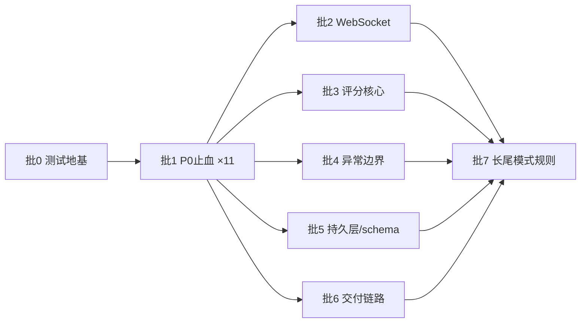

# 修复 Spec：按 8 批次消化 2026-08-26 审计确认的全部缺陷（P0 止血 10 条 → 系统性家族 → 长尾模式规则）

> 依据：[2026-08-26-review-audit.md](../reviews/2026-08-26-review-audit.md)（357 条断言，348 确认）与 [2026-08-26-full-project-review.md](../reviews/2026-08-26-full-project-review.md)。
> 执行方式：每批可独立交付与验收；批 0 是全部批次的前置；批 2-6 相互独立可并行。执行时建议用 make-plan 将单批展开为带完整代码的任务清单。

**Goal:** 消除已确认的数据丢失/跨用户串扰/资源耗尽缺陷，建立回归防护，使 `clean verify` 从 0 测试变为每条修复路径有失败回归测试。

**Architecture:** 先建测试地基（DevServices MySQL 容器 + 实体建表），再按"根因家族"分批修复——每个家族一个批次、一套模式规则，而不是 348 条逐条打补丁。

**Tech Stack:** Quarkus 3.20.4 / Java 21 / Hibernate ORM Panache / MySQL / Jakarta WebSocket。测试依赖已在 pom（quarkus-junit5:126、rest-assured:134、testcontainers-mysql:139-148），Docker 29.1.3 可用。

## 全局约束

1. **范围外**：安全项（认证授权、root/root、CORS、token 强度）沿用内网已接受风险口径，本 spec 不处理。
2. **接口契约不变**：`ResponseResult.error` 走 HTTP 200 + 业务码是既有客户端契约，本 spec 不改 HTTP 状态语义（见批 4 决策）。
3. **不引新依赖**：所需测试依赖已声明；禁止为修复引入新框架。
4. **TDD**：每条 P0/P1 修复先写失败回归测试（红→绿），长尾 P2 按家族抽样测试。
5. **事务铁律**（贯穿所有批次）：`@Transactional` 方法内 catch 不得吞掉写路径异常——要么重抛，要么 `TransactionManager.setRollbackOnly`；"先删后写"一律倒转为"先构建并校验新数据 → 再删旧 → 写新"。
6. **禁止顺手扩权**：只修文档确认的缺陷；重构、抽象、性能优化不在本 spec 授权范围（批 7 明确列出的除外）。
7. 每批结束 `JAVA_HOME=$HOME/.local/opt/jdk21 ./mvnw -B clean verify` 全绿 + 提交；批间不留红。

---

## 批 0：测试地基（前置，约 0.5 天）

**Files:**
- Create: `src/test/java/com/nip/SmokeIT.java`（实为 @QuarkusTest 单测，命名 SmokeTest）
- Modify: `src/main/resources/application.yml`（追加 `%test` profile 段）

**内容：**
1. `%test` 段：不配置 `quarkus.datasource.jdbc.url`（触发 DevServices 自动起 MySQL 容器，镜像固定 `mysql:8.0`，**执行前需与生产 MySQL 版本核对对齐**）；`quarkus.hibernate-orm.database.generation: drop-and-create`（实体驱动建表，`CustomPhysicalNamingStrategy` 保持生效）。
2. 冒烟测试：

```java
@QuarkusTest
class SmokeTest {
  @Inject EntityManager em;
  @Test void schemaBoots() {
    assertNotNull(em);
    // 任选一个实体验证建表成功
    assertDoesNotThrow(() -> em.createQuery("from TestPaperEntity").setMaxResults(1).getResultList());
  }
}
```

**验收：** `clean verify` 输出 `Tests run: 1, Failures: 0`（不再是 "No tests to run"）。

**风险：** 实体建表 ≠ 生产 schema（生产有 5 张缺表和列漂移，见批 5）。测试地基验证的是**代码自洽行为**，不是生产 schema 兼容性——两者在批 5 汇合。

---

## 批 1：P0 止血（10 条 + 1 条连带，最高优先级）

来源：full-review §2 确认 P0 的 #1-4/#6/#8/#9/#22，加审计 §4.2 回调的 #19/#20。每条 = 一个回归测试 + 一个修复，可独立提交。

### 1.1 TestPaperService.java:59-92（P0#1 试卷编辑丢题）
- **根因**：先 `deleteAll` 全部题目，随后任一题型列表为 null 时 `addAll(null)` NPE，catch 吞掉后事务提交。
- **修**：新增私有工具 `List<T> nullToEmpty(List<T> l)`，五个题型列表入口归一；删除操作移到新题目列表组装完成之后；catch 移除或重抛 `RuntimeException`。
- **测试**：`TestPaperServiceTest.updateWithMissingQuestionTypeKeepsExistingQuestions` —— Given 已保存含 3 题的试卷，When 用缺一个题型列表（null）的 DTO 调 update，Then 断言原 3 题仍可查出、update 返回错误或正常完成但不丢题。

### 1.2 TheoryKnowledgeService.java:223-296（P0#2 课件/测验丢失）
- **根因**：同 1.1 模式；:231 无条件先删课件，:259 `firstBy` 为 null 时 `.getId()` NPE 被吞（:293 只打 getMessage）。
- **修**：同 1.1 —— 校验/归一在前、删除在后、异常冒出。:259 处 firstBy 判空并抛带上下文的异常。
- **测试**：缺课件列表的 DTO 调 update，断言原课件行仍在。

### 1.3 MenusService.java:101-115（P0#3 按钮权限静默丢失）
- **根因**：先删按钮权限，请求缺 `permissions` 时 NPE 被吞。
- **修**：方法入口 `Assert` permissions 非 null（注意 `common/utils/Assert.notNull` 语义已被审计证实与预期相反，见 1.11），校验通过后再删旧。
- **测试**：缺 permissions 的请求调编辑，断言权限行仍在且返回错误。

### 1.4 TheoryKnowledgeExamService.java:65-93（P0#4 编辑考试抹掉答卷）
- **根因**：编辑无状态守卫，删全部考生行重建空答卷。
- **修**（安全默认，产品可后调）：存在任一考生 `state != 未开始` 或已有非空 content/score 时拒绝编辑重建，返回业务错误；守卫通过才允许重建。
- **测试**：造一个已有作答内容的考试，调编辑，断言拒绝且答卷仍在。

### 1.5 TickerPatUtils.java:283-318 + PostTelegramTrainService.java:508-535（P0#6 损坏 JSON 空化回写）
- **根因**：四个空 catch（:286/:303/:308/:313）把损坏 JSON 变成合法空数组，外层 :534-535 delete+save 覆盖原行。
- **修**：四个 catch 改为抛 `IllegalStateException`（带原始 JSON 片段与位置）；`PostTelegramTrainService` 外层不捕获、让事务回滚。
- **测试**：喂损坏 JSON 调外层方法，断言旧行未删、异常冒出。

### 1.6 WebSocketUnionService.java:39-85（P0#8 跨用户消息错投）
- **根因**：`@ApplicationScoped` 单例的 `session`/`sUser` 实例字段被所有连接共享。
- **修**：删除实例字段；连接态放入类级 `ConcurrentHashMap<String /*sessionId*/, UnionState>`，onOpen put、onClose/onError remove，所有方法从 map 取态。连带修审计新发现：:110-111 两次 `setReceiveUser` → 第一次改 `setSendUser`；removeRoom:304-308 / roomMessage:401 / userExit:180 对 `webSocketClientSet.get(...)` 判空。
- **测试**：@QuarkusTest + 两个 `jakarta.websocket` 客户端连接，A 向 B 定向发消息，断言只有 B 收到且 sendUser 字段正确。

### 1.7 WebSocketSimulationService.java:43-96,183-198（P0#9 断线错身份暂停整房）
- **根因**：单例共享 `userModel`，onClose 用最后连接者身份执行 REPORT/RECEPT 房间暂停并落库。
- **修**：同 1.6 的 session-keyed 状态模型；连带修 quitRoomRouter:301-320 的 routerRoom key 泄漏（清空后 remove key）。
- **测试**：教员+学员两连接，学员断开，断言房间未被暂停、库无暂停记录。

### 1.8 PostMilitaryTermTrainService.java:124-189（P0#22 干扰项死循环耗尽线程）
- **根因**：类型恰 4 条且候选文本无法生成唯一合成项时 while 永不满足 3 个干扰项；`nextInt(size-1)` 末条永不中。
- **修**：`nextInt(size-1)` → `nextInt(size)`（全方法 3 处）；候选池先 distinct 并校验 ≥4 否则直接业务报错；循环加上限（100 次）后降级为允许重复干扰项并 log.warn。
- **测试**：构造恰 4 条同类型、文本互斥的数据，调用出题，断言 1 秒内返回且干扰项数量=3。

### 1.9 TheoryKnowledgeExamService.java:74（改级#19 回调：快照复用源试卷 id 删掉首场）
- **根因**：考试快照 merge 复用源试卷 id，`deleteById(源试卷id)` 直接删除第一场考试的快照。
- **修**：快照实体建立时 id 置 null 走 persist（`BaseRepository`:16-22 id 空即 persist）；删除改为按本考试 examId 关联删除。
- **测试**：同一试卷建两场考试，编辑第二场，断言第一场快照行仍在。

### 1.10 TheoryKnowledgeExamService 考核分析路径（改级#20 回调：快照 addAll(null)）
- **根因**：客户端 `TestPaperDto` 直写快照，五个题型列表 null → `JSONUtils.toJson(null)=""` → 读回 `fromJson("")=null` → `addAll(null)` NPE。
- **修**：复用 1.1 的 `nullToEmpty` 于快照写入与读出两侧。
- **测试**：写入缺题型列表的快照后调考核分析，断言正常返回不抛 NPE。

### 1.11 连带前置：Assert 语义修正 + 军语导入事务边界（#18）
- `common/utils/Assert.java:75-78` 的 `notNull` 语义写反（审计证实，EnteringTelexPat P0-08 佐证）——修正语义并用 `lsp references` 核查全部调用点的正反逻辑后逐个适配。
- 军语 Excel 导入：P1-43 确认 `saveBatch` 无事务且 CDI 自调用绕过 `@Transactional`——将 saveBatch 拆到注入的自身代理调用（或独立 @ApplicationScoped 协作类）使事务生效，再对空顶级/子级集合判空报业务错误。
- **测试**：导入含非法行的 Excel，断言整批回滚（前半有效行不落库）。

**批 1 验收：** 11 个回归测试全绿；每条修复的 catch 变更经 `grep` 复核无新增吞异常；`clean verify` 全绿。

---

## 批 2：WebSocket 并发家族（ws 分片 13×P1 + 8×P2 + 审计新发现 5）

**Files:** `src/main/java/com/nip/ws/` 全目录、`ws/service/simulation/SimulationGlobal.java`。

**统一规则（按此逐文件核对，不留例外）：**
1. 端点类不得有任何保存连接/用户/房间状态的实例字段——一律 session-keyed `ConcurrentHashMap` 或 `Session.getUserProperties()`。
2. `SimulationGlobal` 及各房间表：裸 `ArrayList` → `CopyOnWriteArrayList`；非原子 get→改→put → `compute`/`computeIfAbsent`；所有 onClose/quit 路径成对 remove（含 routerRoom）。
3. `@OnError` 补齐：WebSocketGeneralKeyPatService / WebSocketGeneralTelexPatService / WebSocketGeneralTickerPatService（当前缺失，审计证实）；实现统一为 log.error(带 Throwable) + 清理该 session 状态。
4. onClose/消息处理对 `get(...)` 结果判空（P1-12 主缺陷 :463/:487/:521/:531/:537/:546 等）。
5. `WebSocketService.sendInfoAll:185-189` 改为按 `sid` 定向（审计新发现 5）。

**验收：**
- 静态：`grep` ws 目录无 `private Session`/`private .*UserModel` 实例字段。
- 动态：批 1 已建的双连接测试扩展为三个场景（定向投递、断线清理、并发进出房间 50 次无泄漏——断言房间表 size 归零）。

---

## 批 3：评分核心统一（TickerPatUtils + 速率/正确率家族）

**Files:** `common/utils/TickerPatUtils.java`、`PostTelexPatTrainService`、`PostTelegraphKeyPatTrainService`、`PostTickerTapeTrainService`、各 `*StatisticalService`。

**顺序（characterization 先行）：**
1. 用真实样本 JSON（从 `docs/database/project006.sql` 的既有训练数据提取 2-3 组）为 TickerPatUtils 现行为写快照测试——先锁行为再动刀。
2. 修确定性缺陷：列对调、列表错位、过滤不同步、groupScore 覆盖累加（full-review §3.8 确认的 P1 组）；`TickerPatUtils.java:640` `setWordPerfectNumber(getCodePerfectNumber()+1)` → `getWordPerfectNumber()+1`（审计新发现 1）。
3. 收敛漂移实现（各保留单一实现，其余调用点迁移）：
   - 除零/速率公式三套（P2-68：`/(totalTime/1000)` vs `/totalTime` 1000 倍差异）→ 统一为 `ScoreMath.rate(count, totalTimeMillis)` 新工具方法，零除返回 0。
   - 排序四写法（P2-69 sort/swap(0,1)/旋转/不排序）→ 统一显式 `ORDER BY` 或内存 sort；`TickerTapeTrainService:216` 的无条件 `swap(0,1)` 删除，改按 type 排序。
   - `SpeedDeduct` r/l 系数对调（:20-27，P1-02 佐证）修正。
   - 守分子/守分母漂移（P2-15/51：`PostTelexPat:850-856`、`PostTelegraphKeyPat:396-399`）→ 统一守分母且分母=0 返回 0。
4. 幂等修复：finish 三服务幂等语义统一（P2-52 汇总的 P1-08/09/10）；`PostTelegramTrainService:519` speedLog 无条件 add + :534 先删后插 → 按页号 upsert。

**验收：** TickerPatUtils 单测覆盖列映射/完美数/gap 三类断言；三个训练服务的速率计算走同一工具方法（`lsp references` 证明旧实现无调用后删除）。

---

## 批 4：异常边界与可观测性（silent-failures 家族）

**Files:**
- Create: `src/main/java/com/nip/common/exception/GlobalExceptionMapper.java`、`UnauthorizedException.java`
- Modify: `common/interceptor/JWTInterceptor.java:82-84`、`service/UserService.java:479-481`、全仓 catch 块（机械化）

**内容：**
1. `GlobalExceptionMapper implements ExceptionMapper<Throwable>`：log.error(完整 Throwable) + 返回 `ResponseResult.error(SYSTEM_ERROR)` 体（HTTP 状态按全局约束 2 保持既有契约：未捕获异常仍 500，显式业务错误仍 200+业务码——**只补空白，不改契约**）。
2. `UserService.getUserByToken` null → 抛 `UnauthorizedException`；对应 Mapper 返回与 JWTInterceptor 相同的 code 203 响应体。效果：52 个 @JWT controller 的"过期 token NPE 面"一次性消除，契约不变。
3. `JWTInterceptor` catch 分支保留异常对象：`log.error("jwt fail", e)`。
4. 机械化清理（ast_edit）：
   - `log.error(e.getMessage())`/`log.error(xxx + e.getMessage())` → `log.error(xxx, e)`（全仓）。
   - 空 catch 块（P2-43 三处 `catch(ignored){}` 等）→ 至少 `log.warn("<上下文>", e)`；位于 @Transactional 写路径的按全局约束 5 重抛。
5. `PostMilitaryTermTrain:402-404` catch 返回 emptyList 伪装"暂无记录" → 重抛。

**验收：** `grep -P 'catch\s*\([^)]+\)\s*\{\s*\}'` 全仓零命中；`grep 'getMessage()'` 在 log 调用中零命中；过期 token 集成测试断言响应 code 203 且日志含堆栈。

---

## 批 5：持久层与 schema 对齐

**Files:**
- Create: `docs/database/migrations/2026-08-26-01-schema-sync.sql`、`2026-08-26-02-engine-innodb.sql`
- Modify: `dao/general/key/GeneralKeyPatPageDao.java:26-27`、`dao/general/telex/GeneralTelexPatPageDao.java:22-23`、`service/TelegramTrainService.java:306`、含空 IN()/REGEXP/双引号字面量的命名查询

**内容：**
1. **findTwoPage 修正**：两处 `id = ?1` → `trainId = ?1`（正确参照：`GeneralKeyPatUserValueResolverDao:12-14`）；调用方 `GeneralKeyPatService:833`、`GeneralTelexPatService:279` 不变。回归测试：造两页数据分属两个 train，断言按 trainId 过滤正确。
2. **schema-sync 迁移 SQL**：建 5 张缺表（general_telex_pat/_page/_user/_user_value、t_masthead，DDL 从实体生成——用批 0 测试容器 `drop-and-create` 导出 DDL 与 dump 差分）；`simulation_router_room` 补 `is_start_sign` 列；`general_key_pat_page.id` 类型对齐 varchar(64)。以 `logs/info.log.1` 的 Hibernate validation 输出为差分清单交叉核对。
3. **engine-innodb 迁移 SQL**：22 张 MyISAM 表 `ALTER TABLE ... ENGINE=InnoDB`（清单以审计核实的 project006.sql 行号名单为准）。**前置：全库备份；执行窗口停服。**
4. 迁移应用后将 `%prod` 增加 `quarkus.hibernate-orm.database.generation: validate`，使后续漂移在启动期阻断（当前 `none` 不阻断，full-review §3.7）。**顺序不可倒**：先迁移后 validate，否则生产起不来。
5. HQL 缺陷修正：`TelegramTrainService:306` 蛇形列名 `mores_value/morse_time` → 驼峰属性名（:205 为正确参照）；空集合 IN() 前判空短路；双引号字面量 → 单引号；聚合带 ORDER BY 修正（persistence P2 清单逐条）。

**验收：** 批 0 容器导出 DDL 与 schema-sync 后的快照库 `mysqldump --no-data` 差分为空（引擎行除外）；命名查询集成测试全绿；迁移脚本在快照库演练通过并记录耗时。

---

## 批 6：交付链路（common-build 家族）

**Files:** `.github/workflows/*.yml`、`Dockerfile.jvm:91`、`Dockerfile.native:24`、`pom.xml`。

1. workflow 增加 `on.push.tags: ['v*']` 使 release job 可达。
2. native 构建按架构拆分 job：ARM64 job 移除 x86 专用 `-march`（保留 `march: compatibility` 与 x86 job 对应）；产物名嵌入 `${{ runner.arch }}` 消除平铺合并同名冲突。
3. `EXPOSE 8080` → `EXPOSE 18001`（两个 Dockerfile），文档示例映射同步 18001。
4. BeanUtils 清理：先 `lsp references` 找出对 commons-collections 的直接 import 并替换/显式声明依赖，再删 BeanUtils 死调用（full-review §4 依赖树结论：官方 POM 仍传递 3.2.2，顺序错了才会编译失败）。
5. 修正 common-build 分片页首统计（27→35）——文档勘误随本批提交。

**验收：** workflow 经 `actionlint`（或 GitHub 语法校验）通过；`docker build -f Dockerfile.jvm .` 本地构建成功且 `EXPOSE 18001`；tag 推送 dry-run 验证 job 触发条件（可在 fork/分支验证）。

---

## 批 7：长尾 P2 模式规则（机械化，最后执行）

按家族批量处理，每家族一次提交 + `clean verify`。工具：`ast_edit` 做同构替换，`lsp references` 验证无遗漏调用点。

| 家族 | 规则 | 代表位置 |
|---|---|---|
| findById 裸解引用 | 统一 `orElseThrow(() -> new BusinessException(...))`；只读列表场景允许 orElse(null)+判空 | P2-30/49/70/71 清单、RoleService:91-94、TheoryKnowledgeExamService:346-352 |
| Integer 拆箱 NPE | `==`/`compareTo` 前判空或改 `Objects.equals` | P2-24/31/32/33/55/56 |
| `nextInt(size-1)` | → `nextInt(size)`；空集合先判 | P2-20（批 1.8 已修军语处） |
| 循环内重建重对象 | `new ObjectMapper()` → 注入单例；N+1 查询改批量 in 查 | P2-73/82/93 |
| 缺 @Transactional 写路径 | 按 P2-A 清单逐方法补注解；自调用改代理调用 | EquipmentDeviceService 等 P2-A 全清单 |
| 死代码 | 无调用且无接入价值 → 删（DemoService.test、AsyncSave 死代码 :566-580、update() 死方法、P2-84 注释 handler）；"守卫写了没接入"（P2-13）→ **接入**而非删 | P2-7/13/84/94 |
| 提示/变量用错 | 逐条按审计表修正 | P2-62/63/64、P2-77/78 两套及格线统一 |
| Map 取值依赖遍历顺序 | `MilitaryTermDataService.getKey:76-85` 改为按明确列名取值（key/value 双键时不再取"首个非 null"）；核查 saveAll:64 调用方 | 审计新发现 8 |
| 文档勘误 | controller-api scope 52→63；P2-16/P2-11 漏计位置补录 | 分片文档 |

**验收：** 每家族修复后 `clean verify` 全绿；findById/拆箱两族各抽 3 处补边界单测；死代码删除后 `lsp diagnostics` 无未使用告警新增。

---

## 排期与依赖



- 批 2-6 相互独立，可并行（不同文件域，无共享编辑面；批 4 的机械化 catch 清理与批 2/3 有文件交叠——批 4 的 ast_edit 步骤放在批 2/3 合入之后执行）。
- 未覆盖项：full-review 标"待运行验证"的运行后果（WS 压测、Native、ARM64 真机、Docker 全链路）不在本 spec；批 6 完成后另行安排。

## 总验收（Definition of Done）

1. `clean verify` 全绿且测试数 ≥ 30（批 0 冒烟 + 批 1 十一条 + 批 2 三场景 + 批 3/4/5 各集成测试 + 批 7 抽样）。
2. 全仓静态门禁：空 catch 零命中；ws 目录无会话态实例字段；`log.*(…getMessage())` 零命中。
3. 快照库演练：schema-sync + engine-innodb 迁移脚本执行通过，`generation: validate` 下 prod jar 启动成功。
4. 审计文档 §2 两条误报对应的分片原文已勘误（P0-14、P2-25 标注误报），§6 新发现 10 条全部落入批 1/2/3/7。
