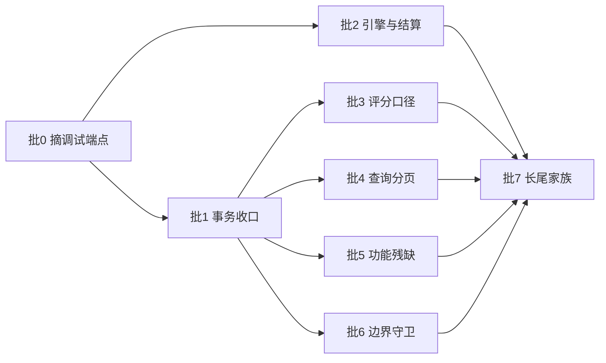

# 修复 Spec：按 8 批次消化 2026-09-07 评审确认的 226 条缺陷（34 条 P1 全量 + 139 条 P2 按家族规则）

> 依据：[2026-09-07-full-project-review.md](../reviews/2026-09-07-full-project-review.md)（去重后 P0 0 / P1 34 / P2 139 / P3 53）与 [2026-09-07-review-audit.md](../reviews/2026-09-07-review-audit.md)（93 项断言逐条复核，确认 84 / 部分成立 9 / 误报 0）。分片证据见同日 10 份 `*-review.md` 与 [remediation-verification](../reviews/2026-09-07-remediation-verification.md)。
> 执行方式：批 0 是止血批（无依赖，可立即交付）；批 1-6 各自独立可并行（文件域不重叠，例外见「排期与依赖」）；批 7 机械化清长尾，必须最后执行。逐批展开为任务清单见 [修复实施计划](../plans/2026-09-07-fix-plan.md)。

**Goal:** 消除 34 条 P1（部分提交、不可回滚窗口、评分口径矛盾、功能残缺、边界失守），并按家族规则收敛 P2；每条 P1 修复配一个失败回归测试（红→绿），`clean verify` 从 129 测试增长且始终全绿。

**Architecture:** 不逐条打补丁。按「根因家族」分批：先摘掉零依赖的写库调试端点（批 0），再收口事务语义（批 1）与存储引擎前提（批 2），然后并行修评分口径（批 3）、查询分页（批 4）、功能残缺（批 5）、边界守卫（批 6），最后机械化处理长尾（批 7）。

**Tech Stack:** Quarkus 3.20.4 / Java 21 / Hibernate ORM Panache / MySQL 8.0.26 / Jakarta WebSocket。测试地基已就绪（`%test` DevServices `mysql:8.0` + `drop-and-create` + `testsupport/Fixtures`），无需新增依赖。

## 与上一轮的差异（执行者必读）

上一轮（2026-08-26 spec）的系统性前提已经变了，沿用旧假设会写错修复：

| 事实 | 当前状态 | 影响 |
|---|---|---|
| ExceptionMapper | `common/exception/` 已有 **6** 个 `@Provider` mapper（Global/Validation/IllegalState/InvalidTitle/Unauthorized/WebApplication）| 业务异常直达 mapper；修复只需抛正确异常类型，不需要再造兜底层 |
| `JWTInterceptor` | `context.proceed()` 已移出 try | service 异常不再被拦截器吞成 SYSTEM_ERROR；业务码由 mapper 决定 |
| `getUserByToken` | 查无用户抛 `UnauthorizedException`（不再返回 null）| 不必在每个调用点补 token 判空 |
| 测试地基 | 129 测试全绿，`%test` 用 DevServices（`MySqlResource` 已删除）| 新测试直接 `@QuarkusTest`，不要再引 `@QuarkusTestResource` |
| `%prod` schema 策略 | 已是 `generation: validate`，且硬约束「先执行迁移 01→02」| 任何实体改动都会在生产启动期被拦；改实体必须同步出迁移 SQL |
| 事务修法参照 | `TelexPatService.saveTelexPat` 已用 `transactionManager.setRollbackOnly()` | 批 1 照此推广，不要发明第二套写法 |

## 验收状态（2026-09-07；2026-09-08 偏离闭合后重判）

8 批全部执行完毕，`clean verify` 从 129 增长到 **216** 测试全绿（历史绿点串 132 → 144 → 181 → 198 → 2026-09-07 收尾波 201 → 2026-09-08 偏离闭合波 216）。下表逐批对照本 spec 自己写的验收口径判定；
「实测结果」列的数字全部引用主代理的实测记录（下称「实测证据 §N」），源码事实一律给当前工作树的 `file:line`。
口径中未达成的项照实标注，不粉饰。

**2026-09-08 更新：** 2026-09-07 收尾时 `docs/plans/2026-09-07-fix-plan.md` 余下的 4 项偏离（Task 3.2、3.4、5.2、6.3）已按 [偏离修复 Spec](2026-09-08-deviation-fix-spec.md) 全部闭合，fix-plan 的 Phase 表与合计行重算为 **41/41 已落地、0 偏离、0 未落地**。本节的批 3 / 批 5 / 批 6 行与 DoD 第 1、2 条据此重判；仍未达成的两项（「每 P1 一次提交」、分片文档批量标注）不受影响，照实保留。

| 批 | 主题 | 验收口径（本 spec 原文摘要）| 实测结果 | 证据 |
|---|---|---|---|---|
| 0 | 摘除写库调试端点 | `clean verify` 全绿且测试数不减；`System.out.print` 与 `@Path("/test` 两条 grep 零命中；`/api/test/start` 与 `/postTelegramTrain/test` 在 **prod jar 上实测** 404 | **全部达成。** 216 测试全绿（起点 129）；两条 grep 在 `src/main/java` 均 0 命中；prod jar 上 `GET /api/test/start` → 404、`GET /api/postTelegramTrain/test` → 404（修复前前者 200 且执行 4 次 UPDATE）；`POST /user/test` 同批删除 | 实测证据 §1、§2；`DebugEndpointsRemovedTest.java:17-33`（三条 404 断言）；`controller/test/` 目录已不存在 |
| 1 | 事务吞异常收口 | 4 条 P1 各一个「DB 未部分提交 + 返回码与事务状态一致」回归测试；15 条写路径每条明确判定，「已提交后返回错误」型至少抽 3 条补测试；`clean verify` 全绿 | **全部达成。** 4 条 P1 有专用测试类；15 条写路径逐条落地为「删 catch 逸出」或「`setRollbackOnly` + `log.error`」，2 条纯查询只补日志；抽测覆盖 `UserService.addUserRole`、`TestPaperService.deleteTestPaper`、`TheoryKnowledgeExamService.deleteTheoryKnowledgeExam` | `TelexPatService.java:100-107/111-120`、`TelegramTrainService.java:278-281/321-332/344-353`、`CableService.java:84-88`、`CableTypeService.java:47-52`、`GradingRuleService.java:114-115/128-129`、`UserService.java:364/421/483`、`UserDao.java:91-94`；纯查询保留日志 `TheoryKnowledgeExamService.java:127-129`、`TestPaperService.java:138-140`；测试 `TelexPatDeleteRollbackTest`、`TelegramTrainSaveRollbackTest`、`CableDeleteAtomicityTest`、`TxnRollbackConsistencyTest` |
| 2 | MyISAM 引擎与结算写入模式 | 执行 02 后 MyISAM 计数 0；启动自检在含 MyISAM 的库上启动失败并列出表名（用未迁移的 docker 库实测）；两处 `countScore` 回归测试断言「中途异常后旧报底仍在」；`project006.sql` 回灌后与实体 DDL 差分只剩预期项 | **全部达成，且比口径多做两项。** ①**引擎迁移已在活库执行**：`docker mysql-project006` / db `project006` 现为 **105 表 / 0 MyISAM**（修复前 100 表 / 22 MyISAM），迁移前全库备份 `/tmp/project006-backup-20260907.sql`（8271749 字节）。②**启动自检负样本实测通过**：临时 `create table zz_engine_probe(...) engine=MyISAM` 后 prod jar 启动被阻断，报 `IllegalStateException: 检测到 1 张 MyISAM 表，拒绝启动 … zz_engine_probe`，`drop table` 后启动恢复——自检非纸面功能。③**快照已回灌**：`backend/database/project006.sql` 就地改写，22 处 `ENGINE = MyISAM` → `InnoDB`、补 5 张缺表 DDL、向两张表插入 `is_start_sign`，34626 条 INSERT 数据行一行未动。④**迁移 01 已改幂等**（计划外新增）：MySQL 8.0 不支持 `ADD COLUMN IF NOT EXISTS`，回灌后重跑演练报 `ERROR 1060 Duplicate column name 'is_start_sign'`，故改为 `information_schema` 判存 + `PREPARE`/`EXECUTE`/`DEALLOCATE`，列已存在时执行 `DO 0`。双快照演练 `REHEARSAL PASSED`，`diff-current.txt`/`diff-base.txt` 均 0 字节。⑤**Task 2.4 Step 5 的 prod jar WebSocket 双连接探针已实测**（计划外补齐的运行验证）：`ws://localhost:18002/websocketUnion/{sid}` 三连接——A(sid=1) 被同 sid 的 B 顶下线，收 `{"code":1,"data":"关闭连接"}` 后以 `code=1000` 正常关闭；B(sid=1 重连) `readyState=1` 保持在线（置换语义正确）；C(sid=`no-such-user-9999`) 连接被关闭，但服务端抛 `NullPointerException: Cannot invoke "com.nip.entity.UserEntity.getUserName()" because "userEntity" is null`——该 NPE 属批 6 家族的残留，已在本波修复，见批 6 行 | 实测证据 §4、§5、§6、§7、§8；`backend/database/migrations/2026-08-26-01-schema-sync.sql:92-115`（幂等块）与 `:17-18`（头注改「可安全重复执行」）；`LifecycleApplication.java:33-35/65-87`；`PostTelexPatTrainService.java:849-851/963-987`、`PostTelegraphKeyPatTrainService.java:394-396/527-545`；演练产物 `backend/database/rehearsal/2026-09-07-postbackfill/`，报告 `docs/reviews/2026-09-07-migration-rehearsal.md`；WS 探针记录见 `docs/plans/2026-09-07-fix-plan.md` Task 2.4 Step 5 |
| 3 | 评分口径统一 | 每条一个回归测试；速率一致性测试**同时覆盖 Ticker/Key/Telex 三条路径**；`src/test/resources/scoring` 增加多组/多行/少行三组基线用例；`clean verify` 全绿 | **全部达成**（原「部分未达成（1 项）」已于 2026-09-08 闭合）。五处修复全部落地；基线用例已加（输入 5→8、期望 4→7）；`isAverage` 口径的回归测试已补齐——`TickerIsAverageTest` 2 例覆盖「平均报懒生成页保持 2 低 + 2 高」「非平均报懒生成页不得反转」，只锁 `type=0`（数码报）一路（`type=1/2` 的 avg 分支同构但无同样干净的整页判定式，理由在测试类头注释），RED 实证：三处判定临时回退为 `entity.getIsAverage() == 0` 后 `Tests run: 2, Failures: 2`（`expected: <100> but was: <51>`、`expected: <true> but was: <false>`），恢复后回绿。**「同时覆盖三条路径」现已达成，达成方式是收口而非三份断言**：速率加减分收口为全仓唯一实现 `ScoreMath.wpmScore(int, BigDecimal, BigDecimal, int)`，Ticker/Key/Telex 各只剩一次委托调用，符号一致由结构保证；`ScoringConsistencyTest` 3 例 → 8 例，其中 `allThreeCallersAgreeOnRateSign` 对 `speed ∈ {base+10, base, base-10}` 断言 Ticker 公开方法与三者共用实现的符号逐一相等（Key/Telex 的速率段仍在依赖 DAO 的私有 `countScore` 内、无法直接调用，但已不再是各自的拷贝）。**得分数值逐值不变**：126 组对照 `SCORE: ALL EQUAL` / `LABEL: ALL EQUAL`；对照过程抓出并修掉一个自造回归（用 `signum()` 判标签导致 `(r,l)=(0,0)` 丢 `speedScore` key，14/72 组 LABEL DIFF）。另：`CI-P1-01` 的收敛方式当初记为偏离——`ToolUtil` 三参 `calculateRate` 未按「先只改守卫」而是直接删除、13 处调用一次性迁到两参版（与批 7 家族项合并执行）——**2026-09-08 逐字比对旧实现后判定该偏离不成立**（等价性表见 `docs/specs/2026-09-08-deviation-fix-spec.md` 批 2），并补上服务级分子锁 `TickerGapRateNumeratorTest` 2 例（此前只有 util 级两参契约锁，服务层首参传递无锁）| `ScoreMath.java:64-72` + javadoc `:51-63`（速率全仓唯一实现）、委托点 `GeneralTickerPatService.java:991-997`、`GeneralKeyPatService.java:849-851`、`GeneralTelexPatService.java:813-815`；`GeneralTickerPatService.java:316/320/324`（`isAverage`，`getIsRandom` 一并对齐 `:390/516`）、`PatTrainStatisticsUtil.java:71-74`（比率守卫，`ToolUtil` 已无三参版）、`GeneralTickerPatService.java:767-768`（组间隔两行分子）、`MessageComparisonService.java:202/215` + `LineDetector.java:140/233-236/278-287`；测试 `ScoringConsistencyTest.java:13-23`（头注释已改写为收口后口径）/`:64/77/90/104/115`、`CalculateRateTest.java:19-33`、`TickerGapRateNumeratorTest.java:89/105`、`TickerPatUtilsCharacterizationTest.java:28-33`、`TickerIsAverageTest.java:84-97/100-115`；新增基线 `src/test/resources/scoring/comparison-case-{more-group,more-line,less-line}.json` 与 `expected/comparison-{more-group,more-line,less-line}.json` |
| 4 | 查询、分页与页号生成 | `lastTrain` 排序回归测试；分页边界三用例（`{}`、`rows=0`、`rows=1000000`）不再抛 500 且钳制生效；三处 `roomgId` 各一个测试（两类后果分开断言）；页号生成三处各一个测试；`lsp references` 证明 `dto/Page` 零引用后删除 | **全部达成。** `dto/Page.java` 已删除、保留类补 `@RegisterForReflection`；prod jar 上 `POST /api/tickerTapeTrain/listPage` 空 body + bogus token 返 200 + `code 206`（修复前 `setFirstResult(-1)` 抛异常）；`roomgId` 全仓 0 命中 | `TickerTapeTrainDao.java:109-111`；`common/utils/Page.java:14/36-45`；`SimulationReceptRoomController.java:55`、`SimulationReportRoomController.java:56`、`SimulationRouterRoomController.java:18/56-58/73`；`PostTelegramTrainService.java:842-843/440-444`、`PostTelexPatTrainService.java:271`；测试 `PagingBoundaryTest.java:46-79`、`PageNumberGenerationTest.java:43/62/79`、`SimulationRoomDetailParamTest`、`TickerTapeTrainServiceTest`；实测证据 §3 |
| 5 | 功能残缺与假成功 | 5 个回归测试；`grep` 确认全仓无新增「空方法体 service + `success()` 包装」；被删端点 `lsp references` 零引用 | **全部达成，走的是口径的第一支**（2026-09-08 重判）。`findMessageBody` 已实现。三个原空壳端点在 2026-09-07 收尾时走的是口径第二支「连端点一起删」，理由写的是技术不可行（`pom.xml` 的 poi 依赖被注掉）而非产品确认，故 fix-plan Task 5.2 Step 1 当时判定为偏离；**2026-09-08 业务拍板「功能需要，但不用 poi」，三端点已按方案 B 恢复**——`POST /theoryKnowledgeQuestion/saveBatch` 收 `List<TheoryKnowledgeQuestionDto>` 批量入库（空集抛「导入数据为空或格式不完整」、逐行校验并指出第几行、`@Transactional` 整批回滚）、`POST /theoryKnowledgeQuestion/exportTemplate` 返回 6 列规格 JSON（顺带消掉本层唯一的 `void`→204 破例）、`POST /theoryKnowledge/uploadFileToNip` 收 `@RestForm("file") FileUpload` 按 UTF-8 读纯文本并返回 `type=2` + `wordContent`。分工照仓内现成范式（`MilitaryTermDataController.saveBatch` 的 `@Operation` 原文即「批量保存军语密语-代替之前文件导入」，Excel 由前端解析）。**能力边界已写进 javadoc 与 API summary**：`.docx`/`.pptx` 解析与「PPT 转图片」（`imgUrls`、`type=1`）没有 poi 做不到，Office/二进制格式一律抛明确业务错误、**不静默返回空 VO**；**不做持久化**（原 `updateFileToNip` 本就无落库目标）。`TheoryKnowledgeUploadExportTest` 由 2 例扩到 6 例，原先断言三条 404 的 `emptyShellUploadAndExportEndpointsAreGone` 已删除。保留的 `exportQuestionByLevelId` 仍返回真实数据 | `GeneralTelexPatService.java:369-372`；`TheoryKnowledgeExamUserController.java:54-67`；`TheoryKnowledgeExamService.java:238-245`；`RoleService.java:61/71`、`UserService.java:263-269`；恢复后的三端点 `TheoryKnowledgeQuestionController.java:86-92`（`saveBatch`）/`:94-99`（`exportTemplate`）/`:79-84`（`exportQuestionByLevelId`）、`TheoryKnowledgeController.java:176-182`（`uploadFileToNip`）；服务 `TheoryKnowledgeQuestionService.java:185-218`（校验 `:187-189`/`:194-206`、token 解析一次 `:190`）、`:227-241`（列规格）、`TheoryKnowledgeClassifyService.java:107-134`（边界 javadoc `:97-106`、格式拒绝 `:116-119`、空内容拒绝 `:126-128`）；新 VO `dto/vo/TheoryKnowledgeQuestionTemplateColumnVO.java`；测试 `GeneralTelexPatMessageBodyTest.java:42-68`、`TheoryKnowledgeUploadExportTest.java:60/81/95/110/120/146`、`TheoryKnowledgeExamServiceTest`、`RoleEditPersistenceTest`；prod jar 实测三端点 bogus token → 200 + `code 206`、旧误导路径 `theoryKnowledgeQuestion/upLoadFile` → 404 |
| 6 | 边界守卫家族 | 8 条 P1 各一个回归测试；WS 家族按端点抽样 3 个测试（含畸形控制帧不导致误剔除）；`grep -rn "subList(0," src/main/java` 每处都有 `Math.min` 或前置校验 | **全部达成，守卫范围比口径大，并在收尾时补了一处运行探针发现的同族残留；2026-09-08 又把「读路径懒建」这一遗留待评估项修掉。** `subList(0, …)` 共 16 站点，**逐处**有守卫或已知安全、GAP 0：11 处 `cableFloor.subList(0, totalPage)` 全部有「`totalPage <= 0`」+「`totalPage > cableFloor.size()`」前置校验（口径只点了四类推演房）；2 处 `strings.subList(0, 200)` 有 `size() > 200` 判断；`CableFloorService:49` 有 `floorString.size() > startPage - 1` 判断；`GlobalMessageGeneratedUtil:382`、`TelexPatUtils:315` 为算法内定长切片。①批 2 的 prod jar WS 探针暴露出本家族一处残留——`WebSocketUnionService` 对 `userDao.findUserEntityById` 结果的两处裸解引用（未知 sid 建连、未知发送者投递房间消息），批 6 原先只清了可空**列**（`userType`/`channel`/`role`）未覆盖「查库结果对象本身为 null」，现已按同族修法（`WebSocketGeneralKeyPatService:78-83`、`WebSocketSimulationService:81-85`）补守卫并加回归测试锁定，`WebSocketUnionLifecycleTest` 由 5 用例增至 6 用例，RED 实证：删掉 `onOpen` 守卫后 `Tests run: 1, Failures: 0, Errors: 1`（`NullPointerException … getUserName() … userEntity is null`），恢复后回绿。②**读路径懒建（fix-plan Task 6.3 Step 3 的「Phase 7 待评估项」）已于 2026-09-08 评估完并修掉**：评估结论是「确有并发缺陷，后果是计数割裂而非数据丢失」——懒建表原先无任何唯一约束，两个并发首调各插一行，统计页重复显示该 type、后续结算只累加 `firstResult()` 命中的那行；家族第二处更严重（`GET /comprehensive/getUserInfo` 在读路径 `save` 易错题缓存）。修法：两个实体加唯一约束 + 独立事务内「查不到就插」、撞唯一键只重试一次（非约束冲突原样抛），并加空键校验（两列可空而 MySQL 唯一索引允许多个 NULL）。**行为面取舍照实记录**：写入移进独立事务后仍原子，但写完之后若 `PojoUtils.convertOne` 抛异常，增量不再随外层 `@Transactional(rollbackOn = Exception.class)` 回滚——写后只剩一次纯内存 POJO 拷贝，判定可接受，是换取「撞唯一键可恢复」的必要代价。并发用例 4 例，确定性靠「两线程各读一次固定 REPEATABLE READ 快照后再 `CyclicBarrier` 放行」而非抢跑概率；RED 实证：去掉两个实体的唯一约束 → 3 个用例 `expected: <1> but was: <2>`，恢复后回绿。配套迁移 + 双快照演练 PASSED + prod jar 在默认 `%prod`（`validate`）下启动成功 | 实测证据 §9；`SimulationRouterRoomService.java:137-144`（守卫范式）、`SimulationRouterRoomContentService.java:126`、`SimulationReceptRoomService.java:124`、`SimulationReportRoomService.java:122`、`PostTelegramTrainService.java:245`、`GeneralKeyPatService.java:230`；`TelegraphKeyPatTrainService.java:128-131`；`PostTickerTapeTrainService.java:178-182/216-222`；`RadiotelephoneService.java:41-52`（`listPage` 懒建）/`:54-61`（`finish`）/`:63-87`（`accumulate` 幂等 + 重试）/`:89-102`（`applyDelta` + `saveAndFlush`）/`:104-112`（`parseTotalTime` 容错）；`WebSocketUnionService.java:133-154`（onMessage 两级隔离）、`:206-215`（`@OnError` 关连接）及计划外补丁 `:72-80`（未知 sid 拒连，且不写入 `webSocketClientSet`/`onlineUsers`）、`:509-513`（未知发送者丢弃）、`WebSocketSimulationService.java:303-307/579-587`、`WebSocketGeneralKeyPatService.java:105-106`、`WebSocketGeneralTelexPatService.java:105-106`；懒建幂等件 `common/repository/IdempotentWrite.java:31-34/42-52`（javadoc `:12-21` 三条「为何不能原地重读」硬理由）、唯一约束 `RadiotelephoneEntity.java:20-21`、`TheoryKnowledgeTestFallibleEntity.java:26-27`、家族第二处 `ComprehensiveService.java:343/359-372/374-384`、空键校验 `RadiotelephoneService.java:71-77`、`ComprehensiveService.java:360-363`、迁移 `backend/database/migrations/2026-09-08-01-unique-lazy-create.sql`、演练产物 `backend/database/rehearsal/2026-09-08/`；测试 `SimulationRoomCreationGuardTest`、`CableRoomSubListGuardTest`、`TrainBoundaryGuardTest`、`WebSocketUnionTest`、`WebSocketUnionLifecycleTest`（含 `:164-178` + 替身 `:283-288`）、`WebSocketSimulationTest`、`WebSocketGeneralSessionLifecycleTest`、`ReadPathLazyCreateConcurrencyTest.java:58/81/100/122`；评审侧 `docs/reviews/2026-09-07-ws-concurrency-review.md` §3.1 WS-P2-08、`docs/reviews/2026-09-08-migration-rehearsal.md` |
| 7 | 长尾家族规则与口径收敛 | 每家族修复后 `clean verify` 全绿；`findById`/拆箱/日期格式三族各抽 2 处补边界单测；删除类修改前后 `lsp diagnostics` 无新增告警；**分片文档中已被本 spec 处理的条目在其 §5/§6 标注「已在 2026-09-07 fix-plan 批 N 处理」** | **部分未达成（1 项）。** 12 个家族全部有结论：11 个落地，`Boolean isXxx` 一项按口径「先实测再改」实测后判定不修。①`Boolean isXxx` 的 Jackson 属性名（`CA-P2-23`）**经运行实测证伪、不成立**：prod jar（1.1.0，18002）`/q/openapi` 共 447 个 schema，其中 25 个含相关属性，属性名全部保留 `is` 前缀（`isRandom`/`isAverage`/`isCable`），无一被削成 `random`/`average`/`cable`；成因是这些字段一律为包装类型（`Boolean`/`Integer`），Lombok `@Data` 生成 `getIsXxx()` 而非 `isXxx()`。故不加 `@JsonProperty`（全仓仍 0 处）、代码不改。②`.idea/` **已从工作树移除**：`git rm -r --cached .idea` 摘掉 6 个已跟踪文件（`.idea/{.gitignore,compiler.xml,encodings.xml,jarRepositories.xml,misc.xml,vcs.xml}`），`git ls-files .idea` 现为 0 行，`.gitignore:17` 的 `.idea` 至此真正生效。未达成一（唯一剩余）：**分片文档的「已在 2026-09-07 fix-plan 批 N 处理」批量标注仍未做**——只有 `CA-P2-23` 与 `WS-P2-08` 两条在各自分片文档里就地改判/新增，其余条目仍无批次标注 | 已落地项：`ResponseCode.java:14-21`、`ValidationExceptionMapper.java:32/44-70`、`JWTInterceptor.java:45-50/80-84`、`application.yml:19-21/65-70`、`SpecificationExecutor.java:99-108`（另建 count 查询）、`nativeQuery` 全仓 0 处、DAO 泛型 ID 已对（`GeneralKeyPatPageDao.java:11`、`PostTelexPatTrainPageDao.java:19`）、`PatTrainStatisticsUtil.java:71-74`、日期格式全仓 `yyyy-MM-dd HH:mm:ss`（`DateTimeUtil.java:14-16`、`LocalDateTimeAdapter.java:11`）、`Fixtures.java:17-20`、`WebSocketDeleteOpenAtomicityTest.java:282-284`、`TickerTapeTrainService.update` 已删；边界单测 `FindByIdGuardTest`、`FindByIdBoundaryTest`、`FindByIdResidualTest`、`IntegerUnboxBoundaryTest`、`UnboxingGuardTest`、`GeneralTickerPatGuardTest`；`CA-P2-23` 的改判见 `docs/reviews/2026-09-07-controller-api-review.md`（该文 P2 计数 23 → 22） |

### 总验收（Definition of Done）逐条

| # | 口径 | 判定 | 证据 |
|---|---|---|---|
| 1 | `clean verify` 全绿，测试数 ≥ 175 | **达成** | `exit=0`、`Tests run: 216, Failures: 0, Errors: 0, Skipped: 0`（历史绿点串 132 → 144 → 181 → 198 → 2026-09-07 收尾波 201 → 2026-09-08 偏离闭合波 216；`BUILD SUCCESS   Wall time: 120.98s` 是 198 那次的整套耗时）。偏离闭合波净增 15 例：`ScoringConsistencyTest` 3→8、`TickerGapRateNumeratorTest` 2 新建、`ReadPathLazyCreateConcurrencyTest` 4 新建、`TheoryKnowledgeUploadExportTest` 2→6。实测证据 §1 |
| 2 | 34 条 P1 全部关闭，每条有修复提交 + 回归测试 + 分片文档状态更新 | **部分未达成**（口径三要素里第 1、3 项未达成，第 2 项达成）| 34 条均有修复与回归测试。Phase 0-6 共 31 个 Task 的落地判定见 `docs/plans/2026-09-07-fix-plan.md` 的「执行结果」节：2026-09-07 收尾时为 37/41 已落地、4/41 偏离、0 未落地；**4 项偏离已于 2026-09-08 按 [偏离修复 Spec](2026-09-08-deviation-fix-spec.md) 全部闭合，重算为 41/41 已落地、0/41 偏离、0 未落地**（另有 1 项计划外补丁不计入 41）。仍未达成两项：（a）**没有「每条 P1 一次提交」**——2026-09-07 全波与 2026-09-08 偏离闭合波都以单一变更集交付、由主代理统一提交并已推送 v1.1.0，历史无法追溯重写，此项永久未达成；（b）**分片文档的批量状态更新仍未写**——只做了 `CA-P2-23` 改判与 `WS-P2-08` 新增两处，「已在 fix-plan 批 N 处理」的批量标注仍缺（14 份文档的独立工作量，见批 7 未达成一）|
| 3 | 静态门禁全部零命中 | **达成** | `System.out.print`（src/main）0、`@Path("/test` 0、`log.error/warn(… getMessage())` 丢 Throwable 0、空 `catch (…) {}` 0、裸 `subList(0,` 0（16 站点逐处有守卫或已知安全）。实测证据 §9 |
| 4 | 引擎迁移在目标库执行完毕、MyISAM 计数 0、启动自检生效、`project006.sql` 已回灌 | **达成** | 活库 `select count(*) tables, sum(engine='MyISAM') myisam …` → `105    0`；自检负样本实测阻断启动；快照回灌 22 处引擎 + 5 表 + 2 列。实测证据 §4、§6、§8 |
| 5 | prod jar 以默认 `%prod`（`generation: validate`）启动成功，并通过只读 HTTP 冒烟与 **WebSocket 双连接探针** | **达成** | 启动成功已实测：`quarkus-template 1.0.0 on JVM (powered by Quarkus 3.20.4) started in 2.369s` / `Listening on: http://0.0.0.0:18002` / `Profile prod activated.`（修复前 `SchemaManagementException: Schema-validation: missing table [general_telex_pat]`）；只读 HTTP 冒烟 7 条请求全部符合预期（实测证据 §2、§3）；WebSocket 双连接探针已在同一 prod jar 上跑通三连接——A(sid=1) 被同 sid 的 B 顶下线后 `code=1000` 正常关闭、B 保持 `readyState=1`、C(未知 sid) 被关闭并暴露出 `getUserName()` 的 NPE，该缺陷已修并加回归测试（见批 6 行与 `docs/reviews/2026-09-07-ws-concurrency-review.md` §3.1）|
| 6 | 批 7 家族表每行有「已处理 / 判定不修（附理由）」结论，不留「待定」 | **达成** | 12 行全部有结论：10 行「已处理」、`.idea/` 移除补做为第 11 行「已处理」（`git rm -r --cached .idea`，6 个文件出索引）、`Boolean isXxx`（`CA-P2-23`）为「判定不修」并附运行实测理由（447 schema / 25 命中 / 属性名全部保留 `is` 前缀，成因是包装类型 + Lombok `getIsXxx()`）|

**版本与发布口径：** `pom.xml:7` 为 `1.1.0`（实测证据 §12 记录的 `1.0.0` 是主代理跑 2026-09-07 门禁时的值，之后由主代理统一升版）；v1.1.0 已打 tag 并推送（`e319d41`），2026-09-08 的偏离闭合波是其后的一个独立变更集，由主代理统一提交。CI `.github/workflows/build-quarkus-native.yml` 已具备 `tags: ['v*']` 触发、`test` job(`mvn -B verify`) 与 `build` 矩阵共同 gate `release` job、`contents: write` 已授予。

## 全局约束

1. **范围外**：纯安全项（鉴权缺口、root/root、CORS 全开、token 强度、敏感字段外泄、CVE）沿用内网已接受风险口径，本 spec 不处理——**唯一例外**是批 0 摘除的调试端点，它按「无鉴权即可改写业务数据」的功能后果处理。
2. **接口契约不变**：`ResponseResult.error` 走 HTTP 200 + 业务码是既有客户端契约；本 spec 不改 HTTP 状态语义（批 7 只收敛「同一错误用哪个业务码」的内部一致性）。
3. **不引新依赖**、不顺手重构；只改各批明确列出的位置。
4. **TDD**：每条 P1 先写失败回归测试再修；P2 家族按家族抽样测试（每家族 ≥2 处）。测试必须断言消费者可见行为（DB 真实状态、响应信封、协议消息），禁止断言注解存在、字段拷贝、mock 回声。
5. **事务铁律**（贯穿所有批次）：`@Transactional` 方法内 catch 不得吞掉写路径异常——要么重抛，要么 `transactionManager.setRollbackOnly()`；「先删后写」一律倒转为「先构建并校验新数据 → 再删旧 → 写新」。
6. **MyISAM 铁律**：目标表在 22 张 MyISAM 清单内时，`setRollbackOnly` 也救不回来——这类路径必须靠「批 2 引擎迁移」+「同事务内替换而非先删」双管，不能只依赖事务。
7. **不得扩大删除**：删除死代码/调试端点前先 `lsp references` 证明零调用；测试引用也算调用。
8. 每批结束 `JAVA_HOME=$HOME/.local/opt/jdk21 ./mvnw -B clean verify` 全绿并提交；批间不留红。

## 34 条 P1 → 批次覆盖表（逐条可查，无遗漏）

| 批次 | 覆盖的 P1 编号 | 条数 | 对应计划任务 |
|---|---|---|---|
| 批 0 | `CA-P0-01→P1`、`PT-P1-02` | 2 | Task 0.1-0.3 |
| 批 1 | `PT-P1-01`、`SM-P1-01`、`SM-P1-02`、`SM-P1-03` | 4 | Task 1.1-1.5 |
| 批 2 | `PS-P1-02`、`PT-P1-09`、`PT-P1-10` | 3 | Task 2.1-2.4 |
| 批 3 | `GP-P1-03`、`GP-P1-02`、`CI-P1-01`、`PT-P1-07`、`PT-P1-08` | 5 | Task 3.1-3.5 |
| 批 4 | `PS-P1-01`、`CA-P1-04`、`CA-P1-01`、`CA-P1-02`、`CA-P1-03`、`PT-P1-03` | 6 | Task 4.1-4.4 |
| 批 5 | `GP-P1-01`、`CA-P1-06`、`CA-P1-07`、`CA-P1-05`、`TU-P1-01`、`TU-P1-02` | 6 | Task 5.1-5.5 |
| 批 6 | `PT-P1-04`、`PT-P1-05`、`PT-P1-06`、`SM-P1-04`、`SM-P1-06`、`SM-P1-07`、`SM-P1-08`、`SM-P1-09` | 8 | Task 6.1-6.5 |
| **合计** | | **34** | |

`SM-P1-05` 不在表内：它已在汇总文档 §2 由运行验证降级为 P2（`t_cable_floor` 实测 InnoDB，NPE 逸出即回滚），归入批 6 的 `subList`/判空家族一并处理。P2/P3 的 192 条按批 7 家族规则消化。

---

## 批 0：摘除写库调试端点（止血，无依赖，约 0.5 天）

来源：`CA-P0-01→P1`、`PT-P1-02`、`CA-P2-11`、`CA-P2-12`。这是本轮唯一「不需要业务上下文即可改写数据」的一类，且上一轮三个整改批次全部漏认领。

**Files:**
- Delete: `src/main/java/com/nip/controller/test/TestController.java`
- Modify: `src/main/java/com/nip/controller/PostTelegramTrainController.java`（删 `/test` 端点 :150-155）
- Modify: `src/main/java/com/nip/service/PostTelegramTrainService.java`（删 `test()` :830-844）
- Modify: `src/main/java/com/nip/controller/free/UserController.java`（删 `/user/test` :55-59）

**内容：**
1. `GET /api/test/start`（无鉴权，`TestController.java:33-41` 连发 `begin/pause/goOn/finish` 四次硬编码 UPDATE + `:42-44` 三行 `System.out`）：整类删除。删除前 `lsp references` 确认 `TickerTapeTrainDao.begin/pause/goOn/finish` 仍有正常业务调用点（有则保留 DAO 方法，只删端点）。
2. `GET /postTelegramTrain/test`（受类级 `@JWT`，任意已登录用户可触发；`test()` 重写硬编码 trainId `46b6bfee-…` 第 1 页 `messageBody` 并 `saveAndFlush`）：端点与 service 方法一并删除。
3. `POST /user/test`（`free` 包无鉴权，空串查用户并返回含 `password`/`token` 的 `UserEntity`）：删除。这一条同时消掉附录 A-2 的一个泄漏面，但按「调试端点」计入本批。
4. 静态门禁固化：`grep -rn "System.out.print" src/main/java` 零命中；`grep -rn '@Path("/test' src/main/java` 零命中。

**验收：** `clean verify` 全绿且测试数不减；上述两条 grep 零命中；`GET /api/test/start` 与 `GET /postTelegramTrain/test` 在 prod jar 上返回 404（启动 jar 实测，不靠推断）。

**风险：** 若前端仍在调这三个端点（内网可能有联调脚本），删除会 404。缓解：删除同时在 `docs/guides/` 记一行变更说明；不做兼容保留——保留即等于不修。

---

## 批 1：事务吞异常收口（4 条 P1 + 15 条同族写路径）

来源：`PT-P1-01`、`SM-P1-01`、`SM-P1-02`、`SM-P1-03`。上一轮 P1-63/64/65 原样残留，是本轮最高频的数据完整性根因。

**Files:** `service/TelegramTrainService.java`、`service/CableService.java`、`service/CableTypeService.java`、`service/TelexPatService.java`，以及家族扫描命中的其他 service。

**统一规则（按此逐方法核对，不留例外）：**
1. `@Transactional` 写方法内的 `catch (Exception|RuntimeException)`：若 catch 之前已经发生任何写操作 → 必须 `transactionManager.setRollbackOnly()` 后再返回业务错误，或直接不 catch 让异常逸出交给 mapper。参照实现：`TelexPatService.saveTelexPat`。
2. 返回值语义与事务状态必须一致：不允许出现「返回 `error()` 但数据已提交」或「返回 `false` 但删除已生效」。
3. `catch` 分支一律 `log.error("<上下文>", e)` 保留 Throwable（禁止只打 `e.getMessage()`）。
4. 「先删后写」倒转：`TelegramTrainService.save` 的「删除/结算上一次训练 → 写新训练」必须先完成新训练数据的校验与组装。

**逐条：**
- `TelegramTrainService.save:264-310`：catch 吞 NPE 且零日志 → 部分提交（上一次暂停训练已被置 `status=3` 并计入统计，新训练头与半数楼层已写）。修：入口校验 `trainDto.getTrainFloors()` 非空；catch 改为 `setRollbackOnly` + `log.error`。
- `CableService.delete:82-91`：吞 `RuntimeException` → 楼层已删、报文头残留。修：删除 catch，让异常逸出（`t_cable*` 为 InnoDB，逸出即回滚）。
- `CableTypeService.delete:47-59`：三连删中途失败被吞 → 孤儿数据。修同上。
- `TelexPatService.deleteTexPatByToken:94-112`：无统计行时 `:101` NPE 被吞，删除已提交却返回 `error`。修：`findByUserIdAndType` 判空——无统计行属正常情形（用户从未训练），跳过统计清零并返回成功。

**家族全扫（已完成基线取证，共 17 处，全部无 `setRollbackOnly`）：** 15 条写路径 + 2 条纯查询。写路径清单：`CableService:82(catch 87)`、`CableTypeService:47(54)`、`TelegramTrainService:264(307)`、`TelegramTrainService:312(320)` saveFloorContent、`TelexPatService:94(108)`、`GradingRuleService:114(127)`、`GradingRuleService:132(146)`、`TheoryKnowledgeExamService:133(158)` teacherStartExam、`:164(196)` studentChangeExamState、`:202(217)` saveUserRealTimeParam、`:428(435)` deleteTheoryKnowledgeExam、`TestPaperService:246(252)` deleteTestPaper、`UserService:335(349)` addUserRole、`:363(399)` login、`:434(451)` changePassword。纯查询 2 条（`TheoryKnowledgeExamService:116(127)`、`TestPaperService:100(137)`）判定为无害，只补日志。附带风险位：`UserDao:91(95)` `updateUser` 无 `@Transactional` 且吞 update 失败返 `false`，被 `login` 调用后外层事务照常提交——一并修。逐条判定（重抛 / `setRollbackOnly` / 无害）写入提交说明。

**验收：** 4 条 P1 回归测试（Given 触发条件、When 调接口、Then 断言 DB 未部分提交且返回码与事务状态一致）；15 条写路径清单每条有明确判定，其中「已提交后返回错误」型至少抽 3 条补测试；`clean verify` 全绿。

**参照修法（`TelexPatService.saveTelexPat:50-80`，逐字模板见计划文档 Task 1.1）：** 注入 `jakarta.transaction.TransactionManager` → `catch (UnauthorizedException e) { throw e; }` → `catch (Exception e) { transactionManager.setRollbackOnly(); log.error(...); return ResponseResult.error(); }`，其中 `setRollbackOnly` 的 `SystemException` 转 `IllegalStateException` 并 `addSuppressed`。

---

## 批 2：MyISAM 引擎与结算写入模式（3 条 P1 + 部署门禁）

来源：`PS-P1-02`、`PT-P1-09`、`PT-P1-10`。四张结算目标表实测均为 MyISAM，`delete→saveAndFlush` 之间中断即永久丢失。

**Files:**
- Modify: `service/PostTelexPatTrainService.java`（`countScore` 的 `:818-819` delete→saveAndFlush；`finish` 幂等守卫在 `:230`）、`service/PostTelegraphKeyPatTrainService.java`（`countScore` 的 `:371-372`；`finish` 守卫 `:137`）
- Modify: `src/main/java/com/nip/common/LifecycleApplication.java`（**已有唯一启动钩子** `onStart(@Observes StartupEvent)` 在 `:23`，引擎自检挂这里，不要新建启动类）
- Modify: `scripts/rehearse-migrations.sh`（`OUTDIR` 硬编码在 `:38`，参数化后才能重跑而不覆盖旧证据）、`backend/database/project006.sql`（回灌）、`docs/guides/`（部署顺序）

**内容：**
1. **执行引擎迁移**：在目标库执行 `backend/database/migrations/2026-08-26-02-engine-innodb.sql`（22 张 MyISAM → InnoDB）。前置：全库备份 + 停服窗口；先用 `scripts/rehearse-migrations.sh` 在快照库演练并记录耗时（脚本已存在，OUTDIR 硬编码 `2026-08-28` 需在本批顺手参数化，否则会覆盖上次证据）。
2. **启动自检**（新增，弥补 `generation: validate` 不校验引擎的缺口）：在 `LifecycleApplication.onStart` 内查询 `information_schema.tables` 中本库 `engine='MyISAM'` 的表；`%prod` 下 >0 则 `log.error` 列出表名并抛异常**阻断启动**（与 `validate` 的 fail-fast 语义一致），`%dev`/`%test` 只 `log.warn`（DevServices 建的表都是 InnoDB，不会误报，但本地连旧库时不应阻断）。全仓当前没有任何引擎自检代码，`LifecycleApplication` 是唯一启动挂点。
3. **结算写入模式收敛**：`PostTelexPatTrainService.countScore:818-819`（`PostTelexPatTrainPageDao.deleteByTrainId:52-55`，JPQL delete）与 `PostTelegraphKeyPatTrainService.countScore:371-372`（`PostTelegraphKeyPatTrainPageValueDao.deleteByTrainId:26-29`，Panache delete+flush）的「delete → `saveAndFlush(Iterable)`」改为「先在内存构建完整新集合并校验 → 同一事务内 delete + 批量 save」，异常一律不吞（批 1 铁律）。引擎迁移完成后该窗口才真正具备回滚能力；两项缺一不可。
4. 回灌快照：把迁移 01/02 的结果回灌 `backend/database/project006.sql`（当前快照仍缺 5 表 2 列且 22 张 MyISAM，与实体和 `%prod` 策略不一致——这是 `PS-P2-18` 的根）。

**验收：** 演练库执行 02 后 `information_schema` 中 MyISAM 计数为 0；启动自检在含 MyISAM 的库上启动失败并列出表名（用当前未迁移的 docker 库实测）；两处 `countScore` 的回归测试断言「中途异常后旧报底仍在」；`project006.sql` 回灌后与实体 `drop-and-create` 导出的 DDL 差分只剩预期项。

**风险：** 22 张表 ALTER 的耗时与锁表窗口取决于数据量，必须先演练取实测耗时；启动自检若把 `%dev` 也做成硬失败会让本地开发无法启动——按上述 profile 分级。

---

## 批 3：评分口径统一（5 条 P1）

来源：`GP-P1-03`、`GP-P1-02`、`CI-P1-01`、`PT-P1-07`、`PT-P1-08`。

**Files:** `service/general/GeneralTickerPatService.java`、`common/utils/ToolUtil.java`、`service/MessageComparisonService.java`、`service/detector/LineDetector.java`，参照 `service/general/GeneralKeyPatService.java`、`common/utils/PatTrainStatisticsUtil.java`。

**内容：**
1. **速率加减分符号**（`GP-P1-03`，`GeneralTickerPatService:939-943`）：`wpm = base - speed`，`speed ≥ base` 时 `wpm * R ≤ 0` 变成扣分，与 `GeneralKeyPatService:814-818`（快于基准加分）相反。修：Ticker 改为与 Key/Telex 同口径（高于基准 `+R*diff`，低于基准 `-L*diff`）。**这是会改变历史成绩口径的修复**，必须在提交说明里写明「修复后同一拍发速度的得分变化方向」，并补跨三种训练类型的一致性测试。
2. **报底再生成的 isAverage 判反**（`GP-P1-02`，`:294-303` vs 入库 `:130/:179`）：统一为入库口径（`1 = 均匀`），使同一训练前后页分布策略一致。
3. **比率守卫**（`CI-P1-01`）：`ToolUtil.calculateRate(min,max,total)` 守首参却以第三参为除数；`GeneralTickerPatService:737` 首参误传 `groupGapMin` 而分子是 `groupGapMax`。修：**不得直接删除三参方法**（该类 13 处调用中 12 处依赖「守首参」语义正常工作）；最小修正 = 改对 `:737` 首参 + 把方法守卫语义统一为「分母为 0 或分子为 0 返回 0」；随后可分步把 13 处调用迁往 `PatTrainStatisticsUtil.calculateRate(count,total)` 并删除三参版（迁移完成后再删，作为批 7 的一个家族项）。
4. **多组对比返回值**（`PT-P1-07`，`MessageComparisonService:205-212`）：多组命中后 `return currentIndex` 未加 `skipCount`，导致多余组被重复比对、后半页错位。修：与 `:239` 错码路径一致返回 `currentIndex + skipCount`。
5. **多行/少行检测遗漏与重复统计**（`PT-P1-08`，`LineDetector:182-253`）：两个分支不写 `addCorrectMessage`（当前 patKey 的日志/点划/耗时丢失），多行分支对后 9 组 `checkDotLineGap` 但主循环未跳过（重复统计）。修：参照 `GroupDetector` 的正确实现补写入并跳过已统计组。

**验收：** 每条一个回归测试；速率一致性测试同时覆盖 Ticker/Key/Telex 三条路径；`src/test/resources/scoring` 增加多组/多行/少行三组基线用例（characterization 先锁现行为，再改，diff 必须可解释）；`clean verify` 全绿。

---

## 批 4：查询、分页与页号生成（6 条 P1 + 2 条跨轮遗留）

来源：`PS-P1-01`、`CA-P1-04`、`CA-P1-01`、`CA-P1-02`、`CA-P1-03`、`PT-P1-03`，外加 2026-08-15 遗留 P2-06/P2-07（页号生成，跨两轮未认领）。

**Files:** `dao/TickerTapeTrainDao.java`、`service/TickerTapeTrainService.java`、`dto/Page.java`、`common/utils/Page.java`、`common/specification/SpecificationExecutor.java`、三个 `controller/simulation/Simulation*RoomController.java`。

**内容：**
1. **`lastTrain` 排序**（`PS-P1-01`，`TickerTapeTrainDao:109-111`）：`Sort.by("createTime").ascending()` → `descending()`，与同族 `EnteringExerciseDao:55-57`、`TelegramTrainDao:55-57` 对齐。调用点两处（`TickerTapeTrainService:73` 的 `add`、`:228` 的 `lastTrain`）：新建训练时对「上一次」未开始则删、暂停则结算，断点续训接口也返回它。回归测试必须造 ≥2 条记录并断言取到最新那条。这是 2026-08-15 遗留 P2-03，已跨两轮未修。
2. **分页类合一与钳制**（`CA-P1-04`）：`com.nip.dto.Page` 与 `com.nip.common.utils.Page` 字段与默认值完全相同（`page=0`、`rows=20`、`desc`、`sortBy=id`）。**保留 `common.utils.Page`**（6 个消费方在用：`GroupNetTrainService:79`、`PostTelexPatTrainService:175`、`PostTickerTapeTrainService:125`、`GeneralKeyPatService:314`、`GeneralTelexPatService:191`、`GeneralTickerPatService:363`），把唯一使用 `dto.Page` 的 `TickerTapeTrainService` 迁过去后删除 `dto/Page`，并把 `@RegisterForReflection` 补到保留的类上（native 构建需要）。钳制分三类修，因为分页机制不同：Panache 直接 `.page(page-1, rows)`（`GroupNetTrainService:79`、`PostTickerTapeTrainService:125`）、Panache 显式 `Page.of`（`TickerTapeTrainService:94/98`）、自建 `SpecificationExecutor.findPage(spec, page-1, rows)`（其余 4 处，`SpecificationExecutor:79-95` 内 `currentPage*pageSize` 偏移）。统一在 `Page` 类的 getter 上做钳制（`page` 最小 1、`rows` 限 `[1,200]`）比逐个消费方改更省且不漏。
3. **`roomgId` 拼写**（`CA-P1-01/02/03`）：三处 `@RestQuery("roomgId")`（`SimulationReceptRoomController:55`、`SimulationReportRoomController:56`、`SimulationRouterRoomController:73`）→ 改用 `BaseConstants.ROOM_ID`（`:12`，值 `"roomId"`）。后果分两类，测试断言要分开写：抄收/报告房的 service 无 `orElseThrow`，返回空详情；路由房 `SimulationRouterRoomService:258` 有 `orElseThrow`，返回显式错误信封。顺带修 `SimulationRouterRoomController:15` 误导入的 `jakarta.websocket.server.PathParam`（`CA-P2-19`）。
4. **页号生成三处算术**（`PT-P1-03` + 遗留 P2-06/P2-07）：`PostTelegramTrainService:795-821` 的 `floorNumber += i`（应递增，现为累加 → 追加 ≥2 页时楼层号重叠并留空洞）；`PostTelexPatTrainService:255` 的 `pageNumber < 0` 判据（第 0 页可落库）；`PostTelegramTrainService:415` 的 `floorNumber = lastFloor + 1`（跳页时写错页号）。三处统一为「按已有最大页号 + 序号递增」并补边界测试。

**验收：** `lastTrain` 排序回归测试；分页边界测试（`{}` 空 body、`rows=0`、`rows=1000000` 三个用例断言不再抛 500 且钳制生效）；三处 `roomgId` 各一个测试（两类后果分别断言）；页号生成三处各一个测试（追加两页、跳页、第 0 页）；`lsp references` 证明 `dto/Page` 零引用后删除。

---

## 批 5：功能残缺与假成功（6 条 P1）

来源：`GP-P1-01`、`CA-P1-06`、`CA-P1-07`、`CA-P1-05`、`TU-P1-01`、`TU-P1-02`（`CA-P1-05` 同时含拆箱 NPE）。

**Files:** `service/general/GeneralTelexPatService.java`、`controller/TheoryKnowledgeController.java` + `service/TheoryKnowledgeClassifyService.java`、`controller/TheoryKnowledgeQuestionController.java` + `service/TheoryKnowledgeQuestionService.java`、`controller/TheoryKnowledgeExamUserController.java`、`service/TheoryKnowledgeExamService.java`、`service/RoleService.java`。

**内容：**
1. **`findMessageBody` 空实现**（`GP-P1-01`，`GeneralTelexPatService:341-343` 只有 `return null;`）：按 `GeneralKeyPatService`/`GeneralTickerPatService` 的同名实现补齐电传查询报底；不能实现则删除端点（保留一个恒返回 `data:null` 的接口是最坏选项）。**决策要求**：实现优先，删除需在提交说明写明产品确认。
2. **上传/导出假成功**（`CA-P1-06`/`CA-P1-07`）：`uploadFileToNip` 不使用上传文件且缺 `@RestForm`（参照 `PostEnteringExerciseWordStockController:52` 的正确写法）；`exportTemplate` 返回 `void` 且 service 是空方法体。二者要么实现、要么连端点一起删——**禁止保留返回 `code=200` 的空壳**。
3. **内层错误被 `.getData()` 丢弃**（`CA-P1-05`，`TheoryKnowledgeExamUserController:54,59`）：改为传递内层 `Response` 的错误码；`map.get("state")` 传 `boolean` 形参的拆箱 NPE 一并修（判空 + 明确业务错误）。
4. **自测快照复用源试卷主键**（`TU-P1-01`，`TheoryKnowledgeExamService:242-250`）：照主路径 `:86` 补 `snap.setId(null)`，并把删除改为按 `examId` 关联删除。回归测试：同一试卷连续两次自测，断言前一场快照仍可查、`examineAnalyse` 不抛 NPE。
5. **角色编辑标量字段不落库**（`TU-P1-02`，`RoleService:63-65`）：`roleDao.save` 只在 id 为空时执行 → 编辑永不落库；且 `:56-62` 的默认角色翻转会让库中不再有 `isDefault=0` 角色，`UserService.assignDefaultRole:255-256` 有 null 守卫，于是**新建用户静默无角色**。修：编辑走 merge（id 非空即 `save` 走 merge）；默认角色翻转与自身提交值必须一致；`assignDefaultRole` 在取不到默认角色时 `log.warn` 并抛业务异常（静默无角色比失败更糟）。

**验收：** 5 个回归测试；`grep` 确认全仓无「空方法体 service + `success()` 包装」的新增；被删端点 `lsp references` 零引用。

---

## 批 6：边界守卫家族（8 条 P1 + WS 7 条 P2）

来源：`PT-P1-04/05/06`、`SM-P1-04`、`SM-P1-06/07/08/09`、`WS-P2-01..07`。

**Files:** `service/TelegraphKeyPatTrainService.java`、`service/PostTickerTapeTrainService.java`、`service/RadiotelephoneService.java`、四个 `service/simulation/Simulation*Service.java`、`ws/WebSocketSimulationService.java`、`ws/WebSocketGeneralKeyPatService.java`、`ws/WebSocketGeneralTelexPatService.java`、`ws/WebSocketUnionService.java`。

**统一规则：**
1. `subList(0, n)` 一律 `subList(0, Math.min(n, list.size()))`，且 `n == 0` 时按业务错误拒绝（四处 `bwCount/100`：房间建成但零报底是最坏结果，必须显式报错而不是静默建空房）；入参 `bwCount` 在 DTO 或 service 入口加下限校验。
2. 「懒建记录」的服务：`finish`/`clear` 等后续动作必须容忍记录不存在——要么懒建、要么明确业务错误，禁止裸解引用（`SM-P1-04` `RadiotelephoneService:56-58`、`PT-P1-04` `TelegraphKeyPatTrainService:128` 的 `save(null)`）。
3. 状态机守卫补全：`checkStatus` 需覆盖 `NOT_STARTED`（`PT-P1-05`：`reset` 置 `startTime=null` 后 finish 会 `Duration.between(null,…)` NPE）。
4. 列表长度成对校验：`uploadResult` 的 `result` 页数与 `images` 张数（`PT-P1-06`）。
5. WS 可空列解引用：`getUserType()`/`getChannel()`/`getRole()` 在 `compareTo` 前判空（`WS-P2-01..06`），合成成员路径补默认值；`WebSocketUnionService.onMessage` 的四个处理器加异常隔离，避免畸形帧经 `@OnError → userExit` 误剔除用户且留僵尸连接（`WS-P2-07`，需同时 `session.close`）。

**验收：** 8 条 P1 各一个回归测试；WS 家族按端点抽样 3 个测试（含畸形控制帧不导致误剔除）；`grep -rn "subList(0," src/main/java` 每处都有 `Math.min` 或前置校验。

---

## 批 7：长尾家族规则与口径收敛（P2 139 条 / P3 53 条，机械化，最后执行）

按家族批量处理，每家族一次提交 + `clean verify`。工具：`ast_edit` 做同构替换，`lsp references` 验证调用点无遗漏。

| 家族 | 规则 | 代表位置（分片编号） |
|---|---|---|
| 响应口径三套并存 | 统一「参数错误→PARAMS_ERROR、鉴权→203、系统错误→CODE_500」；`ValidationExceptionMapper` 不再回显 `e.getMessage()` 原文 | `CA-P2-14`、`CA-P2-15`（`ResponseCode:10-19` 同码多义）|
| 手写 CORS 与配置冲突 | `JWTInterceptor:50-54` 的手写 CORS 删除，统一由 `quarkus.http.cors` 承担；OPTIONS 分支补 `return` | `CI-P2-01`、`CI-P2-02` |
| 拦截器双写响应 | `response.send(...)` 后 `return null` 的三处改为抛 `UnauthorizedException` 交 mapper | `CI-P2-03` |
| 连接池与 JDBC 参数 | `max-size: 200` 与 MySQL `max_connections` 对齐；JDBC URL 里的 HikariCP 专有参数（`idleTimeout`/`connectionTestQuery`）改为 Agroal 等价配置 | `CI-P2-13`、`CI-P2-14` |
| `findById` 裸解引用 / Integer 拆箱 | 统一 `orElseThrow(业务异常)`；`compareTo`/`==` 前判空或 `Objects.equals` | 持久层与服务层 P2 清单 |
| 空集合 `IN()` / 缺 `Math.min` | 前置判空短路 | `PS-P2-20/21` 等 |
| `SpecificationExecutor` | `getResultList().size()` 改 count 查询；`nativeQuery` 的 Session 泄漏与 `getRow()==0` 恒真——全仓零调用，按「不得扩大删除」规则先 `lsp references` 确认后整体删除 | `PS-P2-01`、`PS-P2-04` |
| DAO 泛型 ID 与实体不符 | 4 处泛型参数改对，恢复 `findById/deleteById` 编译期检查 | `PS-P2-05..08` |
| 死代码 / 孤儿方法 | 零调用且无接入价值 → 删（`TickerTapeTrainService.update` 无端点暴露、`ToolUtil.calculateRate` 三参版在批 3 迁移完成后）| `PS-P2-11`、批 3 遗留 |
| 日期格式与序列化 | `hh:mm:ss` → `HH:mm:ss`、`yyy` → `yyyy`；`Boolean isXxx` 的 Jackson 属性名与实体对齐（先按 `CA-P2-23` 的待验证项实测再改）。**结论：日期格式已处理**（全仓统一 `yyyy-MM-dd HH:mm:ss`）；**`Boolean isXxx` 判定不修**——prod jar `/q/openapi` 447 个 schema、25 个命中，属性名全部保留 `is` 前缀，成因是包装类型 + Lombok `getIsXxx()`，`CA-P2-23` 系误报 | `CA-P2-21/22`、`CA-P3-07`、`CA-P2-23` |
| 测试基础设施 | `Fixtures` 播种数据加清理或改用唯一账号；`WebSocketDeleteOpenAtomicityTest` 的 250ms 负向时序断言改为确定性同步点；`WebSocketUnionTest` 63s 耗时优化 | `TS-P2-02/03/04` |
| 交付链路 | Maven 缓存 key 加 `runner.arch`；native 产物增加一次功能冒烟（至少启动 + 一个只读端点）；`pom` 版本与 tag 对齐；`.idea/` 从工作树移除。**结论：四项均已处理**，`.idea/` 由 `git rm -r --cached .idea` 摘掉 6 个已跟踪文件，`git ls-files .idea` 现为 0 行 | `BD-P2-01/02/04`、`BD-P3-*` |

**验收：** 每家族修复后 `clean verify` 全绿；`findById`/拆箱/日期格式三族各抽 2 处补边界单测；删除类修改前后 `lsp diagnostics` 无新增告警；分片文档中已被本 spec 处理的条目在其 §5/§6 标注「已在 2026-09-07 fix-plan 批 N 处理」。

---

## 排期与依赖

- 批 0 无依赖，先做（零风险止血）。
- 批 1 是批 3-6 的前置：批 3-6 的修复都会新增「异常正确逸出」的路径，事务语义必须先收口，否则新测试会因旧 catch 吞异常而假绿。
- 批 2 与批 1 可并行（文件域不重叠：批 2 只碰两个 `countScore` 与新增自检类），但批 2 的「结算写入模式」部分要遵守批 1 的铁律。
- 批 3-6 相互独立可并行（评分 / DAO+DTO / 理论考试与角色 / 边界与 WS，文件域不重叠）。
- 批 7 必须最后：它的机械化替换会大面积触碰批 3-6 的文件。

## 总验收（Definition of Done）

1. `clean verify` 全绿，测试数 ≥ 129 + 34（每条 P1 一个回归测试）+ 家族抽样，即 ≥ 175。
2. 34 条 P1 全部关闭，每条有：修复提交、回归测试（修前红/修后绿有记录）、以及分片文档中对应编号的状态更新。
3. 静态门禁全部零命中：`System.out.print`（src/main）、`@Path("/test`、`log.*(e.getMessage())`、`subList(0,` 无 `Math.min` 的裸用法、空 catch 块。
4. 引擎迁移在目标库执行完毕，`information_schema` MyISAM 计数为 0；启动自检生效；`project006.sql` 已回灌。
5. prod jar 在迁移后的库上以 `%prod`（`generation: validate`）默认配置**启动成功**（当前是 fail-fast 失败），并通过只读 HTTP 冒烟与 WebSocket 双连接探针。
6. 批 7 家族表中每一行有「已处理 / 判定不修（附理由）」结论，不留「待定」。
