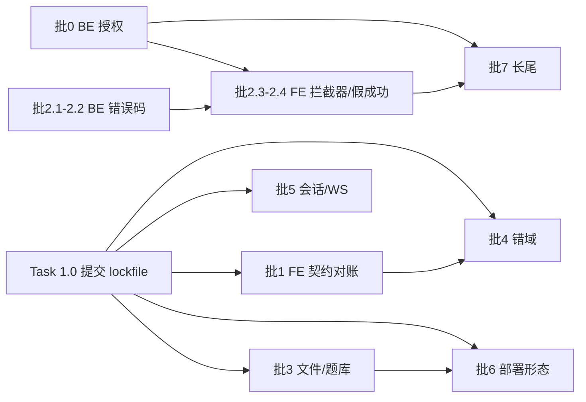

# 修复 Spec：按 8 批次消化 2026-09-08 前后端联合评审的 41 条跨栈缺陷

> 依据：[2026-09-08-joint-frontend-backend-review.md](../reviews/2026-09-08-joint-frontend-backend-review.md)（J-P1 7 / J-P2 19 / J-P3 15，J-P0 0，含 §5.0 勘误）与同日 8 份分片 `2026-09-08-joint-*.md`。本 Spec 的每条改点在写作时由 4 个只读侦察分片逐个取回 `file:line`。
> 执行方式：**批 0 与批 1 无依赖、可并行**（批 0 纯后端、批 1 纯前端，文件域不重叠）；**批 2 内部顺序锁死（BE → FE）**；批 3-6 各自独立；批 7 机械化清长尾，最后做。
> 与两轮后端 Spec 的关系：`2026-09-07-fix-spec.md` 与 `2026-09-08-deviation-fix-spec.md` 只看后端一侧，本 Spec 专治「两侧放一起才成立」的缺陷，**不重复它们的条目**。

**Goal:** 关闭 7 条 J-P1（越权、房间详情失效、强制登出、文档导入失效、删除 404、时间恒空、Web 形态失效）与全部 19 条 J-P2；每条 J-P1 有可观察的验收证据（后端 = 回归测试红→绿；前端 = 浏览器实测 + 静态门禁）。收口后 `cd backend && ./mvnw -B clean verify` 全绿且测试数从 **216** 增长。

**Architecture:** 不逐条打补丁，按「契约面」分批：先补服务端授权（唯一的安全边界缺口，批 0）与前端契约对账修点（批 1），再收口错误码语义（批 2，必须 BE 先行），然后修文件/题库分工（批 3）、错域调用（批 4）、会话与 WS 韧性（批 5）、部署形态与配置真源（批 6），最后机械化长尾（批 7）。

**Tech Stack:** 后端 Quarkus 3.20.4 / Java 21 / Panache / MySQL 8.0；测试地基已就绪（`%test` DevServices `mysql:8.0` + `drop-and-create` + `testsupport/Fixtures`）。前端 Vue 3.5 + Vite 4 + ant-design-vue 2.x，**无测试框架、无 lint 工具链**（见「全局约束 6」）。**不引入新后端依赖**；前端仅在 Task 7.6 需要一个净化库。

---

## 执行者必读：立项前提与已撤回结论

| 事实 | 状态 | 对修复的影响 |
|---|---|---|
| 前端 GET 用 `data` 传参 | **不是缺陷**（联合评审 §5.0 勘误已撤回原 J-P1） | 28 个 api 模块 import 包装器 `frontend/src/common/http/axios.js`，其 `:20-24` 对 get 执行 `instance.get(url, { params: data })` → 参数正常进查询串。**不要做「`data`→`params` 全量改写」**，那是无收益的大面积改动；只修键名/谓词/URL 三类真漂移（批 1） |
| `IllegalArgumentException` 的落点 | `ValidationExceptionMapper.java:21` 就是它的 mapper，`:31-37` 返回 **HTTP 200 + 业务码 500 + `safeMessage`** | 「查不到就抛」不会变成 HTTP 500；前端拿到的是 200 信封、`data=null`。批 2 改的是**业务码**，不是 HTTP 状态 |
| 全仓只有一个 mapper 返 HTTP 500 | `GlobalExceptionMapper.java:20-25`（`Response.serverError()`，兜底 `Throwable`） | 未预期异常仍走 HTTP 500，前端 `common/http/index.js:70-110` 的 error 分支只对它生效 |
| `orElseThrow(IAE)` 的影响面 | 约 **116 处**，跨 38 个 service | 批 2 改 IAE 的业务码 = 一次性影响这 116 条路径的响应码，属**跨栈契约变更**，必须按 Task 2.2 的前置核对执行 |
| 前端是否有依赖业务码 500 的分支 | **没有**。全前端 `code === 500` 仅 1 处命中且是 Electron IPC 结果，非 HTTP 信封（`frontend/src/common/utils/electronSerial.js:27`） | Task 2.2 的码值变更对前端无回归风险（唯一消费面是批 2 自己新加的集中分支） |
| `isAdmin` 语义 | **`isAdmin == 0` 表示超管**（反直觉）。依据现有消费点 `UserService.java:412`：`role.getIsAdmin() == 0 ? 全部菜单 : 按角色菜单` | 批 0 的授权判定必须照这个既有语义写，**不要发明第二套** |
| 用户→角色查询 | `RoleDao.findRoleByUserId:14-18` 用 `getSingleResult()`，**无角色时抛 `NoResultException`** | 批 0 必须捕获它并判为「无权限」，否则会逸出到 `GlobalExceptionMapper` 变成 HTTP 500 |
| 自限定范式 | `UserController.userOut:50-54`（`@RestHeader(TOKEN)`）+ `UserService.getUserByToken:517-522`（查无即抛 `UnauthorizedException`） | 批 0 的 `changePassword` 照抄这个范式 |
| 测试 fixture | `backend/src/test/java/com/nip/testsupport/Fixtures.java:10-24` 只能建「用户 + token + deviceId」，**没有角色 fixture** | 批 0 需先扩 fixture（Task 0.1），否则写不出授权测试 |

---

## 全局约束

1. **鉴权码契约不可动**：`ResponseCode` 的 **203 / 204 / 206** 码值与文案是既有客户端契约（`ResponseCode.java:17-21` 的注释已固化），本 Spec 不改它们。批 2 只把**业务语义**从 204 迁出。
2. **HTTP 语义不变**：业务错误一律 HTTP 200 + `code`；不得把业务错误改成 HTTP 4xx/5xx。
3. **新增业务码必须两侧同批交付**：批 0 引入的 `207` 只有在批 2 的前端集中分支落地后才对用户可见。若批 2 无法同期交付，批 0 的授权失败**临时复用 `SYSTEM_ERROR(500)` + message**，禁止复用 206（会导致前端强制登出，语义错）。
4. **单侧改动前先 grep 对侧**（AGENTS.md 红线 5）：改 `@RestQuery`/`@RestForm` 名、返回形态、业务码、能力边界，必须先 grep `frontend/src/common/api/*.js` 与实际调用点，并把 grep 结果写进提交说明。
5. **后端 TDD**：每条 J-P1 先写失败回归测试再修；测试只断言消费者可见行为（DB 真实状态、响应信封、协议消息），禁止断言注解存在/字段拷贝/mock 回声。
6. **前端验收不引测试框架**：前端当前零测试、`.eslintrc.js` 引用的插件未安装。本 Spec 的前端验收 = **静态门禁 grep（见 DoD）+ 浏览器实测清单**（每条给「点哪里、看什么请求/提示」）。**禁止**为了「让改动有测试」而引入 vitest/jest 脚手架；若业务要求建前端测试地基，另开 Spec。
7. **前端可复现构建是前端验证的前置**：`frontend/.gitignore:8` 忽略了 `package-lock.json`，`npm install` 每次重解析 `^` 区间。**Task 1.0 必须先做**，否则任何前端实测结果都不可复现。
8. **不引新依赖**：后端零新依赖；前端只有 Task 7.6（富文本净化）允许引入一个净化库，且优先复用仓内已有的 `frontend/public/UEditor/third-party/xss.min.js`。
9. **范围外**：纯安全缺口（token 强度/明文凭据/CORS 全开/WS 无鉴权/license 软门控）沿用内网已接受风险口径。**唯一例外是批 0**——它按「任意登录用户可删他人数据/接管账号」的**数据后果**处理，不是安全口径。

---

## 批 0：服务端授权（BE，J-P1 #1，最高优先）

**根因**：全仓零角色校验（`grep @RolesAllowed|hasPermission|PermitAll|SecurityContext` = 0 命中），`JWTInterceptor` 只校验「token 非空 + deviceId 非空 + (token,deviceId) 存在」（`JWTInterceptor.java:50-68`）。前端 `v-per`（`config/directive/ButtonPermission.js:15-25`，且 `indexOf(value)===-1` 时置 `isExist=true` = 查不到权限反而放行）是可篡改的软门控。→ 任意持有效 token 的学员直连 API 即可删除任意用户、重置管理员密码、给自己授角色。

### Task 0.1 授权基础设施 + fixture

- 新增 `backend/src/main/java/com/nip/common/interceptor/RequireAdmin.java`：照 `JWT.java:18-20` 写 `@InterceptorBinding` + `@Target({TYPE, METHOD})` + `@Retention(RUNTIME)`。
- 新增 `RequireAdminInterceptor.java`：`@RequireAdmin @Interceptor @Priority(Interceptor.Priority.PLATFORM_BEFORE + 10)`（**必须排在 `JWTInterceptor` 之后**，后者是 `PLATFORM_BEFORE`，见 `JWTInterceptor.java:26-28`）。逻辑：
  1. 取 header `token`（常量走 `BaseConstants.TOKEN`，取法照 `JWTInterceptor.java:50-56`）；
  2. `userService.getUserByToken(token)`（`UserService.java:517-522`，查无即抛 `UnauthorizedException` → 200 + 203，与现状一致）；
  3. `roleDao.findRoleByUserId(user.getId())`，**捕获 `NoResultException`** → 判为无权限；
  4. `Integer.valueOf(0).equals(role.getIsAdmin())` 为超管 → `context.proceed()`；否则抛授权拒绝。
- `ResponseCode` 新增 `NO_PERMISSION(207, "无操作权限", "")`；新增 `common/exception/ForbiddenException` + `ForbiddenExceptionMapper`（HTTP 200 + 207，照 `UnauthorizedExceptionMapper.java:16-21` 写）。**不得改动 203/204/206**。
- 扩 `backend/src/test/java/com/nip/testsupport/Fixtures.java`：新增 `userWithRole(UserDao, RoleDao, UserRoleDao, token, deviceId, int isAdmin)`，建 `t_role`(`isAdmin`) + `t_user_role` 关联并返回用户。

### Task 0.2 给 8 个管理写端点加 `@RequireAdmin`

| 端点 | 位置 | 目标 service |
|---|---|---|
| `POST /api/user/saveUser` | `UserController.java:43-48` | `UserService.addUser:156` |
| `POST /api/user/importUser` | `UserController.java:72-77` | `UserService.importUser:320` |
| `POST /api/user/addUserRole` | `UserController.java:79-86` | `UserService.addUserRole:349` |
| `GET /api/user/delete` | `UserController.java:166-171` | `UserService.delete:605` |
| `GET /api/user/resetPassword` | `UserController.java:173-178` | `UserService.resetPassword:610` |
| `POST /api/role/addRole` | `RoleController.java:43-47` | `RoleService.addRole:55` |
| `POST /api/menus/addMenu` | `MenusController.java:41-46` | `MenusService.addMenus:97` |
| `POST /api/user/getAllUser`（读，但泄露全量用户） | `UserController.java:88-93` | `UserService.getAllUser` |

方法级注解，**不要**加在类上（同类还有学员自用的 `changePassword`/`userOut`/`getUserById`）。

### Task 0.3 `changePassword` 改为自限定

`UserController.java:57-70` 现在从 body 取 `USER_ID`（任意人可改任意人密码，且旧密码校验在 `UserService.changePassword:461` 内 → 不知道旧密码改不了，但仍是错误的授权模型）。改为：忽略 body 里的 `userId`，用 `getUserByToken(token)` 推导 id，其余参数与校验不变。**前端无需改动**（多传字段被忽略，`personal.js:171`、`HJJ_LJ.vue:204`、`PreviewHJ.vue:523`、`PreviewHJJ_LJ.vue` 四处调用照旧可用）。

### Task 0.4 回归测试（新建 `AdminAuthorizationTest`）

- 学员 token（`isAdmin != 0`）逐个调用 Task 0.2 的 8 个端点 → 断言 `code == 207` **且 DB 状态未变**（如目标用户仍存在、密码未被重置）。
- 管理员 token（`isAdmin == 0`）→ 断言操作成功（`code == 200` + DB 已变）。
- 无角色用户（不建 `t_user_role`）→ 断言 `code == 207`（覆盖 `NoResultException` 分支），**不得** HTTP 500。
- `changePassword` 用 A 的 token 传 B 的 userId → 断言改的是 A 自己（或旧密码不匹配而失败），B 的密码未变。

**批 0 验收**：上述测试红→绿；`grep -rn "@RequireAdmin" backend/src/main/java/com/nip/controller` 命中 8 处；`clean verify` 全绿。

---

## 批 1：前端契约对账修点（FE，无 BE 改动，可与批 0 并行）

### Task 1.0（前置）提交 lockfile

从 `frontend/.gitignore:8` 删掉 `package-lock.json` 并提交当前 lockfile。**这是本批及后续所有前端实测的前提**（约束 7）。

### Task 1.1 `roomgId` → `roomId`（J-P1 `HC-J-P1-01`）

后端三处已读 `@RestQuery(ROOM_ID)`（`BaseConstants.java:12` = `"roomId"`）：`SimulationRouterRoomController.java:72`、`SimulationReportRoomController.java:56`、`SimulationReceptRoomController.java:55`。前端 7 处传 `roomgId`，逐处改键名：

| 文件:行 | api 导出 |
|---|---|
| `frontend/src/views/manage/unionJob/lineNotify/js/Issue.js:149`、`:290` | `apiSimulationRouterRoomDetail`（`UserApi.js:126-132`）|
| `frontend/src/views/manage/unionJob/lineNotify/components/ListenIn.vue:404`、`:483` | 同上 |
| `frontend/src/components/BroadcastTeachTrain/js/useBroadStudent.js:265` | `getRoomDetail`（`broaddcastTeacheingApi.js:37-42`）|
| `frontend/src/components/BroadcastTeachTrain/js/useBroadTeacher.js:288` | 同上 |
| `frontend/src/views/manage/unionJob/broadcastTeacheing/js/useBroadcastTrain.js:21` | 同上 |

**验收**：`grep -rn "roomgId" frontend/src` = 0；浏览器实测「网络协同 → 线路通知」进入房间详情，Network 里请求为 `?roomId=NN`、响应 `code:200` 且 `data` 非空（修复前 router 路是 `code:500`）。

### Task 1.2 删 URL 尾空格（J-P1 `HC-J-P1-02`）

`frontend/src/common/api/TestApi.js:61` 的 `"/api/theoryKnowledge/deleteThroyKnowledgeById "` 末尾有一个空格 → 编码成 `%20` → 真 404（后端 `TheoryKnowledgeController.java:135-139` 路径无空格），且调用点 `study/basic/edit/Index.vue:295`、`study/basic/edit/js/useForm.js:109` 无 `catch` → 删除静默失败。删空格即可。**验收**：`grep -rn "deleteThroyKnowledgeById " frontend/src` = 0；实测删除课程后列表刷新。

### Task 1.3 自测列表时间键名（J-P1 `DM-J-P1-01`）

后端 VO 只有 snake 键 `start_time`（`TheoryKnowledgeExamUserSelfVO.java:28-29`），前端 `frontend/src/views/manage/basicTheory/test/test/studentGradeList/Index.vue:32` 读 `d.startTime` → 恒空；排序键在 `frontend/src/components/test/nodeTree/listSort.js:3` 用 `createTime/create_time`（VO 无此字段）→ `Number(undefined)=NaN`，排序失效。改前端读 `d.start_time`，排序改用 VO 实有字段。**同模块其余三处已正确读 snake**（`test/grade/Index.vue:30`、`test/list/Index.vue:46`、`startGrade/Index.vue:34`），本页是离群点 → 改前端，不改后端契约（后端 snake/camel 分裂另见 Task 7.1）。

### Task 1.4 谓词不符与孤儿导出清理（`HC-J-P3-04/05/06`）

- `StructureApi.js:11-16` `getAllUserByContent` 前端 `get` vs 后端 `@POST`（`UserController.java:95-101`）→ 405；当前是死导出 → **删除该导出**（若将来要用，改 `method:'post'`）。
- `UnionApi.js` 的 `editStatus`（指向后端不存在的 `routerRoomContent/editStatus`）与 `addUser`（后端无此端点）→ 删除死导出。**改前逐个 `grep` 确认零调用**。
- `frontend/src/views/manage/preJob/receive/explain/Index.vue:119` 死 `import axios from "axios"`（唯一用法在 `:136` 已注释）→ 删除。

### Task 1.5 `rows:999` 改真分页（`HC-J-P2-03`）

`frontend/src/views/manage/organization/telexZuXun/list/js/list.js:138` 传 `{page:1, rows:999}`，后端 `common/utils/Page.java:43-44` 钳到 200 → >200 条静默截断。改为真分页（随页拉取，`rows ≤ 20`）或显式 `rows: 200` 并在 UI 提示上限。**该文件在批 4 会整体改域，建议与 Task 4.1 合并提交。**

**批 1 验收**：4 条门禁 grep 归零（见 DoD）；浏览器实测清单逐条通过。

---

## 批 2：错误码与信封语义对齐（**顺序锁死：先 BE 后 FE**）

**根因**：①后端 204 一码两义（`ResponseCode.java:12` `NULL_ERROR` 业务「参数为空」 vs `:20` `CODE_204` 鉴权「设备标识不能为空」），前端 `common/http/index.js:30-33` 把所有 204 当鉴权失效弹窗 + 跳登录 → 改密漏填字段即被强制登出。②参数校验错误与真服务器错误同编码为业务码 500 → 前端无法安全加集中分支。③前端有 205 死分支（后端从不发 205）。

### Task 2.1（BE）业务语义迁出鉴权码段

删除 `ResponseCode.NULL_ERROR`，3 个使用点改用 `PARAMS_ERROR(202)`：

| 位置 | 端点 | 现状 |
|---|---|---|
| `controller/UserController.java:67` | `POST /api/user/changePassword` | `@JWT` 类 → 触发强制登出 |
| `controller/PostTelegramTrainController.java:106` | `POST /api/postTelegramTrain/finish` | `@JWT` 类 → 触发强制登出 |
| `controller/free/UserController.java:44` | `POST /api/user/login` | 登录页命中 `index.js:31-33` 的 `return`（返回 `undefined`）→ `useLogin.js:73` 的 `res.code` 抛 TypeError、登录按钮卡住 |

**验收**：`grep -rn "NULL_ERROR" backend/src/main/java` = 0；204 的唯一产生点是 `JWTInterceptor.java:65`。

### Task 2.2（BE）参数校验错误与服务器错误分码

- `ValidationExceptionMapper.java:31-37`（`IllegalArgumentException`）、`IllegalStateExceptionMapper.java:19-23`、`InvalidTitleExceptionMapper.java:21-25`：业务码由 `SYSTEM_ERROR(500)` 改 `PARAMS_ERROR(202)`，**保留 HTTP 200 与 `safeMessage`**（`ValidationExceptionMapper.java:44-70`，三个 mapper 共用，不要复制第二套）。
- `GlobalExceptionMapper.java:20-25` 保持 HTTP 500 + 500 不变。
- **前置核对（约束 4）**：本条改动 116 处 `orElseThrow(IAE)` 路径的响应码。已核实前端无依赖（全前端 `code === 500` 仅命中 `common/utils/electronSerial.js:27`，是 Electron IPC 结果而非 HTTP 信封）；执行时重跑该 grep 确认无新增依赖。

### Task 2.3（FE，必须在 2.1/2.2 之后）拦截器收口

改 `frontend/src/common/http/index.js`：

1. **删 205 死分支**（`:45-56`）——后端无 205，真实凭证失效发 206（`JWTInterceptor.java:68`）。
2. **登录页抑制统一**：现在只有 203/204 分支有 `location.href.indexOf('login')>-1` 早返回（`:31-33`），206 没有 → 重登后仍在飞行的请求会在登录页反复弹窗。抽一个 `handleAuthFailure(code)`，203/204/206 共用，登录页只跳过弹窗；**并且不得 `return undefined`**（破坏信封契约），一律 `return response.data`。
3. **加集中业务错误分支**：`code !== 200` 且未被鉴权分支处理时 `message.error(response.data.message || '操作失败')`；支持调用方 opt-out（如 `config.skipErrorToast`，用于自行处理错误的页面）。**依赖 Task 2.2**：只有校验错误变成 202、真服务器错误留 500，这个集中提示才不会把用户输入错误报成「服务器错误」。批 0 的 `207 无操作权限` 也由这条分支呈现。
4. **删死分支** `:20-22` 的 `config.method === 'POST'`（axios 已把 method 转小写，永不命中；一旦有人「修正」为 `'post'` 会双重 `JSON.stringify` 静默损坏所有 POST 体）。

### Task 2.4（FE）假成功修点

`frontend/src/views/manage/systemManage/structure/js/useStructure.js:368-375`（重置密码）不判 `code` 直接 `Modal.success` 并回显 `e.data`（失败时为 null）→ 改为按 `res.code === 200` 判定。其余同型「不判 code 直接弹成功」调用点见归档分片 [envelope-error](../reviews/archive/2026-09-08-joint-envelope-error.md) §附录 A，逐个按同一模式修。

### Task 2.5（BE）回归测试（新建 `ErrorEnvelopeContractTest`）

- 改密漏填字段 → `code == 202`（**断言 `!= 204`**，这是「不再强制登出」的机器可判定形式）。
- 走一条 `orElseThrow(IAE)` 路径（如 `GET /api/menus/getMenuById?id=不存在`）→ HTTP 200 + `code == 202` + `message` 可读且不含异常类名。
- 触发一条未预期异常 → HTTP 500 + `code == 500`（守住 `GlobalExceptionMapper` 未被误改）。
- 缺 `deviceId` 的请求 → `code == 204`（鉴权语义保留，守住契约红线）。

---

## 批 3：文档导入与题库导入分工（双侧，`TK-J-P1-01`/`TK-J-P2-02`/`TK-J-P2-03`）

**根因**：后端已把能力边界收窄/重写（`uploadFileToNip` 只收 `txt/md/csv`；新增整批单事务 `saveBatch`；`exportTemplate` 改返回列规格 JSON），前端一处未跟随。

### Task 3.1（FE）上传 `accept` 与响应判定对齐

- `accept` 从 `.doc,.docx,.pptx` 改为 `.txt,.md,.csv`：`frontend/src/views/manage/equipment/equipmentIndex.vue:204`、`:246`、`frontend/src/views/manage/basicTheory/study/basic/edit/Index.vue:168`。后端允许集合的唯一真源是 `TheoryKnowledgeClassifyService.java:43`（`TEXT_SUFFIXES = Set.of("txt","md","csv")`），越界即 `IllegalArgumentException`（`:110-127`）→ 200 + 202（批 2 后）+ message。
- 响应判定：后端文本路径恒返回 `imgUrls = List.of()`（`TheoryKnowledgeClassifyService.java:132`），而 JS 里空数组是**真值** → `if (data.imgUrls)` 恒真 → `wordContent` 分支永不执行。改为 `Array.isArray(data?.imgUrls) && data.imgUrls.length` 才走图片分支，否则走 `wordContent` 插入；并对 `data` 为 null 加可选链 + 按 `code` 提示（`equipmentIndex.vue:336-347` 及 `edit/Index.vue` 同型回调）。
- **决策：后端契约不动**（`imgUrls` 保持空数组）。理由：`Response<T>` 形态稳定优先，且判定错误在前端；改后端会再造一次「一侧改、另一侧不知道」。

### Task 3.2（FE）题库导入接 `saveBatch`

现状 `frontend/src/views/manage/basicTheory/test/questionBank/js/knowledgeTabel.js:567-582` 用 mammoth 客户端解析 Word，`:556-564` 逐行 fire-and-forget 调 `saveTheoryKnowledgeQuestion`（不 `await`），2 秒后 `setTimeout` 无条件 `message.success('上传成功！')` → 单行失败静默、可能部分导入。改为解析后**一次** `saveBatch(arrObj)`（后端 `TheoryKnowledgeQuestionController.saveBatch` + service 已实现整批单事务 + 行级校验，会指出第几行有问题），按返回 `code` 提示；删掉 `setTimeout` 假成功。

### Task 3.3（FE）导出模板接后端列规格

现状「导出模板」按钮走带外静态文件 `window.fileUrl + '/006/题库-模板.docx'`（`knowledgeTabel.js:648-654`），后端 JSON 版 `exportTemplate` 零调用成孤儿；同文件还有死函数 `exportTemplate1`（`:583-642`，硬编码绝对 URL + `responseType:'blob'` + `.docx` 文件名，一旦接线就会产出「JSON 字节冒充 docx」的损坏文件）与死导入 `downloadTemplate`（`common/api/TheoryQuestionBankApi.js:44-51`）。改为：调后端 `exportTemplate` 取列规格 → 用仓内已有的 `xlsx` 客户端生成 `.xlsx` 下载；删 `exportTemplate1` 与 `downloadTemplate`。顺带把 `knowledgeTabel.js:589` 的 raw axios 调用改走包装器 `../http/axios.js`（当前手动补 token/deviceId 头、绝对 URL，与实例逻辑漂移）。

**批 3 验收**：浏览器实测三条路径——①选 `.txt` 导入 → 编辑器出现文本内容；选 `.docx` → 按钮被 accept 拦住（不再发出必失败的请求）；②导入题库 Word → 一次 `saveBatch` 请求，失败行有明确提示，成功后列表条数与文件行数一致；③点「导出模板」→ 下载到可被 Excel 打开的 `.xlsx`。门禁：`grep -rn "exportTemplate1\|downloadTemplate" frontend/src` = 0。

---

## 批 4：错域调用（`TF-J-P2-01`/`TF-J-P2-02`）

**根因**：`telexZuXun`（电传组训）整棵子树是 `datagramZuXun` 的复制品，但 import 全部指向 `electronKeyZuXun.js`（电子键域 `/api/generalKeyPat/*`）与 `handkeyZuXun.js`（手键域），WS 也连 `/generalKeyPatTrain` → 用「电传组训」建/控/结算的其实是电子键库的训练。

### Task 4.1（FE）telexZuXun 6 个文件改指电传域

正确域的 api 模块是 `frontend/src/common/api/datagramZuXun.js`（→ `/api/generalTelexPat/*`），函数映射：`findDatagramList`(`:11`)、`addTrain`(`:3`)、`getDatagramDetail`(`:18`)、`getDatagramStatistics`(`:25`)、`updateTrainStatus`(`:32`)、`getDatagramZuXunPageNumber`(`:39`)、`uploadDatagramResult`(`:46`)、`finishDatagramZuXun`(`:53`)、`endPatDetail`(`:68`)、`startTrainUser`(`:76`)、`deleteTrain`(`:82`)。

| 文件 | 现状 | 改法 |
|---|---|---|
| `telexZuXun/list/js/list.js:5` | 引 `getElectronKeyZuXunList`/`saveElectronKeyZuXunTrain` | 改 `findDatagramList`/`addTrain`（并做 Task 1.5 的分页）|
| `telexZuXun/train/student/student.vue:160` | 引 `getElectronKeyZuXunDetails` | 改 `getDatagramDetail` |
| `telexZuXun/train/student/js/datagramTrain.js:8-11` | 引 `finishElectronKeyZuXun`/`getElectronKeyZuXunPageNumber`/`uploadElectronKeyZuXunPatResult`/`resetHandKeyZuXunTrain` | 改电传域四个对应函数（reset 见 Task 4.3）|
| `telexZuXun/train/student/js/datagramTrain.js:27` | WS `/generalKeyPatTrain` | 改 `/generalTelexPatTrain`（后端 `WebSocketGeneralTelexPatService.java:33`）|
| `telexZuXun/train/student/js/trainScore.js:5` | 引 `getElectronKeyZuXunPageNumber`/`updateElectronKeyPatTrainDetails` | 改 `getDatagramZuXunPageNumber`/`endPatDetail` |
| `telexZuXun/train/teacher/js/teacher.js:3-4`、`:88` | 引电子键 detail/statistics/updateStatus；WS `/generalKeyPatTrain` | 改电传域三个函数；WS 改 `/generalTelexPatTrain` |
| `telexZuXun/train/teacher/js/teacherBack.js:2`、`:130` | 引手键域函数；WS `/generalTickerPat/{uid}/{trainId}`（**缺 `{role}` 段**，后端模板三段 `WebSocketGeneralTickerPatService.java:31`）| 该文件全仓零引用（死代码）→ **删除**；若要保留必须改电传域并补齐 URI 段 |

建训时确认 `trainType`：电传在 `generalTelexPat` 域的语义见 `GeneralTelexPatTrainVO.java:71-72`。

### Task 4.2（FE）localStorage 键分域

`telexZuXun/train/student/student.vue:257`、`:270` 与 `datagramZuXun` 的同名文件写同一个键 `'datagramZuXun'+trainId`（`datagramTrain.js:151` 读）→ 两个域的断点数据互相覆盖。telex 侧改用 `'telexZuXun'+trainId`。

### Task 4.3（BE+FE）`reset` 补本域端点

`reset` 端点全仓只有手键域一个：`GeneralTickerPatController.java:91`（`@RequestBody GeneralTickerPatTrainResetParam` → service）。而 `electronKeyZuXun.js:38-44` 的 `resetHandKeyZuXunTrain` 打的就是它 —— 电子键学员点「重新拍发」（`electronKeyZuXun/train/student/js/handKeyTrain.js:488-491`，可达自 `:564-567`）会去重置**手键库**中同号训练（跨训练写），本域训练则未被重置（假成功）。

- **BE**：新增 `POST /api/generalKeyPat/reset`（`GeneralKeyPatController`）+ service `reset`，实现照 `GeneralTickerPatController.java:91` 与其 service（复用本域 value DAO 的 `deleteByTrainIdAndUserId`）。若电传域也需要 → 同批加 `POST /api/generalTelexPat/reset`。
- **FE**：`electronKeyZuXun.js:38-44` 改指 `/api/generalKeyPat/reset`；`datagramTrain.js:179` 现在只传 `{id: trainId}` 缺 `uid` → 按后端入参补齐。

**批 4 验收**：门禁 `grep -rn "electronKeyZuXun\|handkeyZuXun" frontend/src/views/manage/organization/telexZuXun` = 0；`grep -rn "generalKeyPatTrain" frontend/src/views/manage/organization/telexZuXun` = 0。浏览器实测：电传组训建训后，用后端 `/api/generalTelexPat/findAll` 能查到该训练（修复前落在 `generalKeyPat`）；电子键「重新拍发」后本域训练状态被重置。BE 侧 `generalKeyPat/reset` 配回归测试（重置后本域 page/value 行被清、其他域训练未受影响）。

---

## 批 5：会话生命周期与 WS 韧性（`AS-J-P2-02`/`AS-J-P2-01`/`WS-J-P2-01`/`WS-J-P2-02`）

### Task 5.1（FE）登出走完整流程

现状登出 = 跳 `#/login`，由守卫 `frontend/src/config/router/guards.js:10-19` 清 localStorage；`POST /api/user/userOut` 在 `common/api/UserApi.js:34-36` 有定义但**全仓零调用**（后端 `UserController.java:50-54` → `UserService.userOut:439` 会把 token/deviceId 置空）。改为：登出时先 `await userOut()` → 再清本地存储 → 关闭全部 WS 单例（`Ws`/`PublicSocket`/`MessageWebSocket`/`UnionWs`）→ 清 `localforage` 的 `autoLoginInfo`。**验收**：实测登出后用旧 token 直连任一 `@JWT` 端点 → `code 206`（修复前 200）。

### Task 5.2（FE）WS 重连退避 + 心跳 + 实例拆除

抽一个共享重连助手（指数退避 + 抖动 + 上限 + 心跳看门狗），替换固定 `setTimeout` 无限重拨：`ws/Ws.js:74-81`、`ws/PublicSocket.js:32-37`、`ws/MessageWebSocket.js:103-107`、`unionJob/js/UnionWs.js:109-116`。同时：`UnionWs.exit()` 关闭 socket 后置空静态 `instance`（否则下次 `getInstance()` 拿到 `flag=false` 的陈旧实例）；`sendData` 前判 `readyState === OPEN`（照 `PublicSocket.js` 现有正确写法）。

### Task 5.3（BE）WS 空闲超时

后端未配 WS idle timeout（`application.yml:37-38` 只有 `websocket.dispatch-to-worker`）→ 半开连接堆积在静态会话表。显式配置空闲超时，并**实测**其对 WS 的作用（Quarkus 的 `quarkus.http.idle-timeout` 对 WS 的语义需要在本项目版本上验证后再定值）；与 Task 5.2 的心跳配合。

---

## 批 6：部署形态与配置真源（`DC-J-P1-01`/`DC-J-P2-01`/`DC-J-P3-*`）

### Task 6.1（FE）统一 base 拼装（J-P1）

`frontend/index.html:80-88` 在非 http 页面把 `window.httpUrl` 设成**绝对 URL**（`https://host/data`），而所有自己拼 base 的点写死 `'http://' + window.httpUrl` → 在「浏览器 https + 反代」形态下产出 `http://https://…` 畸形 URL。新增 `frontend/src/common/http/endpoints.js` 暴露 `apiUrl(path)` / `wsUrl(path)`（协议感知，逻辑与 `common/http/index.js:6` 一致），替换：

- 上传 `action` 6 处：`basicTheory/study/basic/edit/Index.vue:198`、`basicTheory/test/questionBank/Index.vue:307`、`equipment/equipmentIndex.vue:272`、`postJob/hanzi/articleManage/Index.vue:120`、`preJob/ditto/militaryDeploy/Index.vue:119`、`systemManage/basic/equipment/Index.vue:112`
- SSE 1 处：`basicTheory/study/basic/edit/Index.vue:230`（`new EventSource('http://' + window.httpUrl + '/Sse/connect')`）
- 导出 1 处：`basicTheory/test/questionBank/js/knowledgeTabel.js:588`（批 3 一并处理）
- WS 4 处用 `httpUrl` 拼的：`unionJob/js/UnionWs.js:41`、`unionJob/disturbCode/js/train.js:224`、`unionJob/lineNotify/components/ListenIn.vue:300`、`unionJob/lineNotify/js/Issue.js:62` → 统一走 `window.wsUrl`

**验收门禁**：`grep -rn "'http://' + window.httpUrl\|ws://\${window.httpUrl}" frontend/src` = 0。

### Task 6.2（双侧）上传体积链

后端未配 `quarkus.http.limits.max-body-size`（默认 10MB，超限返回原生 HTTP 413，不进业务信封）；前端上传无体积前置校验，且 `common/http/index.js:7` 的 `timeout` 被注释。→ BE 显式写定上限并记录到 `backend/README.md`；FE 上传前校验体积并提示；FE 给共享实例设置真实 `timeout` 并在 `!error.response` 时给出网络异常提示（`common/http/index.js:70-111` 当前静默 reject）。

### Task 6.3（工程）版本真源与 CI

`backend/pom.xml:7` = `1.1.0`、`frontend/package.json:2` = `0.0.0`、`application.yml:1` = `4.0.1` 三个版本号互不相关；CI 只构建后端。→ 确立单一版本源（发布时由 tag 同步 pom 与 package.json，`application.yml` 的 `version` 要么删要么纳入体系）；CI 增前端 `npm ci && npm run build` 步骤并归档 `dist/`，在 README 记录 `dist/` → Electron 外壳的交付链。

---

## 批 7：长尾家族（按家族规则收敛，最后执行）

| # | 家族 | 处理 | 关键位置 |
|---|---|---|---|
| 7.1 | JSON 命名 snake/camel 分裂 | 选定 camelCase 为唯一契约：后端把 snake 字段加 `@JsonProperty` 或改名，前端同步；**至少先消除离群读取点**（Task 1.3 已修其中一处） | `dto/vo/TheoryKnowledgeExamUserSelfVO.java:28-29`、`dto/FindAllExamByIdDto.java:24-28`；前端 `test/grade/Index.vue:30` 等 |
| 7.2 | 时区与时间 wire 形态 | 容器设 `TZ=Asia/Shanghai` 或 JVM `-Duser.timezone`；实体时间统一走 `DateTimeUtil`；`@JsonFormat(timezone=)` 对 `LocalDateTime` 无效的标注清理 | `entity/EnteringExerciseEntity.java:43-45`、`common/utils/DateTimeUtil.java:25`、`dto/vo/TickerTapeTrainVo.java:52`、4 个 Dockerfile |
| 7.3 | 数值 wire 类型不一致 | 同概念字段统一（`accuracy`/`speed`/`duration` 有 String / Double / Integer / BigDecimal 四种），前端相应移除 `parseFloat`/`*1` 兜底 | `entity/TelegramTrainEntity.java:40-41`、`entity/TelexPatTrainEntity.java:41`、`entity/EnteringExerciseEntity.java:50,55` |
| 7.4 | 前后端双实现漂移 | 评分/正确率/速率以后端 `ScoreMath` 为唯一权威；前端本地值只作「预估」展示并明确标注，或直接改为展示后端返回值 | 前端 `postJob/telegram/train/js/details.js:917-925`、`datagramTrain.js:177`；后端 `service/general/GeneralTelexPatService.java:791-815` |
| 7.5 | 孤儿端点 / 死代码 | 确认无外部依赖后删除或注明用途：WS `/status`（`ws/StatusWebSocket.java:8`）、`/startWebsocket/{sid}`（`ws/StartWebSocket.java:16`）；前端 `teacherBack.js`（Task 4.1 已列）、`UserApi.js:11-24` 的 `addSignin`/`userSignIn` 重复导出 | 各处 |
| 7.6 | 富文本存储型 XSS（`[已接受风险口径]`，但持久污染） | 净化落**渲染侧**：`equipment/equipmentIndex.vue:24` 的 `v-html`、`study/basic/details/js/useDetails.js:71` 的 `iframe.document.write` 改为净化后渲染（优先复用 `public/UEditor/third-party/xss.min.js`）。后端写入侧净化仅作可选纵深防御 | 前端两处 sink |
| 7.7 | 考试取卷/分析消费点缺 null 兜底 | 统一 `res.code === 200 && res.data?.paper` 判定 + 失败提示 | `addTest/js/addTest.js:57-61`、`startGrade/js/startGrade.js:70-73`、`studentGradeDetails/js/startGrade.js:109-112`、`startTest/js/startTest.js:124-127` |

批 7 每行必须给出「已处理 / 判定不修（附理由）」结论，不留「待定」。

---

## 排期与依赖



- **批 0 / 批 2(BE) 可与批 1 并行**（前者纯 `backend/`，后者纯 `frontend/`）。
- **批 2 的 FE 部分必须等 BE 部分上线**（否则集中错误提示会把用户输入错误报成「服务器错误」）。
- **批 4 与 Task 1.5 同文件**（`telexZuXun/list/js/list.js`）→ 合并提交。
- **批 3 与 Task 6.1 同文件**（`knowledgeTabel.js`、`edit/Index.vue`）→ 注意冲突，建议批 3 先行。
- 批 7 最后做，避免与其他批次抢同一批文件。

---

## 总验收（Definition of Done）

### 1. 静态门禁（全部零命中）

```bash
grep -rn "roomgId" frontend/src                                             # Task 1.1
grep -rn "deleteThroyKnowledgeById " frontend/src                           # Task 1.2
grep -rn "NULL_ERROR" backend/src/main/java                                 # Task 2.1
grep -rn "=== 205\|== 205" frontend/src/common/http                         # Task 2.3
grep -rn "method === 'POST'" frontend/src/common/http                       # Task 2.3
grep -rn "exportTemplate1\|downloadTemplate" frontend/src                   # Task 3.3
grep -rn "electronKeyZuXun\|handkeyZuXun\|generalKeyPatTrain" \
     frontend/src/views/manage/organization/telexZuXun                      # Task 4.1
grep -rn "'http://' + window.httpUrl" frontend/src                          # Task 6.1
grep -rn "import axios from ['\"]axios['\"]" frontend/src --include=*.vue   # Task 1.4
```
并且 `grep -rn "@RequireAdmin" backend/src/main/java/com/nip/controller` 命中 **8** 处（Task 0.2）。

### 2. 后端测试

- `cd backend && ./mvnw -B clean verify` 全绿，测试数 **≥ 216 + 新增**（新增至少：`AdminAuthorizationTest`、`ErrorEnvelopeContractTest`、`generalKeyPat/reset` 回归测试）。
- 每条 J-P1 的后端侧有一个「修复前失败、修复后通过」的测试；提交说明里给出 RED 的失败输出摘要。

### 3. 前端浏览器实测清单（逐条留证据：截图或 Network 摘要）

| # | 路径 | 期望 |
|---|---|---|
| 1 | 网络协同 → 线路通知 → 进房间 | 请求 `?roomId=`，`code:200`，详情有数据 |
| 2 | 课程编辑 → 删除 | 请求路径无 `%20`，删除后列表刷新 |
| 3 | 自测列表 | 「开始时间」显示真实时间，按时间排序生效 |
| 4 | 个人中心 → 修改密码，故意留空一项 | 出现「参数错误」提示，**不被踢回登录页** |
| 5 | 学员账号直连 `GET /api/user/delete?userId=<他人>`（curl） | `code:207`，目标用户仍在 |
| 6 | 设备说明 → 导入文档 | `.txt` 成功插入内容；`.docx` 被 accept 拦住 |
| 7 | 题库 → 导入 Word | 一次 `saveBatch` 请求；失败行有明确提示 |
| 8 | 题库 → 导出模板 | 下载到可打开的 `.xlsx` |
| 9 | 电传组训 → 建训 | 训练出现在 `/api/generalTelexPat/findAll` |
| 10 | 登出后用旧 token curl 任一 `@JWT` 端点 | `code:206` |

### 4. 契约红线复核

- `ResponseCode` 的 203/204/206 码值与文案未变（`git diff` 逐字确认）。
- 新增 207 已在前端集中分支呈现（或按约束 3 临时复用 500 并记录）。
- 每个改了跨栈契约的提交，说明里附「已 grep 前端调用面」的证据。

### 5. 文档同步

- 本 Spec 的每个 Task 有「已落地 / 偏离（附原因）/ 未落地」结论；偏离项按 `2026-09-08-deviation-fix-spec.md` 的先例单独立项。
- 联合评审报告 §3 必修清单逐行标注「已在 joint-fix-spec 批 N 处理」。
- 若批 4 删除 `teacherBack.js` 或批 7.5 删除孤儿端点，同步更新归档分片 `docs/reviews/archive/2026-09-08-joint-websocket.md` 的端点对账表。

---

## 范围外（明确不做）

1. 纯安全缺口（token 强度与确定性、明文自动登录凭据、CORS 全开、WS 握手无鉴权、license 客户端软门控、fastjson 1.2.78）—— 沿用内网已接受风险口径。**批 0 不属此列**（数据后果）。
2. 前端结构性重构：`*ZuXun` 四份复制的合并、vuex→pinia 统一、依赖瘦身、`manualChunks` 调整、i18n/a11y —— 属前端单侧评审范围，另开 Spec。
3. 前端测试地基（vitest/eslint 工具链）—— 见约束 6。
4. MyISAM/事务/评分算法等后端单侧问题 —— 已在 `2026-09-07-fix-spec.md` 处理，本 Spec 不重复。
5. 反代（nginx）配置本身 —— 仓外资产；Task 6.1/6.2 只保证前端在该形态下拼装正确。
